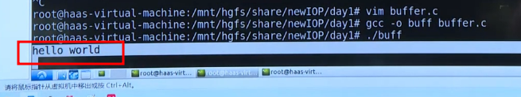
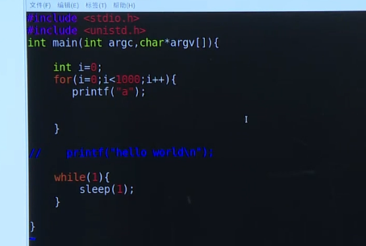
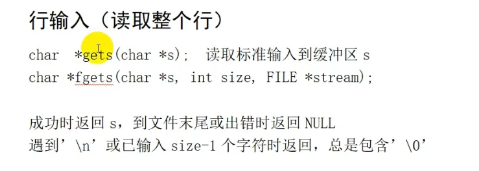
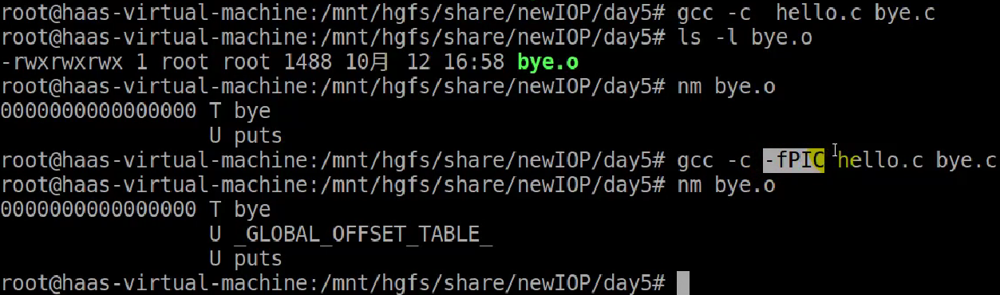

# D01 标准IO介绍及缓冲区
## 标准IO介绍
windows中回车和换行是两个符号，而在linux中只有换行一个符号。
  

## 缓冲区实验
1. 一般情况下，只有缓冲区满了，或者遇到换行符才会输出，这里没有换行符，但是程序是正常输出的，是因为程序结束了，会自动将缓冲区的内容输出。  
  
  

```
tips:在命令行输入man 3 sleep，是查man手册的库函数。
```
2. 像这种情况，程序就不会输出任何信息，因为没有换行符，并且，程序运行后会一直执行，程序不退出，缓冲区的内容就不会输出。  
  
3. 如果有换行符就会有输出。  
  
  
4. 这个相当于是在测试，有多少个字符a，可以将缓冲区填满。结论是，缓冲区一共可以填1024个字节。  
  

# D02 标准IO文件的打开、关闭及代码实现
## 文件的打开和关闭概念

## 文件的打开实现
注意，以“w”打开文件，如果文件存在，并且有内容，他会将文件内容清空并打开。因为是只读方式。以“a”打开文件，如果文件存在，并且有内容，他会在文件后添加新的内容，所以文件内容不会被清空。  
  

如果使用strerror(errno)，括号中的errno是不需要申明的，只需要添加头文件<errno.h>，他在系统头文件中定义了。  
  

## 文件的关闭实现

# D03 标准IO的读写(字符、行)
## 读写单个字符
打开文件后读取，是从文件开头开始读。每次使用fgetc后，读写指针会后移。所以不断用fgetc读，会依次将文件中的字母都读出来。  
  
  

putchar()就是在标准输出上打印字符。  
  

## 按行输入文件(读取整个行)
这里的fgets限定输入5个字符，如果输入的字符数很多，超过了5个，他就会直接取前面4个字符，因为最后一个字符需要存放‘\0’表示结束。而如果只输入3个字符，则是正正好，因为在输入时，会敲入回车，所以fgets接受到的第四个字符就是回车符，第五个字符依旧保留存放‘\0’。  
  
  

上面的是通过fgets读取标准输入，如果通过fgets读文件，同样是限定5个字符，如果输入的字符数很多，超过了5个，他就会直接取前面4个字符，因为最后一个字符需要存放‘\0’表示结束。而如果只输入3个字符，则是正正好，因为有回车符，所以fgets接受到的第四个字符就是回车符，第五个字符依旧保留存放‘\0’。如果输入的字符数小于3，则也只会到回车符结束，也就是只输入一行。  
  
  
  
  

## 按行输出文件(写整个行)
使用r+方式打开文件时，会在读取和写入模式下打开文件。在这种模式下，文件指针位于文件起始处，可以进行读取和写入操作。如果使用r+方式打开文件进行写入操作，它会从当前位置开始写入，并覆盖原有的内容。也就是说，可以想象将原先文件中的内容拉成一个长字符串，然后用puts中的内容，逐个字符的覆盖。  
注意，回车符也算一个字符。  
如果使用a+模式打开文件，文件指针位于文件末尾，然后接下来的具体操作方式，也可以想象将原文件内容拉成一个长字符串，然后将puts中的内容，逐个字符的添加至文件末尾。  
  
原文件内容：  
  
修改后文件内容：  
  

# D04 标准IO读写：二进制方式
## 二进制读写概念
除了文本文件，其他文件一般都是二进制文件。  

## 二进制文件读写代码实现

# D05 流刷新定位
## 文件流的刷新
这里如果没有`fflush(stdout);`这行代码，那么生成的可执行程序执行后，程序就会一直运行，处在`while`循环中，屏幕上也不会输出`printf`中的内容。但是如果加上`fflush(stdout);`这行代码，那么`printf`中的内容会立即输出。同样，将`fflush(stdout);`中的`stdout`替换成`fp`文件指针，也是一样的。  
  

## 文件流的定位
如果对文件通过`a`的方式`fopen`打开，那么`fseek`在移动指针的时候会失败。  
  

```c
long ftell(FILE *stream);
long fseek(FILE *stream, long offset,  int whence);
void rewind(FILE *stream);
```
- fseek函数的形式参数，其中whence可以有三种值：SEEK_SET/SEEK_CUR/SEEK_END  
SEEK_SET：从文件开头往后增加 offset 个位移量为新的读写位置  
SEEK_CUR：以目前的读写位置往后增加 offset 个位移量  
SEEK_END：将读写位置指向文件尾后再增加 offset 个位移量  
offset参数：偏移量，可正可负  
注意事项：文件的打开fopen使用a模式 fseek无效  
- rewind(fp) 相当于 fseek(fp,0,SEEK_SET);  
- ftell(fp) 返回当前文件指针的位置
- 这三个函数只适用2G以下的文件  

# D06 格式化输入输出
## 格式化输入输出
总共四个函数，分别是sprintf、fprintf、fscanf、sscanf。其中最常用的是sprintf和sscanf，主要用于字符串解析。
### 标准I/O – 格式化输出
1. sprintf fprintf
2. 成功时返回输出的字符个数；出错时返回EOF
    ```c
    #include <stdio.h>
    int printf(const char *fmt, …);
    int fprintf(FILE *stream, const char *fmt, …); // 将格式化的内容输入到文件中
    int sprintf(char *s, const char *fmt, …); //将格式化的内容输入到指定的字符串中
    ```
3. sprintf用法(用的非常多，要熟练掌握)：
    ```c
    #include "stdio.h"
    int main(int argc,char *argv[]){
        char buf[100]={0};
        int year=2021;
        int month= 10;
        int day=1;

        sprintf(buf,"%d-%d-%d",year,month,day);
        printf("%s\n",buf);
    }
    ```
4. fprint用法：
    ```c
    #include "stdio.h"
    int main(int argc,char *argv[]){
        FILE *fp;
        int year=2021;
        int month=10;
        int day=1;
        
        fp=fopen("ftest.txt","w");
        if(fp==NULL){
        perror("fopen");
        return 0;
        }
        fprintf(fp,"%d-%d-%d\n",year,month,day);
        fclose(fp);
    }
    ```
### 标准I/O – 格式化输入
1. fscanf：从文件中输入指定的值到变量中去；sscanf：从字符串中输入指定的值到变量中去  
    ```c
    int fscanf(FILE *stream, const char *format, ...);
    int sscanf(const char *str, const char *format, ...);
    ```
2. sscanf用法：
    ```c
    #include "stdio.h"
    int main(int argc,char *argv[]){
        char buf[100]={0};
        int year=2021;
        int month= 10;
        int day=1;
        int syear;
        int smonth;
        int sday;

        sprintf(buf,"%d-%d-%d",year,month,day);
        printf("%s\n",buf);

        // 从buf字符串中按照指定格式，取出三个值并分别赋予三个变量
        sscanf(buf,"%d-%d-%d",&syear,&smonth,&sday);
        printf("%d,%d,%d\n",syear,smonth,sday);
    }
    ```
3. fscanf用法：
    ```c
    #include "stdio.h"
    int main(int argc,char *argv[]){
        FILE *fp;
        int year;
        int month;
        int day;

        fp=fopen("ftest.txt","r");
            if(fp==NULL){
            perror("fopen");
            return 0;
        }

        // 从文件中按照指定格式，取出三个值并分别赋予三个变量
        fscanf(fp,"%d-%d-%d",&year,&month,&day);
        printf("%d,%d,%d\n",year,month,day);
        fclose(fp);
    }
    ```
### 总结：
fprintf：将格式化的内容输入到文件中
sprintf：将格式化的内容输入到指定的字符串中
sscanf：从字符串中按照指定格式，取出值赋予变量
fscanf：从文件中按照指定格式，取出值并赋予变量

# D07 标准IO练习
1. time()用来获取系统时间(秒数)  
   ```c
   // time函数返回的是从 1970.1.1 0:0:0 到现在的秒数
   time_t time(time_t *seconds)
   ```
2. localtime() 将系统时间转换成本地时间  
   struct tm *localtime(const time_t *timer)  
    ```c
    struct tm {
        int tm_sec;         /* 秒，范围从 0 到 59 */
        int tm_min;         /* 分，范围从 0 到 59 */
        int tm_hour;        /* 小时，范围从 0 到 23 */
        int tm_mday;        /* 一月中的第几天，范围从 1 到 31 */
        int tm_mon;         /* 月份，范围从 0 到 11 */
        int tm_year;        /* 自 1900 起的年数 */
        int tm_wday;        /* 一周中的第几天，范围从 0 到 6 */
        int tm_yday;        /* 一年中的第几天，范围从 0 到 365 */
        int tm_isdst;       /* 夏令时 */    
    };
    ```
    注意：   
    int tm_mon;             获取的值要加1是正确的月份  
    int tm_year;            获取的值加1900是正确的年份
3. sleep()实现程序睡眠
4. 每隔1秒向文件test.txt中写入当前系统时间，格式如下：  
1,  2014-10-15 15:16:42  
2,  2014-10-15 15:16:43  
3,  2014-10-16 11:35:07  
4,  2014-10-16 11:35:08  
该程序无限循环，直到按Ctrl-C中断程序  
每次执行程序时，系统时间追加到文件末尾，序号递增  

    ```c
    #include <time.h>
    #include <stdio.h>
    #include <unistd.h>
    #include <string.h>

    int main(int argc,char *argv[]){
        FILE *fp;
        time_t ctime;
        struct tm *ctimestr;
        int linecount = 0; 
        char buf[32];
        fp=fopen("test.txt","a+");
        if(fp==NULL){
            perror("fopen");
            return 0;
        }
        // 获取文件中已有文字的行数
        while(fgets(buf,32,fp)!=NULL){
            // 判断buff的最后一个字符是否为回车，如果是回车说明是读的是一整行
            if(buf[strlen(buf)-1] =='\n'){
                linecount++;
            }
        } 
        while(1){
            ctime = time(NULL);
            //printf("ctime=%d\n",(int)ctime);
            ctimestr = localtime(&ctime);
            printf("%04d-%02d-%02d %02d:%02d:%02d\n",ctimestr->tm_year+1900,ctimestr->tm_mon+1,ctimestr->tm_mday,
                                        ctimestr->tm_hour,ctimestr->tm_min,ctimestr->tm_sec);
            fprintf(fp,"%d, %04d-%02d-%02d %02d:%02d:%02d\n",linecount,ctimestr->tm_year+1900,ctimestr->tm_mon+1,ctimestr->tm_mday,
                                        ctimestr->tm_hour,ctimestr->tm_min,ctimestr->tm_sec);
            fflush(fp);    // 这一步是为了及时将缓冲区的内容刷新到文件中
            linecount++;
            sleep(1);
        }
        fclose(fp);
    }
    ```
# D08 文件IO
## 文件IO概念
1. 文件IO又称为系统IO或者系统调用，是操作系统提供的API接口函数。
2. 注意：文件IO不提供缓冲机制，每次读写操作都引起系统调用
3. 每个打开的文件都对应一个文件描述符。  
4. 文件描述符是一个非负整数。Linux为程序中每个打开的文件分配一个文件描述符。(0-1023，共1024个)
5. 文件描述符从0开始分配，依次递增。
6. 文件IO操作通过文件描述符来完成。
7. 三个标准IO分别对应 0 1 2 这三个文件描述符。每个应用程序打开都会有这三个文件描述符。其中fd表示文件描述符，fp表示文件指针。  
     
## 文件IO的打开使用
1. open函数用来创建或打开一个文件:
    ```c
    // 成功时返回文件描述符；出错时返回EOF
    #include <fcntl.h>
    int open(const char *pathname, int flags);
    int open(const char *pathname, int flags, mode_t mode);
    ```
    - 打开文件时使用两个参数
    - 创建文件时第三个参数指定新文件的权限，（只有在建立新文件时有效）此外真正创建文件时的权限会受到umask值影响(其中umask值是Linux对每个用户的权限限制)，实际权限是mode-umaks
    - 可以打开设备文件，但是不能创建设备文件（创建设备mknode 驱动部分会讲）
2. open函数各个参数含义： 
     
   注意：
    - 在O_NOCTTY参数中说文件作为终端指的是，显示器、键盘以及串口等，因为在Linux中一切皆文件。
    - 其中标准IO中的w功能相当于是O_WRONLY+O_CREAT+O_TRUNC，w+的功能则相当于是O_RDWR+O_CREAT+O_TRUNC，a的功能相当于是O_WRONLY+O_CREAT+O_APPEND。
    - 注意这里的设备文件，之前讨论的文件创建，基本都是指的磁盘文件。
3. 标准与open函数中的flags参数的对应关系：
    | 标准IO |             open函数flags             |
    | :----: | :-----------------------------------: |
    |   r    |               O_RDONLY                |
    |   r+   |                O_RDWR                 |
    |   w    | O_WRONLY \| O_CREAT \| O_TRUNC, 0664  |
    |   w+   |  O_RDWR \| O_CREAT \| O_TRUNC, 0664   |
    |   a    | O_WRONLY \| O_CREAT \| O_APPEND, 0664 |
    |   a+   |  O_RDWR \| O_CREAT \| O_APPEND, 0664  |
   注意：
   - 其中，0664表示的是普通用户权限，也就是open函数中的mode(这个表格是抄的PPT中的)。
   - 对于open函数，可以通过mode参数来设置文件的权限，但是标准IO没有参数可以用来设置权限。
   - 对与标准IO，后面四种方式创建的文件，文件权限都是默认的普通用户权限，也就是664。
4. umask ：用来设定文件或目录的初始权限  
   文件或目录的初始权限 = 文件或目录的最大默认权限 - umask权限
### 示例1
以只写方式打开文件1.txt。如果文件不存在则创建，如果文件存在则清空：  
```c
#include <stdio.h>
#include <sys/types.h>
#include <sys/stat.h>
#include <fcntl.h>
#include <unistd.h>
int main(int argc,char *argv[]){
    int fd;
    fd = open("test.txt",O_WRONLY|O_CREAT|O_TRUNC, 0666);
    if(fd<0){
       printf("open file err\n");
       return 0;
    }
    printf("sucess,fd=%d\n",fd);
}
```
## 文件IO的关闭
1. close函数用来关闭一个打开的文件:
    ```c
    #include <unistd.h>
    int  close(int fd);
    ``` 
    - 成功时返回0；出错时返回EOF
    - 程序结束时自动关闭所有打开的文件
    - 文件关闭后，文件描述符不再代表文件  
    - 对应fclose，fclose的参数是文件指针
    - close的参数是文件描述符，也就是open函数的返回值
### 示例1
以只写方式打开文件1.txt。如果文件不存在则创建，如果文件存在则清空。打开文件后关闭文件：
```c
#include <stdio.h>
#include <sys/types.h>
#include <sys/stat.h>
#include <fcntl.h>
#include <unistd.h>
int main(int argc,char *argv[]){
    int fd;
    int ret;
     
    fd = open("test.txt",O_WRONLY|O_CREAT|O_TRUNC, 0666);
    if(fd<0){
       printf("open file err\n");
       return 0;

    }
    printf("sucess,fd=%d\n",fd);

    ret = close(fd);
    if(ret<0){
        printf("close failed\n");
    }

    // 这里是测试一下，如果关闭文件描述符的情况下再关闭会是什么结果
    ret = close(fd);
    printf("ret=%d\n",ret);
}
```
## 文件IO的读写定位
### 读取文件 写入文件 定位文件
1. read函数用来从文件中读取数据:
    ```c
    #include <unistd.h>
    ssize_t read(int fd, void *buf, size_t count);
    ```
    - 成功时返回实际读取的字节数(返回的字节数可能比count小)；出错时返回EOF
    - 读到文件末尾时返回0
    - buf是接收数据的缓冲区
    - count不应超过buf大小
2. write函数用来向文件写入数据:
    ```c
    #include  <unistd.h>
    ssize_t  write(int fd, void *buf, size_t count);
    ```
   - 成功时返回实际写入的字节数；出错时返回EOF
   - buf是发送数据的缓冲区
   - count不应超过buf大小
3. lseek函数用来定位文件:
    ```c
    #include <unistd.h>
    off_t lseek(int fd, off_t offset, intt whence);
    ```
    - 成功时返回当前的文件读写位置；出错时返回EOF
    - 参数offset和参数whence同fseek完全一样
    - lseek函数的形式参数，其中whence可以有三种值：SEEK_SET/SEEK_CUR/SEEK_END  
    SEEK_SET：从文件开头往后增加 offset 个位移量为新的读写位置  
    SEEK_CUR：以当前的读写位置往后增加 offset 个位移量  
    SEEK_END：将读写位置指向文件尾后再增加 offset 个位移量  
    offset参数：偏移量，可正可负  
### 示例1
将指定内容写入到文件中，并读出来。
```c
#include <stdio.h>
#include <unistd.h>
#include <sys/types.h>
#include <sys/stat.h>
#include <fcntl.h>
#include <string.h>
int main(int argc,char *argv[]){
    int fd;
    int ret;
    char buf[32] = "hello world";
    char buf2[32]={0};
    fd = open("test.txt",O_RDWR | O_CREAT|O_APPEND, 0666);
    if(fd<0){
        printf("open file err\n");
        return 0;
    }
    printf("sucess,fd=%d\n",fd);
    // 将buf中的内容写入到fd中
    ret=write(fd,buf,strlen(buf));
    if(ret<0){
        perror("write");
        goto END;
    }
    printf("write count=%d\n",ret);
    
    // 因为这里文件流指针是指向文件末尾了，所以需要重新定位到文件开始才能读取文件
    // 也可以先关闭再打开，实现一样的功能，如下注释：
    /*
     * close(fd);
     * fd = open("test.txt",O_RDWR | O_CREAT|O_APPEND, 0666);
     */
    lseek(fd,0,SEEK_SET);
    // 将fd中的内容读到buf2中
    ret = read(fd,buf2,32);
    if(ret<0){
        perror("read");
        goto END;
    }
    // 防止因为最后一个字符不是\0，导致打印出乱码，所以将最后一个字符设置为0
    buf2[31]=0;
    printf("read buf2=%s\n",buf2);
END:
    close(fd);
}
```
注意：
1. [perror与printf，及其在错误信息打印上的应用](https://blog.csdn.net/deng942861/article/details/100175606)
2. 注意sizeof和strlen的区别，比如上例中对于`char buf[32] = "hello world";`这个字符串，虽然其中只有hello world这几个字符，但是sizeof得到的结果却是32，而strlen得到的结果才是实际字符的长度。

# D09 目录操作和文件属性获取
## 目录的读取
### 访问目录
1. opendir函数用来打开一个目录文件:
    ```c
    #include <dirent.h>
    DIR *opendir(const char *name);
    DIR *fdopendir(int fd);  使用文件描述符，要配合open函数使用(需要先通过open函数返回文件描述符，再通过fdopendir函数打开文件目录)
    ```
    - DIR是用来描述一个打开的目录文件的结构体类型
    - 成功时返回目录流指针；出错时返回NULL
2. readdir函数用来读取目录流中的内容:
    ```c
    #include <dirent.h>
    struct dirent *readdir(DIR *dirp);
    ```
    - struct dirent是用来描述目录流中一个目录项的结构体类型
    - 包含成员char d_name[256] (为struct dirent结构体中的一项)(d_name为目录项中的文件名)
    - 成功时返回目录流dirp中下一个目录项
    - 出错或到末尾时时返回NULL
3. closedir函数用来关闭一个目录文件:
    ```c
    #include <dirent.h>
    int closedir(DIR *dirp);
    ```
    - 成功时返回0；出错时返回EOF
### 示例
读取文件目录并返回其中的目录项  
```c
#include <dirent.h>
#include <stdio.h>
int main(int argc,char **argv){
    DIR* dp;
    struct dirent *dt;
    dp=opendir("/mnt/hgfs/share/newIOP/");
    if(dp == NULL){
        perror("opendir");
        return 0;
    }
    while((dt=readdir(dp))!=NULL){
       printf("%s\n",dt->d_name);
    }
    closedir(dp);
}
```
## 文件属性获取
### 修改文件访问权限
chmod/fchmod函数用来修改文件的访问权限:
```c
#include  <sys/stat.h>
int  chmod(const char *path, mode_t mode);
int  fchmod(int fd, mode_t mode); (需要先通过open函数返回文件描述符)
```
- 成功时返回0；出错时返回EOF
- root和文件所有者能修改文件的访问权限
- 示例： chmod(“test.txt”, 0666);
### 获取文件属性
1. stat/lstat/fstat函数用来获取文件属性:
    ```c
    #include  <sys/stat.h>
    int  stat(const char *path, struct stat *buf);
    int  lstat(const char *path, struct stat *buf);
    int  fstat(int fd, struct stat *buf);
    ```
    - 成功时返回0；出错时返回EOF
    - 如果path是符号链接stat获取的是目标文件的属性；而lstat获取的是链接文件的属性
2. Stat 结构体(struct stat是存放文件属性的结构体类型):
    ```c
    struct stat {
        dev_t         st_dev;       //文件的设备编号
        ino_t         st_ino;       //节点
        mode_t        st_mode;      //文件的类型和存取的权限
        nlink_t       st_nlink;     //连到该文件的硬连接数目，刚建立的文件值为1
        uid_t         st_uid;       //用户ID
        gid_t         st_gid;       //组ID
        dev_t         st_rdev;      //(设备类型)若此文件为设备文件，则为其设备编号
        off_t         st_size;      //文件字节数(文件大小)
        unsigned long st_blksize;   //块大小(文件系统的I/O 缓冲区大小)
        unsigned long st_blocks;    //块数
        time_t        st_atime;     //最后一次访问时间
        time_t        st_mtime;     //最后一次修改时间
        time_t        st_ctime;     //最后一次改变时间(指属性)
    };
    ```  
    其中，以下几个重要：
    ```c
    mode_t  st_mode;    // 类型和访问权限
    uid_t  st_uid;      // 所有者id
    uid_t  st_gid;      // 用户组id
    off_t  st_size;     // 文件大小
    time_t  st_mtime;   // 最后修改时间
    ```
3. 文件类型(st_mode)，通过系统提供的宏来判断文件类型:  
    |        宏         | 对应数字 |       意义       |
    | :---------------: | :------: | :--------------: |
    |      S_IFMT       | 0170000  | 文件类型的位遮罩 |
    | S_ISREG(st_mode)  | 0100000  |   是否常规文件   |
    | S_ISDIR(st_mode)  | 0040000  |     是否目录     |
    | S_ISCHR(st_mode)  | 0020000  |   是否字符设备   |
    | S_ISBLK(st_mode)  | 0060000  |    是否块设备    |
    | S_ISFIFO(st_mode) | 0010000  |   是否FIFO文件   |
    | S_ISLNK(st_mode)  | 0120000  |   是否链接文件   |
    | S_ISSOCK(st_mode) | 0140000  |  是否SOCKET文件  |
4. 通过系统提供的宏来获取文件访问权限:
    |   宏    | 对应数字 |           意义           |
    | :-----: | :------: | :----------------------: |
    | S_IRUSR |  00400   | bit:8    所有者有读权限  |
    | S_IWUSR |  00200   |  7    所有者拥有写权限   |
    | S_IXUSR |  00100   | 6    所有者拥有执行权限  |
    | S_IRGRP |  00040   |    5   群组拥有读权限    |
    | S_IWGRP |  00020   |    4   群组拥有写权限    |
    | S_IXGRP |  00010   |   3   群组拥有执行权限   |
    | S_IROTH |  00004   |  2   其他用户拥有读权限  |
    | S_IWOTH |  00002   |  1   其他用户拥有写权限  |
    | S_IXOTH |  00001   | 0   其他用户拥有执行权限 |
### 示例
获取指定文件的文件类型、权限、日期等相关信息
```c
#include <stdio.h>
#include <sys/types.h>
#include <sys/stat.h>
#include <unistd.h>
#include <time.h>

int main (int argc,char **argv){

   struct stat buf;
   int ret;
   ret = stat("chmod_t.c",&buf);
   if(ret<0){
      perror("stat");
      return 0;

   }
   if(S_ISREG(buf.st_mode)){
       printf("-");
   }
   if(S_ISDIR(buf.st_mode)){
       printf("d");
   }
   if(S_ISCHR(buf.st_mode)){
       printf("c");
   }
   if(S_ISBLK(buf.st_mode)){
       printf("b");
   }
   if(S_ISFIFO(buf.st_mode)){
       printf("p");
   }
   if(S_ISSOCK(buf.st_mode)){
       printf("s");
   }
   
//   printf(" ");
   int i;
   for(i=8;i>=0;i--){
       if(buf.st_mode & (1<<i)){
          switch(i%3){
          case 2:
              printf("r");
              break;
          case 1:
              printf("w");
              break;
          case 0:
              printf("x");
              break;
          }
       }else{
           printf("-");
       }
   }
   
   printf(" %d",(int)buf.st_size);

   struct tm *t;
   t = localtime(&buf.st_ctime);
   printf(" %d-%d-%d %d:%d",t->tm_year+1900,t->tm_mon+1,t->tm_mday,t->tm_hour,t->tm_min);

   printf(" chmod_t.c\n");
}
```

# D10 静态库和动态库的使用
## 静态库的使用
### 库的概念
1. 库是一个二进制文件，包含的代码可被程序调用。
2. 其中库都有标准C库、数学库、线程库。
3. 库有源码，可下载后编译；也可以直接安装二进制包。
4. 库一般在目录/lib和/usr/lib。
5. 库是事先编译好的，可以复用的代码。
6. 在OS上运行的程序基本上都要使用库。使用库可以提高开发效率。
7. Windows和Linux下库文件的格式不兼容。
8. Linux下包含静态库和共享库。
### 静态库特点
1. 编译(链接)时把静态库中相关代码复制到可执行文件中
2. 程序中已包含代码，运行时不再需要静态库
3. 程序运行时无需加载库，运行速度更快
4. 占用更多磁盘和内存空间
5. 静态库升级后，程序需要重新编译链接
### 静态库创建
1. 如果一个程序的内容只是像这样，没有main函数，
    ```c
    // hello.c
    #include <stdio.h>
    void hello(void) {
        printf("hello  world\n");
        return 0;
    }

    ```
    那么执行命令gcc -c hello.c得到的文件只是hello.o文件，而不是可执行文件，可执行文件只有当有main函数时才行。
2. 创建库文件 ar 指令，其参数：  
    - c  禁止在创建库时产生的正常消息
    - r  如果指定的文件已经存在于库中，则替换它
    - s  无论 ar 命令是否修改了库内容都强制重新生成库符号表
    - v  将建立新库的详细的逐个文件的描述写至标准输出(一般与-t配合使用，-tv表示将生成库的源文件及其文件描述，写至标准输出)
    - q  将指定的文件添加到库的末尾
    - t  将库的目录写至标准输出(该参数也就是看这个库文件是由哪个文件产生的)
3. 通过ar指令和gcc -c hello.c得到的hello.o文件生成库文件：  
   `ar -rsv libhello.a  hello.o`
4. 创建静态库总结：  
    - 创建静态库步骤：  
      1. 编写库文件代码，编译为.o 目标文件  
         `gcc -c xxxx.c`
      2. ar 命令创建 libxxxx.a 文件  
         `ar -rsv  libxxxx.a  xxxx.o`
    - 注意：  
      1. 静态库名字要以lib开头，后缀名为.a  
      2. 没有main函数的.c 文件不能生成可执行文件。
### 链接静态库
1. 链接静态库：
`gcc -o 目标文件 源码.c  -L路径  -lxxxx`  
-L  表示库所在的路径  
-l 后面跟库的名称  
2. 编写应用程序test.c，并使用刚刚生成的libhello.a静态库
    ```c
    #include <stdio.h>
    void hello(void);    
    int main() {
        hello();
        return 0;
    }
    ```
    编译test.c并链接静态库libhello.a。其中`-L`表示要链接的库文件的路径，这里的`.`表示当前目录，`-l`表示要链接的库文件名称(不用包含前缀和后缀)。
    ```bash
    $ gcc -o test test.c -L. -lhello
    $ ./test    # hello  world
    ```
    如果不明确链接，编译时会报错：  
    test.c:(.text+0x15)：对‘hello’未定义的引用  
    collect2: error: ld returned 1 exit status

## 动态库的使用
### 动态库的特点
1. 编译(链接)时仅记录用到哪个共享库中的哪个符号，不复制共享库中相关代码  
程序不包含库中代码，尺寸小  
多个程序可共享同一个库  
程序运行时需要加载库  
库升级方便，无需重新编译程序  
使用更加广泛  
### 动态库创建
1. 编译生成目标文件`gcc -c -fPIC hello.c bye.c`，会生成`hello.o`和`bye.o`。编译时，要加后缀-fPIC。如下图可以看到加-fPIC与不加的区别  
     
2. 创建动态库`gcc -shared -o libmyhello.so hello.o bye.o`
     
3. 创建动态库总结：  
    - 创建动态库步骤：  
      1. 编写库文件代码，生成位置无关代码的 .o 目标文件  
         `gcc -c -fPIC xxx.c ...`
      2. 生成动态库  
         `gcc -shared -o libxxx.so xxx.o ...`
      3. 编译可执行文件  
         `gcc -o 目标文件 源码.c  -L路径  -lxxx`
### 链接动态库
1. 链接动态库：
`gcc -o 目标文件 源码.c  -L路径  -lxxxx`  
-L  表示库所在的路径  
-l 后面跟库的名称  
2. 链接动态库注意事项：
   - 如果直接运行链接动态库后的可执行文件，会报错：error while loading shared libraries: libcommon.so  cannot open shared object file : No such file or directory找不到目标文件，因为动态库默认不会在当前目录寻找，而是会在/usr/lib和/lib目录下寻找。
   - 为了让系统能找到要加载的共享库，有三种方法 ：
     - 把库拷贝到/usr/lib和/lib目录下。
     - 在LD_LIBRARY_PATH环境变量中添加库所在路径。也就是在当前终端中运行`export  LD_LIBRARY_PATH=$LD_LIBRARY_PATH:.`，这行代码表示将当前目录`.`，也就是共享库文件所在目录， 添加到环境变量`LD_LIBRARY_PATH`中。但是通过export的方式添加环境变量的方式仅仅适用于当前运行该export命令的终端。所以，如果在`~/.bashrc`文件中添加`export  LD_LIBRARY_PATH=$LD_LIBRARY_PATH:.`就可以对每一个打开的终端执行添加环境变量的命令。
     - 添加/etc/ld.so.conf.d/*.conf文件，执行ldconfig刷新。理论上就是只要在/etc/ld.so.conf.d/目录下的某个conf文件中添加共享库文件所在的目录即可，但是这里为了以后方便查找，自己添加的共享库文件路径，一般放在`/etc/ld.so.conf.d/libc.conf`文件中。
   - 查看可执行文件使用的动态库：  
    ldd 命令: ldd 你的可执行文件