# D01 进程的创建与回收
## 进程的概念
### 进程的概念
1. 程序
   - 存放在磁盘上的指令和数据的有序集合（文件）
   - 静态的
2. 进程
   - 执行一个程序所分配的资源的总称
   - 进程是程序的一次执行过程
   - 动态的，包括创建、调度、执行和消亡
### 进程包含的内容
1. 其中进程是运行在RAM中，程序是存储在ROM中
   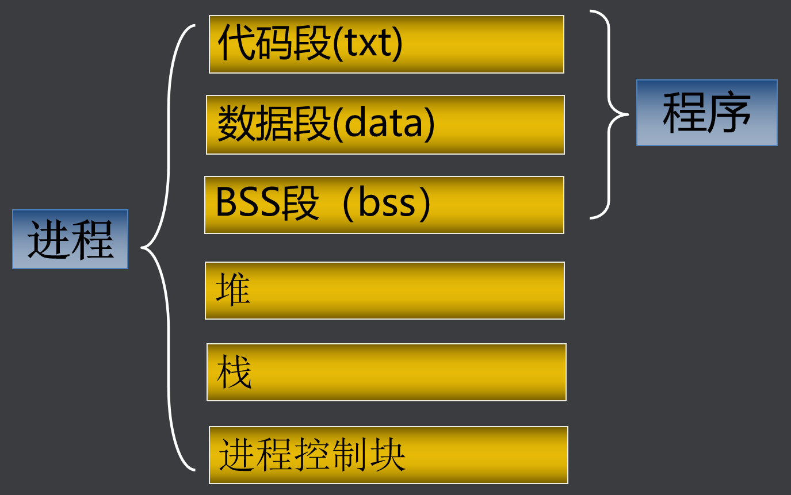  
   - BSS段：BSS段通常是指用来存放程序中未初始化的全局变量的一块内存区域。BSS是英文Block Started by Symbol的简称。
   - 数据段：数据段通常是指用来存放程序中已初始化的全局变量的一块内存区域。
   - 代码段：代码段通常是指用来存放程序执行代码的一块内存区域。这部分区域的大小在程序运行前就已经确定，在代码段中，也有可能包含一些只读的常数变量，例如字符串常量等。
   - 堆（heap）：堆是用于存放进程运行中被动态分配的内存段，当进程调用**malloc等函数分配**内存时，新分配的内存就被动态添加到堆上（堆被扩张）；当利用free等函数释放内存时，被释放的内存从堆中被剔除（堆被缩减）
   - 栈(stack)：栈又称堆栈， 是用户存放程序临时创建的**局部变量**，（但不包括static声明的变量，static意味着在数据段中存放变量）。除此以外，在函数被调用时，其**参数**也会被压入发起调用的进程栈中，并且待到调用结束后，函数的**返回值**也会被存放回栈中。由于栈的先进后出特点，所以栈特别方便用来保存/恢复调用现场。从这个意义上讲，我们可以把堆栈看成一个寄存、交换临时数据的内存区。
   - 进程控制块(pcb)：主要用于管理进程的一些属性，其中包括进程标识PID、进程用户、进程状态、进程优先级、文件描述符表等。
### 进程类型
- 交互进程：在shell下启动。以在前台运行，也可以在后台运行
- 批处理进程：和在终端无关，被提交到一个作业队列中以便顺序执行
- 守护进程：和终端无关，一直在后台运行
### 进程状态
1. 进程状态有哪些：
   - 运行态：进程正在运行，或者准备运行
   - 等待态：进程在等待一个事件的发生或某种系统资源
   - 可中断
   - 不可中断
   - 停止态：进程被中止，收到信号后可继续运行
   - 死亡态：已终止的进程，但pcb没有被释放
2. 进程状态图：
   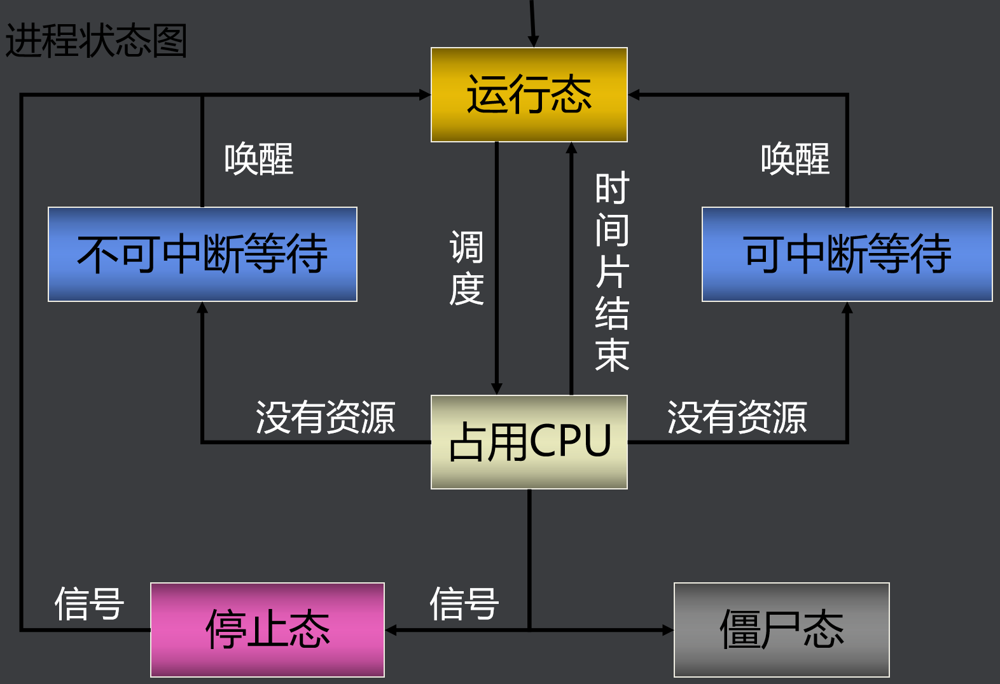  

## 进程常用命令
### 查看进程信息
| 命令  |       作用       |
| :---: | :--------------: |
|  ps   | 查看系统进程快照 |
|  top  | 查看进程动态信息 |
| /proc | 查看进程详细信息 |

(个人感觉ps更好用，因为可以配合grep命令直接搜索)  
(/proc实际上是一个进程目录，可以通过`ls /proc`来查看目录中的内容)
#### ps命令
- ps 命令详细参数：(一般情况下都是`ps -ef`)
   - -e：显示所有进程  
   - -l：长格式显示更加详细的信息  
   - -f： 全部列出，通常和其他选项联用  

  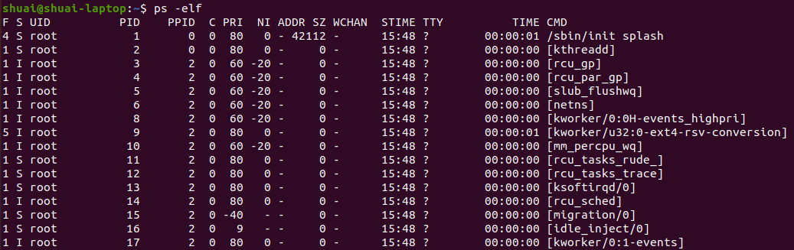
- 如下表格是对上图`ps -elf`中各个字段的解释：
  <table>
    <tbody>
      <tr>
        <td>
          <p><strong>表头</strong></p>
        </td>
        <td>
          <p><strong>含义</strong></p>
        </td>
      </tr>
      <tr>
        <td>
          <p>F</p>
        </td>
        <td>
          <p>进程标志，说明进程的权限，常见的标志有两个:</p>
          <p>1：进程可以被复制，但是不能被执行；</p>
          <p>4：进程使用超级用户权限；</p>
        </td>
      </tr>
      <tr>
        <td>
          <p>S</p>
        </td>
        <td>
          <p>进程状态。进程状态。常见的状态有以下几种：</p>
          <p>D：不可被唤醒的睡眠状态，通常用于 I/O 情况。</p>
          <p>R：该进程正在运行。</p>
          <p>S：该进程处于睡眠状态，可被唤醒。</p>
          <p>T：停止状态，可能是在后台暂停或进程处于除错状态。</p>
          <p>W：内存交互状态（从 2.6 内核开始无效）。</p>
          <p>X：死掉的进程（应该不会出现）。</p>
          <p>Z：僵尸进程。进程已经中止，但是部分程序还在内存当中。</p>
          <p>&lt：高优先级（以下状态在 BSD 格式中出现）。</p>
          <p>N：低优先级。</p>
          <p>L：被锁入内存。</p>
          <p>s：包含子进程。</p>
          <p>l：多线程（小写 L）。</p>
          <p>+：位于后台。</p>
        </td>
      </tr>
      <tr>
        <td>
          <p>UID</p>
        </td>
        <td>
          <p>运行此进程的用户的 ID；</p>
        </td>
      </tr>
      <tr>
        <td>
          <p>PID</p>
        </td>
        <td>
          <p>进程的 ID；</p>
        </td>
      </tr>
      <tr>
        <td>
          <p>PPID</p>
        </td>
        <td>
          <p>父进程的 ID；</p>
        </td>
      </tr>
      <tr>
        <td>
          <p>C</p>
        </td>
        <td>
          <p>该进程的 CPU 使用率，单位是百分比；</p>
        </td>
      </tr>
      <tr>
        <td>
          <p>PRI</p>
        </td>
        <td>
          <p>进程的优先级，数值越小，该进程的优先级越高，越早被 CPU 执行；</p>
        </td>
      </tr>
      <tr>
        <td>
          <p>NI</p>
        </td>
        <td>
          <p>进程的优先级，数值越小，该进程越早被执行；</p>
        </td>
      </tr>
      <tr>
        <td>
          <p>ADDR</p>
        </td>
        <td>
          <p>该进程在内存的哪个位置；</p>
        </td>
      </tr>
      <tr>
        <td>
          <p>SZ</p>
        </td>
        <td>
          <p>该进程占用多大内存；</p>
        </td>
      </tr>
      <tr>
        <td>
          <p>WCHAN</p>
        </td>
        <td>
          <p>该进程是否运行。"-"代表正在运行；</p>
        </td>
      </tr>
      <tr>
        <td>
          <p>TTY</p>
        </td>
        <td>
          <p>该进程由哪个终端产生；</p>
        </td>
      </tr>
      <tr>
        <td>
          <p>TIME</p>
        </td>
        <td>
          <p>该进程占用 CPU 的运算时间，注意不是系统时间；</p>
        </td>
      </tr>
      <tr>
        <td>
          <p>CMD</p>
        </td>
        <td>
          <p>产生此进程的命令名；</p>
        </td>
      </tr>
    </tbody>
  </table>

#### top命令
top    查看进程动态信息
|  top快捷键   |     作用     |
| :----------: | :----------: |
|   shift +>   |    后翻页    |
|   shift +<   |    前翻页    |
| top -p PID号 | 查看某个进程 |

### 进程相关命令
#### 改变进程优先级
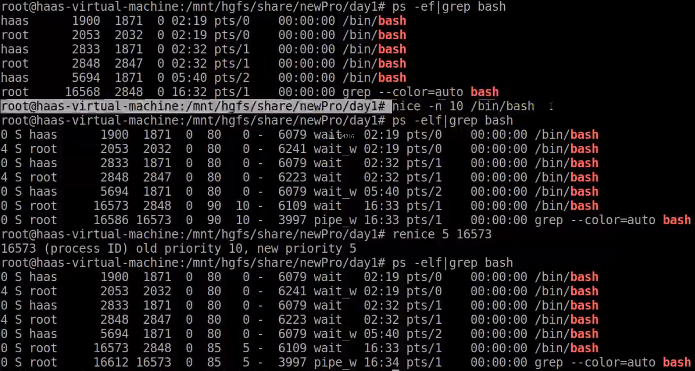
1. nice：按用户指定的优先级运行进程  
   命令：`nice [-n NI值] 命令`
   - NI 范围是 -20~19。数值越大优先级越低
   - 普通用户调整 NI 值的范围是 0~19，而且只能调整自己的进程。
   - 普通用户只能调高 NI 值，而不能降低。如原本 NI 值为 0，则只能调整为大于 0。
   - 只有 root 用户才能设定进程 NI 值为负值，而且可以调整任何用户的进程。
2. renice：改变正在运行进程的优先级  
	 命令：renice [优先级] PID
#### 杀死进程
1. 强制杀死某进程：`kill -9 PID号`
#### 关于进程前后台运行的命令
|   命令   |              作用              |
| :------: | :----------------------------: |
|   jobs   |          查看后台进程          |
|    bg    |     将挂起的进程在后台运行     |
|    fg    |  把后台运行的进程放到前台运行  |
|  ctrl+z  | 把运行的前台进程转为后台并停止 |
| ./test & |     把test程序放在后台运行     |

注意：  
这里分析中的test程序，内容如下：
```c
#include <stdio.h>
#include <unistd.h>
int main(int argc, char **argv)
{
  while(1)
  {
    sleep(1);
  }
}
```
- `ctrl+z`并不是将程序真正的停止了，而是将程序转为了后台运行
- `jobs`显示的是当前终端中后台运行的程序
- `./test &`就是在正常运行程序的时候在程序名称后面加一个`&`符号，表示将该程序test放到后台运行
- 通过命令`fg 1`将后台程序放到前台运行，这里命令中的`1`，是停止运行程序前的序号`1`  
  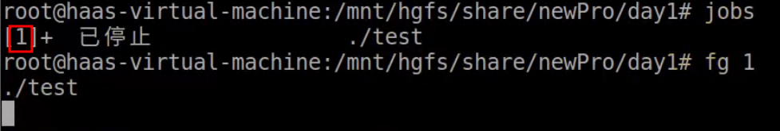
- 通过命令`fg 1`将挂起的进程在后台运行，这里命令中的`1`，与上一条`fg 1`中的`1`是一样的。从下图可以看到，当执行`ctrl+z`后，test程序挂起，并在后台的状态为`T`，也就是停止状态。此时通过`fg 1`将该挂起的程序再次运行，我们可以发现前台并没有直接执行该程序，但是通过ps命令可以看到在后台test程序已经又重新运行起来了。至于为什么这里test程序是`S`(sleep)状态，是因为test程序的主要内容就是sleep函数  
  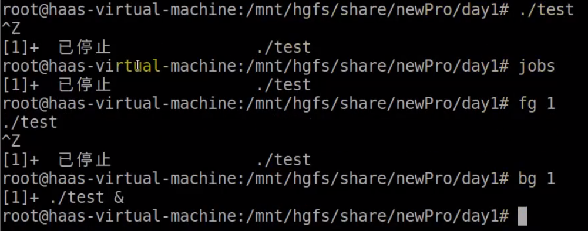
  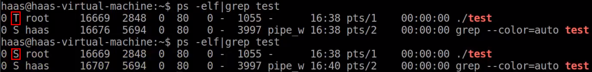

## 创建子进程
### 子进程概念
1. 子进程为由另外一个进程（对应称之为父进程）所创建的进程
### 子进程创建
1. 进程创建函数fork
   ```c
   #include  <unistd.h>
   pid_t fork(void);
   ```
   - 创建新的进程，失败时返回-1
   - 成功时父进程返回子进程的进程号，子进程返回0
   - 通过fork的返回值区分父进程和子进程  
2. 由下图所示，进程A创建进程子进程B时，相当于是直接复制了一份代码，但是子进程B中只运行fork以下的代码。  
   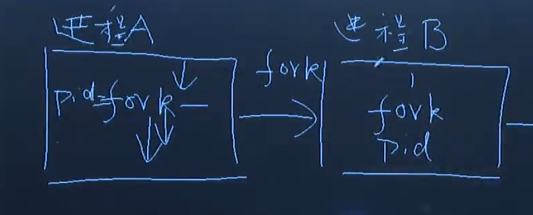  
3. fork程序执行顺序示例：  
    ```c
    #include <stdio.h>
    #include <unistd.h>
    int main(int argc,char **argv){
        pid_t pid;
        printf("before fork\n");
        pid = fork();
        printf("pid=%d\n",(int)pid);
        printf("after fork\n");
    }
    ```
    - 这里before fork会被父进程打印一次，after fork会被父子进程分别打印一次，总共两次。对于PID号，第一次父进程会打印出子进程的PID号，第二次子进程则会打印0。
    - 这里我有一点自己的理解：在 fork() 函数调用后，子进程会继承父进程的变量（包括全局变量和堆栈中的局部变量），但是子进程不会重新执行 fork() 函数之前的代码。子进程会从 fork() 函数调用之后的地方开始执行，并且会继续执行其后的代码。
4. 通过if判断来确定父进程与子进程分别执行哪一段代码：
    ```c
    #include <stdio.h>
    #include <unistd.h>
    int main(int argc,char **argv){
        pid_t pid;
        printf("before fork\n");
        pid = fork();
        if(pid>0){
            printf("This is father process\n");
            printf("pid=%d\n",(int)pid);
            printf("father after fork\n");
        }else if(pid==0){
            printf("This is child process\n");
            printf("pid=%d\n",(int)pid);
            printf("child after fork\n");
        }else if(pid<0){
            perror("fork");
            return 0;
        }
        printf("after fork\n");
    }
    ```
    - 这里父进程与子进程具体谁先执行，这个通过代码是无法决定的，进程执行的先后顺序是由操作系统来决定的
### 父子进程间的关系
1. 父子进程间的关系：
   - 子进程继承了父进程的内容
   - 父子进程有独立的地址空间，互不影响
   - 若父进程先结束
     - 子进程成为孤儿进程，被init进程收养
     - 子进程变成后台进程
   - 若子进程先结束
     - 父进程如果没有及时回收，子进程变成僵尸进程
2. 示例代码并分析：
    ```c
    // fork_t.c
    #include <stdio.h>
    #include <unistd.h>
    int main(int argc,char **argv){
        pid_t pid;
        printf("before fork\n");
        pid = fork();
        if(pid>0){
            printf("This is father process\n");
            printf("pid=%d\n",(int)pid);
            printf("father after fork\n");
            while(1){
                sleep(1);
                printf("father sleep\n");
            }
        }else if(pid==0){
            printf("This is child process\n");
            printf("pid=%d\n",(int)pid);
            printf("child after fork\n");
            while(1){
                sleep(1);
                printf("child sleep\n");
            }
        }else if(pid<0){
            perror("fork");
            return 0;
        }
        // printf("pid=%d\n",(int)pid);
        // printf("after fork\n");
    }
    ```
    - 运行上述代码，会创建两个进程，通过命令`ps -elf | grep fork_t`即可查看到这两个进程的PID号，见下图：  
      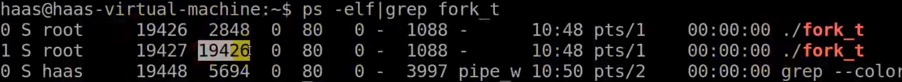  
      可见下面一个进程的父进程PID号是上面一个进程，所以上面一个进程就是父进程
    - 由下图可见，当把父进程19426杀死后，子进程还在，但是其父进程变成了1进程，也就是init进程(但是我自己的电脑运行结果是，如果杀死父进程，子进程的父进程就变成了1648进程)：  
      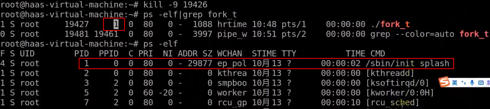  
      并且此时子进程19427变成了后台进程，通过ctrl+c已经无法杀死了。此时只能通过`kill -9 19427`来杀死
    - 如下图，当先把子进程杀死时，再通过`ps -elf | grep fork_t`来查看子进程，可以发现此时子进程变成了僵尸进程(defunct进程)：  
      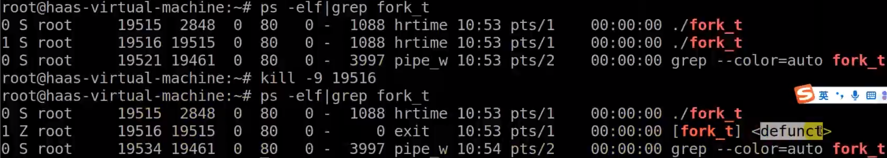  
      此时通过kill或者ctrl+c杀死父进程，子进程僵尸进程也就会消失了：  
      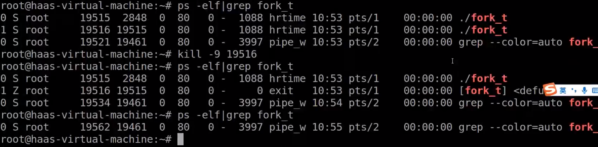  

## 子进程进阶
写一段代码，使得一个父进程生成很多子进程。  
```c
#include <stdio.h>
#include <unistd.h>
int main(){
    pid_t pid;
    int i;    
    for(i=0;i<5;i++){
        pid = fork();
        if(pid<0){
            perror("fork");
            return 0;
        }else if(pid==0){
            printf("child process\n");
            sleep(5);
            // 这里的break是为了每次父进程生成子进程后，让子进程跳出循环，不然子进程也会进入循环，产生"孙进程"
            break;
        }else{
            printf("Father process\n");
            sleep(5);
        }
    }
    // 这里加了sleep(100)是为了，当子进程从循环中break出来后，子进程不会变成僵尸进程。如果不加sleep(100)，子进程就会无事可做，变成僵尸进程
    sleep(100);
}
```

## 进程的退出
```c
#include <stdlib.h> 
#include <unistd.h>
void exit(int status);
void _exit(int status);
void _Exit(int status);
```
- 结束当前的进程并将status返回
- exit结束进程时会刷新(流)缓冲区，而_exit或者_Exit不会刷新(流)缓冲区
- main函数有return，没有exit，但是return时程序会默认执行exit。而普通函数return只是返回上一级
- 注意：在 exit() 函数中，括号中的 `status` 参数表示程序的退出状态码。
  - 这个状态码是一个整数，通常用来表示程序的退出状态。当程序正常退出时，通常使用状态码 0，表示成功执行；而当程序异常退出时，可以使用其他非零的状态码来指示具体的错误或异常情况。这个状态码可以被操作系统或调用程序获取，以便在程序退出时进行处理或记录。
  - 也就是说，这个状态码是由编程人员自己指定的，并且这个状态码会被其他函数捕获，比如`wait(&status)`函数。

## 进程的回收
父进程创建了子进程，如果在子进程被杀死时，父进程如果没有回收子进程，那么子进程就会变成僵尸进程。那么如何回收呢，就是wait、waitpid这两个函数。  
- 注意：  
  - 子进程结束时由父进程回收
  - 孤儿进程由init进程回收
  - 若没有及时回收会出现僵尸进程
1. wait函数
   ```c
   #include <sys/wait.h>
   pid_t wait(int *status); 
   ```
   - 成功时返回回收的子进程的进程号；失败时返回EOF
   - 若子进程没有结束，父进程一直阻塞
   - 若有多个子进程，哪个先结束就先回收
   - status指定保存子进程返回值和结束方式的地址（注意：status中不光有子进程的返回值，还有其他东西，所以如果要获取子进程的返回值，还需要通过WEXITSTATUS(status)来获取）
   - status为NULL表示直接释放子进程PCB,不接收返回值
   - 示例：  
      ```c
      #include <stdio.h>
      #include <sys/wait.h>
      #include <unistd.h>
      #include <stdlib.h>

      int main(int argc, char** argv){

        pid_t pid;
        pid_t rpid;
        pid = fork();
        int status;
        if(pid<0){
            perror("fork");
            return 0;
        }
        else if(pid == 0){
            sleep(10);
            printf("child will exit\n");
            exit(2);
        }else if(pid >0){
            // 正常回收子进程时，这里的status就是exit(2)括号中的2
            rpid = wait(&status);
            printf("Get child status=%x\n",WEXITSTATUS(status));
        }

        while(1){
          sleep(1);
        }

      }
      ```
      - 子进程通过exit/_exit/return返回某个值(0-255)，父进程调用wait(&status)回收
        - WIFEXITED(status) 判断子进程是否正常结束
        - WEXITSTATUS(status) 获取子进程返回值
        - WIFSIGNALED(status) 判断子进程是否被信号结束
        - WTERMSIG(status) 获取结束子进程的信号类型

2. waitpid函数
   ```c
   #include  <sys/wait.h>
   pid_t waitpid(pid_t pid, int *status, int option);
   ```
   - 成功时返回回收的子进程的pid或0；失败时返回EOF
   - pid可用于指定回收哪个子进程或任意子进程
   - status指定用于保存子进程返回值和结束方式的地址
   - option指定回收方式，0 或 WNOHANG
   - 参数：
      - pid
          - pid>0时，只等待进程ID等于pid的子进程，不管其它已经有多少子进程运行结束退出了，只要指定的子进程还没有结束，waitpid就会一直等下去。
          - pid=-1时，等待任何一个子进程退出，没有任何限制，此时waitpid和wait的作用一模一样。
          - pid=0时，等待同一个进程组中的任何子进程，如果子进程已经加入了别的进程组，waitpid不会对它做任何理睬。
          - pid<-1时，等待一个指定进程组中的任何子进程，这个进程组的ID等于pid的绝对值。
      - options
          - options提供了一些额外的选项来控制waitpid，目前在Linux中只支持WNOHANG和WUNTRACED两个选项，这是两个常数，可以用"|"运算符把它们连接起来使用
          - WNOHANG：若由pid指定的子进程未发生状态改变(没有结束)，则waitpid()不阻塞，立即返回0
          - WUNTRACED：返回终止子进程信息和因信号停止的子进程信息
          wait(wait_stat) 等价于waitpid(-1,wait_stat,0) 
   - 示例：  
      ```c
      #include <stdio.h>
      #include <sys/wait.h>
      #include <unistd.h>
      #include <stdlib.h>

      int main(int argc, char** argv){
        pid_t pid;
        pid_t rpid;
        pid = fork();
        int status;
        if(pid<0){
            perror("fork");
            return 0;
        }
        else if(pid == 0){
            sleep(1);
            printf("child will exit\n");
            exit(2);
        }else if(pid >0){
            // 这里的sleep是为了等待子进程运行结束，因为这里的WNOHANG表示不等待
            // 所以一般情况下，标志位应该设置成0，正常等待
            sleep(2);
            waitpid(-1,&status,WNOHANG);
            printf("Get child status=%x\n",WEXITSTATUS(status));
        }

        while(1){
          sleep(1);
        }

      }
      ```
# D02 exec函数族
## exec函数族的执行过程
1. 进程调用exec函数族执行某个程序
2. 进程当前内容被指定的程序替换  
3. 实现让父子进程执行不同的程序
   - 父进程创建子进程
   - 子进程调用exec函数族
   - 父进程不受影响  

以上也就是说，当我们在shell中运行某个程序时，可以查看到其父进程为shell，这是因为在一般情况下，如果在shell中运行另一个程序test，shell会创建一个子进程，让子进程调用exec函数，执行test程序，这样子进程就变成了test程序。而父进程不受影响，依旧可以继续创建子进程并执行其他程序。  

## execl函数和execlp函数
### 进程 – execl / execlp
```c
#include <unistd.h>
int execl(const char *path, const char *arg, …);
int execlp(const char *file, const char *arg, …);
```
- 对于execl第一个参数，要写上需要执行程序的完整路径，包含程序名和路径
- 对于execlp的第一个参数，就写需要执行的程序名称就可以了，会在环境变量路径PATH中查找
- 成功时执行指定的程序；失败时返回EOF
- path 执行的程序名称，包含路径
- arg… 传递给执行的程序的参数列表
- file 执行的程序的名称，在PATH中查找
- 这两个函数的最后一个参数都要写NULL
- 进程当前内容被指定的程序替换，但进程号不变
### 进程创建 – execl(p) – 示例
执行ls命令，显示/etc目录下所有文件的详细信息
```c
// 这里就相当于都实现了ls -al /etc
if (execl("/bin/ls", "ls", "-a", "-l", "/etc", NULL) < 0) {
    perror("execl");
}  

if (execlp("ls", "ls", "-a", "-l", "/etc", NULL) < 0) {
    perror("execlp");
}  
```

## execv函数和execvp函数
### 进程 – execv / execvp
这两个函数与上面的 execl / execlp 的区别，主要就在于 execl / execlp 是直接传参，而 execv / execvp 是将参数封装成数组，然后再传
```c
#include  <unistd.h>
int execv(const char *path, char *const argv[]);
int execvp(const char *file, char *const argv[]);
```
- 成功时执行指定的程序；失败时返回EOF
- arg… 封装成指针数组的形式
### 进程创建 – execv(p) – 示例
执行ls命令，显示/etc目录下所有文件的详细信息
```c
char *arg[] = {"ls", "-a", "-l", "/etc", NULL};

if (execv("/bin/ls", arg) < 0) {
    perror("execv");
}

if (execvp("ls", arg) < 0) {
    perror("execvp");
}
```

## system函数
### 进程 – system
```c
#include <stdlib.h>
int system(const char *command);
```
- 成功时返回命令command的返回值；失败时返回EOF
- 当前进程等待command执行结束后才继续执行（这一点与execl等函数不同，后者运行时，进程当前内容会被execl等函数要执行的程序替换）
### 示例
可以看到这个函数使用起来更加简单
```c
#include <stdio.h>
#include <stdlib.h>

int main(){
	system("ls -a -l ./");
}
```

## exec函数族特点
