# 全新青云1000镜像上手
## 参考
[快速上手-烧录固件](https://qingyun-docs.readthedocs.io/zh/latest/02%E5%BF%AB%E9%80%9F%E4%B8%8A%E6%89%8B.html)  
[网络连接-配置网络](https://qingyun-docs.readthedocs.io/zh/latest/03%E7%BD%91%E7%BB%9C%E8%BF%9E%E6%8E%A5.html)  
[Ubuntu20.04软件源更换](https://zhuanlan.zhihu.com/p/142014944)  
[Ubuntu软件仓库-清华大学开源软件镜像站](https://mirrors.tuna.tsinghua.edu.cn/help/ubuntu/)
## 上网步骤
1. 配置网络前，确保USB网卡和USB转typec线都正常连接
2. USB连接windows，设置RNDIS，建立连接。一开始windows的IP地址设置为192.168.1.100
3. 设置完RNDIS即可连接，然后修改青云1000usb0的IP地址为192.168.251.2，防止与wifi局域网冲突。修改文件`/etc/netplan/01-netcfg.yaml`，并执行指令`sudo netplan apply`，执行一瞬间会断网
4. 修改windows端RNDIS的IP地址为192.168.251.100，修改后可以ssh重新连接青云1000
5. 连接wifi，先扫描网络`nmcli device wifi list`，然后连接`sudo nmcli device wifi connect 248服务器 password 201248sciei`，再通过`nmcli device wifi list`，查看连接的网络前是否有星号。有星号表示连接上了。此时就可以通过WIFI网络来ssh青云了
6. 尝试更新源，如果`sudo apt update`更新失败，查看当前系统时间`date`，如果当前系统时间不是当前时间，请`sudo date -s "YYYY-MM-DD HH:MM:SS"`暂时先手动修改为当前时间。然后就可以update成功，此时就可以正常使用了。
7. (可选)修改镜像源，先备份`sudo cp /etc/apt/sources.list /etc/apt/sources.list.bak`，再修改`sudo vim /etc/apt/sources.list`，最后更新`sudo apt update`
## 使用4G模块(先插卡再插电源)
1. 先看下4G模块的接口图，4G模块12V供电，并插上可用的电话卡，5G卡也可以，不过用的是4G网络。先插卡再插电源，否则连不上网  
   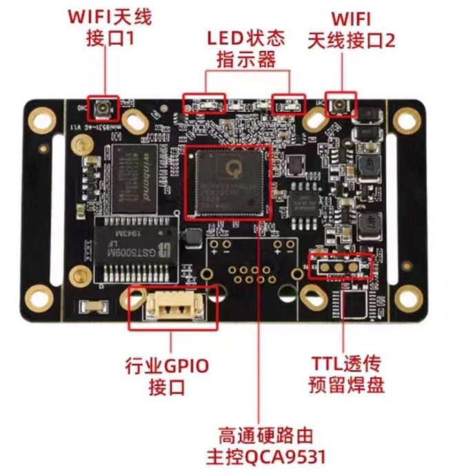  
   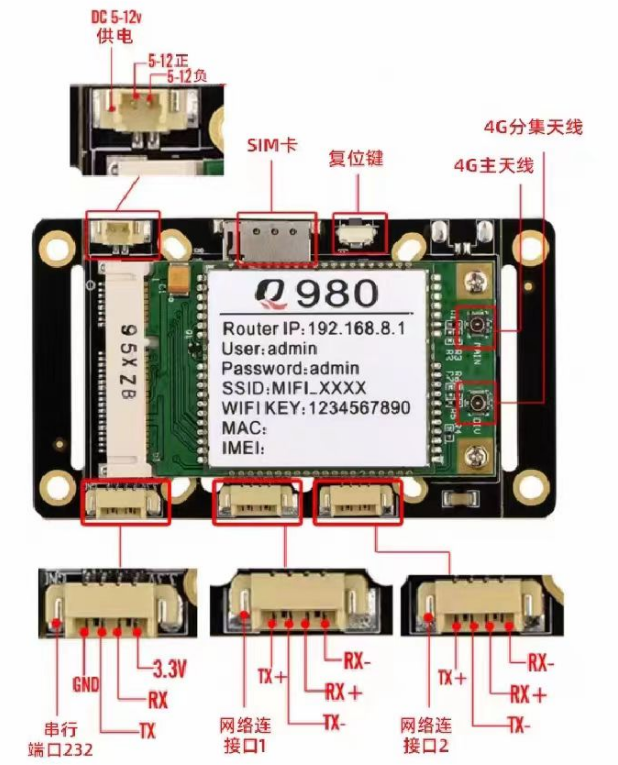  
2. 将4G模块按照下图所示方式与青云1000接线。使用的连接线是SH1.25-4P转水晶头的线，4G模块接LAN口。使用4G模块的时候请确保无线网卡可用，否则断掉USB0，电脑就连不上青云1000了
   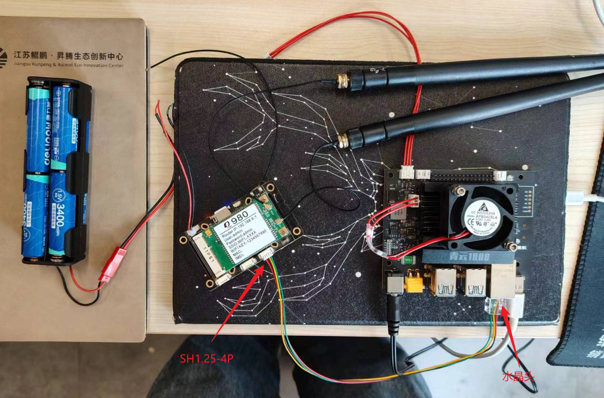  

**注意**：
1. 此时如果在连接USB0的情况下ping百度会发现无法ping通，如果断掉USB0，则发现可以ping通。此时可尝试使用命令`tracepath -b www.baidu.com`来查看，网络访问的依次顺序，第一个出现的是网关，如下图：  
   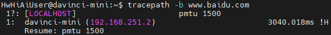  
   然而这里的网关是自己在/etc/netplan/01-netcfg.yaml文件中配置的，文件内容如下，需要将其注释掉，注释后如图：  
   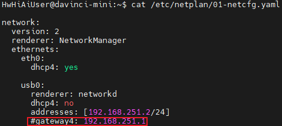  
2. 注释后可以发现，可以ping通了。此时就可以拔掉USB网卡，只通过4G模块上网了。注意USB0是要连接着青云1000，通过USB0来ssh青云1000
3. 其实这里有个问题，明明是通过无线网卡连的网，但是ping百度的时候确是走的USB0的网关，为什么？经手动验证发现，连外部网时，选择网关的顺序时按照`route -n`列举的网关顺序，默认会经过第一个网关来联通外部网络
   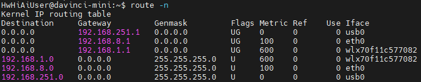  
   之前为什么联不通，是因为自己在/etc/netplan/01-netcfg.yaml文件中配置的网关实际上不存在，任何目标地址在本地子网之外的数据包都将被转发到这个网关进行进一步路由，指定的网关不存在或无法访问可能会导致与本地子网之外的主机之间的通信受限或无法进行。确保配置中指定的网关可访问且针对网络进行了正确配置是确保网络正常运行的关键。

# 全新华为Atlas 200IDK 2A上手
[Atlas 200I DK A2开发者套件](https://www.hiascend.com/document/detail/zh/Atlas200IDKA2DeveloperKit/23.0.RC2/lg/toctopics/topic_0000001698461113.html)  
## 配置网络
最初始的/etc/netplan/01-netcfg.yaml配置文件备份
```yaml
network:
  version: 2
  renderer: networkd
  ethernets:
    eth0:
      dhcp4: yes
      nameservers:
        addresses: [8.8.8.8]
        addresses: [114.114.114.114]

    eth1:
      dhcp4: no
      addresses: [192.168.137.100/24]
      routes:
        - to: default
          via: 192.168.137.1
      nameservers:
        addresses: [8.8.8.8]
        addresses: [114.114.114.114]

    usb0:
      dhcp4: no
      addresses: [192.168.0.2/24]
```
## 使用VNC远程
[使用VNC登录](https://www.hiascend.com/document/detail/zh/Atlas200IDKA2DeveloperKit/23.0.RC2/Hardware%20Interfaces/hiug/hiug_0060.html)
## 如何在公网上建立局域网(内网透传)
1. 安装Tailscale，[下载](https://tailscale.com/download/linux)。运行下载指令  
   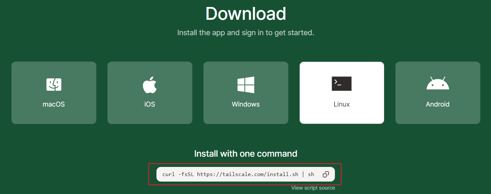  
2. 将指令粘贴到Linux终端直接运行
3. 运行完后，会提示执行`sudo tailscale up`，启动tailscale
4. 启动后终端会返回一个网址，将这个网址输入到其他电脑的浏览器里面，然后登陆账号。这样就自动构建局域网了，可以在[网站](https://login.tailscale.com/admin/machines)上看到。其中address栏就是对应的IP地址  
   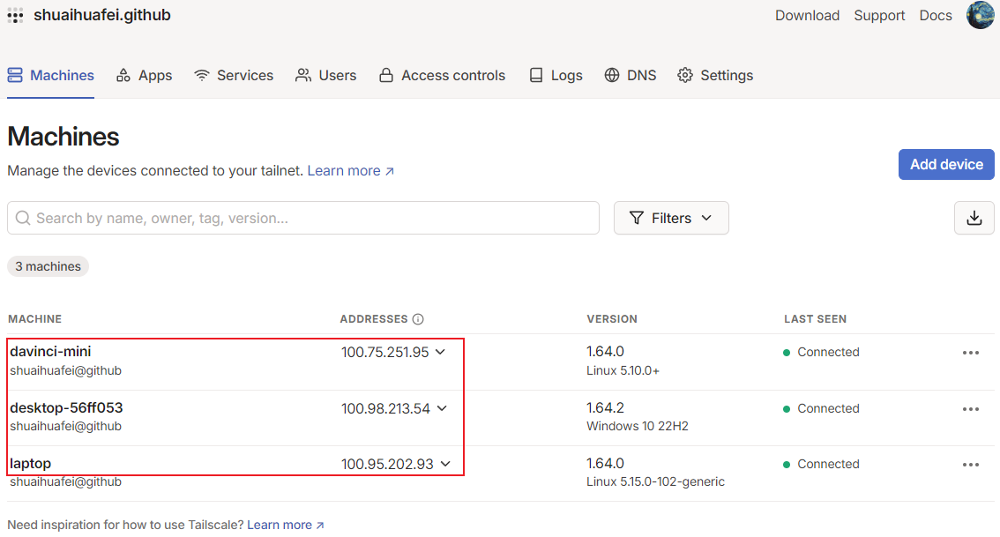  
5. 关机后，下次开机，Tailscale会自启，在上面的网址中可以看到
### 注意
1. 用这种方式ssh远程连接，网速很慢，达不到及时控制的要求，所以最多只能用来远程
2. Linux终端可以输入`ip addr show tailscale0`获取tailscale的内网透传IP地址
## 问题记录
1. **问题**：  
   在使用 APT 安装软件包的结尾，出现这样的报错：  
   Failed to retrieve available kernel versions.  
   Failed to check for processor microcode upgrades.  
   **解决**：
   通过修改 needrestart 的配置去消去这类报错1：  
   ```bash
   sudo vim /etc/needrestart/needrestart.conf
   ```
   在配置文件中找到 kernelhints 和 ucodehints 这两行，取消注释并将值改成 0：  
   (vim中如何搜索？在普通模式下  
   输入 / 后跟要搜索的词或短语，然后按 Enter。  
   例如，/word 会搜索文档中的 “word”。  
   使用 n（next）跳转到下一个匹配项。  
   使用 N（previous）跳转到上一个匹配项。)  
   ```conf
   $nrconf{kernelhints} = 0;
   $nrconf{ucodehints} = 0;
   ```
## 安装ros1
安装前提是已经配置并可以科学上网了。安装步骤大体遵循[此教程](http://www.autolabor.com.cn/book/ROSTutorials/chapter1/12-roskai-fa-gong-ju-an-zhuang/124-an-zhuang-ros.html)  
虽然已经科学上网，但是安装依旧有可能出错。在执行`sudo rosdep init`和`rosdep update`时。此时需要修改/etc/hosts文件，具体实现：
1. 访问 https://www.ipaddress.com/ 并输入域名 raw.githubusercontent.com，查询 ip 地址。  
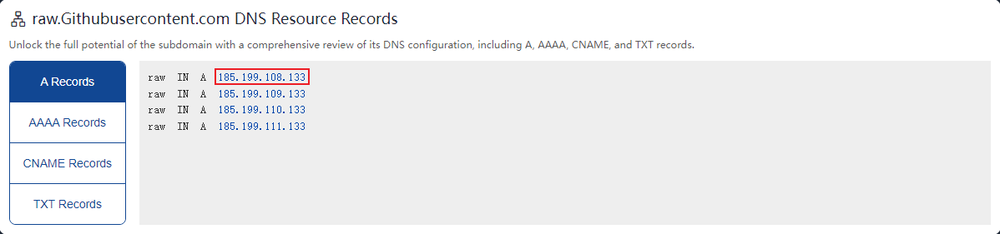  
2. 修改/etc/hosts文件：  
`sudo gedit /etc/hosts`。添加ip和域名映射到hosts文件，保存并退出。  
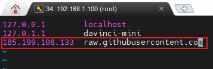  
操作完毕后，终端再次运行指令即可正常执行。  

# 全新英伟达Jetson Nano上手
## 镜像烧录和启动
[jetson nano镜像烧录](https://blog.csdn.net/ZNC1998/article/details/130004714)  
[超详细Jetson Xavier NX烧录系统镜像](https://blog.csdn.net/weixin_45371818/article/details/123838502)  
[补充教程 - 英伟达官方源Jetson Xavier NX安装Ubuntu20.04](https://blog.csdn.net/m0_53717069/article/details/128536837)  
1. nano板烧录教程看第一个，底下两个可以不看
2. SDFormatter可以直接格式化SD卡，不管SD卡中分了多少盘，很香，比磁盘管理器方便。
3. 镜像下载，这个[网址](https://developer.nvidia.com/embedded/downloads)点进去后，搜索`Jetson Nano Developer Kit SD Card Image`得到的就是SD卡的镜像，注意版本，4.6.1对应的是Ubuntu18.04的版本，也是目前的最新版本。下载的时候最好用迅雷，不然太慢了。
4. 注意下载的镜像是Jetson Nano的，别下错了。下错了，启动不了，只会显示Nvidia的图片。
5. 第一次启动会提示错误`A start job is running for End-user configuration after initial OEM installation`，断电重启即可。解决参考[博客链接](https://forums.developer.nvidia.com/t/jetpack-4-2-1-fails-to-boot-on-nano/78710)。
6. 目前创建的用户名为`ei`(影-雷电将军)，密码是`0`。
## 安装nomachine并远程连接
1. 下载[地址](https://downloads.nomachine.com/linux/?id=30&distro=Arm)。nano板对应的版本为ARMv8  
   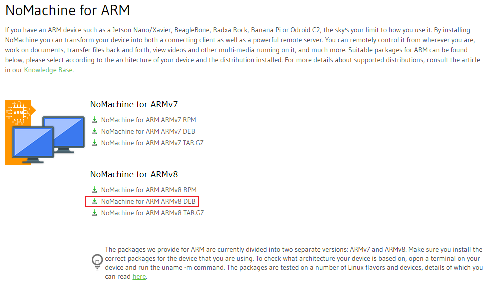  
2. 注意客户端和服务端都要安装，才能连接。一定要安装对应系统支持的版本才行。使用教程参考[官方文档](https://www.nomachine.com/getting-started-with-nomachine)。其实最重要的就是配置好这一页就可以了，IP地址一定要输对  
   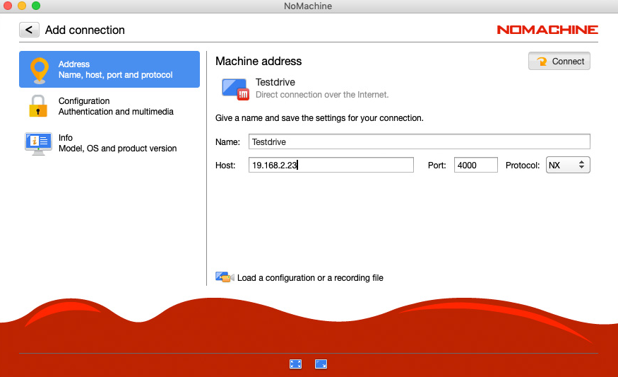  
## 更改主目录为英文
1. 在终端中输入以下命令
`export LANG=en_US`  
`xdg-user-dirs-gtk-update`
2. 在询问是否将目录转化为英文的窗口中选择同意
3. 使用命令将系统语言转化为中文
`export LANG=zh_CN`
4. 重启系统，在登录的时候会提示是是否把英文目录转化为中文，选择不同意，并勾选不再提示。
## 配置科学上网
这里不适用clash for windows，使用clash内核上网，在其他电脑上通过网页显示clash ui。具体步骤如下：
1. 在其他电脑上ssh连接nano板
2. `sudo su root`，因为下面很多地方需要root权限，直接切换到root用户
3. `uname -m`，查看系统架构，如果返回的是aarch64，就使用clash-linux-arm64-latest.gz这个版本的core，如果返回x86_64，就使用clash-linux-amd64-latest.gz这个版本的core。下载源[GitHub网址](https://github.com/szkzn/Clash_Core_Latest_Bak_2023-09-05.git)
4. `mkdir /opt/clash && cd /opt/clash`，将对应版本的core，通过ssh复制到板载计算机/opt/clash的文件夹中
5. `gunzip clash-linux-arm64-latest.gz`，解压缩
6. `chmod +x clash-linux-arm64-latest`，添加可执行权限
7. `mv clash-linux-arm64-latest clash`，将文件重命名，名字太长
8. 以上clash已经可以运行，但是需要配置文件，没有配置文件，就只是clash运行，但是没有节点。配置文件可以从Windows端的clash获取，通过如下图所示方式获取，并将其移动到Linux的`/opt/clash/`目录下
    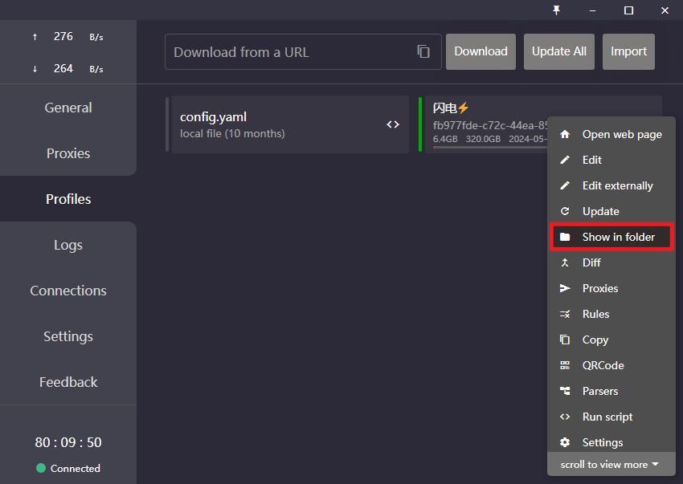  
    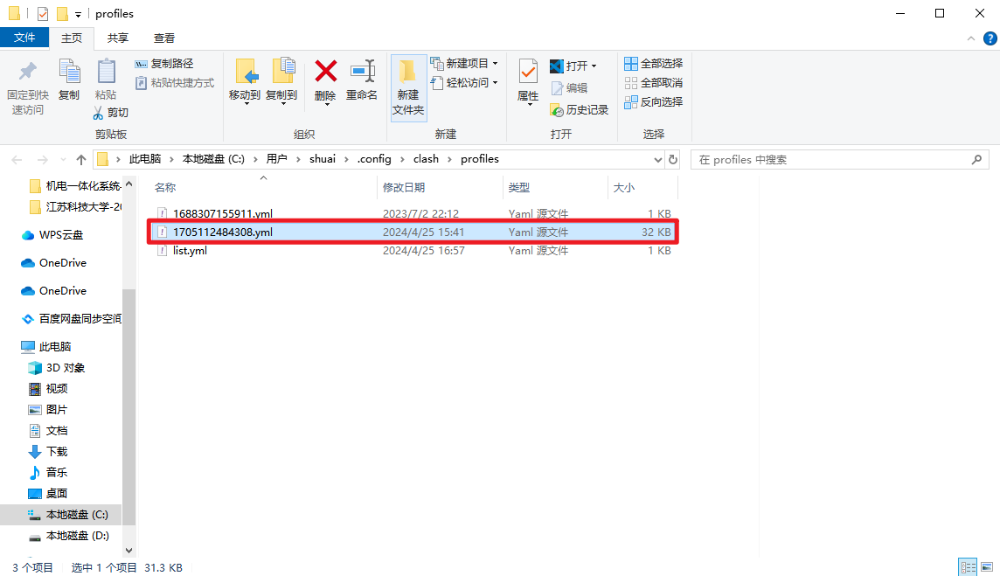  
9. `./clash -f 1705112484308.yml`，此时就可以直接运行了
10. 但是上述运行过程过于复杂，可以将其简化为一个系统命令
11. `mv 1705112484308.yml config.yaml`，先将1705112484308.yml文件重命名
12. `vim /etc/systemd/system/clash.service`，clash.service的内容为
   ```txt
   [Unit]
   Description=clash-core
   [Service]
   Type=simple
   ExecStart=/opt/clash/clash -f /opt/clash/config.yaml
   ```
13. `systemctl daemon-reload`，重新加载 Systemd 的配置文件
14. `systemctl start clash`，启动clash
15. `systemctl status clash`，查看clash状态，可以发现已经启动
16. 但是此时终端`curl -i google.com`还是无法连通
17. `vim ~/.bashrc`，这里是直接在root目录下的.bashrc中修改，在最一开始添加  
    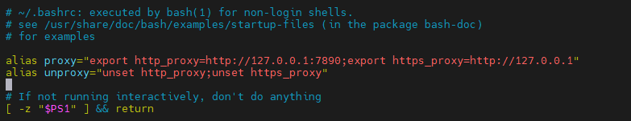
   ```bash
   alias proxy="export http_proxy=http://127.0.0.1:7890;export https_proxy=http://127.0.0.1:7890"
   alias unproxy="unset http_proxy;unset https_proxy"
   ```
18. `source ~/.bashrc`，刷新环境变量
19. `proxy`，运行在.bashrc文件中定义的指令名
20. `curl -i google.com`，此时可以发现google可以ping通
21. 以上可以实现，在终端中输入`proxy`，就可以在终端科学上网，在终端中输入`unproxy`，就可以在终端停止科学上网。然后可以退出root用户，将当前用户的.bashrc文件中也加上那两行，这样不论是普通用户还是root用户都可以科学上网。然后再切换至root用户。但是上述方式目前为止，只能在终端查看clash的状态`systemctl status clash`，最好能有个ui，下面的步骤将介绍如何在同局域网的其他计算机的浏览器中查看clash状态
22. [下载](https://gitlab.com/accessable-net/clash-dashboard/-/tree/gh-pages?ref_type=heads)ui相关的zip，如下图所示
    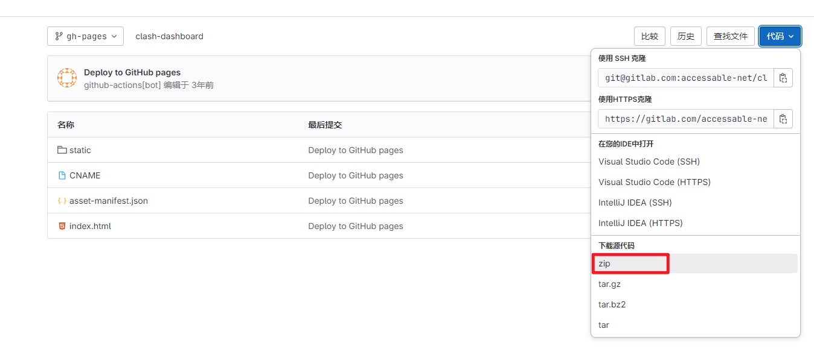
23. `mkdir /opt/clash/ui && cd /opt/clash/ui`，在Linux端新建一个目录/opt/clash/ui
24. 将下载好的zip文件移动到Linux端的目录/opt/clash/ui中，或者复制下载链接，在终端中执行`wget 下载链接`直接下载也可以
25. 下载后使用unzip解压。解压后，将压缩文件删除，并将解压出来的文件夹中的文件都移出来`mv clash-dashboard-gh-pages/* .`。并退回到/opt/clash目录中`cd ..`
    解压出来的文件大概有如下：  
    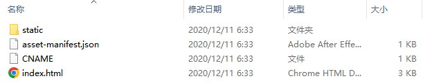
26. `vim config.yaml`，在config.yaml文件中添加一行，使其指向`ui/index.html`这个文件，这样才能在网页中看到。添加的一行为`external-ui: /opt/clash/ui`，位置如图中红框所示。还需修改一行，否则无法从其他计算机浏览器访问这个网页，修改处如图中绿框中所示，将其中的127.0.0.1修改为0.0.0.0。
    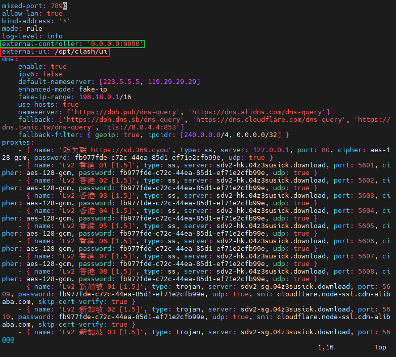  
27. 修改完成后保存，并`systemctl restart clash`重启clash。重启后可`systemctl status clash`，查看clash状态
28. 重启完成后在同局域网的其他计算机的浏览器中输入该Linux端的IP地址加端口号，`192.168.1.107:9090/ui`，即可看到clash的ui，可在其中选择节点。如果此时跳出来一个界面，输入Linux端的IP地址即可
### 启动
1. 如何启动和关闭clash
   ```bash
   # 启动clash
   sudo systemctl start clash
   # 查看clash状态，是否被启动
   sudo systemctl status clash
   # 在终端环境变量中定义的变量，终端可上网
   proxy
   # 在终端环境变量中定义的变量，终端关闭上网
   unproxy
   # 关闭clash
   sudo systemctl stop clash
   ```
## 安装ROSmelotic
安装参考[教程](http://www.autolabor.com.cn/book/ROSTutorials/chapter1/12-roskai-fa-gong-ju-an-zhuang/127-zi-65993a-qi-ta-ros-ban-ben-an-zhuang.html)
1. 执行`sudo rosdep init``rosdep update`时，如果报错`ERROR: cannot download default sources list from:https://raw.githubusercontent.com/ros/rosdistro/master/rosdep/sources.list.d/20-default.list Website may be down.`，进入[网址](https://www.ipaddress.com/)，并输入域名`raw.githubusercontent.com`，查询 ip 地址。将其添加到`/etc/hosts`文件中，如下图。如果添加后执行`rosdep update`依旧报错，反复执行直到成功即可。注意此时终端不要科学上网，如果科学上网，会直接报错  
   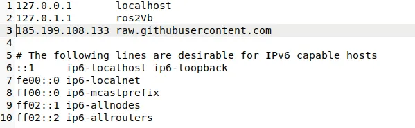
## 安装conda
因为nano板不支持安装miniconda，读者可自行尝试，安装会报错``，这里使用miniforge来替代miniconda，日常使用体验完全相同，安装[地址](https://github.com/conda-forge/miniforge?tab=readme-ov-file)，点击如下图红框处，即可下载安装文件  
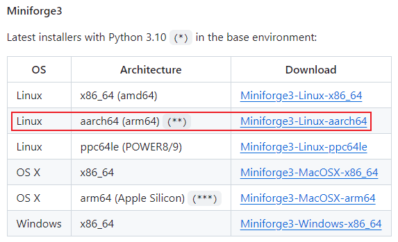  
## 安装Prometheus
安装参考[教程](https://wiki.amovlab.com/public/prometheus-wiki/%E5%BF%AB%E9%80%9F%E4%B8%8A%E6%89%8B/Prometheus%E4%BB%BF%E7%9C%9F%E7%8E%AF%E5%A2%83%E9%85%8D%E7%BD%AE_Ubuntu/Prometheus%E9%85%8D%E7%BD%AE.html)
1. 这里我安装mavros直接是安装的官方的mavros，没有安装教程里的mavros。使用过程应该是一样的，后续使用如果有问题，在此记录
2. 官方的mavros安装步骤如下：
   - 安装mavros，有两种方式：
     - 二进制安装：
       ```bash
       sudo apt update
       sudo apt install ros-${ROS_DISTRO}-mavros ros-${ROS_DISTRO}-mavros-extras
       # 能成功cd到mavros文件夹中就说明安装成功
       roscd mavros
       ```
     - 源码安装：[Ubuntu 18.04下MAVROS源码安装实战教程](https://cloud.baidu.com/article/3285498) (注：未实践过，可自行百度尝试)
   - 安装GeographicLib(安装这个库，其实也是安装mavros的一部分，之所以单独列出来，是因为这个库的安装可能会有问题)，两种安装方式：
     - 官网安装(安装前提是要科学上网，并且安装过程很慢，在安装过程中会好像卡住，其实是正在安装，静候即可)：
       ```bash
       wget https://raw.githubusercontent.com/mavlink/mavros/master/mavros/scripts/install_geographiclib_datasets.sh
       sudo chmod 777 ./install_geographiclib_datasets.sh
       # 执行下面的安装脚本会自动安装到/usr/share路径下
       sudo ./install_geographiclib_datasets.sh
       ```
     - 从已经安装好的电脑上复制过去
       ```bash
       # 先提升到root用户
       sudo su
       # scp远程复制 如果提示权限不够就先复制到普通用户目录然后再复制到/usr/share
       scp -r shuai@192.168.1.xxx:/usr/share/GeographicLib /usr/share
       ```
3. 都安装完后，编译
## T265室内定位
### 参考博客
[使用Jetson Nano向PX4提供T265位置信息，实现室内定点飞行](https://blog.csdn.net/shsh0810/article/details/120632267)  
[T265 安装（Realsense SDK和Realsense-ros）](https://blog.csdn.net/weixin_63883896/article/details/129483203)  
[Jetson nano+T265+PX4实现室内定点飞行](https://blog.csdn.net/qq_37939940/article/details/129882230)  
[PX4实战之旅（五）：利用T265实现室内定点飞行](https://blog.csdn.net/qq_38768959/article/details/127775815)  
1. 主要是参考了第一个博客，但是要注意的是T265停产，Realsense的SDK后续版本将不再支持T265，所以要使用旧版的SDK。这里Realsense SDK的版本是2.48.0，realsense-ros版本是2.3.1。注意这里sdk版本和ros功能包版本要对应上，这是官网的要求，见[realsense-ros2.3.1版本的GitHub链接](https://github.com/IntelRealSense/realsense-ros/tree/2.3.1)
   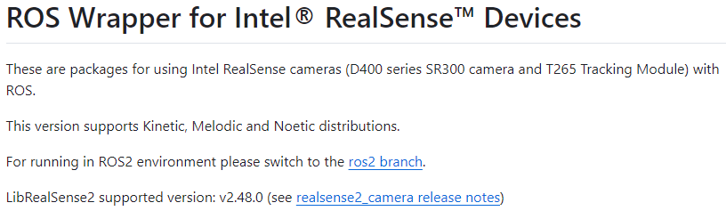  
2. 下载对应版本的GitHub仓库，如果直接`git clone -b v2.3.1 https://github.com/IntelRealSense/realsense-ros.git`无法下载，提示没有对应版本，但是上GitHub查看，又发现有需要的版本，可以先直接`git clone`下载下来后，通过`git checkout 2.3.1`切换到对应的版本即可
3. 在第三个博客里有一个git指令
   ```bash
   git checkout `git tag | sort -V | grep -P "^2.\d+\.\d+" | tail -1`
   ```
   这个指令的含义可以问gpt，其实也是在切换realsense-ros的仓库版本。如果在git clone时就已经下载了对应的版本，这个指令就不用执行了
4. 对于飞控的方向，pixhawk朝上的情况下，指示针指向的是x轴正方向，pixhawk往左就是y轴正方向，pixhawk往上就是z轴正方向
5. 启动指令`roslaunch px4_realsense_bridge bridge_mavros.launch`
### 补充
1. 加了一个launch文件，其中就是启动了一下mavros。不使用视觉定位，使用GPS定位，启动指令`roslaunch px4_realsense_bridge bridge_mavros_gps.launch`
## nomachine分辨率调节
参考[博客](https://blog.csdn.net/qq_43519779/article/details/115427703)  
终端运行`xrandr --fb 1920x1080`后，关掉nomachine客户端，重连nano板。不然鼠标会有偏移。  
## 风扇
[Jetson nano 风扇启动/自启动](https://blog.csdn.net/weixin_42026571/article/details/108550541)  
