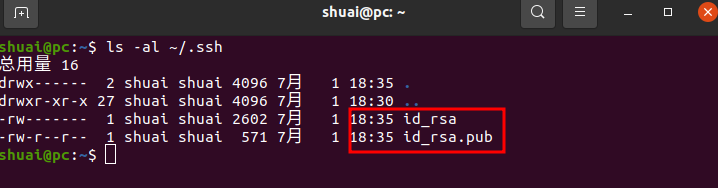
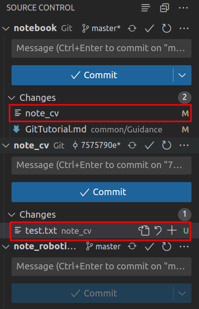

最详细视频教程01_尚硅谷_Git_课程介绍_哔哩哔哩_bilibili
# 安装
1. 安装git时，除了需要修改一下安装位置和编辑器，只需要点击下一步即可。
2. 安装git后，需要先设置一下用户标签，该用户标签只需要设置一次即可，用户标签的内容是用户名和邮箱。该用户名和邮箱并不会在后期上传代码时，被外部验证，仅仅起到标识自己身份的作用，所以可以随便设置，不需要与GitHub的用户名和邮箱一致。命令：
```bash
git config --global user.name <用户名>    #设置用户签名之姓名
git config --global user.email <邮箱>    #设置用户签名之邮箱
```
注：git的用户标签的保存目录在~/.gitconfig
内容如下：
```bash
[user]
    name = shuai
    email = shuai701029@gmail.com
```

# 命令
1. 初始化本地库：新建一个文件夹，打开后并右击空白部分打开`git bash`，输入`git init`，初始化本地库，然后输入`git status`，查看本地库状态，此时文件名是红色。
2. 添加暂存区：`git add <file>`，是指定文件添加到暂存库，但是一般情况下都是`git add .`，添加所有文件到暂存区。再`git status`，查看本地库状态，此时文件名是绿色，说明该文件已被追踪。也可以通过命令`git rm --cached <file>...`删除刚刚添加到暂存区的文件，但是注意，并不是删除本地的文件。
3. 提交本地库：此步骤会形成历史版本。输入`git commit -m "<日志信息>" <文件名>`。再`git status`，查看本地库状态。发现已成功提交本地库。此时可以输入命令`git reflog`或者`git log`查看当前日志。
4. 修改文件：如果修改其中的文件，再输入`git status`，会发现修改后的文件变成了红色，会提示添加到暂存区。此时重复步骤2和步骤3即可。此时可以输入命令`git reflog`或者`git log`查看当前日志，会发现日志已更新。
5. 历史版本：`git reflog`查看精简的历史版本以及当前在哪个版本，`git log`查看详细历史版本，其中包含安装步骤中设置的用户标签。其中`git reflog`查看到的版本号，是`git log`查看到的版本号的前7位。
6. 版本穿梭：使用命令`git reset --hard <git reflog查看到的7位版本号>`即可穿梭到对应的版本。

# 分支
1. 查看分支：`git branch`或者`git branch -v`
2. 创建分支：`git branch <新的分支名>`
3. 切换分支：`git checkout <分支名>`。切换分支后，一样可以修改文件，并添加暂存区，提交本地库。但是在新的分支修改文件，并不会影响其他分支的文件，其他分支依旧还是原先版本的文件。
4. 合并分支：`git merge <分支名>`。切换回master分支后，如果此时master分支并没有修改新分支修改的文件，则可以直接合并，合并后的master分支就会变成新分支修改后的样子。如果合并分支时，master也对相同文件做了修改，此时会发生冲突(分支名会变成master|MERGING)，需要人为的确定最终采用哪个版本的代码，此时需要修改之前两个分支共同修改的文件，做最终敲定，详细步骤可见视频教程[18_尚硅谷_Git_分支_合并分支(冲突合并)_哔哩哔哩_bilibili](https://www.bilibili.com/video/BV1vy4y1s7k6/?p=18&vd_source=a5f4029436fab3ad44f642e3a69eb1d1)。修改完后记得添加暂存区域并提交本地库，并且此时提交本地库时，命令`git commit -m "<日志信息>" <文件名>`，不能有文件名。此时分支名也会由master|MERGING重新变成了master。然后合并只是合并的master中的文件，其他分支中的文件还是原来在其分支中保存并提交的文件。

# 连接GitHub
1. github创建一个库。库名就用自己的项目名即可，方便记忆。并且第一次创建仓库的时候，不要点击创建readme.md，不然在用git push上传时，会使得GitHub触发
2. 查看当前所有远程地址别名，命令`git remote -v`。
3. 给远程库地址创建别名，命令`git remote add <别名> <url>`，别名就用自己在GitHub上创建的库名即可，方便记忆。经测试，取别名这一步不是必须的，可以直接在下面的两步中使用url地址或者ssh地址。(删除别名`git remote rm <别名>`)
4. 推送本地库到远程库：命令`git push <远程库别名> <想要推送的分支名>`。注意在推送时，一定要保证推送的仓库中不能包含其他仓库，否则会报错。使用`-u`参数后，下次只需要输入`git push`，Git 将自动将修改推送到正确的远程分支，比如`git push -u origin master`。
5. 拉取远程库到本地库：命令`git pull <远程库别名> <想要拉取的分支名>`。
6. 克隆远程库到本地：命令`git clone <url>`。注意 ，clone会做三件事：1.拉取远程库代码；2.初始化本地仓库；3.创建别名。
7. 下载主仓库中包含的子仓库代码：命令`git submodule update --init --recursive`

# 团队协作
[19_尚硅谷_Git_团队协作_团队内协作和跨团队协作_哔哩哔哩_bilibili](https://www.bilibili.com/video/BV1vy4y1s7k6/?p=19&vd_source=a5f4029436fab3ad44f642e3a69eb1d1)
## 团队内
[24_尚硅谷_Git_GitHub_团队内协作_哔哩哔哩_bilibili](https://www.bilibili.com/video/BV1vy4y1s7k6/?p=24&vd_source=a5f4029436fab3ad44f642e3a69eb1d1)
## 跨团队
[25_尚硅谷_Git_GitHub_跨团队协作_哔哩哔哩_bilibili](https://www.bilibili.com/video/BV1vy4y1s7k6/?p=25&vd_source=a5f4029436fab3ad44f642e3a69eb1d1)

# SSH免密登录
## Windows
1. 在C盘的用户名目录下，打开Git bash，输入`ssh-keygen -t rsa -C <对应guthub的邮箱>`，连续按回车，则会在当前目录下生成公钥和私钥，将公钥粘贴到GitHub上即可，以后就不用再输入密码了。
2. 之后每次拉取或者推送都不需要再输入密码了。
## Linux
1. 在当前用户目录下，打开终端，输入`ls -al ~/.ssh`，看是否有如下两个文件：

如果没有，继续第二步，如果有，跳转至第三步。
2. 如果没有上图中的两个文件，在当前用户目录的终端中输入`ssh-keygen -t rsa -C <对应guthub的邮箱>`，并连续按回车，生成上图中的两个文件。
3. 登录Github，点击右上角头像，然后点击setting，进入设置后点击左侧SSH and GPG keys，然后在SSH keys那一行后面点击New SSH key。
4. 在终端输入`cat ~/.ssh/id_rsa.pub`，复制里面的内容，**注意复制的过程中不能增加空格**。复制之后粘贴在github的key那一栏，点击Add SSH Key，即可完成添加。
5. **注意注意**：如果此时配置好ssh后，从远程库git clone总是提示失败(`ssh: Could not resolve hostname gitee.com: Temporary failure in name resolution
fatal: 无法读取远程仓库。`)，很有可能是ssh笔记本电脑时，笔记本电脑连接的是校园网JUST，将校园网改成手机热点就可以正常git了。

# 如何在主仓库中加入子仓库
适用场景：随着git仓库越来越大，gitee已经不能支持我原来仓库的大小，所以需要将仓库拆分开来，通过主仓库包含子仓库的方式来应对
## 处理步骤
1. 将原来的仓库复制一份，并将其根目录下的.git文件夹删掉
2. 进入该仓库主目录，对需要变为子仓库的文件做如下处理：
   ```bash
   # 进入子文件夹
   cd subdir
   # 初始化仓库，并推送到远程库。当然远程库需要在gitee或者github上先创建好
   git init .
   git add .
   git commit -m "first commit"
   git remote add origin <远程库地址，尽量使用ssh的>
   git push -u origin "master"
   # 对于其他需要做子仓库的文件夹同理，主仓库也一样处理

   # 推动到远程库后，将这几个子文件也就是子仓库删除，注意删除的是子仓库，主仓库不要删除
   # 然后执行如下clone指令，这个指令的作用不光是将子仓库重新clone下来，还建立了主仓库与子仓库的父子关系
   # 此时在主仓库下会生成一个.gitmodules文件，其中会记录子仓库所在的远程地址
   git submodule add <子仓库地址>
   ```
3. 上述步骤就已经将主仓库和子仓库及其对应关系配置好了，但是如果此时想要更改子仓库中的内容，并且需要将其推动到子仓库的远程库中。可以执行如下：
   ```bash
   # 进入子文件夹
   cd subdir
   git status
   git add .
   git commit -m "Update submodule"
   git push

   # 此时还需要同步主仓库中对子仓库的引用，也就是说要使得别人clone这个主仓库时，能通过git submodule update --init --recursive下载到最新的子仓库，就需要同步
   # 回到主仓库
   cd ..
   git add .
   git commit -m "Update submodule commit"
   git push
   ```
   上述指令过程在vscode中会显示如下，操作简单，不再赘述  
     
   可以看到此时，子仓库中的修改，在主仓库中已没有明细，而是作为一个独立文件。修改明细只能在子仓库的git中看到。
## 如果别人的主仓库中包含子仓库 如何获取
- 方法一：直接运行`git clone --recurse-submodules <仓库地址>`即可克隆主仓库及其子仓库所有内容
- 方法二：先运行`git clone <仓库地址>`，再运行`git submodule update --init --recursive`
## 参考博客
[Git工具-子模块(submodule)：一个仓库包含另一个仓库](https://www.tsingfun.com/it/opensource/git-submodule.html)

# 配置忽略文件
在 .gitconfig 同级目录下(即用户名目录)，创建 .gitignore 文件，在其中加入想要忽略的文件。语法：
1. 空行或是以`#`开头的行即注释行将被忽略。
2. 可以在前面添加正斜杠`/`来避免递归,下面的例子中可以很明白的看出来与下一条的区别。
3. 可以在后面添加正斜杠`/`来忽略文件夹，例如`build/`即忽略build文件夹。
4. 可以使用`!`来否定忽略，即比如在前面用了`*.apk`，然后使用`!a.apk`，则这个a.apk不会被忽略。
5. `*`用来匹配零个或多个字符，如`*.[oa]`忽略所有以".o"或".a"结尾，`*~`忽略所有以`~`结尾的文件（这种文件通常被许多编辑器标记为临时文件）；`[]`用来匹配括号内的任一字符，如`[abc]`，也可以在括号内加连接符，如`[0-9]`匹配0至9的数；`?`用来匹配单个字符。
例如：
```git
# 忽略 .a 文件
*.a
# 但否定忽略 lib.a, 尽管已经在前面忽略了 .a 文件
!lib.a
# 仅在当前目录下忽略 TODO 文件， 但不包括子目录下的 subdir/TODO
/TODO
# 忽略 build/ 文件夹下的所有文件
build/
# 忽略 doc/notes.txt, 不包括 doc/server/arch.txt
doc/*.txt
# 忽略所有的 .pdf 文件 在 doc/ directory 下的
# (使用两个星号（**) 表示匹配任意中间目录，比如a/**/z可以匹配 a/z, a/b/z 或 a/b/c/z等。)
doc/**/*.pdf
# 一个星号表示忽略 doc 目录下所有一级子目录中的所有 pdf 文件
doc/*/*.pdf

# Compiled class file
*.class
# Log file
*.log
# BlueJ files
*.ctxt
# Mobile Tools for Java (J2ME)
.mtj.tmp/# Package Files #
*.jar
*.war
*.nar
*.ear
*.zip
*.tar.gz
*.rar
hs_err_pid*
.classpath
.project
.settings
target
.idea
*.iml
```

# 注意事项
1. [git切换到某个tag](https://blog.csdn.net/qq_20817327/article/details/121877017)