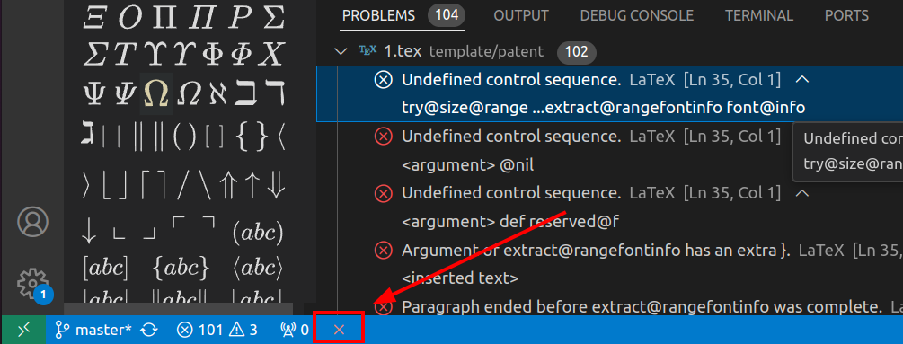
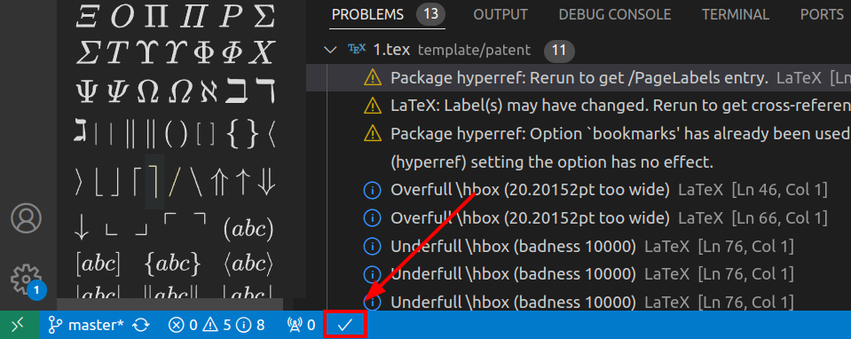
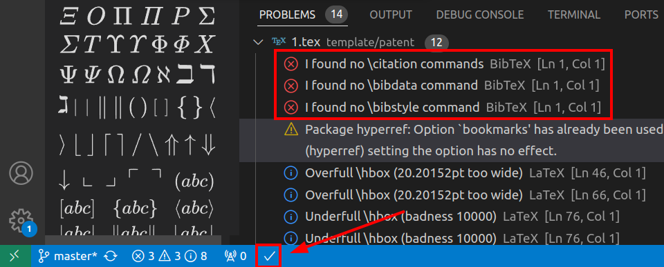
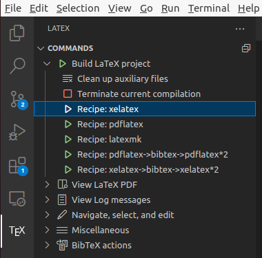

# 教程
## 视频
[【教程-30分钟速通LaTeX】LaTeX排版零基础速成教程](https://www.bilibili.com/video/BV1Mc411S75c)
## 博客
[Ubuntu安装LaTeX](https://blog.csdn.net/lijf2001/article/details/122804413)  
[Tex Live & TeXstudio安装及配置](https://blog.csdn.net/weixin_42468475/article/details/108888966)  
[LaTeX插入图片 子图](https://blog.csdn.net/gsgbgxp/article/details/129655879)(注意：如果发现很多图片都在一页，并且图片间间隙过大，可以通过手动调整图片位置，将图片尽可能分开，这样图片显示就正常了)  
[Latex：BibTex缩小参考文献展示的间距](https://blog.csdn.net/weixin_40520963/article/details/105137544)  
[vscode LaTeX保存编译及自动选择编译方法recipe](https://blog.csdn.net/lyh458/article/details/130667859)  
### PPT相关
[手把手教你在 PPT中插入 LaTex 数学公式](https://blog.csdn.net/itnerd/article/details/106891793)  
### Vscode相关
配置文件：(ctrl+shift+p -> Open User Settings(JSON))
```json
{
    "editor.wordWrap": "on",
    "latex-workshop.latex.tools": [
        {
        "name": "xelatex",
        "command": "xelatex",
        "args": [
            "-synctex=1",
            "-interaction=nonstopmode",
            "-file-line-error",
            "%DOC%"
        ]
        },
        {
        "name": "pdflatex",
        "command": "pdflatex",
        "args": [
            "-synctex=1",
            "-interaction=nonstopmode",
            "-file-line-error",
            "%DOC%"
        ]
        },
        {
        "name": "bibtex",
        "command": "bibtex",
        "args": ["%DOCFILE%"]
        },
        {
        "name": "latexmk",
        "command": "latexmk",
        "args": [
            "-synctex=1",
            "-interaction=nonstopmode",
            "-file-line-error",
            "-pdf",
            "%DOC%"
        ]
        }
    ],
    "latex-workshop.latex.recipes": [
        {
            "name": "PDFLaTeX",
            "tools": ["pdflatex"]
        },
        {
            "name": "XeLaTeX",
            "tools": ["xelatex"]
        },
        {
            "name": "BibTeX",
            "tools": ["bibtex"]
        },
        {
            "name": "latexmk (all-in-one-automatically)",
            "tools": ["latexmk"]
        },
        {
            "name": "pdflatex -> bibtex -> pdflatex*2",
            "tools": ["pdflatex", "bibtex", "pdflatex", "pdflatex"]
        },
        {
            "name": "xelatex -> bibtex -> xelatex*2",
            "tools": ["xelatex", "bibtex", "xelatex", "xelatex"]
        },
    ],
    "latex-workshop.view.pdf.viewer": "tab",
    "latex-workshop.latex.clean.fileTypes": [
        "*.aux",
        "*.bbl",
        "*.blg",
        "*.idx",
        "*.ind",
        "*.lof",
        "*.lot",
        "*.out",
        "*.toc",
        "*.acn",
        "*.acr",
        "*.alg",
        "*.glg",
        "*.glo",
        "*.gls",
        "*.ist",
        "*.fls",
        "*.log",
        "*.bcf",
        "*.run.xml",
        "*.fdb_latexmk"
    ],
    "latex-workshop.latex.autoClean.run": "onBuilt",
    // "latex-workshop.latex.autoClean.run":"never",
    "latex-workshop.latex.autoBuild.run": "onSave",
    "latex-workshop.latex.recipe.default": "lastUsed",
    // "latex-workshop.latexindent.path": "/usr/local/texlive/2023/texmf-dist/scripts/latexindent/latexindent.pl"
}
```
1. [vsCode中如何根据屏幕宽度自动换行](https://blog.csdn.net/weixin_42689147/article/details/87366004)  
2. 如果第一次编译不小心点错了，接下来通过vscode编译可能会一直有报错，并且还是之前的报错，此时可以将vscode关了再重新打开，就没有之前的报错了，并且每次编译是否有问题，以左下角的编译标识为主，如果是×就表示编译失败，如果是√就表示编译成功，如下图  
     
     
   如果点击了`xelatex->bibtex->xelatex*2`报错了参考文献相关的错误，此时再重新点击`xelatex`，该报错依旧会显示，但是latex正文其实是成功编译了的。此时就可以将vscode关了再重新打开，报错就没了。这个应该是vscode的一个bug，所以通过vscode编译一定要编译仔细，别点错了  
     
     
### 字体
[文档类设定字体大小为10pt11pt12pt时 对应的字号大小](https://pinvondev.github.io/blog/Latex/2018/11/19/ubuntu-%E4%B8%AD%E4%BD%BF%E7%94%A8-latex-%E6%8E%92%E7%89%88/%20Or%20/blog/Latex/ubuntu-%E4%B8%AD%E4%BD%BF%E7%94%A8-latex-%E6%8E%92%E7%89%88/)  
[CTEX 宏集手册](https://mirrors.ibiblio.org/CTAN/language/chinese/ctex/ctex.pdf)  
# 好的模板汇总
[清华大学本科毕业论文latex模板教程 | 不保证学会 | 不接受答疑 | 建议收藏](https://www.bilibili.com/video/BV1s5411Q76P)  
[研究生数模竞赛模板-GMCMthesis](https://github.com/latexstudio/GMCMthesis)  
[简单的latex论文自定义模板](https://zhuanlan.zhihu.com/p/664379742)  

# texStudio
## 快捷键
1. Ctrl+鼠标左键 可以快速定位
2. Ctrl+Shift+I 可以加item
3. Ctrl+T 可以快速添加、取消注释
4. Ctrl+Shift+M 可以快速添加行内代码$×$
5. Ctrl+Shift+N 可以增加equation环境
6. Alt+Shift+M 可以增加显示的代码\[×\]
7. Ctrl+Enter 软换行
8. Ctrl+方向键 快速填空