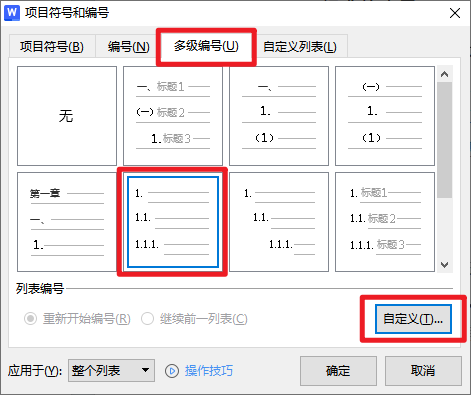
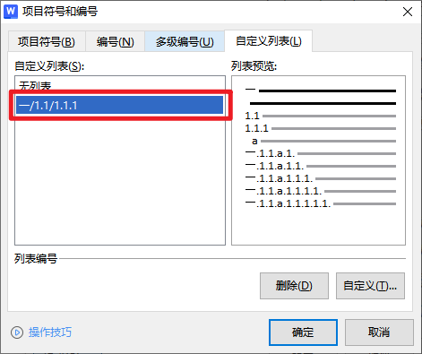

# office安装
## 如何在校园官网下载正版office
1. 进入网址[江苏科技大学微软正版软件中心](https://ic.just.edu.cn/2019/0130/c6740a63575/page.htm)
2. 如下图链接直接点击没有反应，可以右击复制链接地址  
     
3. 打开文件资源管理器，将刚刚复制的地址输入到地址框，并去掉最后的文件名部分，然后回车进入  
     
     
     
4. 直接将需要的文件拖到自己电脑上解压安装即可，激活官网也有bat激活程序
# Word
## 设置样式编号
1. 想要设置样式，建议先用格式刷将需要的格式从原文档中刷过来，然后再手动修改格式刷无法刷出来的段落格式，此步骤较简单，具体过程省略。将样式格式弄好之后，点击右下角箭头，使其在右边显示出来。  
  
1. 点击`编号`中的`自定义编号`  
  
1. 选择`多级编号`中的第六项，并点击自定义  
  
1. 此时注意，多种级别的编号要一次性设置完成，不能每次只设置一次，千万注意，下面还会讲一次。  
  
1. `编号格式`，注意其中的①是不能动的，这里的①相当于是一个变量，如果修改成其他的，比如“一”，就相当于变成了固定的“一”。  
2. `编号样式`，如果不想使用阿拉伯数字1，可以改成简体字“一”，那么下面的所有的层就都会修改。  
  
如果级别一，想使用类似`第一章`这样的特殊表示方式，就可以修改成如下图形式。  
  
1. 重头戏来了，如果第一级别确实需要类似“一”这样的序号，但是第二级别又想使用阿拉伯数字怎么办，这就需要点击复选框`正规形式编号`。这样第二级别又变回了阿拉伯数字。  
  
1. 对于第二级别及其以下级别，都需要点击复选框`在其后开始重新编号`，然后选择上一级别。  
  
1. 所有的级别，如果想链接到第一步设置的样式，则选择对应的样式即可。然后编号之后的符号，选择需要的即可，如下图。  
  
1.  设置完之后点击确定，此时回到如下这个界面，点击`自定义列表`，我们就可以看到其中只有一项，而不是多项。只有一项就说明我们刚刚的设置只是设置了一套，而不是多套。如果设置的多套样式列表就有问题了。  
  
1.  如果要永久保存到样式模板，则还需要再在右边样式列表中右击修改，点击格式，选择编号
  
然后选择刚刚创建的那一套自定义列表，点击确定  
  
点选`同时保存到模板`并确定  
  
1.  注意顺序，一定是先创建好样式，再设置编号列表，并与样式绑定，最后再在样式中修改以保存模板。否则在第二次使用二级标题时，仍会继承第一次使用后的标号顺序。
### 参考
- [Word 多级列表编号方法总结（二）——自定义编号](https://zhuanlan.zhihu.com/p/157316196)  

## 页眉页脚相关
1. 设置页眉页脚，先明白两个概念，`分页符`和`分节符`(所以如果想要将每个部分设置不同的页眉页脚，需要用到分节符，而不是分页符)：
```
分页符：只是起到了将目标内容快速移动到当前页的下一页，分页后前后两部分格式一样（页面尺寸、页边距、纸张横纵向、水印等等）；
分节符：又分为 下一节分节符 和 连续分节符：
下一节分节符：在将目标内容快速移动到当前页的下一页的功能外，可以将文档的分节前后不同页面设置成不同的页面尺寸、页边距、纸张横纵向、水印等等。
连续分节符：从当前位置分为不同的节，但是仍然接着当前位置，不开启新的一页。
```
2. 对不同的部分分节后，可以通过[文档页眉如何自动引用每页标题？](https://www.wps.cn/learning/question/detail/id/2300.html)中介绍的方法，设置页眉内容。  
3. 双击页眉或者页脚进入下图中界面
  
其中`域`是上一步要用到的。`首页不同`指的是当前节中的首页，表示当前节中首页可以与剩余的页不同。`页眉同前节`与`页脚同前节`指的是当前节中的页眉与页脚与前一节相同，如果此时更改上节或者此节中的页眉或页脚，就会连带更改对应的此节或者上节中的页眉或页脚。也就是说这两个复选框，会将上节与此节的页眉和页脚进行关联。  
### 参考
- [文档页眉如何自动引用每页标题？](https://www.wps.cn/learning/question/detail/id/2300.html)

## 自动为图表标号
### 参考
- [使用word代码域自动为图表标号](https://blog.csdn.net/LYGCSDN_/article/details/124973418)