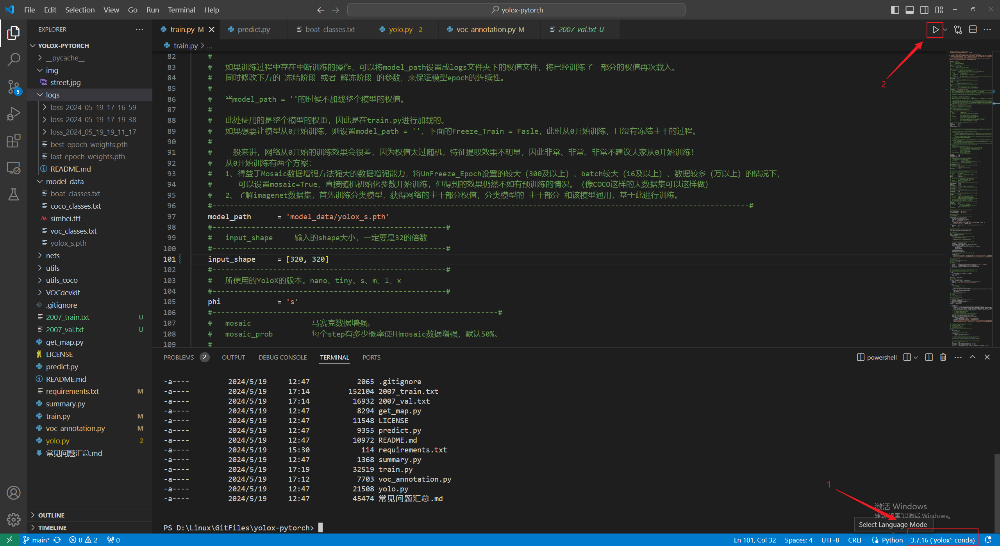
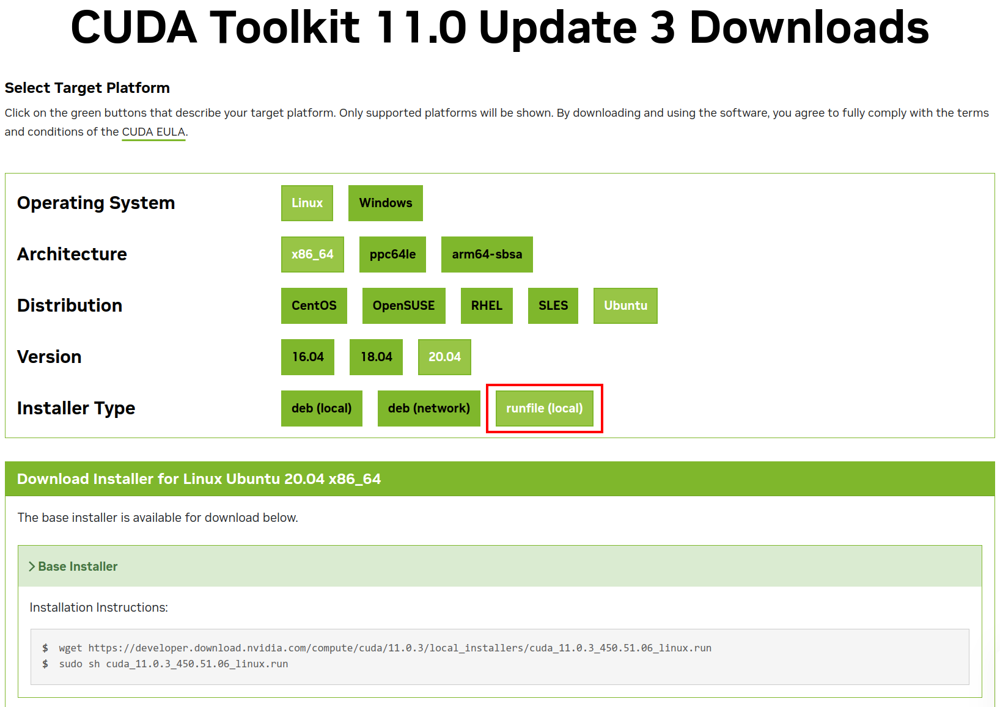
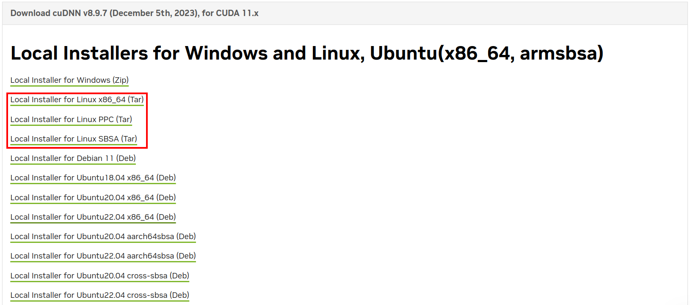
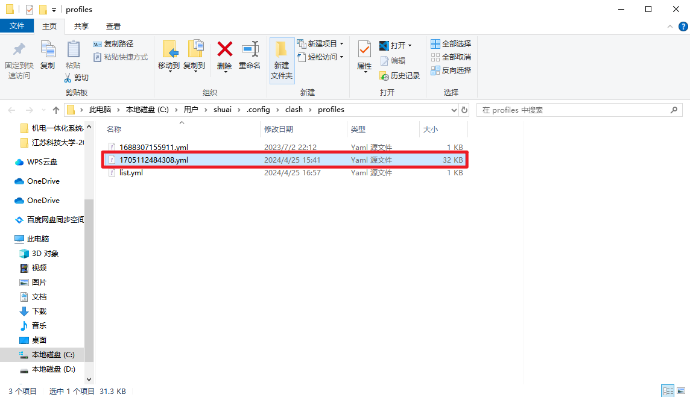
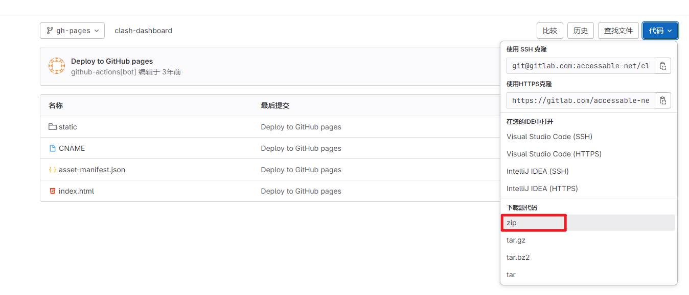
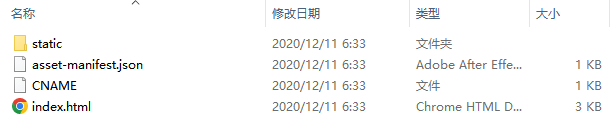
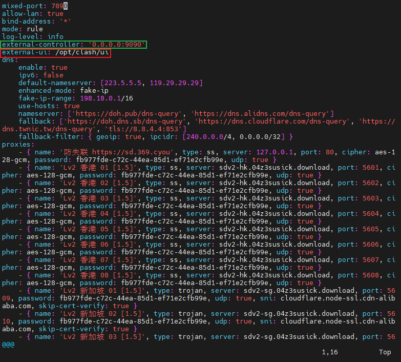
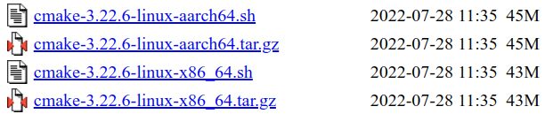
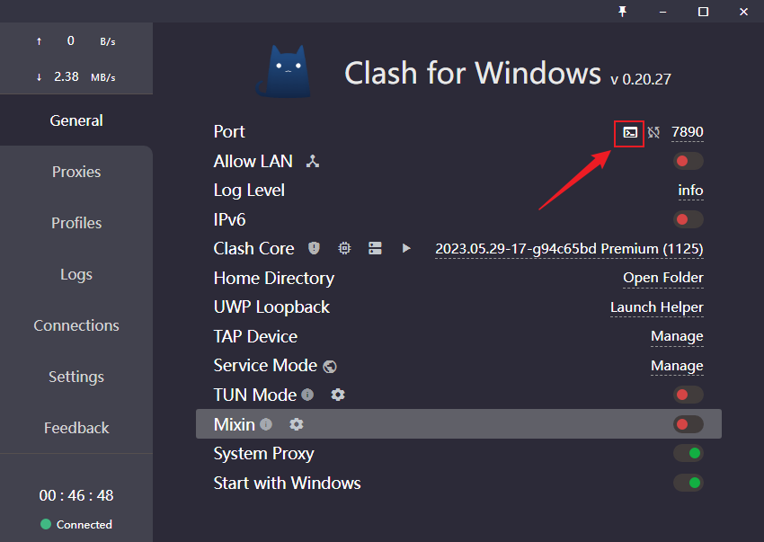

# 如何卸载干净Ubuntu
1. 这个博客讲解的很清楚了，无需安装第三方软件：[彻底删除Ubuntu EFI分区及启动项_水翼的博客-CSDN博客](https://blog.csdn.net/mtllyb/article/details/78635757)
2. 但是上面博客的第三步最好是采用b站视频中的方式，更方便：[5分钟，用Windows 10系统删除双系统Linux_哔哩哔哩_bilibili](https://www.bilibili.com/video/BV1Ba411z75z/?spm_id_from=333.1007.top_right_bar_window_custom_collection.content.click&vd_source=a5f4029436fab3ad44f642e3a69eb1d1)  


# 如何制作系统盘与如何将U盘从系统盘恢复为正常U盘
## 制作系统盘
1. 步骤如图所示：  


## 恢复为正常U盘
1. B站教程：[U盘空间消失了怎么办？如何把系统盘还原？_哔哩哔哩_bilibili](https://www.bilibili.com/video/BV1kE411A7oU/?spm_id_from=333.1007.top_right_bar_window_custom_collection.content.click&vd_source=a5f4029436fab3ad44f642e3a69eb1d1)，这个教程不需要第三方软件
2. 上述教程简言之就是：格式化U盘->打开磁盘管理->删除卷->新建简单卷

# 如何安装Ubuntu
1. 基本的安装步骤就遵循[Windows 和 Ubuntu 双系统的安装和卸载_哔哩哔哩_bilibili](https://www.bilibili.com/video/BV1554y1n7zv?p=8&vd_source=a5f4029436fab3ad44f642e3a69eb1d1)(主要就是看下其中的P8)
2. 但是在切换为U盘为启动项时，可以使用快捷方式：按住shift键+点击重启。这样无需Bios设置(开机时疯狂敲击F2进入Bios)。
3. 如何修改Ubuntu时间(时间与win同步)：
   
```bash
#需要先更换软件源，否则会报找不到ntpdate
#安装时间同步工具
sudo apt install ntpdate
#通过互联网同步正确的时间
sudo ntpdate time.windows.com
#把时间机制从UTC改成Localtime，并同步BIOS硬件时间
sudo hwclock --localtime --systohc
```

# Ubuntu中的grub启动项修改

```bash
# 打开配置文件
sudo vim /etc/default/grub

# 此项是修改默认启动第几项
GRUB_DEFAULT=0
# 此项是修改grub等待多久，进入默认系统。如果设置成-1，就表示一直等到用户输入，否则不进入系统
GRUB_TIMEOUT=10

# 使得配置生效
sudo update-grub
```

# Ubuntu上安装的软件
1. *QQ：方便与win发送复制信息[QQ](https://im.qq.com/index/)
2. Clash for windows：用U盘从win拷贝，此时无法科学上网，Github下载不动。也可以用QQ发
3. Google浏览器：[Google](https://www.google.com/chrome/) Google浏览器插件：Mate Translate(翻译插件)；New Bing Anywhere(Google上的NewBing)
4. GitHub上添加Linux端ssh：先看[Git学习记录](Git学习记录.md) ，辅助[Ubuntu系统VsCode的Github代码仓库托管](https://www.cnblogs.com/Fight-go/p/15851321.html)
5. ROS与VSCode：安装教程[1.2.4 安装 ROS · Autolabor-ROS机器人入门课程《ROS理论与实践》零基础教程](http://www.autolabor.com.cn/book/ROSTutorials/chapter1/12-roskai-fa-gong-ju-an-zhuang/124-an-zhuang-ros.html)  
(注意：安装后，在终端执行以下这个指令`sudo ln -s /usr/bin/python3 /usr/bin/python`(如果符号链接已存在，则用`-sf`表示强制覆盖，`sudo ln -sf /usr/bin/python3 /usr/bin/python`
)，否则catkin_make时可能会报错。参考博客地址：[1.4.2 安装VScode · Autolabor-ROS机器人入门课程《ROS理论与实践》零基础教程](http://www.autolabor.com.cn/book/ROSTutorials/chapter1/14-ros-ji-cheng-kai-fa-huan-jing-da-jian/142-an-zhuang-vscode.html))
6. VSCode插件：Code Translate(悬浮单词翻译插件)；Comment Translate(注释翻译插件)  

7. *百度网盘
8. *WPS
9. *OBS：参数设置[OBS参数设置_哔哩哔哩_bilibili](https://www.bilibili.com/video/BV1wt4y1Q7rV/?p=3&vd_source=a5f4029436fab3ad44f642e3a69eb1d1)  
  
  
如果录像框中出现如下图所示的黑边，可以通过调节 设置->视频->基础(画布)分辨率 来消除黑边，将 基础(画布)分辨率 的值设置成与下面第三张图中黄色框中的大小一致即可(输出分辨率与基础分辨率尽量保持一致)。设置完成后，如果仍有黑边，可以将红框的大小拉到与基础画布大小一致即可。(注意以上操作最好在只有一个显示器的情况下操作)
  
  
  
以下为对OBS设置的一些理解：
   - 基础(画布)分辨率，就是输出的图像的分辨率
   - 上面第三张图中黄色框中的大小就是上面第一张图中的红色框加绿色框。所以想要使得输出的图像中没有黑边，就要尽量使得 基础(画布)分辨率 的值与上面第三张图中黄色框中的大小一致
   - 输出(缩放)分辨率还不清楚具体是什么，但是猜测是在基础(画布)分辨率的基础之上对像素缩放
   - 录制下来的图像，就是一整个黑窗口中的所含内容
   - 上面第一张图中的红色框中可以拖动的红框，应该是在尽量保持分辨率大小不变的情况下，调整录取到的图像在整个输出图像中的位置和大小
10.  *Flameshot：截图软件[GitHub - flameshot](https://github.com/flameshot-org/flameshot)快捷键设置：[ubuntu安装flameshot截图软件，并设置快捷键_陈 洪 伟的博客-CSDN博客](https://blog.csdn.net/u013171226/article/details/107717009)
11.  *VLC：[VLC media player for Ubuntu](https://www.videolan.org/vlc/download-ubuntu.html) 或者直接`sudo apt install vlc`(前者有些时候安装了，但是打不开)
## 笔记本电脑安装软件
笔记本电脑因为使用，可能会经常重装系统，所以只安装重要的软件：  
Clash for windows、Google浏览器、GitHub上添加Linux端ssh、VSCode(VSCode插件)、ROS、百度网盘、搜狗输入法、VLC、Flameshot、Anaconda、NVIDA驱动、ssh服务端

# Ubuntu把家目录文件夹名称改为英文
[Ubuntu更改主目录文件名为英文](https://www.cnblogs.com/zhuxiaoxi/p/6775682.html)

# 一些重要的学习库
1. Moveit!：安装教程[Getting Started ‒ moveit_tutorials Noetic documentation](https://ros-planning.github.io/moveit_tutorials/doc/getting_started/getting_started.html)
2. PCL：安装教程[ubantu20.04安装PCL · 语雀](https://www.yuque.com/huangzhongqing/pcl/pz9w4q)

# 如何在Linux中使用unrar
解压命令`unrar x <rar文件名> <已存在的文件夹名(如果不填就默认是当前文件夹)>`。一般不再使用`unrar e <rar文件名>`了，因为这样会使得rar文件中的所有文件都解压到同一文件下，原先的文件夹目录结构就被破坏了。

# ubuntu20.04配置yolov5环境(anaconda+vscode)
安装前请保证电脑可以科学上网，基本不会安装失败
## 安装前准备
安装显卡驱动前，安装一下gcc等：
```bash
sudo apt update && sudo apt upgrade
sudo apt install build-essential
# gcc --version 测试一下是否安装成功

#也安装一下
sudo apt install pkg-config libglvnd-dev
#否则会出现以下报错
#Unable to determine the path to install the libglvnd EGL vendor library config files. 
#Check that you have pkg-config and the libglvnd development libraries installed, 
#or specify a path with --glvnd-egl-config-path.
```
## 安装显卡驱动
### 方法一：官网下载驱动
ubuntu安装nvida显卡驱动没有win方便，具体原因详见：[NVIDIA显卡的Ubuntu驱动程序安装方法_哔哩哔哩_bilibili](https://www.bilibili.com/video/BV1wY411p7mU/?spm_id_from=333.999.0.0&vd_source=a5f4029436fab3ad44f642e3a69eb1d1)，这个里面也有显卡驱动的安装方法。总结：先禁用nouveau，然后一定要重启，再从官网下载nvida显卡驱动，再安装驱动。
1. 禁用nouveau
```bash
#打开黑名单列表文件
sudo vim /etc/modprobe.d/blacklist.conf
#在最后一行加上，并保存关闭
blacklist nouveau
#在终端中执行命令，并重启，不重启nouveau还是运行的。按f2在bios中将security boot设置为false
sudo update-initramfs -u
```
2. 下载nvida显卡驱动[Download the latest official NVIDIA drivers](https://www.nvidia.com/download/index.aspx)
3. 执行`sudo bash <驱动名称>`安装驱动
4. 安装后重启
5. 在终端执行`nvidia-smi`命令，有信息输出说明安装成功

### 方法二：ubuntu自带安装方法
1. 禁用nouveau
```bash
#打开黑名单列表文件
sudo vim /etc/modprobe.d/blacklist.conf
#在最后一行加上，并保存关闭
blacklist nouveau
#在终端中执行命令，并重启，不重启nouveau还是运行的。按f2在bios中将security boot设置为false
sudo update-initramfs -u
```
2. 在`软件和更新`中找到`附加驱动`，选择如图所示驱动，并点击`应用更改`
   
3. 安装后重启
4. 在终端执行`nvidia-smi`命令，有信息输出说明安装成功

### ubuntu18.04安装踩坑记录
1. 报错：WARNING: Unable to find a suitable destination to install 32-bit compatibility libraries. Your system may not be set up for 32-bit compatibility. 32-bit compatibility files will not be installed; if you wish to install them, re-run the installation and set a valid directory with the --compat32-libdir option.
解决：[Unable to find a suitable destination to install 32-bit compatibility libraries on Ubuntu 18.04 Bion](https://linuxconfig.org/unable-to-find-a-suitable-destination-to-install-32-bit-compatibility-libraries-on-ubuntu-18-04-bionic-beaver-linux)
## 安装anaconda
1. 下载anaconda:[Free Download | Anaconda](https://www.anaconda.com/download#Downloads)(anaconda版本无所谓，可以安装最新版，下面创建虚拟环境时python版本不能太高)
(下载[Miniconda](https://docs.anaconda.com/free/miniconda/))
2. 执行`bash <安装包名称>`安装，一路yes即可，最后一个选项选择是否初始化anaconda，选择yes
3. 安装完后`source ~/.bashrc`或者重开一个终端，进入conda环境
4. `conda config --set auto_activate_base false`运行此命令，避免每次进入终端都自动进入conda的base环境
5. `conda activate`进入conda环境，`conda deactivate`退出conda环境
## 创建虚拟环境
1. 创建虚拟环境`conda create -n <虚拟环境名称> python=3.8`
```
注意：1.创建虚拟环境后，下面安装pytorch及测试安装是否成功，还有安装yolov5所需的依赖，都一定要在此虚拟环境下进行；
2.各个虚拟环境之间是相互独立的，在虚拟环境中安装的软件，在电脑的原生环境中是无法使用的
3.删除虚拟环境：conda remove -n <环境名称> --all
```
1. 运行`nvidia-smi`可发现右上角提示允许的cuda的最大版本，底下安装pytorch时选择版本注意即可。
2. 从pytorch官网下载[PyTorch](https://pytorch.org/)，通过conda的方式下载，会自动下载好cuda等库和依赖。
安装指令：`conda install pytorch torchvision torchaudio pytorch-cuda=11.7 -c pytorch -c nvidia`
注意：此命令安装时，安装的cuda版本一定是11.7的，但是安装的pytorch版本会根据实际环境选择
1. 在虚拟环境中打开python，运行下面的代码测试安装是否成功
```python
import torch                                #--->可以正常导入
import torchvision                          #--->可以正常导入
print(torch.cuda.is_available())            #--->返回：True 
print(torch.backends.cudnn.is_available())  #--->返回：True 
print(torch.version.cuda)                   #--->返回: 11.7或者...
print(torch.backends.cudnn.version())       #--->返回：8500或者...
```
## 下载yolov5并安装相关依赖再测试
1. 从gittub获取源代码:
```bash
git clone https://github.com/ultralytics/yolov5  # clone
cd yolov5

# 注意：在执行pip install -r requirements.txt命令时，前面括号中的环境一定要是你之前创建的环境。
# 如果不是，通过conda activate <环境名称>切换至正确环境
# 此时之前安装pytorch安装过的依赖，如果满足要求就不会再安装了
pip install -r requirements.txt  # install
```
2. 在yolov5目录下，运行`python detect.py --source ./data/images/zidane.jpg`即可看到测试结果。
## 在vscode中使用conda创建的虚拟环境
[在vscode中查看当前项目的工作环境_vscode终端怎么查看当前环境_Clownorange的博客-CSDN博客](https://blog.csdn.net/lcnana/article/details/121301177)

## 配置B站Bubbliiiing的yolox环境
### [Github源码](https://github.com/bubbliiiing/yolox-pytorch)
### [B站视频](https://www.bilibili.com/video/BV1DL4y1B7eU?p=2&vd_source=a5f4029436fab3ad44f642e3a69eb1d1)
### 环境配置过程
#### Linux端配置过程
```bash
# 创建环境
conda create -n yolox python=3.6
conda activate yolox
# 安装torch和cuda，安装的时候关注一下pytorch的版本
conda install pytorch torchvision torchaudio cudatoolkit=11.1 -c pytorch-lts -c nvidia
# 安装requirements.txt中的依赖包，优先采用conda安装，装不上用pip
while read requirement; do conda install --yes $requirement || pip install $requirement; done < requirements.txt
```
#### Windows端配置过程
参考[Bubbliiiing博客](https://blog.csdn.net/weixin_44791964/article/details/120668551)，经实操发现可以配置成功。  
1. 报错：在执行博客中`pip install torch==1.7.1+cu110 torchvision==0.8.2+cu110 torchaudio==0.7.2 -f https://download.pytorch.org/whl/torch_stable.html`这一句安装指令时，如果出现错误`Could not find a version that satisfies the requirement`  
   解决(建议直接科学上网，用第二种方式)：  
   - 如果已经按照Bubbliiiing博客中的教程更改了pip源为国内镜像源，就尝试关闭clash，然后再执行该安装指令即可。参考[博客](https://blog.csdn.net/weixin_43501408/article/details/129486169?ops_request_misc=%257B%2522request%255Fid%2522%253A%2522171610528716800197072555%2522%252C%2522scm%2522%253A%252220140713.130102334.pc%255Fall.%2522%257D&request_id=171610528716800197072555&biz_id=0&utm_medium=distribute.pc_search_result.none-task-blog-2~all~first_rank_ecpm_v1~rank_v31_ecpm-1-129486169-null-null.142^v100^pc_search_result_base1&utm_term=ERROR%3A%20Could%20not%20find%20a%20version%20that%20satisfies%20the%20requirement%20torch%3D%3D1.7.1%2Bcu110&spm=1018.2226.3001.4187)
   - 如果还没有配置pip源为国内镜像源，就打开clash，并在终端设置代理`set all_proxy=http://127.0.0.1:7890`，即可正常下载
2. 注意运行python文件前，先切换vscode右下角的python解释器版本，再点击右上角的运行三角形，如下  
     
   这样就是使用右下角对应的python解释器来运行当前python文件  
   (虽然Windows端中的终端不好用，但是图形化使用还是可以的)  
3. 运行train.py时报错：CUDA out of memory  
   解决：可以改小输入的图片大小，或者改小batch_size的大小，一般batch_size都是2的倍数
### 注意
1. 为什么安装requirements.txt中的依赖包，使用`while read requirement; do conda install --yes $requirement || pip install $requirement; done < requirements.txt`来安装，是因为直接通过`pip install -r requirements.txt`安装会导致包之间版本冲突
2. Windows端如何更换conda源  
   在`C:\Users\shuai`目录下找到文件`.condarc`，修改文件内容为如下
   ```txt
   channels:
     - https://mirrors.tuna.tsinghua.edu.cn/anaconda/cloud/pytorch/
     - https://mirrors.tuna.tsinghua.edu.cn/anaconda/pkgs/free/
     - https://mirrors.tuna.tsinghua.edu.cn/anaconda/pkgs/main/
     - https://mirrors.bfsu.edu.cn/anaconda/pkgs/free/
     - https://mirrors.bfsu.edu.cn/anaconda/pkgs/main/
     - https://mirrors.tuna.tsinghua.edu.cn/anaconda/cloud/conda-forge/
     - https://mirrors.tuna.tsinghua.edu.cn/anaconda/cloud/msys2/
     - https://mirrors.tuna.tsinghua.edu.cn/anaconda/cloud/bioconda/
     - https://mirrors.tuna.tsinghua.edu.cn/anaconda/cloud/menpo/
     - https://mirrors.tuna.tsinghua.edu.cn/anaconda/cloud/fastai/
   show_channel_urls: true
   ```
   show_channel_urls: true的目的是下载时显示安装包来源。注意channels中不要包含`- defaults`，如果包含了，下面在安装包时也会检测默认源，速度特别慢。
### 总结
这里总结以下cuda直接安装与先手动安装cuda再pip安装，这两种方式的区别：
1. Windows端推荐第二种方式，从官网下载并手动安装cuda(cuda[下载](https://developer.nvidia.com/cuda-toolkit-archive))和cudnn(cudnn与cuda对应版本及其[下载](https://developer.nvidia.com/rdp/cudnn-archive))，再切换至conda环境，用pip安装对应版本的pytorch及其他库，比如指令`pip install torch==1.7.1+cu110 torchvision==0.8.2+cu110 torchaudio==0.7.2 -f https://download.pytorch.org/whl/torch_stable.html`。这里torch与cuda的具体对应版本就看[torch官网](https://pytorch.org/get-started/previous-versions/)中，安装指令里列明的库版本。
2. Linux端推荐第一种方式，直接在conda环境中通过conda指令安装，比如指令`conda install pytorch==1.7.1 torchvision==0.8.2 torchaudio==0.7.2 cudatoolkit=11.0 -c pytorch`。这里不需要从官网手动下载cuda库，conda会帮我们安装一个精简版的cuda库在conda虚拟环境中，做深度学习是够用的。但是如果对pytorch版本以及cuda版本有特殊要求，建议还是从官网手动安装，因为conda指定版本安装时，有时会无法安装指定的版本，可能是因为conda的下载库不是很全。Linux端从官网手动下载cuda库，可以参考如下[博客](https://blog.csdn.net/weixin_37926734/article/details/123033286)。
3. 为什么这么推荐，主要是因为Windows的终端操作太垃圾了，conda安装基本都是在终端中进行，读者可自行体验在Windows的终端中用conda指定cuda版本进行安装，体验一言难尽。在Linux中也可以先手动下载cuda库，但是很明显直接通过conda来安装更方便一些。但是如果想要库的安装都是用pip来安装，还是推荐第二种方式，毕竟cuda安装的库与pip安装的库在大型项目中是会有冲突的。
4. 多个版本cuda切换，当然这里说的多个版本是指手动从官网下载库的方式来安装的cuda，因为conda指令安装的cuda是随着conda环境走的。Windows端切换cuda版本参考。Linux端切换cuda版本参考[Ubuntu多版本cuda安装与切换](https://qiyuan-z.github.io/2022/01/04/Ubuntu%E5%A4%9A%E7%89%88%E6%9C%ACcuda%E5%AE%89%E8%A3%85%E4%B8%8E%E5%88%87%E6%8D%A2/)和[Linux多个版本的CUDA切换](https://zhuanlan.zhihu.com/p/589442446)。Windows端切换cuda版本参考[Windows下CUDA多版本共存](https://blog.csdn.net/m0_37605642/article/details/117932717)和[在windows上安装多个cuda版本](https://zhuanlan.zhihu.com/p/568908887)。
5. 注意从官网下载cuda时，尽量下载runfile(local)文件，如下：  
     
   主要是因为runfile(local)文件可以自定义安装的内容
   下载cudnn时，尽量下载tar文件，如下：  
     
   这样解压后可以将cudnn的头文件和库文件复制安装到指定的文件夹下

# Ubuntu卸载anaconda
1. 删除anaconda文件夹：
```bash
rm -rf ~/anaconda3
```
1. 在环境变量中删除anaconda：
```bash
vim ~/.bashrc
```
如下图，删除其中和conda相关的内容。  


1. 使修改立即生效：
```bash
source ~/.bashrc
```
1. 删除相关的隐藏文件：
```bash
rm -rf ~/.condarc ~/.conda
```

# 重置conda的base环境
1. [conda篇---base环境重置](https://blog.csdn.net/m0_46825740/article/details/120932098)  
   ```bash
   conda list --revisions
   conda install --revision [revision number] # revision number中是版本号，重置到最初版本就是conda install --revision 0
   ```

# Ubuntu下使用ssh
1. 安装ssh服务端：[ubuntu开启SSH服务远程登录_ubuntu ssh_jackghq的博客-CSDN博客](https://blog.csdn.net/jackghq/article/details/54974141)
简言之：`sudo apt-get install openssh-server`
2. ssh免密：[SSH 三步解决免密登录_jeikerxiao的博客-CSDN博客](https://blog.csdn.net/jeikerxiao/article/details/84105529)
3. 如何通过ssh传输文件：[Linux下通过ssh上传、下载文件或者文件夹_ssh到linxu下载文件_Easion.Y的博客-CSDN博客](https://blog.csdn.net/qq506930427/article/details/116274385)
## 问题记录
1. 问题：@@@@@@@@@@@@@@@@@@@@@@@@@@@@@@@@@@@@@@@@@@@@@@@@@@@@@@@@@@@
@    WARNING: REMOTE HOST IDENTIFICATION HAS CHANGED!     @
@@@@@@@@@@@@@@@@@@@@@@@@@@@@@@@@@@@@@@@@@@@@@@@@@@@@@@@@@@@
IT IS POSSIBLE THAT SOMEONE IS DOING SOMETHING NASTY!
Someone could be eavesdropping on you right now (man-in-the-middle attack)!
It is also possible that a host key has just been changed.
The fingerprint for the ECDSA key sent by the remote host is
SHA256:kHq5DIoG6nWW7l5RhvR5hR6hPHpn+XzsjGHmRVloy+s.
Please contact your system administrator.
Add correct host key in /home/shuai/.ssh/known_hosts to get rid of this message.
Offending ECDSA key in /home/shuai/.ssh/known_hosts:14
  remove with:
  ssh-keygen -f "/home/shuai/.ssh/known_hosts" -R "192.168.1.200"
ECDSA host key for 192.168.1.200 has changed and you have requested strict checking.
Host key verification failed.  
解决：[ssh remote host identification has changed](https://stackoverflow.com/questions/20840012/ssh-remote-host-identification-has-changed)  
简言之：`ssh-keygen -R 192.168.1.200`
# Windows间如何共享文件
1. 打开允许入站：[解决Ubuntu无法ping通Windows，但Windows能ping通Ubuntu_windows可以ping通ubuntu,但ubuntu无法ping通windows_凌盛羽的博客-CSDN博客](https://blog.csdn.net/Ceosat/article/details/105057554)
2. 如何设置免密共享：[Windows10下局域网的两台电脑间传输文件_windows之间传输文件_Bao@Ting的博客-CSDN博客](https://blog.csdn.net/BaoTTing/article/details/106295408)
   
# Ubuntu中如何杀死某个进程
[【Linux】Ubuntu kill 杀死进程详解_ubuntu杀死进程_Cappuccino-jay的博客-CSDN博客](https://blog.csdn.net/Cappuccino_jay/article/details/125299625)
```bash
ps -ef | grep <想要杀死的进程中包含的关键字> | awk '{print $2}' | xargs kill -9
# 例如：ps -ef | grep clash | awk '{print $2}' | xargs kill -9
```

# VsCode中使用Markdown
## Markdown语法
1. Markdown语法：[Markdown基础语法](https://developer.aliyun.com/article/1150983)
## VsCode中的Markdown插件
1. VsCode中使用Markdown可以安装的插件：[VsCode中使用Markdown可安装的插件](https://blog.cxplay.org/works/vscode-to-markdown-editor/#%E8%BD%AF%E4%BB%B6%E5%AE%89%E8%A3%85)  
其中最好要安装的有：Markdown All in One 和 Markdown Image。因为我平时经常会在md文件中插入图片，所以Markdown Image最好配置下，还是很方便的。
2. VsCode中Markdown Image的两处设置：  
  
  
`${mdname}/IMG_${YY}${MM}${DD}-${HH}${mm}${ss}${mss}`  
  
`.assets_IMG`  
3. Markdown Image的快捷键修改一下：  
  
  

## 其他
1. [Word中复杂表格转完美的Markdown格式的技巧](https://www.cnblogs.com/taylorshi/p/13540687.html)
2. 之前在使用Markdown Image时始终出现使用失灵的情况，所以准备弃用这个插件。替代方案：  
   - 按下 Ctrl + Shift + P 打开命令面板
   - 键入"Preferences: Open Workspace Settings"选择含有JSON的一项，打开settings.json文件
   - 在最后添加如下代码：  
     ```json
     "markdown.copyFiles.destination": {
         "**/*": ".assets_IMG/${documentBaseName}/"
     }
     ```
     (表示将复制的图片放到当前文件目录下的 .assets_IMG 文件夹下的与当前markdown文件同名的文件夹中)

# Ubuntu中的压缩解压缩
```
注意：
1. 压缩时最好将文件都打包到文件夹中进行压缩，不易出错。
2. 解压缩时如果后面不接文件夹名都是默认解压到当前文件夹，所以尽量在新的文件夹中解压，防止解压后当前文件夹中的新文件过多。
```
## tar
### tar.gz
- 压缩 `tar -czvf xxx.tar.gz dir` (其中xxx.tar.gz表示要压缩成的文件名称，dir表示要将哪个文件夹进行压缩)
- 解压缩 `tar -xzvf xxx.tar.gz -C ./dir/` (其中xxx.tar.gz表示要解压缩的目标文件名称，./dir/表示要将文件压缩进哪个文件夹)
### tar.bz2
- 解压缩 `tar -jxvf xxx.tar.bz2 -C ./dir/` (其中xxx.tar.gz表示要解压缩的目标文件名称，./dir/表示要将文件压缩进哪个文件夹)
## zip
- 压缩 `zip -r xxx.zip dir` (其中xxx.zip表示要压缩成的文件名称，dir表示要将哪个文件夹进行压缩)
- 解压缩 `unzip xxx.zip -d ./dir/` (其中xxx.zip表示要解压缩的目标文件名称，./dir/表示要将文件压缩进哪个文件夹)
## rar
- 压缩 `rar a xxx.rar myfolder` (其中xxx.rar表示要压缩成的文件名称，myfolder表示要将哪个文件夹进行压缩)
- 解压缩 `unrar x xxx.rar ./dir/` (其中xxx.rar表示要解压缩的目标文件名称，./dir/表示要将文件压缩进哪个文件夹)
## 7z
- 安装 `sudo apt install p7zip-full`
- 解压缩 `7z x filename.7z -r -o./test`（其中 7z 为解压缩文件命令，x 表示解压缩，-r 表示递归解压缩所有的子文件夹，-o 指定解压到的那个目录 注意：-o 后面没用空格，./test 要解压到的路径）
- 压缩 `7z a -t7z -r filename.7z ./test/*`（其中 a 表示添加文件或文件夹到压缩包，filename.7z 是压缩好后的压缩包名，其他同解压命令）

# Ubuntu20.04设置静态IP
## 通过图形界面设置
1. 在linux上设置静态ip，可以通过这种方式，快捷的设置，但是设置完成后一定要注意，如下第二张图中所示，要将有线连接断开并重连一次，这样才能正确设置静态ip。  
  
  
## [通过yaml文件设置](https://blog.csdn.net/weixin_44311159/article/details/125010211?ops_request_misc=%257B%2522request%255Fid%2522%253A%2522171255821816800227428446%2522%252C%2522scm%2522%253A%252220140713.130102334..%2522%257D&request_id=171255821816800227428446&biz_id=0&utm_medium=distribute.pc_search_result.none-task-blog-2~all~sobaiduend~default-1-125010211-null-null.142^v100^pc_search_result_base1&utm_term=ubuntu18.04%E5%A6%82%E4%BD%95%E5%9B%BA%E5%AE%9Aip%E5%9C%B0%E5%9D%80&spm=1018.2226.3001.4187)
1. **步骤**：  
   - 输入`ifconfig`命令，查看当前网卡
   - 输入`route -n`查看当前网关，这一步要注意，不然配置的时候网关不对会导致配置完之后虽然有IP，但是无法连接网络的情况
   - 终端输入指令`sudo vim /etc/netplan/01-network-manager-all.yaml`，修改yaml文件如下(注意格式要正确，每个冒号后要留一个空格)：
   ```yaml
   # Let NetworkManager manage all devices on this system
   network:
     version: 2
     renderer: NetworkManager
     ethernets: 
       enx0826ae3ad053: 
         addresses: [192.168.1.201/24]
         gateway4: 192.168.1.1
         nameservers: 
           addresses: [114.114.114.114, 8.8.8.8]
         mtu: 9000
   ```
   - 终端输入`sudo  netplan apply`，如果没有任何提示就说明生效了。
   - 注意：
     - DNS域名也要设置正确 [114.114.114.114, 8.8.8.8] ，分别是电信和谷歌
2. 注意事项说明：
   - 其中mtu表示巨型帧，只有网口接相机的时候才需要设置这一项。其中`enx0826ae3ad053`为网卡型号，可以通过`ifconfig`来查看。
   - 在ubuntu20.04中，如果通过修改yaml文件来实现永久固定ip，在有线中会多出来一项，如下图：  
     
   这两项此时会变成单选，选择其中一个固定IP，那么该网卡映射出来的IP地址就会变成选中的那个。可以通过`ifconfig`来查看。  
## 设置的几个静态IP记录
### 248WIFI
1. 无人机 192.168.1.110
2. 笔记本 192.168.1.116
3. 青云1000 192.168.1.101
4. 台式机Windows 192.168.1.115
5. 台式机Linux 192.168.1.118
6. 单体船小电脑 192.168.1.117
7. Atlas200 192.168.1.231
### 手机热点
1. 单体船小电脑 192.168.70.100
2. 笔记本 192.168.70.101
3. 无人机 192.168.70.136
4. 青云1000 192.168.70.198
### 青云USB
1. 青云1000 192.168.251.2
2. 台式机Windows 192.168.251.100

# 使用pandoc将markdown转成pdf文件
## 安装依赖
```bash
sudo apt install pandoc
sudo apt install texlive-xetex
sudo apt install texlive-latex-extra
```
## 检查
```bash
# 检测是否安装成功，如果缺哪个，根据提示补哪个
tex -v
latex -v
xelatex -v
pdflatex -v
```
## 查看支持中文的字体
```bash
fc-list :lang=zh
```
输出：  
```bash
/usr/share/fonts/truetype/arphic/ukai.ttc: AR PL UKai CN:style=Book
/usr/share/fonts/truetype/arphic/ukai.ttc: AR PL UKai HK:style=Book
...
```
其中，  
字体文件路径：`/usr/share/fonts/truetype/arphic/ukai.ttc`  
字体名称：`AR PL UKai CN`  
字体样式：`Book`  
其他的同理。  
## 转化(含中文)
```bash
pandoc --pdf-engine=xelatex -V CJKmainfont="Microsoft YaHei" README.md -o README.pdf
# pandoc --pdf-engine=xelatex -V CJKmainfont="AR PL UKai CN" MatrixTheory.md -o MatrixTheory.pdf
```
1. 如果 markdown 中包含中文，转换为 PDF 的过程中会报错，需要用 xelatex 来处理中文，需要添加选项`--pdf-engine=xelatex`。  
2. `CJKmainfont="Microsoft YaHei"`后面跟的是支持中文的字体。  
## 参考
1. [Pandoc+TeXLive实现Markdown转PDF](https://zhuanlan.zhihu.com/p/444440478)
2. [Linux上将markdown格式的文件转换成PDF,DOCX等其他格式](https://blog.csdn.net/knight_zhou/article/details/106476663)
3. [Missing letltxmacro.sty after LaTeX TexStudio installation](https://askubuntu.com/questions/1253671/missing-letltxmacro-sty-after-latex-texstudio-installation)

# 办公室HP打印机驱动安装
## windows
1. 搜索引擎搜索`hp.com/support/laser1000mfp`。
2. 点击词条，如下图，HP MFP 1188w打印机驱动。
  
3. 下载如下图驱动安装。
  
4. 注意：经测试，该打印机USB打印驱动与无线打印驱动只能安装其中一个，后者会将前者覆盖。
## ubuntu
1. ubuntu端可以直接打印，不用安装驱动，但是打印图片不行，转成pdf用WPS打印

# 远程Ubuntu
## 通过VsCode远程Ubuntu(Remote-SSH)
[CSDN教程-使用Visual Studio Code连接远程Linux服务器](https://blog.csdn.net/weixin_43669941/article/details/102778991)
## 通过MobaXterm远程连接Ubuntu
[使用MobaXterm远程连接Linux服务器](https://blog.csdn.net/m0_56147485/article/details/127201489)
## vscode远程连接服务器+MobaXterm实现可视化结果回传
[vscode远程连接服务器+MobaXterm实现可视化结果回传](https://www.cnblogs.com/tavonl/p/14769862.html)
## Ubuntu间实现ssh图像回传
[linux系统之间ssh远程连接图形用户界面](https://blog.csdn.net/weixin_42232749/article/details/81624156)  
### 注意
1. 但凡需要修改ubuntu内部的配置文件，包括`.bashrc`这种，最好都在bash中修改，不要在vscode中的终端中修改，否则可能会修改失败，应该是vscode的bug
2. 这里最好将`export DISPLAY=localhost:10.0`写到`~/.bashrc`中
3. 除了第一次测试，以后ssh连接时`ssh -X username@192.168.1.240`可以不加`-X`
4. 与Windows中的MobaXterm类似，win中是一定要在MobaXterm成功连接的情况下，才可以在vscode中调用图像显示的命令，ubuntu中是一定要在原生终端成功连接的情况下，才可以在vscode中调用图像显示的命令。我的理解是vscode中只能发出指令，但是最终显示只能通过MobaXterm或者Linux原生终端，MobaXterm与Linux原生终端才是真正的客户端
## 通过nomachine远程ubuntu(可视化界面)
1. 服务端：先通过ssh连接到远程ubuntu，然后通过wget下载deb文件，然后使用dpkg命令直接安装即可，安装完什么也不要做，就可以了。比如：
   ```bash
   cd ~/Downloads
   wget https://download.nomachine.com/download/8.11/Linux/nomachine_8.11.3_4_amd64.deb
   sudo dpkg -i nomachine_8.11.3_4_amd64.deb
   ```
2. 客户端：与远程端一样的安装操作即可
### 使用方法
1. [官网教程](https://www.nomachine.com/getting-started-with-nomachine)
2. [阿木实验室老版本教程](https://docs.amovlab.com/prometheuswiki/#/src/P450%E4%BD%BF%E7%94%A8%E6%89%8B%E5%86%8C/%E9%A6%96%E6%AC%A1%E9%A3%9E%E8%A1%8C)

# Linux安装字体
[Linux安装中文字体（将windows系统的字体安装到linux）](https://blog.csdn.net/willingtolove/article/details/116423173)
[百分百解决你的matplotlib画图中文乱码问题](https://zhuanlan.zhihu.com/p/566430362)
## 注意事项：
1. 如果在用matplotlib画图时报错`findfont: Generic family 'sans-serif' not found because none of the following families were found: SimHei`，运行如下指令`sudo cp /usr/share/fonts/windows/*.ttf ~/anaconda3/envs/xxx/lib/python3.8/site-packages/matplotlib/mpl-data/fonts/ttf`也就是将Linux系统中的字体全部拷贝到当前名为xxx的anaconda环境中(当然，运行上述指令的前提是Linux系统中的字体里要包含SimHei字体才行)，然后将jupyter的运行环境切换到base环境运行一下再切换回来运行就会发现没有这个报错了。当然在拷贝字体前，可以先切换到base环境运行一下再切换回来运行，看看还有没有这个报错，如果只是显示的bug当然更好。
2. 更新完字体，最后一定要运行`fc-cache -fv`，更新字体缓存。

# 挂载ISO
[如何在 Linux 中挂载和卸载 ISO 映像？](https://cn.linux-console.net/?p=22578)

# Windows系统重装
## 教程
[手把手教你给笔记本重装系统（Windows篇）](https://www.bilibili.com/video/BV16h4y1B7md/?spm_id_from=333.999.0.0&vd_source=a5f4029436fab3ad44f642e3a69eb1d1)
## 大致步骤
1. 数据备份
2. 下载主板对应的驱动程序
3. 下载windows镜像文件：[windwos镜像文件下载](https://next.itellyou.cn/)
4. 安装第三方烧录工具：[Refus工具](https://rufus.ie/zh/)
5. 开始烧录
6. 设置U盘为启动项并重装，建议分区那一步删除所有分区
7. 安装完系统后，安装驱动

# 好用的划词翻译软件
[GitHub开源软件 pot-desktop](https://github.com/pot-app/pot-desktop)  
[dpkg依赖问题](https://blog.csdn.net/qq_45618214/article/details/119824451)
## 配置
1. 快捷键：
   
2. 翻译：
   
3. 文字识别
   
4. 配置百度OCR识别API
   [POT配置教程](https://pot-app.com/docs/api/recognize/baidu.html)  
   百度API[官网](https://console.bce.baidu.com/ai/#/ai/ocr/overview/index)  
     
   将官网申请的API复制到下面的输入框即可  
     
## Linux安装问题
问题：dpkg: 依赖关系问题使得 pot 的配置工作不能继续
解决：[dpkg: 依赖关系问题...](https://blog.csdn.net/qq_45618214/article/details/119824451)
   ```bash
   sudo apt update
   sudo apt -f -y install
   ```

# Windows中Anaconda Prompt如何切换当前目录
[在任意文件夹位置打开Anaconda的Jupyter Notebook](https://blog.csdn.net/xiangxiang613/article/details/113687724)

# 如何通过一个脚本文件启动多个终端
示例：
```bash
gnome-terminal --window -e 'bash -c "roscore; exec bash"' \
--tab -e 'bash -c "sleep 5; roslaunch prometheus_gazebo sitl_outdoor_1uav.launch; exec bash"' \
--tab -e 'bash -c "sleep 6; roslaunch prometheus_uav_control uav_control_main_outdoor.launch; exec bash"' \
--tab -e 'bash -c "sleep 14; roslaunch prometheus_demo takeoff_land.launch; exec bash"' \
```
1. `--window`: 这个选项告诉 gnome-terminal 创建一个新的终端窗口。
2. `-e`: 这个选项表示在新创建的终端窗口中执行一个命令。命令是在单引号内指定的，例如 'bash -c "roscore; exec bash"'。
3. `exec bash`: 这个命令是确保在执行完 roscore 后保持终端窗口打开，而不会关闭。

# 设置Vim的tab键为四个空格
[ubuntu 20.04下设置Vim的tab键为四个空格](https://blog.csdn.net/jcl314159/article/details/118670197)

# 如何将clash固定在收藏夹、如何在终端中启动clash
[ubuntu使用clash客户端，带桌面，不带桌面](https://www.youtube.com/watch?v=VOlWdNZAq_o)
## 如何将clash固定在收藏夹
### 步骤
1. `cd ~/.local/share/applications`，切换到目录文件夹，一般自己的应用全部放在这里面
2. `vim clash.desktop`，在其中创建一个文件，其中的内容为
```txt
[Desktop Entry]
Name=clash for windows
Icon=/home/shuai/Pictures/clash.png
Exec=/home/shuai/clash/cfw
Type=Application
```
3. `chmod +x clash.desktop`，这一步权限一定要给，不给，就无法在左下角的三个点中看到这个图标应用
## 如何在终端中启动clash
### 资源下载
[clash-core下载地址(自己百度网盘中也备份了)](https://github.com/szkzn/Clash_Core_Latest_Bak_2023-09-05)
[clash-ui下载地址(自己百度网盘中也备份了)](https://gitlab.com/accessable-net/clash-dashboard/-/tree/gh-pages?ref_type=heads)
### 步骤
1. `uname -m`，查看系统架构，如果返回的是aarch64，就使用clash-linux-arm64-latest.gz这个版本的core，如果返回x86_64，就使用clash-linux-amd64-latest.gz这个版本的core。下载源[GitHub网址](https://github.com/szkzn/Clash_Core_Latest_Bak_2023-09-05.git)
2. `mkdir clash && cd clash`，将对应版本的core，通过ssh复制到板载计算机中
3. `gunzip clash-linux-arm64-latest.gz`，解压缩
4. `chmod +x clash-linux-arm64-latest`，添加可执行权限
5. `sudo su root`，因为下面很多地方需要root权限，直接切换到root用户
6. `mkdir /opt/clash`，创建一个文件夹，将clash移动到里面
7. `mv clash-linux-arm64-latest /opt/clash/`，移动clash到刚刚创建的目录中
8. `cd /opt/clash/`，切换到新的clash目录中
9. `mv clash-linux-arm64-latest clash`，将文件重命名，名字太长
10. 以上clash已经可以运行，但是需要配置文件，没有配置文件，就只是clash运行，但是没有节点。配置文件可以从Windows端的clash获取，通过如下图所示方式获取，并将其移动到Linux的`/opt/clash/`目录下
      
      
11. `./clash -f 1705112484308.yml`，此时就可以直接运行了
12. 但是上述运行过程过于复杂，可以将其简化为一个系统命令
13. `mv 1705112484308.yml config.yaml`，先将1705112484308.yml文件重命名
14. `vim /etc/systemd/system/clash.service`，clash.service的内容为
```txt
[Unit]
Description=clash-core
[Service]
Type=simple
ExecStart=/opt/clash/clash -f /opt/clash/config.yaml
```
15. `systemctl daemon-reload`，重新加载 Systemd 的配置文件
16. `systemctl start clash`，启动clash
17. `systemctl status clash`，查看clash状态，可以发现已经启动
18. 但是此时终端`curl -i google.com`还是无法连通
19. `vim ~/.bashrc`，这里是直接在root目录下的.bashrc中修改，在最一开始添加  
    
```bash
alias proxy="export http_proxy=http://127.0.0.1:7890;export https_proxy=http://127.0.0.1:7890"
alias unproxy="unset http_proxy;unset https_proxy"
```
20. `source ~/.bashrc`，刷新环境变量
21. `proxy`，运行在.bashrc文件中定义的指令名
22. `curl -i google.com`，此时可以发现google可以ping通
23. 以上可以实现，在终端中输入`proxy`，就可以在终端科学上网，在终端中输入`unproxy`，就可以在终端停止科学上网。然后可以退出root用户，将当前用户的.bashrc文件中也加上那两行，这样不论是普通用户还是root用户都可以科学上网。然后再切换至root用户。但是上述方式目前为止，只能在终端查看clash的状态`systemctl status clash`，最好能有个ui，下面的步骤将介绍如何在同局域网的其他计算机的浏览器中查看clash状态
24. [下载](https://gitlab.com/accessable-net/clash-dashboard/-/tree/gh-pages?ref_type=heads)ui相关的zip，如下图所示
    
25. `mkdir /opt/clash/ui && cd /opt/clash/ui`，在Linux端新建一个目录/opt/clash/ui
26. 将下载好的zip文件移动到Linux端的目录/opt/clash/ui中，或者复制下载链接，在终端中执行`wget 下载链接`直接下载也可以
27. 下载后使用unzip解压。解压后，将压缩文件删除，并将解压出来的文件夹中的文件都移出来`mv clash-dashboard-gh-pages/* .`。并退回到/opt/clash目录中`cd ..`
    解压出来的文件大概有如下：  
    
28. `vim config.yaml`，在config.yaml文件中添加一行，使其指向`ui/index.html`这个文件，这样才能在网页中看到。添加的一行为`external-ui: /opt/clash/ui`，位置如图中红框所示。还需修改一行，否则无法从其他计算机浏览器访问这个网页，修改处如图中绿框中所示，将其中的127.0.0.1修改为0.0.0.0。
      
29. 修改完成后保存，并`systemctl restart clash`重启clash。重启后可`systemctl status clash`，查看clash状态
30. 重启完成后在同局域网的其他计算机的浏览器中输入该Linux端的IP地址加端口号，`192.168.1.107:9090/ui`，即可看到clash的ui，可在其中选择节点。如果此时跳出来一个界面，输入Linux端的IP地址即可
#### 使用root用户登录终端配置更简单
1. `uname -m`，查看系统架构，如果返回的是aarch64，就使用clash-linux-arm64-latest.gz这个版本的core，如果返回x86_64，就使用clash-linux-amd64-latest.gz这个版本的core
2. `mkdir /opt/clash && cd /opt/clash`，将对应版本的core，通过ssh复制到板载计算机/opt/clash的文件夹中
3. `gunzip clash-linux-arm64-latest.gz`，解压缩
4. `chmod +x clash-linux-arm64-latest`，添加可执行权限
5. `mv clash-linux-arm64-latest clash`，将文件重命名，名字太长
6. 以上clash已经可以运行，但是需要配置文件，没有配置文件，就只是clash运行，但是没有节点。配置文件可以从Windows端的clash获取，通过如下图所示方式获取，并将其移动到Linux的`/opt/clash/`目录下
      
      
7. `./clash -f 1705112484308.yml`，此时就可以直接运行了
8. 但是上述运行过程过于复杂，可以将其简化为一个系统命令
9. `mv 1705112484308.yml config.yaml`，先将1705112484308.yml文件重命名
10. `vim /etc/systemd/system/clash.service`，clash.service的内容为
```txt
[Unit]
Description=clash-core
[Service]
Type=simple
ExecStart=/opt/clash/clash -f /opt/clash/config.yaml
```
11. `systemctl daemon-reload`，重新加载 Systemd 的配置文件
12. `systemctl start clash`，启动clash
13. `systemctl status clash`，查看clash状态，可以发现已经启动
14. 但是此时终端`curl -i google.com`还是无法连通
15. `vim ~/.bashrc`，这里是直接在root目录下的.bashrc中修改，在最一开始添加  
    
```bash
alias proxy="export http_proxy=http://127.0.0.1:7890;export https_proxy=http://127.0.0.1"
alias unproxy="unset http_proxy;unset https_proxy"
```
16. `source ~/.bashrc`，刷新环境变量
17. `proxy`，运行在.bashrc文件中定义的指令名
18. `curl -i google.com`，此时可以发现google可以ping通
19. 以上可以实现，在终端中输入`proxy`，就可以在终端科学上网，在终端中输入`unproxy`，就可以在终端停止科学上网。然后可以退出root用户，将当前用户的.bashrc文件中也加上那两行，这样不论是普通用户还是root用户都可以科学上网。然后再切换至root用户。但是上述方式目前为止，只能在终端查看clash的状态`systemctl status clash`，最好能有个ui，下面的步骤将介绍如何在同局域网的其他计算机的浏览器中查看clash状态
20. 下载ui相关的zip，如下图所示
    
21. `mkdir /opt/clash/ui && cd /opt/clash/ui`，在Linux端新建一个目录/opt/clash/ui
22. 将下载好的zip文件移动到Linux端的目录/opt/clash/ui中，或者复制下载链接，在终端中执行`wget 下载链接`直接下载也可以
23. 下载后使用unzip解压。解压后，将压缩文件删除，并将解压出来的文件夹中的文件都移出来`mv clash-dashboard-gh-pages/* .`。并退回到/opt/clash目录中`cd ..`
    解压出来的文件大概有如下：  
    
24. `vim config.yaml`，在config.yaml文件中添加一行，使其指向`ui/index.html`这个文件，这样才能在网页中看到。添加的一行为`external-ui: /opt/clash/ui`，位置如图中红框所示。还需修改一行，否则无法从其他计算机浏览器访问这个网页，修改处如图中绿框中所示，将其中的127.0.0.1修改为0.0.0.0。
      
25. 修改完成后保存，并`systemctl restart clash`重启clash。重启后可`systemctl status clash`，查看clash状态
26. 重启完成后在同局域网的其他计算机的浏览器中输入该Linux端的IP地址加端口号，`192.168.1.107:9090/ui`，即可看到clash的ui，可在其中选择节点。如果此时跳出来一个界面，输入Linux端的IP地址即可
### 启动
1. 如何启动和关闭clash
   ```bash
   # 启动clash
   sudo systemctl start clash
   # 查看clash状态，是否被启动
   sudo systemctl status clash
   # 在终端环境变量中定义的变量，终端可上网
   proxy
   # 在终端环境变量中定义的变量，终端关闭上网
   unproxy
   # 关闭clash
   sudo systemctl stop clash
   ```
2. 注意如果是ubuntu桌面版，虽然安装了clash for windows，可以直接快捷启动clash，并且也配置了  
     
   但是在这种情况下，终端还不是科学上网的状态，这个千万注意，可以在终端通过命令`curl -i google.com`来测试。此时依旧需要`vim ~/.bashrc`，在最一开始添加  
     
   ```bash
   alias proxy="export http_proxy=http://127.0.0.1:7890;export https_proxy=http://127.0.0.1:7890"
   alias unproxy="unset http_proxy;unset https_proxy"
   ```
   然后`source ~/.bashrc`，刷新环境变量。`proxy`启动环境变量。再`curl -i google.com`，此时可以发现google可以ping通

# 检查Linux有无新的USB插拔
## 指令
1. `lsusb -t`：列举USB设备
2. `dmesg -wH`：USB插拔的日志信息

# 修改Ubuntu密码
## 步骤
1. `sudo su`，想要修改密码，必须先提升为root用户
2. `sudo passwd root`，修改root用户密码
3. `sudo passwd user`，(user是对应的用户名)修改普通用户密码

# Ubuntu如何挂载局域网中电脑下的目录
以下是两种不同的方式，第二种方式只能在Linux间相互访问  
[Linux挂载局域网内共享目录-samba](https://blog.csdn.net/dcr_yll/article/details/127015692?ops_request_misc=%257B%2522request%255Fid%2522%253A%2522171549818716800213075361%2522%252C%2522scm%2522%253A%252220140713.130102334.pc%255Fall.%2522%257D&request_id=171549818716800213075361&biz_id=0&utm_medium=distribute.pc_search_result.none-task-blog-2~all~first_rank_ecpm_v1~rank_v31_ecpm-2-127015692-null-null.142^v100^pc_search_result_base4&utm_term=linux%20mount%20%E6%8C%82%E8%BD%BD%20%E5%B1%80%E5%9F%9F%E7%BD%91%20%E6%96%87%E4%BB%B6%E5%A4%B9&spm=1018.2226.3001.4187)  
[Ubuntu局域网挂载硬盘-nfs](https://blog.csdn.net/m0_46259216/article/details/127985350?ops_request_misc=%257B%2522request%255Fid%2522%253A%2522171549854116800197048515%2522%252C%2522scm%2522%253A%252220140713.130102334.pc%255Fall.%2522%257D&request_id=171549854116800197048515&biz_id=0&utm_medium=distribute.pc_search_result.none-task-blog-2~all~first_rank_ecpm_v1~rank_v31_ecpm-2-127985350-null-null.142^v100^pc_search_result_base4&utm_term=linux%20mount%20nfs%20%E5%B1%80%E5%9F%9F%E7%BD%91%20%E6%96%87%E4%BB%B6%E5%A4%B9%20%E6%9B%B4%E6%96%B0&spm=1018.2226.3001.4187)  

# MV维视相机使用后笔记
## 安装支持巨型帧的网卡驱动
[Linux Ubuntu20.04安装RTL8156网卡驱动开启巨型帧](https://blog.csdn.net/abanchao/article/details/125250161)  
1. 在绿联买了几种网卡都不支持，最后买的是RTL8156网卡，这是支持巨型帧的
2. 安装步骤：
   - `tar -jxvf r8152-2.17.1.tar.bz2`，解压
   - `make`和`sudo make install`，在Makefile的目录下打开终端，make编译，并安装
   - `ifconfig`和`ethtool -i enxc84d4435b74d`，查看对应网卡的驱动安装是否正确，如果安装正确，这里driver会显示r8152
       
       
   - `sudo cp 50-usb-realtek-net.rules /usr/lib/udev/rules.d/`
       
     将规则文件复制到对应目录下
   - `modprobe r8152`，运行此指令，安装完成
   - `sudo ifconfig enxc84d4435b74d mtu 9000`，运行此指令打开巨型帧，此时`ifconfig`查看是否成功设置了。注意，如果网卡不支持巨型帧，这里会提示`未知参数：MTU`。这种设置方式是暂时的，开机会失效  
     
   - 永久设置巨型帧方式：修改网络配置文件`sudo vim /etc/netplan/01-network-manager-all.yaml`，就是在配置静态IP时加上`mtu: 9000`，见如下：
     ```yaml
     network:
       version: 2
       renderer: NetworkManager
       ethernets: 
         enxc84d4435b74d: 
           addresses: [192.168.4.100/24]
           gateway4: 192.168.4.1
           nameservers: 
             addresses: [114.114.114.114, 8.8.8.8]
           mtu: 9000
     ```
     终端输入`sudo netplan apply`，即可生效。  
     这里注意有线连接要选择该网卡，如下图：  
       
## MV相机的python驱动安装
最后一步在安装驱动时，如果要安装在虚拟环境中可以如下：  
`sudo python setup.py install --prefix=/home/shuai/miniconda3/envs/yolox`  
但是注意，本相机在conda虚拟环境中测试过了，是无法使用多相机取图的，单相机可以。猜测应该是虚拟环境中的Opencv在多线程取图时有bug。又或者MV相机多线程取图需要系统环境中的opencv库
## 在ubuntu中安装其他版本的python并能切换
### 安装Python和pip
[Ubuntu 20.04 安装 Python3.7](https://www.linjiangxiong.com/2023/04/27/how-to-install-python-3-7-on-ubuntu-linux/index.html)  
1. 安装Python和pip，就按照上述教程来，他将的方法也是pip官网推荐的方法。
2. 注意只安装其他版本的python后，当前系统的pip还是与之前版本的python对应，可通过`pip --version`，这里需要重新安装一下pip，`python get-pip.py`，将pip与当前版本的python对应。这里`python get-pip.py`中的`python`最好指定一下版本
[在Linux系统安装python3.7以及pip3](https://blog.csdn.net/u012559967/article/details/136376869)  
1. 如果上一个教程失效，就按这个教程来，这里通过下面这些指令安装完后，pip也会自动安装，就不需要单独通过`python get-pip.py`安装了
   ```bash
   cd ~
   # 切换到root用户
   sudo su
   # 下面需要的python安装包，注意版本
   wget https://www.python.org/ftp/python/3.7.17/Python-3.7.17.tar.xz
   tar -xvf Python-3.7.17.tar.xz
   cd Python-3.7.4
   mkdir -p /usr/local/python3
   ./configure --prefix=/usr/local/python3
   # 编译 安装
   make
   make install
   # 修改软链接，使得终端运行python和pip的版本就是此时的版本
   ln -sf /usr/local/python3/bin/python3.7 /usr/bin/python3
   ln -sf /usr/local/python3/bin/pip3.7 /usr/bin/pip3
   ln -sf /usr/bin/python3 /usr/bin/python
   ln -sf /usr/bin/pip3 /usr/bin/pip
   ```
### 不同版本pyhton切换
[在 ubuntu 中切换使用不同版本的 python](https://blog.csdn.net/wangyx1234/article/details/129130357)  
[【Python】Ubuntu修改默认Python版本](https://blog.csdn.net/White_Idiot/article/details/78240298)  
1. 上述教程中是使用的`update-alternatives`这个第三方工具来实现的版本切换，使用发现其实也是在修改软链接，而且是与`update-alternatives`工具自身的变量链接，虽然第三方工具管理版本切换方便，但是效果并不直观，读者可自行尝试，这里不推荐，建议通过直接修改软链接的方式来进行
2. 命令`sudo ln -sf /usr/bin/python3.7 /usr/bin/python3`，`-sf`表示强制覆盖，前面的`/usr/bin/python3.7`替换成新安装的python版本即可，后面`/usr/bin/python3`就是当在终端中输入python3后，会显示什么版本的python。为什么这么做，是因为ubuntu20.04下的python软链接是这样的，终端输入`ll /usr/bin | grep python`查看，如下图：
     
   可以发现是链式链接，`/usr/bin/python->/usr/bin/python3->/usr/bin/python3.8`，如果想要永久修改python对应的版本，可以直接`sudo ln -sf /usr/bin/python3.7 /usr/bin/python3`，修改后一层链接关系，这样就可以改变终端输入python时，打开的python版本了。
3. 注意切换python命令对应的python版本后，系统如果之前安装过`terminator终端终结者`，可能会打不开，切换回原系统的python版本就可以了`sudo ln -sf /usr/bin/python3.8 /usr/bin/python3`。参考[博客](https://www.zhihu.com/question/613552949)
### 卸载python
[Ubuntu系统下python3.x的卸载](https://blog.csdn.net/ylfmsn/article/details/124926549)  
1. `sudo apt purge --auto-remove python3.7`命令卸载的干净
### 补充阅读
[ubuntu系统下不同版本的python和pip共存设置](https://blog.csdn.net/qq_41826708/article/details/128607549)  
1. 这里讲了一种ubuntu系统下不同版本的python和pip共存的设置，一般情况下不需要，后续参考用  

[一分钟学会Python中pip的安装与使用](https://blog.csdn.net/qq_42257666/article/details/117884849)  
1. 这是Windows下pip的安装与使用，与ubuntu差不多，互相参考
### 使用时遇到的问题
[pip安装时报错, fatal error：Python.h：没有这样的文件或目录](https://blog.csdn.net/qq_35102059/article/details/132176864?ops_request_misc=%257B%2522request%255Fid%2522%253A%2522171655916216800222822939%2522%252C%2522scm%2522%253A%252220140713.130102334..%2522%257D&request_id=171655916216800222822939&biz_id=0&utm_medium=distribute.pc_search_result.none-task-blog-2~all~sobaiduend~default-4-132176864-null-null.142^v100^pc_search_result_base4&utm_term=fatal%20error%3A%20Python.h%3A%20%E6%B2%A1%E6%9C%89%E9%82%A3%E4%B8%AA%E6%96%87%E4%BB%B6%E6%88%96%E7%9B%AE%E5%BD%95&spm=1018.2226.3001.4187)  
[typing-extensions requires Python ‘＞=3.7‘ but the running Python is 3.6.5](https://blog.csdn.net/wzs885009776/article/details/133953044?ops_request_misc=&request_id=&biz_id=102&utm_term=RROR:%20Package%20%27typing-extensio&utm_medium=distribute.pc_search_result.none-task-blog-2~all~sobaiduweb~default-1-133953044.142^v100^pc_search_result_base4&spm=1018.2226.3001.4187)  

### 一些注意说明补充
经过这一次折腾，明白了python和pip的版本管理，以及安装包的安装逻辑，对于后续管理python环境用处很大，下面分几点说明：
1. python的版本切换上面已经详细说明了，主要是是更改软链接，`sudo ln -sf /usr/bin/python3.7 /usr/bin/python3`，如果不想永久切换使用，可以不更改python的链接指向，不过在后续使用python3.7的时候，将版本号输全就可以
2. pip的版本切换，就是在下载了新的python后，运行对应python版本的安装pip的脚本，比如3.7版本，就运行`python3.7 get-pip.py`。这时指令`pip --version`返回的结果就会改变，可以发现变成了python3.7对应的pip。并且pip的安装目录可以发现会被安装在家目录的`.local`文件夹下  
     
3. 在系统环境中中通过pip安装包，pip都会先检查这些目录，如下，如果都没有才会将需要安装的包安装在`~/.local/lib/python3.X/site-packages`目录下
   - /usr/lib/python3/dist-packages
   - /usr/local/lib/python3.X/dist-packages
   - ~/.local/lib/python3.X/site-packages  
4. 在conda虚拟环境中中通过pip安装包，pip都会先检查这些目录，如下，如果都没有才会将需要安装的包安装在`~/miniconda3/envs/AAA/lib/python3.X/site-packages`目录下
   - ~/.local/lib/python3.X/site-packages
   - ~/miniconda3/envs/AAA/lib/python3.X/site-packages
5. 无论是系统中安装还是conda环境中安装，最后都是为了python能使用到对应的包，而python检索包的路径可以在对应环境的python中使用sys.path查看，如下图所示。如果在前一个路径中找到了对应的包，就直接使用了。我们可以发现，除了python自身的包，`~/.local/lib/python3.X/site-packages`的优先级还是很高的，比`/usr/local/lib/python3.X/dist-packages`、`/usr/lib/python3/dist-packages`还有`~/miniconda3/envs/AAA/lib/python3.X/site-packages`的优先级都要高，所以对于`~/.local/lib/python3.X/site-packages`环境的管理要慎重。  
     
     
6. 从上述特征可以看到，因为`~/.local/lib/python3.X/site-packages`目录被交叉使用，如果环境管理不当，极有可能出现，我需要使用的包在`~/miniconda3/envs/AAA/lib/python3.X/site-packages`中，但是实际python根据优先级检索检索到了`~/.local/lib/python3.X/site-packages`中的包的情况，所以在配置python环境时，最好使用conda来管理。如果不得已要使用系统python环境的包，也最好避开与conda环境中的python的版本，防止包的使用冲突。当然如果conda环境中要使用到的包与系统环境中对应python版本已经安装的包相同的话，也可以节省conda环境的配置时间。所以对于`~/.local/lib/python3.X/site-packages`目录一定要注意

# CMake版本升级
cmake版本下载[地址](https://cmake.org/files/)  
[升级cmake（详细步骤）](https://blog.csdn.net/m0_46831734/article/details/130608506)
1. 其实主要就是修改一下软链接的指向
2. 注意如果原先/usr/bin/中的cmake不是一个软连接就是一个普通文件的话，需要先将其重命名，`sudo mv /usr/bin/cmake /usr/bin/cmake3.10.2`，也就是说之前版本的cmake不要删，重新指向cmake的链接对象就可以了
3. 下载cmake，通过上面的cmake下载地址，找一个，右击复制下载链接，然后在终端执行`wget https://cmake.org/files/v3.22/cmake-3.22.6-linux-aarch64.tar.gz`，这里将版本替换成需要的版本，就可以下载了。注意wget是将文件下载到执行wget指令的目录下  
   
   

# Ubuntu20.04安装matlab
## 安装包
Ubuntu20.04安装matlab，可以去微信公众号`Linux资源库`，不过要花7块钱。软件目录中找到matlabR2023b里面有详细的安装步骤
## 步骤
除了公众号中说的安装步骤外，还需注意几点：
1. 如果iso文件无法挂载，可以通过7zip来解压，可以参考博客[linux下解压iso文件](https://blog.csdn.net/qq_44073614/article/details/125678356)，解压指令`7z x R2023b_Linux.iso -o./R2023b_Linux`
2. 解压后按照公众号教程步骤，如果无法运行`./install`安装，并且使用root用户依旧无法运行。此时运行`ll`可以发现，其实是`install`文件没有可执行权限，可以运行`chmod +x -R .`一次性给当前文件夹中所有文件和子文件夹中的文件，添加可执行权限
3. 安装后可以直接打开终端运行`matlab`，此时终端有可能会报错`Failed to load module “canberra-gtk-module“`，参考[博客](https://blog.csdn.net/qq_46304090/article/details/126572231)解决。注意在创建软链接时，看看原软链接的指向，判断一下能不能改。我这里原来是没有这个软链接的，所以直接就创建了

# Windows使用相关记录
## windows中为终端设置代理
[参考](https://blog.csdn.net/csj777/article/details/129536997)
1. 在cmd终端中输入`set all_proxy=http://127.0.0.1:7890`即可设置clash代理。通过`curl -i google.com`测试是否设置成功。或者也可以在clash中复制cmd命令，如下图  
   
2. 直接在clash中点击
     
     
   此时会跳出来一个终端，这个终端就是可以科学上网的终端了，直接输入`curl -i google.com`测试
## 为 git bash 设置代理
[参考](https://jjayyyyyyy.github.io/2019/08/11/git_bash_proxy.html)
1. 注意里面的端口都改成clash的端口，7890，不是1080
   在git bash中输入
   ```bash
   git config --global http.proxy "http://127.0.0.1:7890"
   git config --global https.proxy "https://127.0.0.1:7890"
   ```
## 使用虚拟机VisualBox
VisualBox设置桥接模式好像方便一些，并且是真的能设置，这一点不错  
[VirtualBox安装Ubuntu虚拟机](https://blog.csdn.net/Amentos/article/details/127733864)  
[VirtualBox设置桥接模式](https://blog.csdn.net/Hongwei_1990/article/details/105340373)  
[虚拟机共享主机VPN](https://blog.csdn.net/qq_27462573/article/details/130484723)  
[VirtualBox的虚拟机Ubuntu和Windows系统之间复制粘贴和共享文件夹](https://blog.csdn.net/weixin_64993156/article/details/129728005)  

## ssh连接失败
如果通过vscode连接某个ubuntu电脑，但是现在那个电脑的IP地址变了，此时再通过vscode连，可能就连不上，这时需要将`C:\Users\shuai\.ssh\known_hosts`中对应的ip地址的内容删掉，然后再次连接就可以了。  

