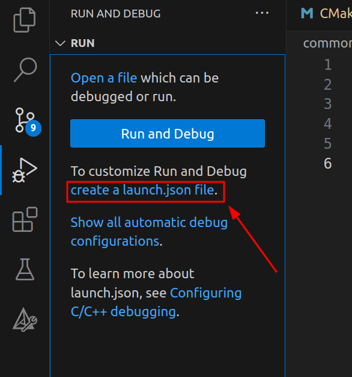
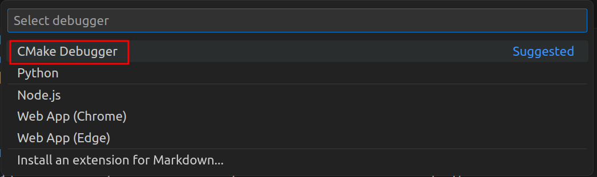
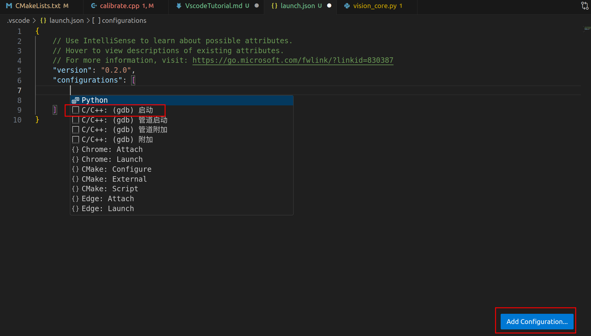
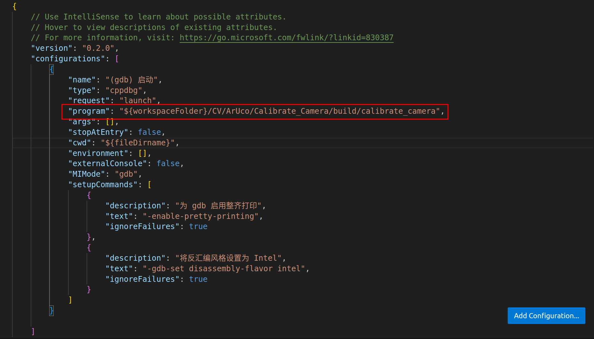
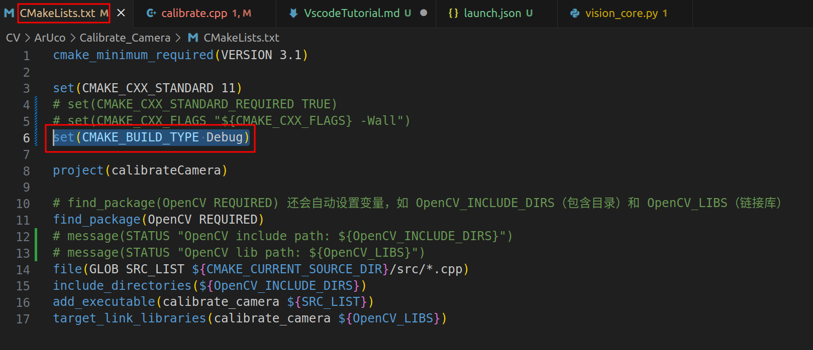
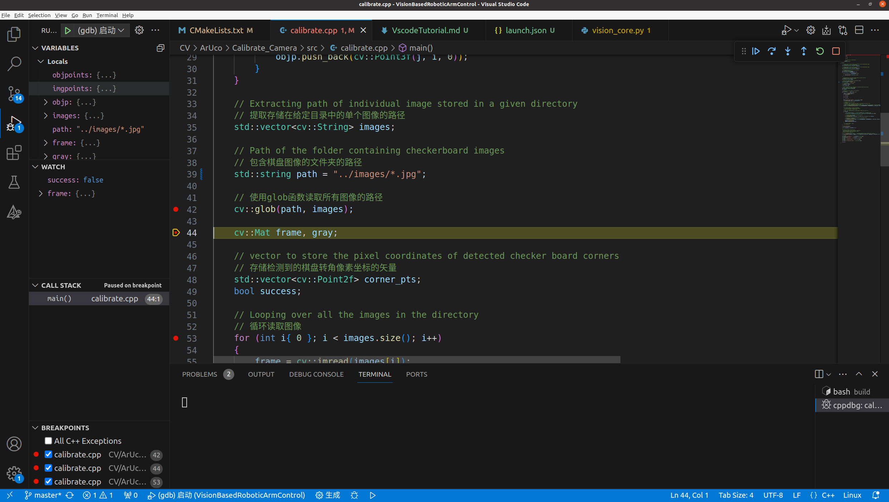

# 如何在Vscode中调试
## 教程
- [基于VSCode和CMake实现C/C++开发 | Linux篇(之前主要是看了22和23节)](https://www.bilibili.com/video/BV1fy4y1b7TC?p=22&vd_source=a5f4029436fab3ad44f642e3a69eb1d1)
## 概述
1. 点击旁边调试按钮，添加`launch.json`文件。
  
2. 选择`Cmake Debugger`。
  
3. 点击右下角的`add configuration`，再点击`gdb启动`
  
4. 修改该json文件中的program对应值为cmake生成的可执行文件，如下图：
  
其中变量`${workspaceFolder}`表示的当前最顶层工程目录所在的路径；`${fileDirname}`表示的是在按F5调试时，当前文件所在的路径。
5. 回到之前构建的项目中，在`CMakeLists.txt`文件中添加`set(CMAKE_BUILD_TYPE Debug)`，并且做好在`project`之前添加，这样`cmake .. && make`生成的可执行文件才能被调试，如图：
  
6. 转到需要调试的cpp文件，在项目目录的`build`文件夹下执行`cmake .. && make`命令后，按`F5`进行调试。
  
## 注意
通过这种方式调试，同样是适用于嵌套的CMake。只需要在子节点CMakeLists.txt文件中添加`set(CMAKE_BUILD_TYPE Debug)`指令即可。