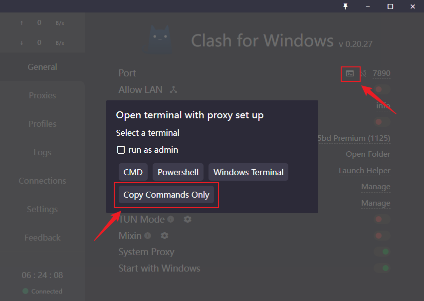
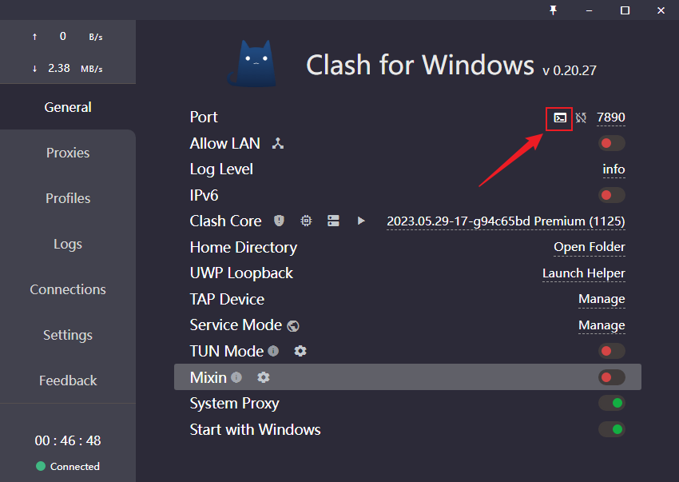
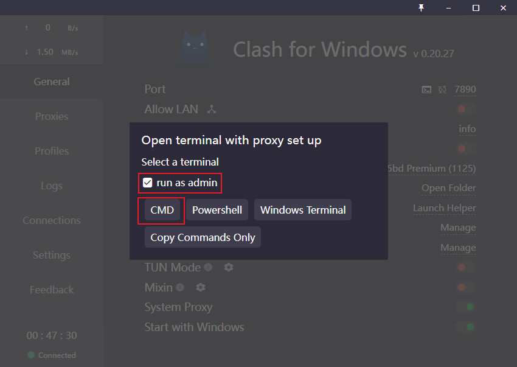

# 系统安装 
[微PE制作教程](https://www.bilibili.com/video/BV1vT4y1n7JX)  
[系统安装教程](https://www.wepe.com.cn/ubook/installwin810.html)  

# Windows使用相关记录
## windows中为终端设置代理
[参考](https://blog.csdn.net/csj777/article/details/129536997)
1. 在cmd终端中输入`set all_proxy=http://127.0.0.1:7890`即可设置clash代理。通过`curl -i google.com`测试是否设置成功。或者也可以在clash中复制cmd命令，如下图  
   
2. 直接在clash中点击
     
     
   此时会跳出来一个终端，这个终端就是可以科学上网的终端了，直接输入`curl -i google.com`测试
## 为 git bash 设置代理
[参考](https://jjayyyyyyy.github.io/2019/08/11/git_bash_proxy.html)
1. 注意里面的端口都改成clash的端口，7890，不是1080
   在git bash中输入
   ```bash
   git config --global http.proxy "http://127.0.0.1:7890"
   git config --global https.proxy "https://127.0.0.1:7890"
   ```
## 使用虚拟机VisualBox
VisualBox设置桥接模式好像方便一些，并且是真的能设置，这一点不错  
[VirtualBox安装Ubuntu虚拟机](https://blog.csdn.net/Amentos/article/details/127733864)  
[VirtualBox设置桥接模式](https://blog.csdn.net/Hongwei_1990/article/details/105340373)  
[虚拟机共享主机VPN](https://blog.csdn.net/qq_27462573/article/details/130484723)  
[VirtualBox的虚拟机Ubuntu和Windows系统之间复制粘贴和共享文件夹](https://blog.csdn.net/weixin_64993156/article/details/129728005)  

## ssh连接失败
如果通过vscode连接某个ubuntu电脑，但是现在那个电脑的IP地址变了，此时再通过vscode连，可能就连不上，这时需要将`C:\Users\shuai\.ssh\known_hosts`中对应的ip地址的内容删掉，然后再次连接就可以了。  
