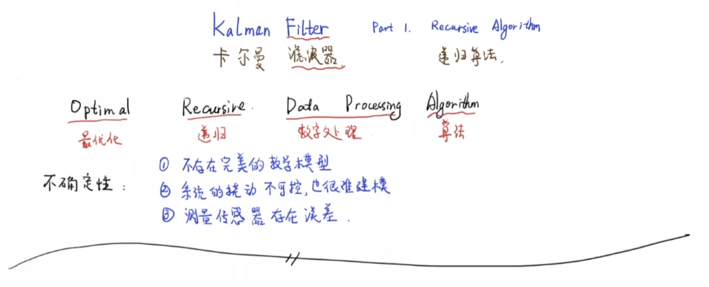
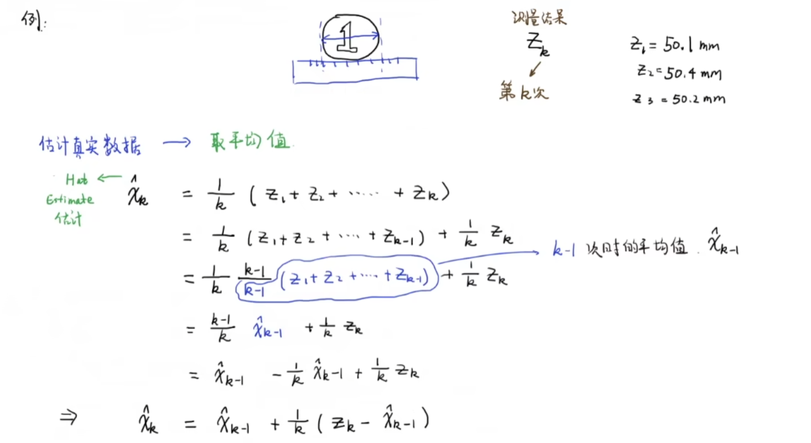
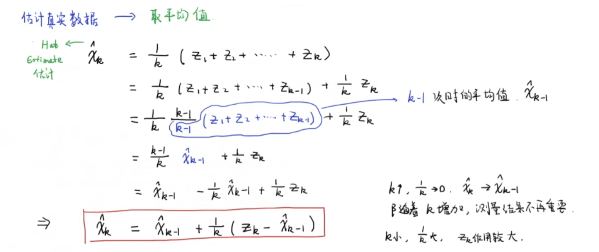
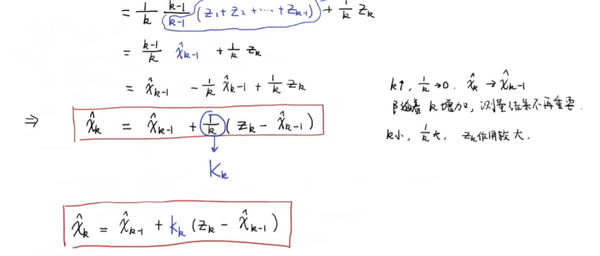
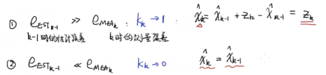
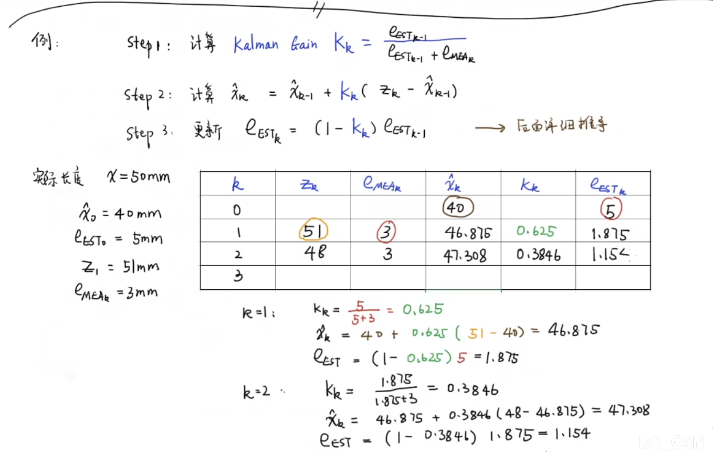
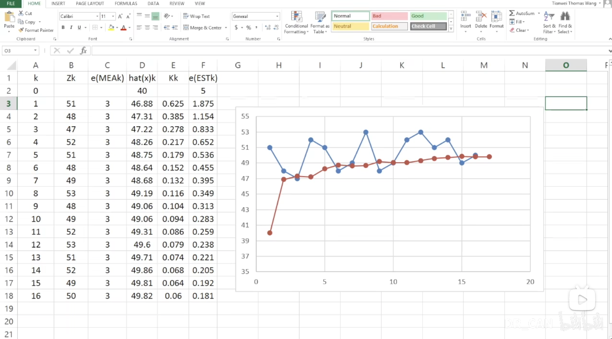
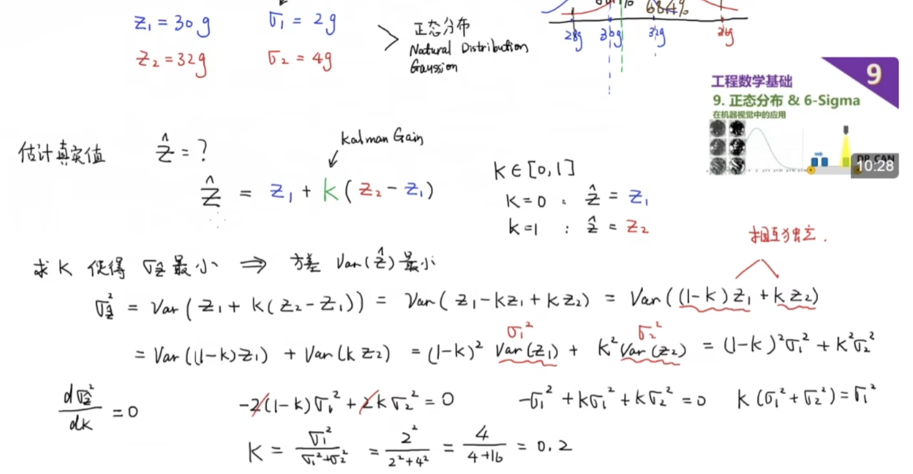
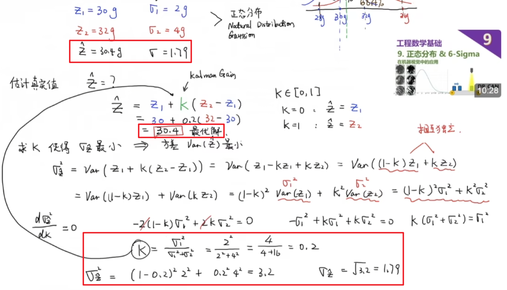

# 视频教程
[卡尔曼滤波器](https://www.bilibili.com/video/BV1ez4y1X7eR)  

  

  

  

  

  
其中，右下角这一部分可以这么理解：  
  
当估计误差远远大于测量误差时，估计值就不可信，当前估计值就应该等于测量值。当估计误差远远小于测量误差时，估计值就可信，当前估计值就等于上一次估计值。  

  

  
这里的真实值是有波动的，测量误差为3，可以看到估计值随着测量次数的增多，越来越接近真实值50

  

  

  

