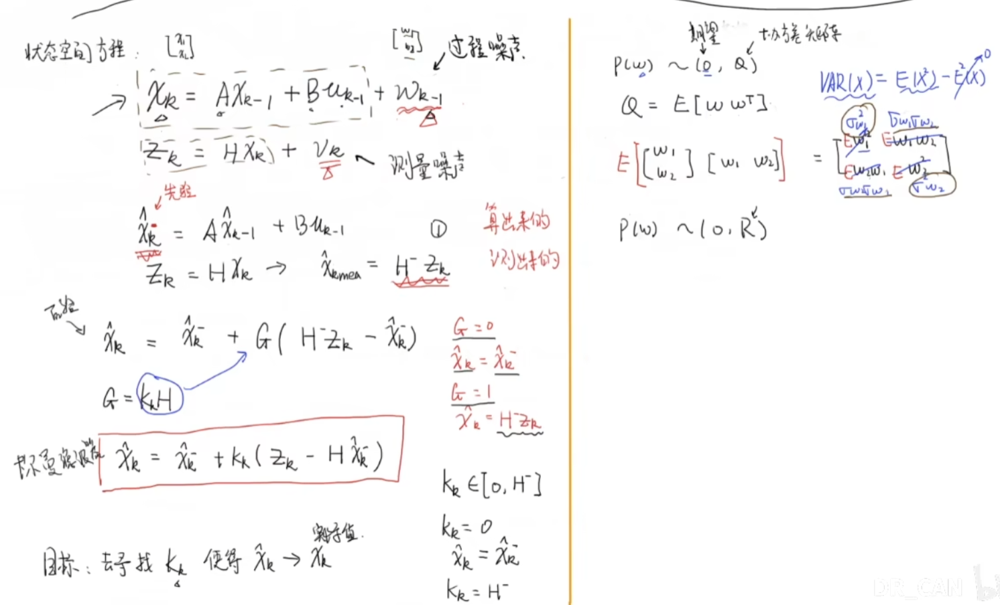

# 视频教程01
[DR_CAN-卡尔曼滤波器](https://www.bilibili.com/video/BV1ez4y1X7eR)  

## 1_递归算法_Recursive Processing
  

  

  

  

  
其中，右下角这一部分可以这么理解：  
  
当估计误差远远大于测量误差时，估计值就不可信，当前估计值就应该等于测量值。当估计误差远远小于测量误差时，估计值就可信，当前估计值就等于上一次估计值。  

  

  
这里的真实值是有波动的，测量误差为3，可以看到估计值随着测量次数的增多，越来越接近真实值50

## 2_数学基础_数据融合_协方差矩阵_状态空间方程_观测器问题
  

  

  

  
通过数据融合，可以将两组数据融合得到一个更高更瘦的数据组(两边的数据分别是蓝色和红色，融合后的数据是黑色的)，这样得出的测量结果更精准  

  

  
这里是将表格数据转化成矩阵来计算，这里的过渡矩阵很巧妙，过渡矩阵=原矩阵(n×3)-1/3乘以1矩阵(n×n个1)乘以原矩阵(n×3)。这样协方差矩阵就可以等于1/3过渡矩阵的转置乘以过渡矩阵

  

  

  

## 3_卡尔曼增益超详细数学推导
  
这里默认过程噪声和测量噪声都符合正态分布

  
红框中的公式是一般教科书中给出的卡尔曼滤波公式  
  

  

  

## 4_误差协方差矩阵数学推导_卡尔曼滤波器的五个公式
  

  

  

  

  
这里完整的卡尔曼滤波的五个公式  

## 5_直观理解与二维实例【包含完整的EXCEL代码】
  

  

  

  

## 6_扩展卡尔曼滤波器_Extended Kalman Filter
  

  

  

  

  

# 视频教程02
[华南小虎队-卡尔曼滤波器](https://www.bilibili.com/video/BV1Rh41117MT)

