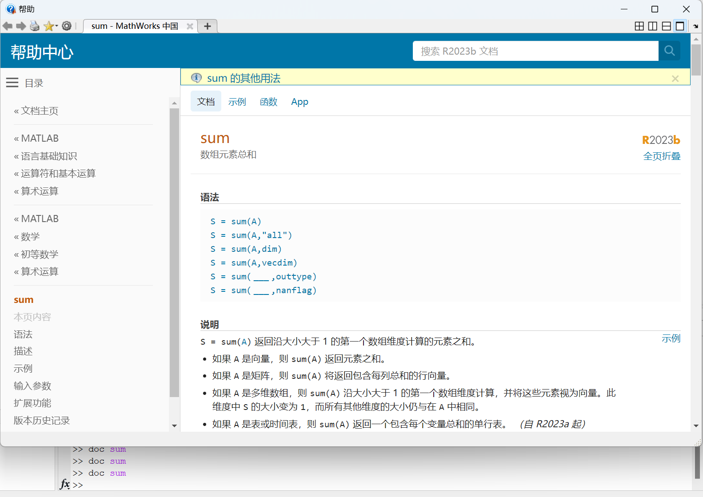

# Matlab教程
1. [MATLAB教程新手入门篇（数学建模清风主讲，适合零基础同学观看）](https://www.bilibili.com/video/BV1dN4y1Q7Kt?p=1&vd_source=a5f4029436fab3ad44f642e3a69eb1d1)
2. [功能强大的MATLAB实时脚本](https://www.bilibili.com/video/BV1z34y1K7hm/?spm_id_from=333.999.0.0&vd_source=a5f4029436fab3ad44f642e3a69eb1d1)

# 教程笔记(MATLAB教程新手入门篇（数学建模清风主讲，适合零基础同学观看）)
## - 以下 视频为主 讲义为辅
## 001 （第1章）MATLAB的介绍和安装
## 002 （第2章）MATLAB入门知识的目录
## 003 2.1 MATLAB的界面介绍
## 004 2.2 创建MATLAB的脚本
1. MATLAB 名称必须以字母开头，并且仅包含字母、数字或下划线
2. 只运行选中的代码，快捷键F9

## 005 2.3 强大的实时脚本
1. ctrl+e 快捷键，能够自由切换文本和代码
2. 分节符对实时脚本中的内容分节，可通过 ctrl+方向上/下键 切换不同的小节
     
3. ctrl+鼠标滚轮 放大或缩小实时脚本
4. 运行节表示只运行当前一整节，快捷键为 ctrl+enter ；运行所有代码，快捷键为 F5  
   
5. 可以通过右击编辑区域，快捷菜单清除输出
   

## 006 2.4 MATLAB文件管理
1. 当执行 MATLAB 某个文件的命令时，MATLAB 首先会在当前文件夹中寻找该命令对应的文件，如果找到的话就会执行这个文件；如果没有找到的话，会在`搜索路径`中继续寻找，如果都没找到的话则会报错。搜索路径如下图，可以在其中添加。但是一般情况下不建议自己添加，防止与官方原本的冲突  
     
2. 命令行窗口输入指令，搜索优先级是 工作区>当前文件夹>搜索路径  
   
3. 如何修改当前文件夹：右击代码标题，选择修改当前文件夹，这种方法最简单
   

## 007 2.5 MATLAB的帮助系统
1. 在MATLAB官网搜索:[MATLAB帮助中心](https://ww2.mathworks.cn/help/index.html)
2. 使用doc命令:在MATLAB的命令行窗口输入doc即可调出MATLAB的帮助中心。doc后面可以跟上你要查询的命令名称，例如我们输入：doc sum，就会弹出sum的帮助界面。  
   
3. MATLAB中行添加注释和取消注释的快捷键，分别是Ctrl+R 和Ctrl+T

## 008 2.6 MATLAB的变量
1. 变量名必须以字母开头，之后可以是任意的字母、数字或下划线_。 
2. 变量名区分字母的大小写，例如a和A代表不同的变量。 
3. 变量名不超过63个字符，第63个字符以后的字符将被忽略。 
4. 不能定义与MATLAB关键字同名的变量（例如if或end）。要获取关键字的完整列
表，请在命令行输入iskeyword 并运行。
5. 连续两个百分号后面加一个空格可以把脚本分节：  
   
6. 可以删除工作区的pi，从而将pi恢复成系统默认值。删除后，再F9运行，结果如下图
   
   
7. inf/-inf 分别表示无穷大和负无穷大，注意1/0 = inf
8. NaN 表示不定值或缺失值。例如计算0/0或0*Inf会返回NaN
9. i和j 都表示复数中的虚数单位，例如3+4i和3+4j表示同一个复数
10. eps 可以简单的将其看成一个非常小的数，这个数大约等于2.22×10−16，有时候不想分母为0时，我们就可以在分母上加上eps
11. 更改MATLAB的数值显示格式：
    - 临时更改：在命令行输入 format long g ，即可改变接下来数值显示的方式
        
    - 永久更改: format 命令更改数值显示格式是临时的，关闭MATLAB 后重新打开就会恢复成默认的格式。如何永久更改。点击 MATLAB 菜单栏——主页——预设，就能打开MATLAB 的设置界面。我们可以点击命令行窗口，将数值格式设置为long g 即可。
        
12. 有时候，一些计算结果并不需要在命令行显示，那么我们可以在代码行的最后加上英文分号“;”，这样计算结果不会出现在命令行，但在工作区仍然可以查看计算的结果。另外，如果想把两行代码放到同一行，这两行代码中间也用英文分号“;”隔开。
13. clc和clear的作用：
    - clc   ：清空命令行窗口
    - clear ：清空工作区（clear a表示只删除工作区中变量名为a的变量；clear a b表示删除工作区中的变量a和变量b）

## 009 2.7 常见的数学运算函数
1. 可以通过右击脚本标题的方式，将脚本通过实时脚本打开：  
     
2. MATLAB 数值运算的函数：
   <table>
      <tr>
         <th>函数名</th>
         <th>功能</th>
         <th>计算结果</th>  
      </tr>
      <tr>
         <td>abs</td>
         <td>求绝对值，也可以用来计算复数的模长</td>
         <td>abs(1.5)      % 1.5
            <br>abs(-1.5)  % 1.5
            <br>abs(3+4i)  % 5
         </td>
      </tr>
      <tr>
         <td>floor</td>
         <td>朝负无穷大方向取整（将结果取到小于或等于该元素的最接近整数）</td>
         <td>floor(1.1)      % 1
            <br>floor(1.9)      % 1
            <br>floor(-1.1)    % -2 
            <br>floor(-1.9)    % -2
         </td>
      </tr>      
      <tr>
         <td>fix</td>
         <td>朝零方向取整（相当于删除小数部分，将其截断为整数）</td>
         <td>fix(1.1) % 1
            <br>fix(1.9) % 1
            <br>fix(-1.1) % -1 
            <br>fix(-1.9) % -1
         </td>
      </tr>      
      <tr>
         <td>ceil</td>
         <td>朝正无穷大方向取整（将结果取到大于或等于该元素的最接近整数）</td>
         <td>ceil(1.1) % 2
            <br>ceil(1.9) % 2
            <br>ceil(-1.1) % -1 
            <br>ceil(-1.9) % -1
         </td>
      </tr>      
      <tr>
         <td>round</td>
         <td>round 函数还有第一种用法：真正意义上的四舍五入函数（将结果四舍五入为最近的整数，如果为 0.5，则会朝着偏离零的方向调整）
         <br>round 函数还有第二种用法：它可以输入第二个参数，round(X,N)可以将 X 在第 N 位数四舍五入，分下面三种情况：
         <br>1. N > 0：四舍五入到小数点右侧的第 N 位数。
         <br>2. N = 0：四舍五入到最接近的整数。
         <br>3. N < 0：四舍五入到小数点左侧的第 N 位数。</td>
         <td>% 只有一个输入参数的用法：
            <br>round(1.1) % 1
            <br>round(1.9) % 2
            <br>round(-1.1) % -1 
            <br>round(-1.9) % -2 
            <br>round(1.5) % 2
            <br>round(-1.5) % -2
            <br>% 有两个输入参数的用法：
            <br>round(3.14159, 1) % 3.1
            <br>round(3.14159, 3) % 3.142 
            <br>round(3.14159, 0) % 3
            <br>round(12345.6, -1) % 12350 
            <br>round(12345.6, -2) % 12300 
            <br>round(12345.6, -3) % 12000
         </td>
      </tr>
      <tr>
         <td>mod</td>
         <td>mod(a,m)可以计算 a 除以 m 后的余数，其中 a 是被除数，m 是除数。</td>
         <td>mod(11, 3) % 2
            <br>mod(9, 3) % 0
         </td>
      </tr>
      <tr>
         <td>sqrt</td>
         <td>sqrt(a)可以计算 a 的平方根，即对a 开根号。如果 a 为负数则返回复数结果。其结果和 a^(1/2)等价。</td>
         <td>sqrt(9) % 3
            <br>format long g % 计算结果显示为长格式
            <br>sqrt(2) % 1.414213562373095 
            <br>sqrt(-4) % 2i
         </td>
      </tr>
      <tr>
         <td>exp</td>
         <td>exp 函数可以计算以自然常数 e 为底的指数。</td>
         <td>exp(1) % 2.7183
            <br>exp(2) % 7.3891 
            <br>exp(10) % 2.2026e+04
         </td>
      </tr>
      <tr>
         <td>log</td>
         <td>log(x)用来计算以自然常数 e 为底数的对数。</td>
         <td>log(2) % 0.6931
            <br>log(3) % 1.0986
            <br>log(exp(10)) % 10
         </td>
      </tr>
      <tr>
         <td>log2/log10</td>
         <td>分别用来计算以 2 和 10 为底的对数。</td>
         <td>log2(4) % 2
            <br>log2(1024) % 10
            <br>log10(100) % 2
         </td>
      </tr>
   </table>
3. 怎么计算以任意常数a为底的对数：高中学过的换底公式，下面我们以计算以4为底的对数为例  
   ```matlab
   log(16)/log(4)  % 2  
   log(64)/log(4)  % 3  
   log(256)/log(4)  % 4  
   log(1024)/log(4)  % 5  
   ```
4. 三角函数：[官网地址](https://ww2.mathworks.cn/help/matlab/trigonometry.html)
5. MATLAB 的乘号不能省略。例如计算 sin(2π)时，我们要在 MATLAB 中输入 sin(2*pi)，中间的乘号不能省略。

## 010 第2章小节
## 011 第2章练习题和参考答案
## 012 补录：第二章补充的练习题
## 013 （第3章）MATLAB矩阵的操作的目录
## 014 3.1 复习矩阵的基础知识
## 015 3.2.1 向量的创建方法
在MATLAB中，向量的创建方法主要有三种，分别是：直接输入法、冒号法和利用MATLAB函数创建。
1. 直接输入法  
   - 向量元素需要用中括号“[ ]”括起来，元素之间用空格、逗号、分号或按回车键（Enter键）分隔，就可以创建对应的向量。  
   - 若元素之间用空格（可以有多个空格）、逗号分隔，则创建的是行向量；  
   - 若用分号、回车键分隔，则创建的是列向量。（注意：这里的逗号和分号都是英文输入法下输入的，不能用中文的逗号或分号）  
2. 冒号法（注意：冒号法有点像python中的切片，但是在终止值处，matlab是包含的；而且python中的步长step在后面，matlab中的step在中间）
   - 我们可以利用命令：`A:step:B` 来创建一个行向量。
   - 其中，A是起始值，step是每次递增或递减的步长，B是终止值（不一定刚好停在这里）。若step等于1，则可以直接简写成A:B。
   - 在 MATLAB 中，我们可以直接使用命令`[]`创建空的向量。
3. 利用 MATLAB 函数创建
   - linspace 函数: 它有两种用法，区别在于是否给定第三个输入参数 n，如果我们不指定 n，则 MATLAB 会默认 n=100。
     - linspace(a,b): 该命令用来创建一个行向量，向量中的第一个元素为 a，最后一个元素为 b，形成总数为 100 个元素的线性间隔的向量。
     - linspace (a,b,n): 该命令用来创建一个行向量，向量中的第一个元素为 a，最后一个元素为 b，形成总数为 n 个元素的线性间隔的向量。
     - 对于冒号法和linspace函数，具体场景下的使用：后续章节讲解循环语句时，冒号法使用的频率最高；而在绘制函数图形时，使用linspace 得到的 x 轴的范围要比冒号法稍微准确一点。例如：我们要绘制 sin(x)在区间[0, 2𝜋]上的图形，x 的范围是 0 到2𝜋，我们使用 linspace(0,2\*pi)生成的向量的最后一个元素一定是2𝜋；如果使用冒号法令 x=0:0.1:2\*pi，那么 x 向量的最后一个元素和2𝜋有一个微小的差异，当然，如果我们将 step 取得更小，例如取成 0.01，那么这个差异几乎可以忽略。
   - logspace 函数: 
     - logspace(a,b)：创建一个行向量，其第一个元素为$10^a$，最后一个元素为$10^b$，形成总数为 50 个元素的等比数列向量。
     - logspace(a,b,n): 创建一个行向量，其第一个元素为$10^a$，最后一个元素为$10^b$，形成总数为 n 个元素的等比数列向量。

## 016 3.2.2 向量元素的引用
在 MATLAB 中，可以使用 length 函数或numel 函数来计算向量中包含的元素个数。例如：a = [1,3,8,9,7]; length(a)或 numel(a)的返回结果是 5，因为向量 a 中有五个元素。  
在 MATLAB 中，向量的索引是从 1 开始的。  
1. 单个元素引用  
我们提取向量 a 中单个元素的方法很简单，只需要利用 a(ind)命令，小括号中的 ind 就是
你要提取的对应元素的索引。（注意：创建向量用中括号，提取元素要用小括号哦！）
2. 多个元素引用  
类似的，我们也可以利用向量的索引来同时提取多个位置的元素，这时候只需要将 ind 设置成一个向量，ind 中放入我们想要提取的元素的索引，然后使用 a(ind)命令即可。例如，我们令 ind = [1 3 5 7 9]，那么 a(ind)的结果为[2 8 32 128 512]，即我们提取了向量 a 中奇数位置的元素。熟悉向量冒号创建方法的同学应该能够看出，ind 等于 1:2:9，因此我们可以直接将 a(ind)写成 a(1:2:9)，这就表示提取 a 中奇数位置的元素；类似的，提取 a 中偶数位置元素的命令是 a(2:2:10)，如果你不熟练的话，可以分成两步写，即先令 ind=2:2:10，然后再使用 a(ind)的命令。当然，对于同一个位置的元素，我们也可以提取多次，例如：ind = [1 2 2 3 3 3]，那么 a(ind)得到的结果应该是[2 4 4 8 8 8]，以后熟悉的话可以直接写成 a([1 2 2 3 3 3])。  
3. 技巧：使用 end 索引  
有同学会想，假如我不知道向量 a 中有多少个元素，也不想使用 length 函数或者 numel 函数来计算向量中元素的个数，那我能不能提取出 a 中奇数位置的元素呢？这时候就需要用到一个特殊的关键字：end。它有很多种用法，在这里 end 可以用来替代向量的最后一个索引。  
例如，我现在要访问 a 中第五个至最后一个元素，那么我们可以直接使用 a(5:end)，这里的 end 就表示了 a 的最后一个索引；另外，我们还可以对 end 进行计算，例如要访问 a 中第五个至倒数第三个元素，我们可以使用 a(5:end-2)，得到的结果为[32 64 128 256]。  
这里有一个易错点，如果使用了 end，不能将要取元素的索引赋值给 ind。例如，还是要访问 a 中第五个至最后一个元素，如果你令 ind=5:end，MATLAB 就会报错。因此，我们只能在 a 后面的小括号中使用 end 来替代数组的最后一个索引。  
那我们回到上面的问题，在不知道 a 中有多少个元素的前提下，我们可以使用 a(1:2:end)。

## 017 3.2.3 向量元素的修改和删除
可以利用等号赋值的方法对引用位置的元素进行修
改和删除。令向量 a=[2 4 8 16 32 64 128 256 512 1024]
<table>
   <tr>
      <th colspan='2' style="text-align:center;">向量元素的修改</th>
   </tr>
   <tr>
      <th>代码</th>
      <th>修改后的向量a</th>
   </tr>
   <tr>
      <td>a(1) = 4 % 第一个元素改成 4</td>
      <td>[4 4 8 16 32 64 128 256 512 1024]</td>
   </tr>
   <tr>
      <td>a([1,3]) = [50 60] % 第 1 个位置元素改成 50；第 3 个位置元素改成 60</td>
      <td>[50 4 60 16 32 64 128 256 512 1024]</td>
   </tr>      
   <tr>
      <td>a(1:3) = [5 6] % 赋值时，左右两侧的元素个数要相同，左边引用了 3 个位置，右侧的向量长度为 2</td>
      <td>MATLAB 报错：无法执行赋值，因为左侧和右侧的元素数目不同。</td>
   </tr>      
   <tr>
      <td>a(2:4) = 100 % 如果右边为常数，则将指定位置的元素全部变成这个常数。</td>
      <td>% 第 2 至 4 号位置的元素改为了 100 
         <br>[50 100 100 100 32 64 128 256 512 1024]
      </td>
   </tr>      
   <tr>
      <td>a(13) = 88 % 把索引为 13 的元素赋值为 88，如果超过了最大索引，则会自动拓展向量的大小</td>
      <td>[2 4 8 16 32 64 128 256 512 1024 0 0 88]
         <br>% 索引 11 和 12 的位置会自动用 0 进行赋值
      </td>
   </tr>
   <tr>
      <th colspan='2' style="text-align:center;">向量元素的删除</th>
   </tr>
   <tr>
      <th>代码</th>
      <th>修改后的向量a</th>
   </tr>
   <tr>
      <td>a(1) = [ ] % 删除 a 的第一个元素</td>
      <td>[100 100 100 32 64 128 256 512 1024]</td>
   </tr>
   <tr>
      <td>a(end-1:end) = [ ] % 删除 a 中最后两个元素</td>
      <td>[100 100 100 32 64 128 256]</td>
   </tr>
</table>

### 思考题
以下语句会报错吗？
1. ```matlab
   a = [2 4 8 16 32 64 128 256 512 1024];
   a(1,3) % 8
   ```
   不会报错，这里相当于是将向量a当成了矩阵来进行索引
2. ```matlab
   a = [2 4 8 16 32];
   a(8) = 10 % 2 4 8 16 32 0 0 10
   ```
   不会报错，这里相当于是将向量a往后的第8个数变成了10，前面加了两个0
3. ```matlab
   a = [2 4 8 16 32];
   a(10) = [] % 矩阵索引超出删除范围
   ```
   会报错，删除时索引不能超出矩阵范围，但是添加的时候可以，如上2

## 018 3.2 使用思维导图复习本节内容
## 019 3.3.1 矩阵的创建方法
在MATLAB中，矩阵的创建方法主要有三种，分别是：直接输入法、函数创建法和导入本地文件中的数据。
### 直接输入法
输入矩阵时要以中括号“[ ]”作为标识符号，矩阵的所有元素必须都在中括号内。矩阵的同行元素之间用空格或逗号分隔，行与行之间用分号或回车键分隔。
```matlab
a = [1 2 3; 4 5 6]
b = [1,2,3; 4,5,6]
c = [2  5
    6  7]
% 还可以既加分号又加回车键进行换行
d = [3 6;
    6 9]
% 如果不想显示输出结果，可以在语句的最后用英文分号“;”结束。（工作区还是可以找到我们创建的矩阵）
e = [2, 3
     5, 7];
```
### 函数创建法
MATLAB提供了一些函数，这些函数可以用来生成某些特定的矩阵，我们这里介绍几个最常用到的函数。
1. 第一组函数： zeros、ones和eye  
   这三个函数可用来分别创建全为0的矩阵、全为1的矩阵和单位矩阵。  
   以zeros函数为例，其常见的用法有两种：  
   - zeros(n)可以创建一个n行n列全为0的矩阵；
   - zeros(m,n)可以创建一个m行n列全为0的矩阵。
   ```matlab
   a = zeros(3)
   b = zeros(2,3)
   c = ones(5)
   d = ones(1,4)
   % 单位矩阵：主对角线元素为 1 且其他位置元素为 0 。
   e = eye(4)
   f = eye(4,3)  
   g = eye(3,4)  
   ```
2. 第二组函数： rand、randi和randn。  
   这三个函数分别用来创建均匀分布的随机数、均匀分布的随机整数和标准正态分布的随机数，以后会大量用到，请大家熟记。  
   1. rand函数可用来创建区间0和1内均匀分布的随机数，其最常用的方法有两种：（由rand函数创建的随机数矩阵的每个元素都随机取样自0和1之间的均匀分布。）  
   - rand(n)可以创建一个n行n列的随机数矩阵；
   - rand(m,n)可以创建一个m行n列的随机数矩阵。
   2. randi函数是用来创建均匀分布的随机整数，其最一般的使用方法为：randi([imin,imax],m,n)，可以用来创建一个m行n列的随机数矩阵，该随机数矩阵中的每个元素都是从区间[imin,imax]内随机抽取的整数。  
   举个例子，假设我们要模拟投掷100次骰子，骰子有6个面，那么我们可以使用randi([1,6],1,100)得到一个长度为100的行向量，向量中的每个元素都是取自1,2,3,4,5,6中的一个整数。
      ```matlab
      % 这里我生成一个行向量，也可以生成列向量，大家可以根据你自己的需求来。
      randi([1,6],1,100)
      % 另外，如果imin等于1，那么可以简写为randi(imax,m,n)；
      randi(6,1,100)
      % 如果m和n相同，即生成一个n行n列的方阵，那么可以直接写成randi([imin,imax],n)。
      randi([-3 3],5) 
      ```
   3. randn函数用来创建标准正态分布的随机数，其使用方法和rand函数类似：（标准正态分布:以0为均值、以1为标准差的正态分布，记为N(0,1)）
   - randn(n)可以创建一个n行n列的随机数矩阵；
   - randn(m,n)可以创建一个m行n列的随机数矩阵。
3. 第三组函数：diag和blkdiag。  
   1. diag 函数可用来创建对角矩阵或者获取矩阵的对角元素  
      - 如果输入的第一个参数是向量，则表示创建对角矩阵。  
      diag(v, k) 将向量 v 的元素放置在第 k 条对角线上，其他位置元素为 0。k=0 表示主对角线，k>0 位于主对角线上方，k<0 位于主对角线下方。如果 k=0, 可以直接写成 diag(v)。  
        
      - 如果输入的第一个参数是矩阵，则表示获取矩阵的对角元素  
      diag(A,k) 返回 A 的第 k 条对角线上元素的构成的列向量。  
        
   2. blkdiag 函数可用来创建分块对角矩阵  
      - 分块对角矩阵是相对于常规的对角矩阵而言的，常规的对角矩阵沿对角线具有单个元素，而分块对角矩阵的对角线的元素是矩阵。我们可采用以下形式表示一个分块对角矩阵：  
        
        
### 导入本地文件中的数据
MATLAB 可读取本地的文件，支持的常见格式如下：
- .txt、.dat 或 .csv（适用于带分隔符的文本文件）
- .xls、.xlsb、.xlsm、.xlsx、.xltm、.xltx 或 .ods（适用于电子表格文件）

## - 以下 讲义为主 视频为辅
## 020 3.3.2 矩阵元素的引用（接下来都是看讲义自学）
## 021 3.3.3 矩阵元素的修改和删除
## 022 3.3.4 矩阵的拼接和重复
## 023 3.3.5 矩阵的重构和重新排列
## 024 3.3.5 reshape函数：更改矩阵的形状
## 025 3.3.5 sort函数：对向量或者矩阵进行排序
## 026 3.3.5 sortrows函数：基于某一列对矩阵进行排序
## 027 3.3.5 flip fliplr flipud函数：翻转向量或者矩阵
## 028 3.3.5 rot90函数：对矩阵进行旋转
## 029 3.3 使用思维导图复习本节内容
## 030 3.4.1 调用函数对矩阵进行运算
## 031 3.4.1 sum求和、prod求乘积
## 032 3.4.1 cumsum求累积和、diff求差分
## 033 3.4.1 mean求平均值、median求中位数
## 034 3.4.1 mode求众数
## 035 3.4.1 var求方差、std求标准差
## 036 3.4.1 min求最小值、max求最大值
什么是兼容模式：

## 037 3.4.1 拓展1：三个函数：mink、maxk和topkrows
1. mink是用来求出前k个最小值的函数
   - 如果A是一个向量，则mink(A,k)可以计算向量A的前k个最小值  
     
   - 如果A是一个矩阵，则mink(A,k,dim)可以计算A沿维度dim的前k个最小值
     - 当dim=1时沿着行方向计算，即得到每列的前k个最小值（类似的，dim=1时，mink(A,k,1)也可以简写成mink(A,k)）  
     
     - 当dim=2时沿着列方向计算，即得到每行的前k个最小值
     
2. maxk :求前k个最大值。使用方法和mink类似
3. topkrows :返回矩阵按照排序顺序的前若干行。这个函数的用法和上一节介绍的sortrows函数类似，sortrows函数基于某一列对整个矩阵进行排序，而topkrows函数则只返回排序后的前k行（默认是降序排列）。  
  
  
  
  
  
### 补充：
幻方矩阵：  


## 038 3.4.1 拓展2：以sum函数为例，新版本推出的功能
主要讲解了就是可以使用 sum(A, 'all')来计算所有元素的和：  

## 039 3.4.2 算术运算：加、减、乘、右除、左除、乘方和转置
## 040 3.4.2 练习：评价预测效果好坏的指标，例如SSE、RMSE、MAPE等
## 041 3.4.2 练习：计算优化算法中常见的四个测试函数
## 042 3.4.3 关系运算：等于==、不等于~=等六个关系运算符
## 043 3.4.3 关系运算：判断两个浮点数是否相等
## 044 3.4.4.1 逻辑运算函数：逻辑与、逻辑或、逻辑非和逻辑异或
## 045 3.4.4.1 逻辑与和逻辑或的连续运算、运算符优先级
### 运算符优先级
处于同一优先级别的运算符具有相同的运算优先级，将从左至右依次进行计算。下表显示了 MATLAB 运算符的优先级规则，顺序从最高优先级别到最低优先级别：

1. 圆括号 ()
2. 转置 (.')、幂 (.^)、复共轭转置 (')、矩阵幂 (^)
3. 带一元减法 (.^-)、一元加法 (.^+) 或逻辑求反 (.^~) 的幂，以及带一元减法 (^-)、一元加法 (^+) 或逻辑求反 (^~) 的矩阵幂。
   ```
   注意:
   尽管大多数运算符都从左至右运行，但 (^-)、(.^-)、(^+)、(.^+)、(^~) 和 (.^~) 按从右至左顺序从第二个运行。建议您使用括号显式指定包含这些运算符组合的语句的期望优先级。
   ```
4. 一元加法 (+)、一元减法 (-)、逻辑求反 (~)
5. 乘法 (.*)、右除 (./)、左除 (.\)、矩阵乘法 (*)、矩阵右除 (/)、矩阵左除 (\)
6. 加法 (+)、减法 (-)
7. 冒号运算符 (:)
8. 小于 (<)、小于或等于 (<=)、大于 (>)、大于或等于 (>=)、等于 (==)、不等于 (~=)
9. 按元素 AND (&)
10. 按元素 OR (|)
11. 短路 AND (&&)
12. 短路 OR (||)

## 046 3.4.4.1 短路功能的逻辑与和逻辑或
## 047 3.4.4.2 利用逻辑值引用矩阵的元素
## 048 3.4.4.3 使用逻辑值修改或删除矩阵元素
## 049 3.4.4.4 all函数和any函数
## 050 3.4.4.4 find函数
## 051 3.4.5 集合运算
## 052 3.4.5 unique函数求唯一值
## 053 3.4.5 ismember函数判断数组元素是否在另一个数组中
## 054 3.4.5 交集intersect、并集union、差集setdiff和对称差集setxor
## 055 3.4 使用思维导图复习本节内容
## 056 3.5 线性代数相关的函数
## 057 3.5 行列式、秩、迹、行最简型矩阵、逆矩阵、转置
## 058 3.5 triu上三角部分和tril下三角部分
## 059 3.5 eig函数求特征值和特征向量
## 060 3.5 norm计算范数以及三种距离的计算方法
## 061 3.5 使用思维导图复习本节内容
## 062 第3章小节
## 063 第3章练习题和参考答案
## 064 第3章练习题中拓展的17个新函数
## 065 （第4章）MATLAB程序流程控制的目录
## 066 4.1.1 if-elseif-else-end条件语句的基础知识
## 067 4.1.1 if语句的嵌套
## 068 4.1.2 switch-case-otherwise-end语句的基础知识
## 069 4.1.2 switch语句中元胞数组的用法
## 070 4.2.1 for循环中循环变量的取值
## 071 4.2.1 (重要)断点调试功能讲解for循环的例1
1. 文件只有被保存才能添加断点
2. 断点调式与之前在C语言中的没什么区别
3. 注意，列向量在被循环时，只能循环一次：
     
   可以通过如下代码，就可以不管x是列向量还是行向量，都可以将其转换为列向量
   ```matlab
   xx = (x(:))'  % xx = transpose(x(:));
   ```
## 072 拓展：将实时脚本转换成m文件来进行调试
1. 将mlx文件另存为GBK编码的m文件(主要是因为低版本的matlab实时脚本无法添加断点)
## 073 4.2.1 for循环的例2、例3和例4
## 074 4.2.1 for循环的例5、例6和例7
## 075 4.2.1 for循环的三个注意事项
## 076 4.2.2 while循环的使用方法和条件断点
## 077 4.2.2 while循环的补充和注意事项
## 078 4.2.3 循环语句中的break和continue关键字
## 079 4.2.3 例1：判断自然数n是否为质数
## 080 4.2.3 例2：模拟斗地主首次出现炸弹的轮数
## 081 4.2.3 例3：蒙特卡罗模拟求小猫走出山洞的期望时间
## 082 4.2.3 例4：二分搜索法求函数零点
## 083 4.3 处理异常的try-catch语句
## 084 4.4 控制程序流程的其他常用指令
## 085 4.4.1 程序运行计时：tic和toc
1. 请考虑使用 MATLAB 矩阵和向量运算，而不是编写基于循环的代码。这样可以提高代码的运行效率。
## 086 4.4.2 暂停程序运行：pause
## 087 4.4.3 用户输入数据：input
## 088 4.4.4 显示警告信息：warning
## 089 4.4.5 显示报错信息：error
## 090 第4章小节
## 091 第4章练习题和参考答案
