# 教程
[数学建模+MATLAB+写论文+模型与算法，赛前突击的数学建模教程（北海主讲）](https://www.bilibili.com/video/BV1Rq4y1S7S8)
## 教程截图
### 3-3 Matlab矩阵运算
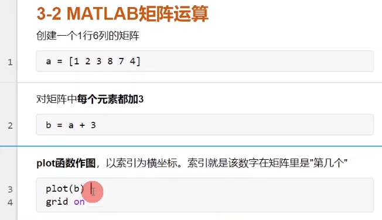  

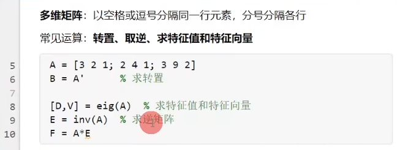  

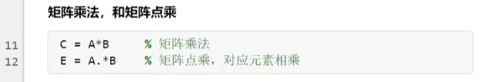  

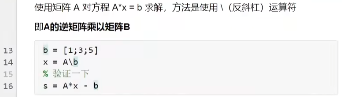  
如果是$A/b$，那就是A乘以b的逆矩阵。可以这么记，把斜杠想象成一条直线，谁在这条直线的下方，谁就取逆，也就是说如果是`\`，前者取逆，如果是`/`，后者取逆

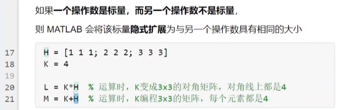  

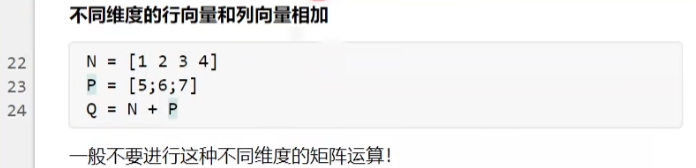  

### 3-4 线图，条形图，极坐标，图散点图
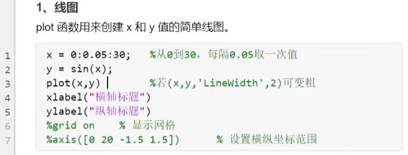  
- 这里的axis是设置横纵坐标的范围，其中前两个是设置横坐标起点和终点，后两个是设置纵坐标的起点和终点，如下两张图所示：  
    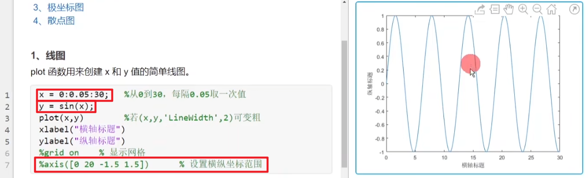  
    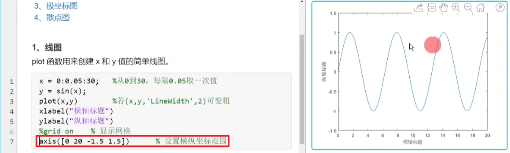  
- 步长设置成0.05差不多就可以了，如果太小会影响绘图速度  
- 可以通过plot中的参数Linewidth，设置绘图线宽
      

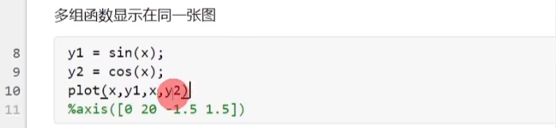  

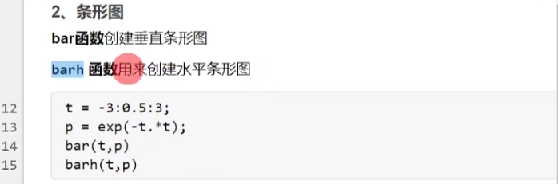
- 这里的公式其实就是$p = e^{-t^2}$

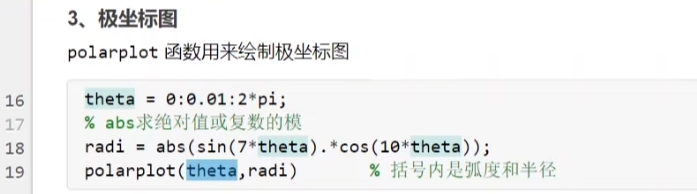  

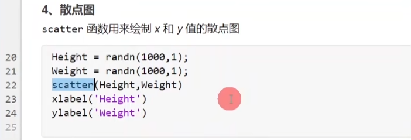  

### 3-5 三维图和子图
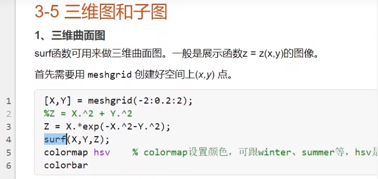  
- 这里colormap表示上色的色系，colorbar表示显示旁边每种颜色代表的值
    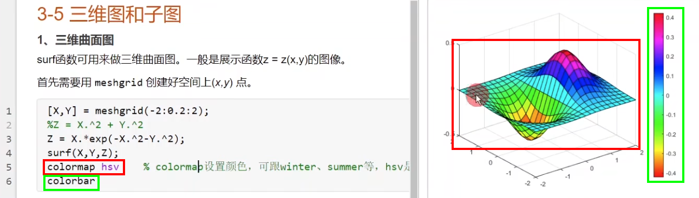

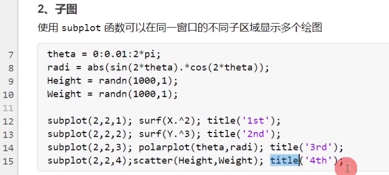  
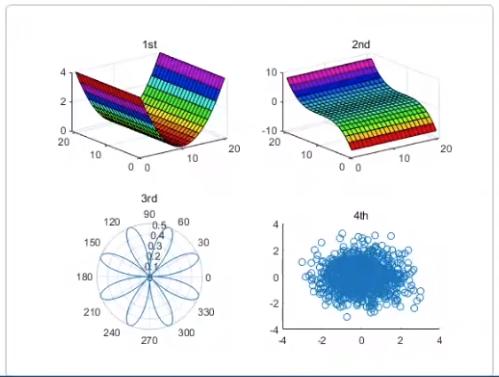  

### 3-6 Matlab导入数据
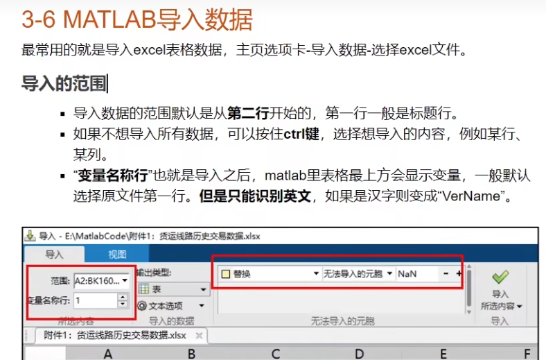  

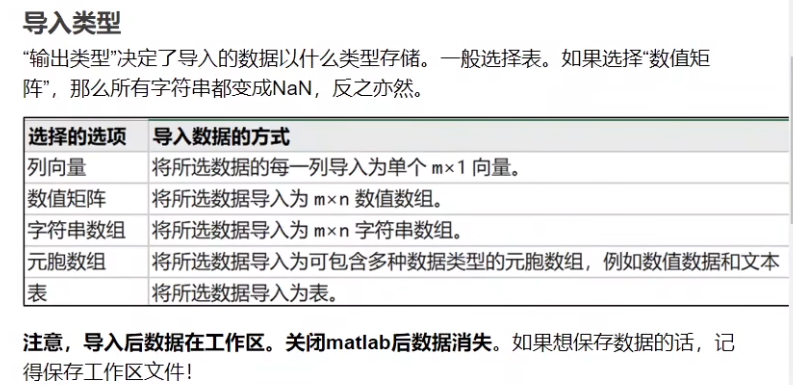  

### 3-7 Matlab处理缺失值和异常值
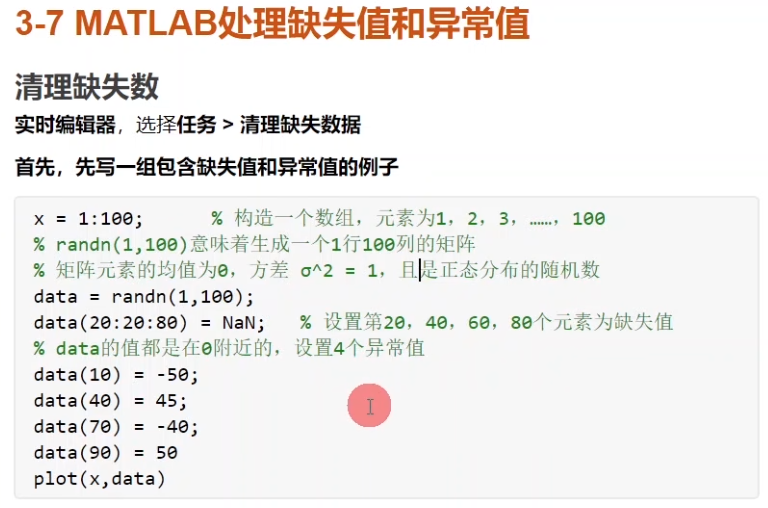  

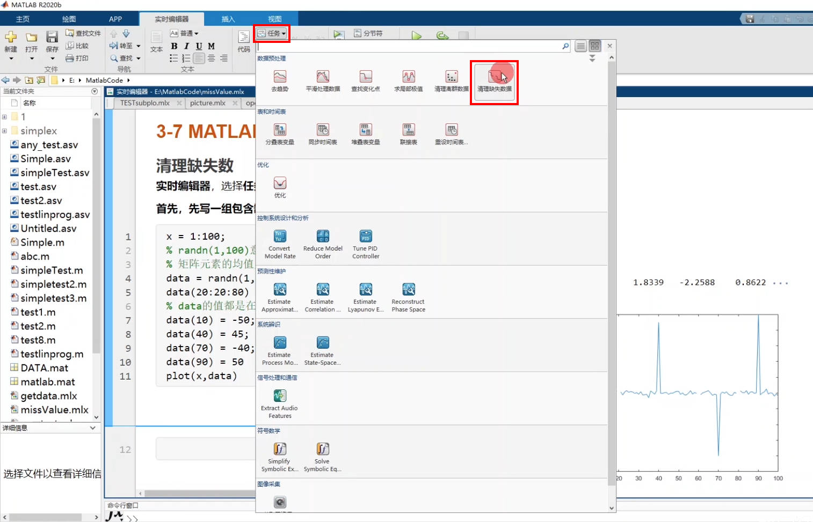  
这里使用的是matlab的工具箱，清理缺失值  
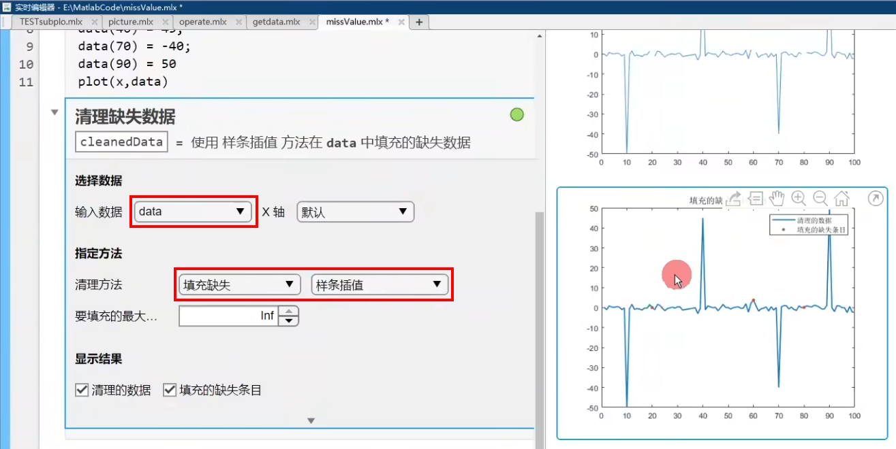  
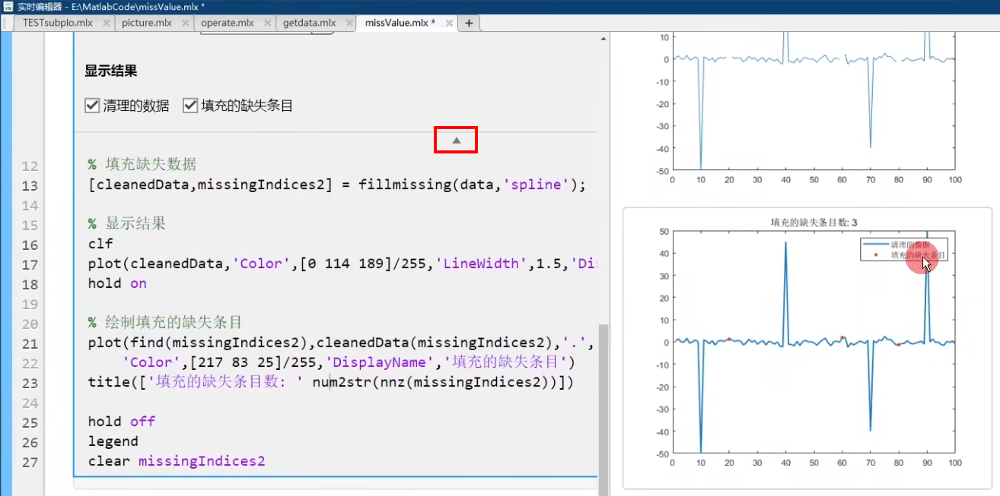  
这里下方有一个三角形，点击就可以显示该工具箱的具体代码，可以将此部分代码复制使用，代替工具箱  

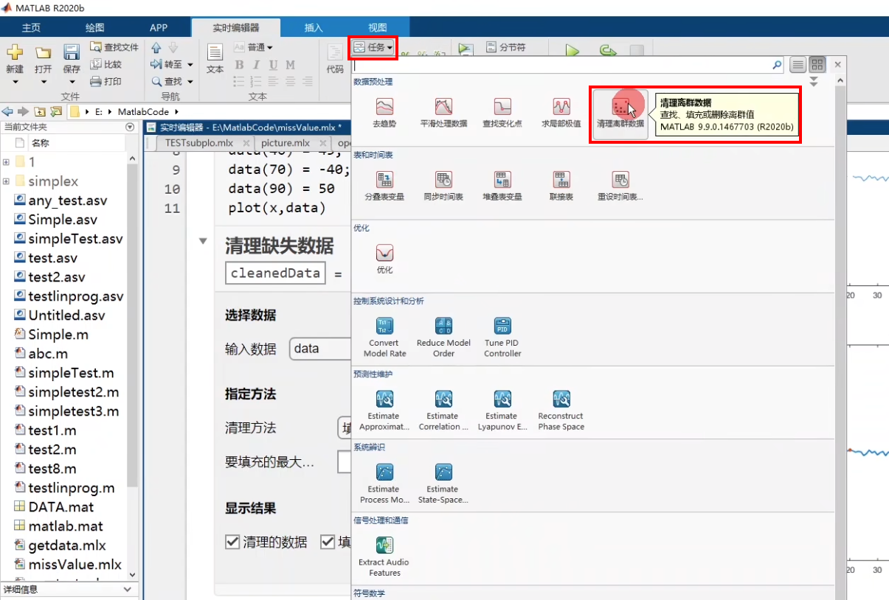  
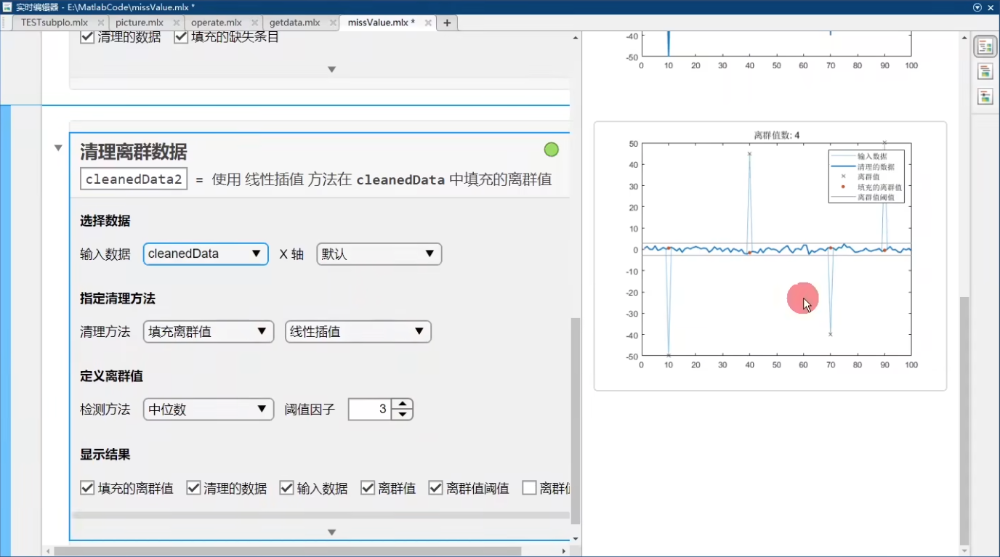  
这里使用的是matlab的工具箱，处理异常值  

