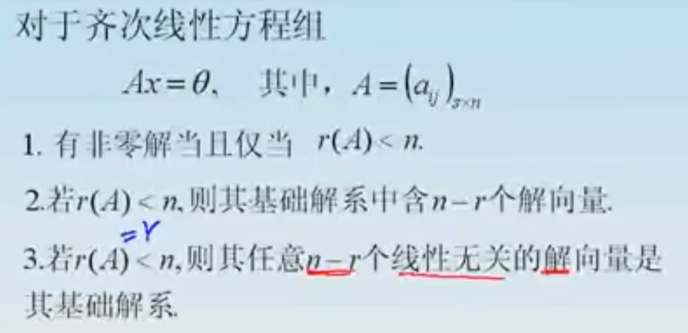
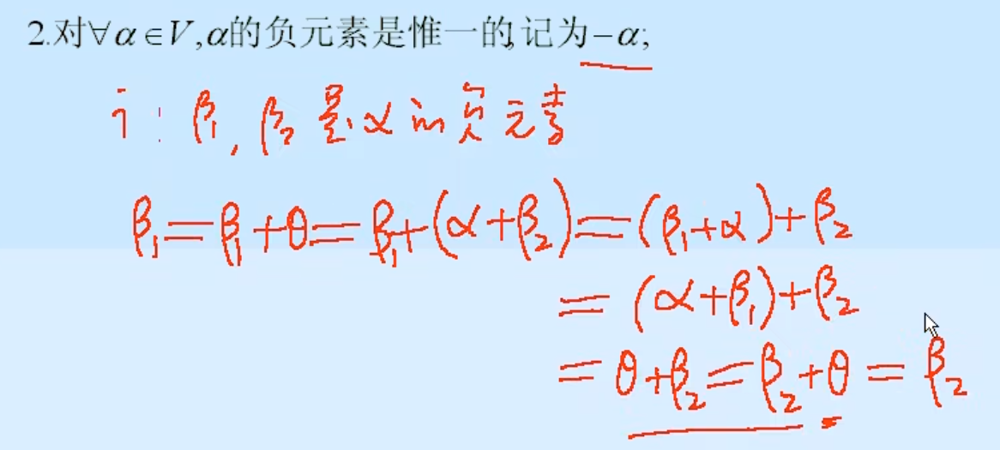
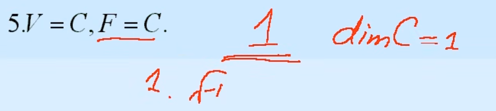
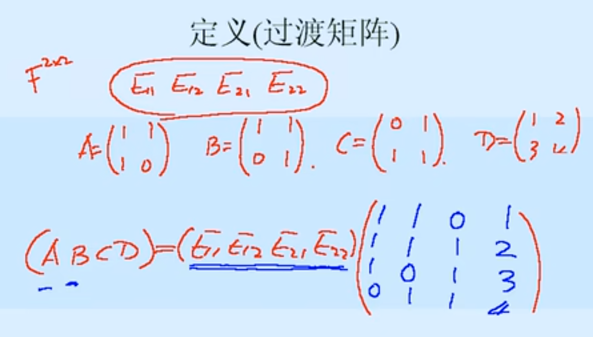
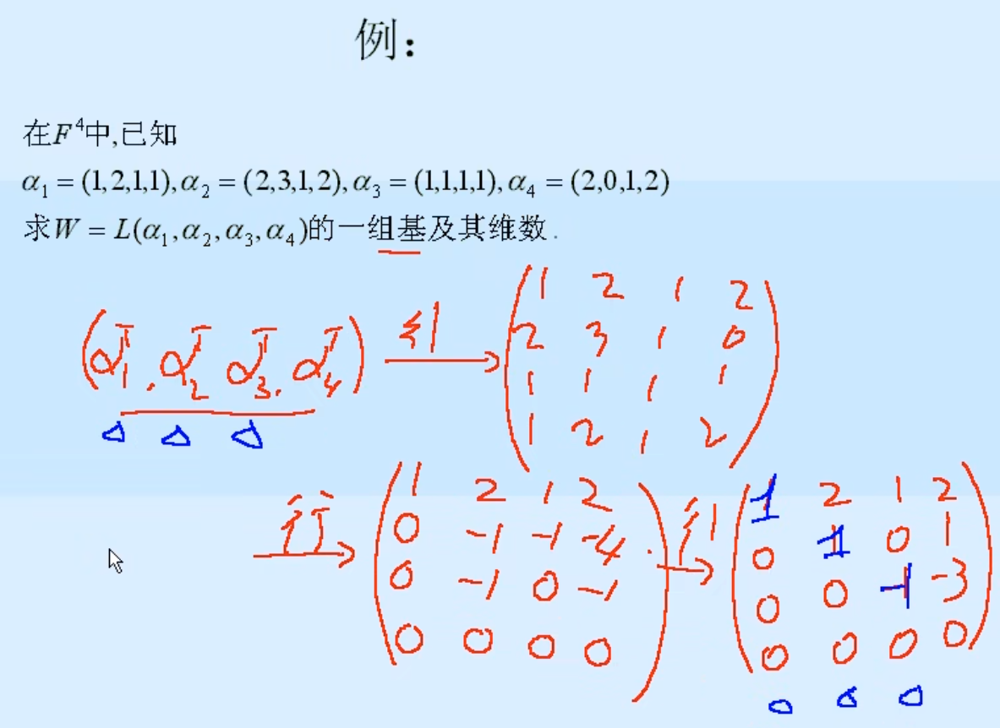
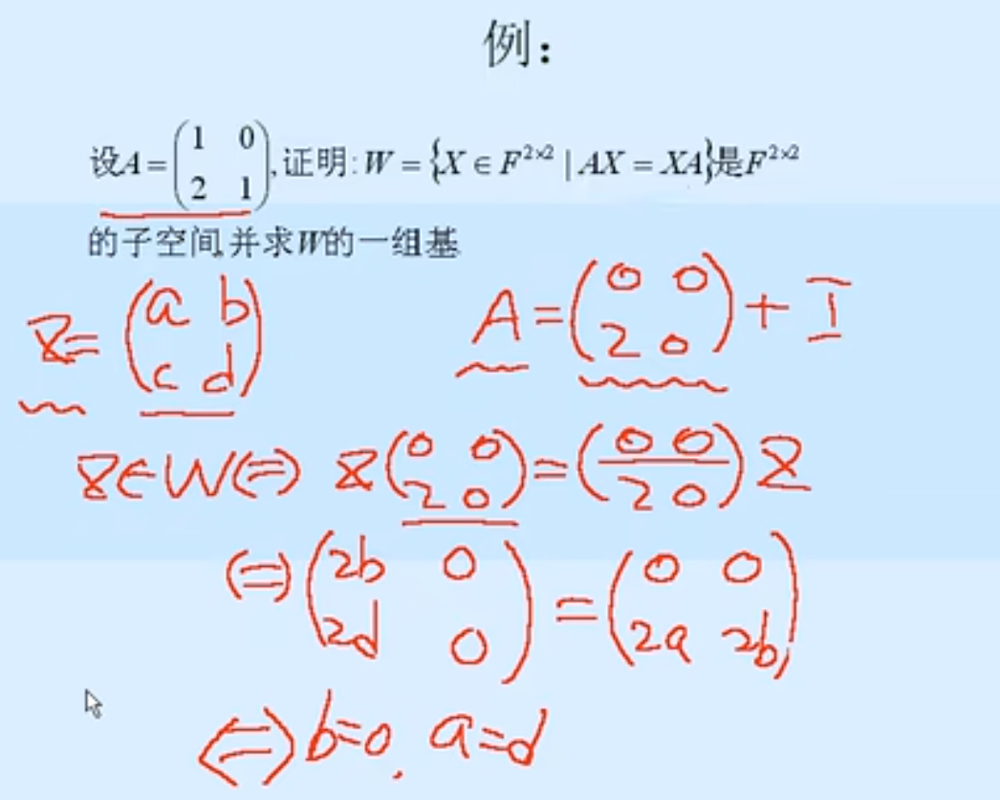

# 视频：[B站](https://www.bilibili.com/video/BV1Mt411k7Rq/?spm_id_from=333.1245.0.0&vd_source=a5f4029436fab3ad44f642e3a69eb1d1)
# 01 复习与引申(1) P001-005
## 矩阵理论
求矩阵A的k次幂，如果A有相似对角阵，则直接利用相似对角阵求解(如上图)。
  
如果没有相似对角阵，则需要找一个简单的但又与A相似的矩阵求解(如下图)。
  

在求矩阵极限时，老师的笔记是这样子的，看不太懂，以后再来看。  
时间：大约P01-25:00  
  
矩阵极限的求解对于求解矩阵函数好像是有帮助的，所以这段可以以后再看。  
时间：大约P01-30:30
  
  
  

如果方程组有解且并不是唯一解，如下图，请问如何恰当地表达图中的矩阵G。
  

# 02 复习与引申(2) P006-024
## 矩阵乘法中应注意的问题
矩阵的乘法中存在这种现象，就是矩阵本身并不等于0，但是想乘后等于0，此时称这连个矩阵为非零零因子。  
  
  

此板书为PDF第8页例题求解过程。其中数量矩阵，指的是设I是单位矩阵, k是任何数,则k*I称为数量矩阵。  
  

平凡差公式不适用于矩阵。  
  

## 分块矩阵的乘法规则

## 一些特殊的分块形式
下图是，A按列分块，B不分块的计算结果。然后这样计算能得到两个结论。  
  
  

若$AB=O$，则$r(A)+r(B)\leq n$，也就是说两矩阵的秩之和，不会超过A的列数，也不会超过B的行数，没懂，以后再看。  
时间：大约P02-43:58  
  
  

下图中是用的分块矩阵来进行证明的，并且使用了数学归纳法。  
  

## 非齐次线性方程组

## 齐次线性方程组的基础解系
下图中红字是基础解系的要求。  
  
  

下图红字为简化阶梯矩阵的要求。
  

其中$A^H$表示为A的共轭转置。  
  

两个证明题，比较难，是借助齐次线性方程组的基础解系来求解的。这里讲解的很清晰，跟之前李永乐讲解的转置的那个差不多。看图片如果回忆不起来，可以再听一遍。  
时间：大约P02-01:10:40  
  
  
  

# 03 复习与引申(3) P025-032
## 向量组的极大无关组及秩
下图为举例，求解极大线性无关组的过程。
  
  
## 矩阵的秩
下图中为证明题过程。不过最下面笔记写错了，应该是$r(A)=r(AB)$。
  

下图中证明小于等于用的是下下张图中的第1个性质，证明大于等于勇的是下下图中的第3个性质。  
  
  

## 矩阵的等价标准形
下图为证明$r(B)=r=r(C)$的过程。  
  

证明满秩分解。但是难点在于找到P和Q。  
  

矩阵B取矩阵A的极大无关组，C为A的每一个列向量，用A的极大线性无关组的组合系数。所以最终导向就是要求矩阵A的极大线性无关组。  
  

满秩分解举例。
  

# 04 线性空间与线性变换(1) P033-042
## 1 线性空间和线性变换
## 1.1 线性空间的定义
## 1.1.1 线性空间的定义
这是苏州大学出版社教材上关于线性空间的定义，注意不光有八条运算法则，还要有两种运算也要满足(运算的结果也要属于原先的空间)：  
  

下图中，其中1-4是针对加法而言，5-6是针对数乘而言，7-8是针对数乘和加法运算而言的。  
  

  
  
其中$F_n[x]$表示关于x的多项式，其中x的系数在$F$中，x的最大次数小于n。
  
  
其中对于第7、8条，V不是F上的线性空间。  
这两个是不满足数乘运算，即$\forall k\in F,\alpha \in V$时，$k\alpha \notin V$。  
  
  
注意，这里新定义的运算，是针对线性空间V的，对于数域F上的元素，加法还是普通的加法。比如说下下张图中的$(k+l)$就是简单的相加运算。
  
  

## 1.1.2 线性空间的性质
这里是证明零向量唯一，他是假设了如果存在两个零元素，然后这两个零元素一定相等。  
  
证明负元素唯一。  
  
  
这里应该是写错了，应该是$x=\beta-\alpha$。  
  
这里用的应该是结合律。  
  
这里的 $\theta$ 表示0向量。  
  

## 1.2 基、维数和坐标
## 1.2.1 基、维数和坐标
这里是一个例子，证明4个矩阵线性无关。并且这里确实是无关的。  
  
这个例子是求证$\alpha1$、$\alpha2$、$\alpha3$的关系，这里使用的证明方式在线性代数中很常见，就是通过假设常数的方式，然后分别求解k1、k2、k3是否有非零解。  
  
在这个例子中$\alpha1$、$\alpha2$线性无关。  
  
这里对于第4个例子，他与第3个例子不同的地方就在于数域不同，但是第4个例子中的$\alpha1$、$\alpha2$是线性相关的，因为当$a=1，b=i$时，是符合条件的。  
  
这里是老师补充了一个例子，要求是：证明当$V=R^+,F=R$时，$\alpha=2,\beta=3$，二者线性相关。  
  

# 05 线性空间与线性变换(2) P043-053
## 1.2.2 定义(基，维数)
由定义可见，维数就是基的个数。  
  

下图中，对于$V={\theta}$这个空间，只有一个0元素，所以基不存在，因为该线性空间中不存在线性无关的向量。  
对于$V=F[x]$这个空间，x的次方可以取无限大，所以其中维数也是无限的，则其基不存在。  
但是在这门课中，不考虑无限维的情况。  
  

下面是6个例子，分别找出他们的基：  
这个例子中讲解的是，对于$V=F^n$，最简单的基。也称为自然基。
  
这里例子中展示的是，对于$V=F^{2\times2}$，最简单的基。
  
这里例子中展示的是，对于$V=F_n[x]$，最简单的基。
  
对于复数空间，可以用1和i来作为基。为什么是这样，可以联想x轴为实数轴，y轴为虚数轴的坐标系。
  
对于复数空间V，数域F也是复数的情况，V中1和i是线性相关的，所以其基为1，维数为1。
  
这里的$V=R^+,F=R$，其中$\oplus$和$\circ$运算是自定义的，对于这种情况。基不能是1，因为前面证明过，1是这个空间中的0元素。前面也证明过，这个空间中，采用$\oplus$和$\circ$这两种运算，其他任意实数之间也是可以相互线性表示的，所以可以找个最简单的实数，2，作为其基。  
  
  

这里老师想要证明的是，在V中任意一个向量$\eta$，都可以用它的基来表示。这里板书是通过使用两条定理来证明。
  
如何证明$\beta,\alpha_1,\alpha_2,\cdots,\alpha_n$线性相关，这里使用的是下下张图中的定理。
  
  

这是个证明题，但是有两种证明方法：  
第一种，先证明$f_1,f_2,f_3$三者线性无关，然后再证明$F_3[x]$中的任意一个向量都可以用$f_1,f_2,f_3$三者来表示。  
  
第二种，直接用上面的定理，先证明$dimF_3[x]=3$，然后再证明$f_1,f_2,f_3$三者线性无关，再根据定理，即可证明$f_1,f_2,f_3$这三个向量可以构成一组基。  
  
  

## 1.2.3 定义(坐标)
注意，在线性空间中基是有顺序的，如果顺序如图一样颠倒了，那么坐标表示也会被颠倒。  
  
  

其中定理1是很显然的。前者$\eta=\theta$表示的是在抽象线性空间中的0向量。后面的$X=\theta$则表示在这个抽象的线性空间中，$\eta$如何通过该线性空间中的基$\alpha_1,\alpha_2,\cdots,\alpha_n$坐标表示。也就是说$X$就是我们在线性代数中所理解的坐标$(0,0,\cdots,0)$。  
  
定理2，老师在视频中证明了充分性，通过举例，由$\eta=k_1\eta_1+k_2\eta_2$推导出$X=k_1X_1+k_2X_2$。
  
为什么要有基和坐标这样的概念，是因为可以方便的将抽象线性空间$V$下的向量关系转化为$F^n$下的坐标的关系。这种其实放在之前的线性代数中很好理解，因为在之前的线性代数中，向量就是用坐标来表示的，向量的线性相关等关系就是通过坐标来体现的。  
  

这里例子里用的就是上述定理，将判断向量的线性相关性，转化成了判断坐标的线性相关性。  
  
这个例子里也是利用了上述定理，将2x2的矩阵转化成了坐标，然后对应坐标的极大无关组也就是对应矩阵的极大无关组。  
  

# 06 线性空间与线性变换(3) P054-070
## 1.2.4 形式记号
形式记号，下图就是下下张图中的推导。这里的$\alpha$只是一种表示方式或者说形式记号，可能有很多种形式，各种向量空间的基，表示方式都不太一样。  
  
  

## 1.2.5 形式记号的性质
下边是三组向量表示关系的简单转化推导。  
  
  

这里是一个命题的充分性和必要性证明  
先证明充分性(用的是反证法)：  
  
再证明必要性(先假设了一个$X$，使得$(\beta_1,\beta_2,\cdots,\beta_n)X=\theta$)：  
  

## 1.2.6 定义(过渡矩阵)
  

这里是两个例子，从自然基到新的基的过渡矩阵。  
  
  

## 1.2.7 过渡矩阵的性质
下面这道题，就不再是求自然基到其他基的过渡矩阵了，而是求两个非自然基之间的过渡矩阵。此时如果直接解方程组死算会很麻烦，但是这里可以使用过渡矩阵的性质。这样就可以计算得，从$\alpha$到$\beta$过渡矩阵就是$A^{-1}B$。  
  

这里是对下面得到的两个公式的一个证明。  
  
这道例题是利用上面的坐标变换公式来计算在新基下的坐标。  
  

## 1.3 子空间 交与和
## 1.3.1 子空间 交与和
这里红色字迹是举了一个例子，虽然下方的运算$\oplus$和$\circ$也能在$F=R$上构成线性空间，但是并不能说W是V的子空间，因为下方的运算是$\oplus$和$\circ$，而上方的运算是正常的$+$和$\bullet$。运算不一样，也不能算是子空间。  
  
  

如果要验证非空子集W是否为V的子空间，只需要验证4条：  
1. 是否满足加法封闭(这里说的封闭就是相加后的结果依旧属于W)
2. 是否满足数乘封闭(这里说的封闭就是数乘后的结果依旧属于W)
3. 是否满足八条法则中的第三条，即0元素也要属于W
4. 是否满足八条法则中的第四条，即负元素也要属于W  

为什么八条运算法则只需要验证三和四，因为其他的运算法则用不到线性运算，在V中成立的，在W中也一定成立。  
  
 

但是上述的验证条件还可以简化，只需要满足前两个即可：  
1. 是否满足加法封闭(这里说的封闭就是相加后的结果依旧属于W)
2. 是否满足数乘封闭(这里说的封闭就是数乘后的结果依旧属于W)  

为什么？下张图中老师进行了证明，因为只要满足数乘，通过乘以0元素和-1就可以发现，0元素和负元素都属于W。  
讲解见视频：P6-45:06
  
这里的线性运算就是指加法和数乘。  
  

0元素和V本身都可以叫V的子空间。这两个空间又可以被称为平凡子空间。  
  

对于下图中的$V_1$，不是$R^3$的子空间，因为如果取$\alpha=(\frac{1}{3},0,0)\in V_1$，则$2\bullet\alpha=(\frac{2}{3},0,0)\notin V_1$，所以不满足数乘运算封闭性。当然，还有一个更简单的验证方式，只需要验证0元素是否属于$V_1$即可。这里很显然不属于，因为0带入不成立。  
而对于$V_2$则一定是子空间，因为很容易验证加法和数乘成立。验证加法，就是两个一样的式子相加后依旧为0。验证数乘就是将等式两边同时乘以一个数，然后等式右边也是0。这两种验证方式，等式都是成立的。  
  
对于这两种子空间，可以很明显的发现，如果等式右边为0，或者该方程对应的平面经过原点，则该子空间是$R^3$的子空间。  
  

## 1.3.2 两类重要的子空间
对于这种齐次线性方程组的解空间，他的基就是他的基础解系，维数就对应了$n-r(A)$。$n-r(A)$实际上也就是基础解系的秩。  
  
对于这种，我的理解，$\alpha_1,\alpha_2,\cdots,\alpha_s$是$V$中的部分向量(但是这部分向量不一定是$V$的极大无关组，因为这里不是要求$V$的基)。  
  

这里的$\alpha_j$就是指$W$的**生成元**。  
  
对于下面这个命题的证明。证明充分性，老师用的是第一条命题的结论。证明必要性，老师是分别证明$L(\alpha_1,\alpha_2,\cdots,\alpha_s)\subseteq L(\beta_1,\beta_2,\cdots,\beta_t)$和$L(\alpha_1,\alpha_2,\cdots,\alpha_s)\supseteq L(\beta_1,\beta_2,\cdots,\beta_t)$。视频讲解：P06-1:01:20  
  
第三条命题应该显而易见，证明见视频讲解：P06-1:04:25  
  

这个例题应该很简单。  
  

这里将ABCD矩阵转换成对应的坐标，求出对应坐标的极大无关组就是W的基。  
  

这里例子中，老师几乎是用观察法得到的，然后再证明矩阵$A$和$B$是不是基。  
  

证明是子空间，只要证明加法封闭，数乘封闭即可。
1. 证明加法封闭就是证明$X_1+X_2\in W$，因为$W=\{X\in F^{2\times2}|AX=XA\}$，所以只需要证明$X_1+X_2$与$A$可交换，就说明$X_1+X_2\in W$。
2. 证明数乘封闭就是在$AX=XA$两边同乘$k$，所以一定是满足的。

  
这里是将A矩阵拆成了$\begin{pmatrix}
0 & 0 \\
2 & 0
\end{pmatrix}$和一个单位矩阵相加，因为单位矩阵跟谁都是可交换的，所以只要验证$\begin{pmatrix}
0 & 0 \\
2 & 0
\end{pmatrix}$与A可交换就可以了。  
这里相当于是使用了待定系数法，将$X$中各个位置的代数关系确定好，然后再利用观察法同上面的例子一样，得到$W$的基。  
  
  

# 07 线性空间与线性变换(4) P072-
## 1.3.3 子空间的交与和
在平面上，如果直线经过坐标原点，也构成子空间。相应的，如果空间中的平面经过平面也构成子空间。  
下图中的$V_1\bigcup V_2$，不是平面的子空间，因为$V_1\bigcup V_2$加法不封闭，也就是说在$V_1$和$V_2$上分别取一个向量，但是相加后的结果，并不落在$V_1\bigcup V_2$上，所以加法不封闭，不是子空间。  
  

交与和是有区别的，和比交更大，并且包含了交。  
  

这里是在证明这个命题的正确性，如图老师笔记，是证明了左边包含于右边。  
  

## 1.3.4 维数定理
  

如图所示，对于$V_1$和$V_2$的基可以直接观察法得到，维数自然也就能得到了。
  
这里老师几乎是用观察法来求$V_1\cap V_2$的具体表达式，然后根据式子$V_1\cap V_2=\left \{ \begin{pmatrix} x & x \\ -x & -x \end{pmatrix} |\ x\in F \right \}$又可以观察出来其基为$\begin{pmatrix} 1 & 1 \\ -1 & -1 \end{pmatrix}$，所以维数就是1维。  
视频：P7-13:22
  

这道题中如果是计算$V_1+V_2$的基和维数，就直接将$\alpha_1,\alpha_2,\beta_1,\beta_2$四个向量组合成一个矩阵，然后算极大线性无关组即可。如果是计算$V_1\cap V_2$的基，就需要列式$\eta=k_1\alpha_1+k_2\alpha_2=l_1\beta_1+l_2\beta_2$，此时就看$k_1\alpha_1+k_2\alpha_2=l_1\beta_1+l_2\beta_2$有几种类型的组合，因为这里方程$k_1\alpha_1+k_2\alpha_2-l_1\beta_1-l_2\beta_2=0$的基础解系只有一个，所以也就是说$k_1\alpha_1+k_2\alpha_2=l_1\beta_1+l_2\beta_2$只有一种类型的组合，也就是说$\eta=k_1\alpha_1+k_2\alpha_2=l_1\beta_1+l_2\beta_2$中的$\eta$也就只有一种，所以$V_1\cap V_2$的基也就只有一个，维数也就是1。当然这里$V_1\cap V_2$的维数也可以用维数定理来算，也就是$dim(V_1\cap V_2)=dimV_1+dimV_2-dim(V_1+V_2)$，计算得$dim(V_1\cap V_2)=2+2-3=1$。
  
  

这道题计算$V_1\cap V_2$的基和维数比较简单，这里要算的$\eta$就是$V_1\cap V_2$中的，相当于既要满足$A\eta=\theta$，又要满足$B\eta=\theta$。这里直接将矩阵A和B纵向组合成一个大的矩阵，然后解方程组就可以了。相当于就是求公共解。  
如果是计算$V_1+V_2$的基和维数，就要分别计算$V_1$和$V_2$的生成元，然后再通过上一题类似的方式，将所有生成元组合成一个矩阵，然后算极大线性无关组。  
  

## 1.3.5 直和
  
老师这里是想通过1推出2，2再推出3，3推出4，4推出3，3推出1。
  

其中1为什么能推出2？是因为，根据直和定义，只要满足1，那么2就一定满足，因为表示唯一，包括0向量表示也唯一。  
  
其中2为什么能推出3？假设$\eta\in V_1\cap V_2$，那么也就显然$\eta\in V_1$，如果要表示0向量，就要找一个$-\eta\in V_2$，但是因为2中说了，0向量表示唯一，也就是说$\eta$只能是0向量了。  
  
其中3为什么能推出4？是利用的维数定理，很显然。$dim(V_1+V_2)=dimV_1+dimV_2-dim(V_1\cap V_2)$，其中$dim(V_1\cap V_2)=0$。  
同理4推出3，也是维数定理。  
其中3为什么能推出1？这里老师的做法很巧妙。见下图中绿框部分。  
视频讲解：P07-34:57  
  
其中4为什么能推出5？这里很显然，然后老师也就没有讲。  
至于如何判断两个子空间的和空间是不是直和，用的最多的是第3个和第4个条件。  
  

在这个例子中，最终要证明的是$F^{n\times n}=V_1\oplus V2$，然后这个证明可以拆解成两个证明过程，第一个是证明$V_1+V_2$是直和，第二个是证明$F^{n\times n}=V_1+V_2$。  
视频讲解：P07-39:10  
其中证明$V_1+V_2$是直和，直接用的是题目中的条件。  
证明$F^{n\times n}=V_1+V_2$，就是要证明$F^{n\times n}\subseteq V_1+V_2$和$F^{n\times n}\supseteq V_1+V_2$。其中$F^{n\times n}\supseteq V_1+V_2$是显然成立的，然后证明$F^{n\times n}\subseteq V_1+V_2$，也就是说，只要证明任意一个$n\times n$的矩阵，都可以写成对称矩阵和反对称矩阵的和。至于这个对称矩阵和反对称矩阵分别是什么，见下图中红框部分。红框中的左边是对称阵，右边是反对称阵。  
  

视频讲解：P07-41:23  
  

## 1.3.6 多个子空间的直和
  
下面两张截图要说明的是对于等价的第三个条件，如果改成下图中下方的红圈部分，是不行的，因为两两相交为零向量的条件不够强。老师用三维空间中的直角坐标系举了一个例子，可以看到如果仅仅满足两两相交为零向量，并不是直和。
讲解：P07-46:30  
  
  

# 08 线性空间与线性变换(5)

# 09 线性空间与线性变换(6)

# 10 内积空间、等距变换(1)

# 11 内积空间、等距变换(2)

# 12 矩阵的相似对角性(1)

# 13 矩阵的相似对角性(2)

# 14 矩阵的相似对角性(3)

# 15 矩阵的相似对角性(4)

# 16 矩阵的相似对角性(5)

# 17 Hermite二次型(1)

# 18 Hermite二次型(2)

# 19 Hermite二次型(3)

# 20 范数及矩阵函数(1)

# 21 范数及矩阵函数(2)

# 22 矩阵的广义逆
