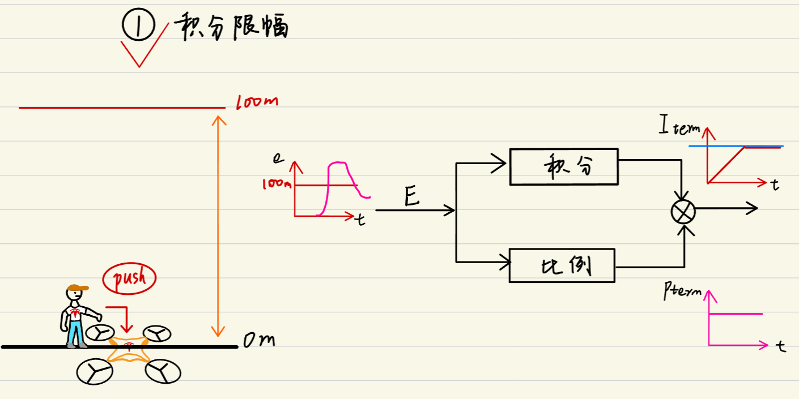
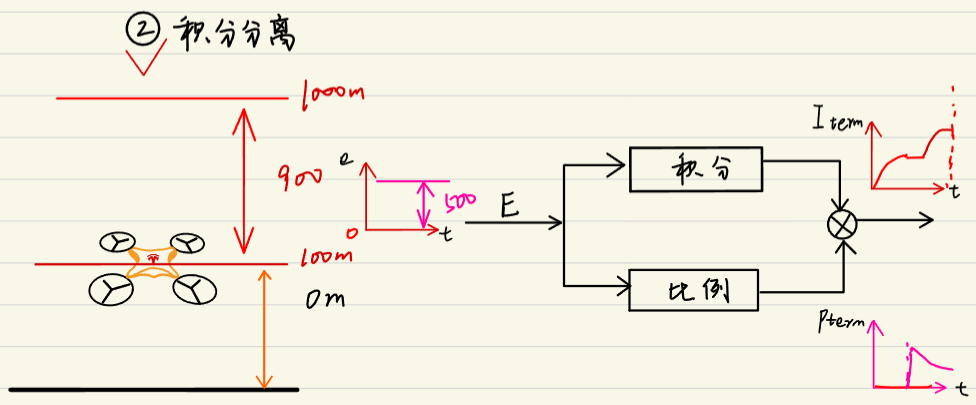
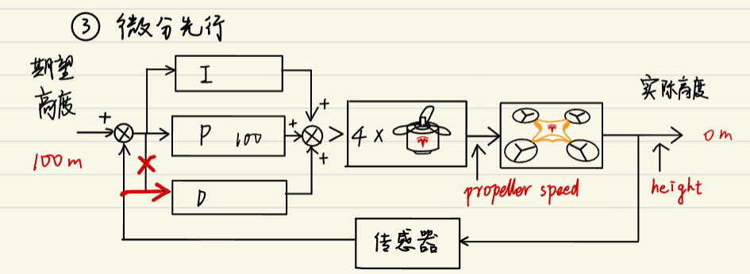

# 02
## 参数整定(PID怎么调)
1. 先调节$K_p$，由小到大，当静态误差很小时确定$K_p$值
2. 再从小到大增加$K_i$，缩小静态误差，如果响应要快，可以继续增大$K_i$，此时可能会出现超调
3. 如果出现超调，就调节$K_d$，但是不可过大，防止响应时间过长（一般系统只有$K_p$和$K_i$，如果系统震荡很大，就调节$K_d$）

## 相关控制知识
### 积分限幅
  
当积分累计到一定值后，为了避免系统突然过大的超调，就不再继续往上升了。  

### 积分分离
  
当误差突然变大，并且超过某个值，为了避免过大的超调，此时积分不起作用，积分作用部分直接等于0。

### 微分先行
  
微分先行是为了避免输入突变对$K_d$的影响。