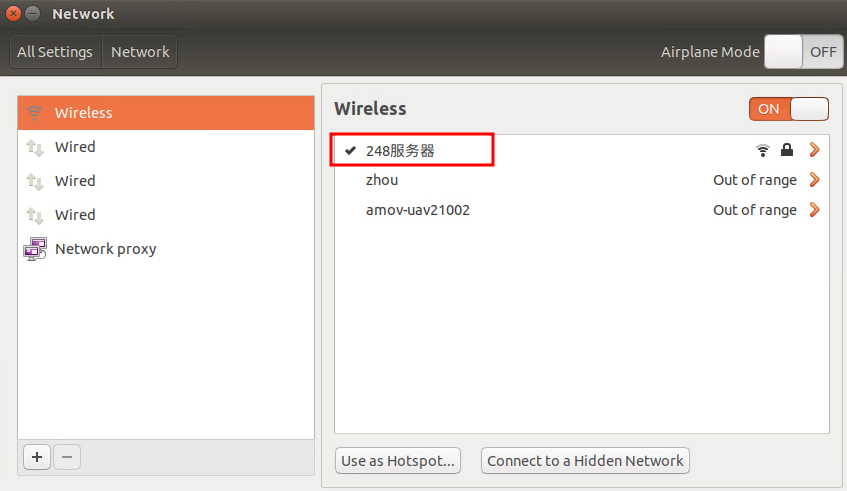
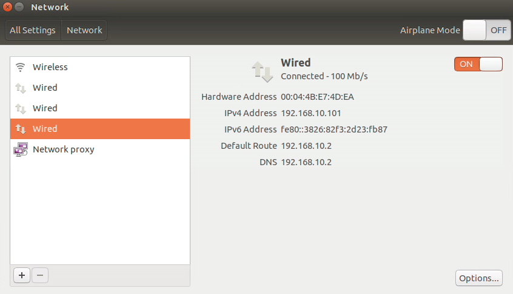

[P450使用手册](https://docs.amovlab.com/prometheuswiki/#/src/P450%E4%BD%BF%E7%94%A8%E6%89%8B%E5%86%8C/%E9%A6%96%E6%AC%A1%E9%A3%9E%E8%A1%8C%E5%AE%A4%E5%A4%96)  
[室外试飞教程](https://www.bilibili.com/video/BV1AS4y1C7Me/?spm_id_from=888.80997.embed_other.whitelist&t=299&vd_source=a5f4029436fab3ad44f642e3a69eb1d1)

# 电池
  
  
1. 图上标志的14.8V表示标称电压，4S表示是四节小电池，也就是$4.2\times 4=16.8$
2. 电压不能低于$3.6\times 4=14.4$，否则过放损伤电池
3. 可以充满电，是16.8V
4. 电池长期不适用，要将电量充到70%-80%，大概就是16（=14.4+(16.8-14.4)*0.7）V

# 无人机
1. 没有开关，直接连接电源即可

# 遥控器
1. 遥控器上面的四个开关全部拨到最上面，然后同时长按两个电源键开机
2. 遥控器右上角txt表示遥控器电源
3. 左摇杆内八解锁，往下再外八就是上锁
4. 四个开关中最右边的一个往下打是自动控制，往上是手动控制
5. 四个开关中最右边倒数第二个开关，最上的是stabilize飞行模式(自稳模式)，飞行难度高，适用于专业飞手，可灵活调整无人机姿态；中间是position(定点模式)，无人会自动定点稳定飞行，飞手只需要调整位置即可，适用于新手；最下的是land模式(自动降落)，不敢手动降落，就直接将此开关调至最下，然后无人机会自动降落
6. 初次将无人机从stabilize模式调至position模式时，不一定能立马成功(可能会进入altitude模式，定高不定点)，可以反复尝试，以进入position模式
7. 飞行模式设置：[飞行模式设置](https://www.bilibili.com/video/BV1Hq4y1o7Dt?p=6&vd_source=a5f4029436fab3ad44f642e3a69eb1d1)
# QGC
1. 长时间不使用，或者经过长途运输后，起飞前最好校准一下，无人机有时候无法起飞或者飞起来飘来飘去大部分是因为没有校准(校准-视频位置13:34)
2. 按照教程上设置就可以，室外飞行一定要切换成设置GPS数据定位，如果修改参数了，一定将无人机重启一下，并在QGC中重启飞控，然后确定无人机连接的GPS卫星数量，最好是进入3D GPS Lock状态

# nomachine
[使用方法](https://docs.amovlab.com/prometheuswiki/#/src/P450%E4%BD%BF%E7%94%A8%E6%89%8B%E5%86%8C/%E9%A6%96%E6%AC%A1%E9%A3%9E%E8%A1%8C)
1. 无人机板载计算机ip:192.168.10.101
2. 用户名和密码都是:amov

# 飞行
1. 第一次解锁建议不带桨叶(是为了后续看下无人机电机能否正常运动)，并且第一次解锁会安全报警，这时需要QGC将无人机的飞控再次重启一下才可以正常使用
2. 解锁后操作遥控器，电机能正常运转，此时就可以将无人机再次上锁，准备正式飞行。
3. 系上安全绳，装上桨叶
4. 内八解锁后，推动摇杆左滑到正下方并上推起飞

# 相机
1. 启动指令：
   ```bash
   # 打开相机并获取图片
   cd ~/Prometheus
   source ./devel/setup.bash
   roslaunch prometheus_detection web_cam0.launchA
   # 重开一个终端并观察图像
   rqt_image_view
   ```

# WiFi
1. 既可以通过数传WiFi连接机载计算机，又可以通过其他热点连接机载计算机，因为机载计算机与数传WiFi是通过有线连接的，并且分配的IP地址是192.168.10.101，所以无论机载计算机与数传WiFi是否通过无线连接，都可以通过数传WiFi这个局域网，连接到机载计算机。  
  
  

# 步骤
1. 检查电池电量，电压表测量14.4V-16.8V之间是正常电压
2. 连接无人机电池
3. 遥控器上面的四个开关全部拨到最上面，然后同时长按两个电源键开机，观察遥控器电量
4. 连接无人机WiFi，QGC连接无人机，观察QGC是否可以正常显示无人机的姿态和航向(12:10)
5. **第二次跳过**：校准无人机传感器，之前校准过后就不用再校准了
6. **第二次跳过**：在QGS中设置无人机的定位数据来源，设置完需要在QGS中重启飞控，如果之前已经设置了，就不用设置和重启了
7. 静置无人机并等待确认GPS卫星数量，最好有12颗以上的卫星，并进入3D GPS Lock状态
8. 将遥控器倒数第二个开关拨到中间档位，进入position模式，观察QGS是否成功进入，如果进入失败，就反复进入，如果还是无法进入，就插拔无人机电源，重启再尝试
9. 第一次解锁建议不带桨叶，将遥控器左摇杆内八解锁，如果解锁触发安全报警，就通过QGC将无人机的飞控再次重启一下，重启后需要重新等待GPS卫星连接，然后再解锁
10. 无人机解锁后3-5秒不起飞，会自动上锁。测试电机是否正常转动，测试正常后上锁
11. 系上安全绳，安装桨叶(注意有白点的叶片安装到有白点的点击上)
12. 第一次解锁起飞，遥控器慢慢推，飞行时尽量避免突然减速，避免自锁桨叶飞掉
13. 遥控器倒数第二个开关拨到最下land模式(自动降落)，然后无人机会自动降落

## 遥控飞行简易步骤
### 电池
1. **无人机电池**：检查电池电量，电压表测量14.4V-16.8V之间是正常电压，连接无人机电池
2. **遥控器电池**：遥控器上面的四个开关全部拨到最上面，然后同时长按两个电源键开机，观察遥控器电量
### 连接
1. **QGC GPS**：连接无人机WiFi，QGC连接无人机，确认GPS卫星数量，最好有12颗以上的卫星，并进入3D GPS Lock状态
2. **遥控器position模式**：将遥控器倒数第二个开关拨到中间档位，进入position模式，观察QGS是否成功进入，如果进入失败，就反复进入
### 飞行
1. **安全准备**：系上安全绳，安装桨叶(注意有白点的叶片安装到有白点的电机上)
2. **解锁飞行**：将遥控器左摇杆内八解锁，慢慢加油门，飞行时尽量避免突然减速，避免自锁桨叶飞掉
3. **降落**：遥控器倒数第二个开关拨到最下land模式(自动降落)，然后无人机会自动降落

## Aruco码定点降落简易步骤
### 电池
1. **无人机电池**：检查电池电量，电压表测量14.4V-16.8V之间是正常电压，连接无人机电池
2. **遥控器电池**：遥控器上面的四个开关全部拨到最上面，然后同时长按两个电源键开机，观察遥控器电量
### 连接
1. **QGC GPS**：连接无人机WiFi，QGC连接无人机，确认GPS卫星数量，最好有12颗以上的卫星，并进入3D GPS Lock状态
2. **遥控器position模式**：将遥控器倒数第二个开关拨到中间档位，进入position模式，观察QGS是否成功进入，如果进入失败，就反复进入
### 飞行
1. **安全准备**：系上安全绳，安装桨叶(注意有白点的叶片安装到有白点的电机上)
2. **输入指令**：
    - **二维码降落**：
      - 无人机
        - `roslaunch p450_experiment p450_gps_onboard.launch`(启动MAVROS和姿态检测)
        - `roslaunch p450_experiment p450_cam.launch`(打开相机)
      - 笔记本
        - `roslaunch prometheus_detection landpad_det.launch`(检测图像)
          - `roslaunch prometheus_detection yolo_det.launch`(检测图像)
        - `rqt_image_view`(观察相机图像)
          - `rostopic echo /prometheus/object_detection/landpad_det`(打印二维码实时检测结果)
        - `roslaunch p450_experiment p450_outdoor_landing_rec.launch`(**运行此指令后先解锁并输入1，再切换至offboard**)
      - 意外情况：如果此时无人机无法启动相机检测，可以执行一下指令，打开检测
        - `rostopic pub /prometheus/switch/landpad_det std_msgs/Bool "data: true"`
    - **指点飞行**：
      - 无人机
        - `roslaunch p450_experiment p450_gps_onboard.launch`(启动GPS)
        - `roslaunch p450_experiment p450_gps_control.launch`(0 4 0 1 然后输入坐标)(这个指令要在nomachine输入)
3. **解锁飞行**：将遥控器左摇杆内八解锁
4. **遥控器offboard模式**：将遥控器倒数第二个开关拨到下档位，进入offboard模式
5. **降落**：根据程序无人机会自动降落
### 需要测试的
1. 无人机能否识别二维码并自动降落
2. 遥控器从offboard模式切回来，能否正常接管飞机飞行(切回手动模式后，立马将油门往下轻推)

# 注意
1. 尽量不要占用数传WIFI通过ssh传输文件，或者ROS传输图像，不然飞机遥控器会一直警报滴滴滴的声音，不知道为什么。有可能是飞控本省的bug，就是WIFI数传与遥控器最终会汇总到一个总线，数传WIFI过多的占用总线资源，遥控器就会报警。

# 拍摄脚本
## 场景一 草地
1. 实验开始时将所有的道具都拍摄一遍
2. 手机相机对准电脑
3. 打开飞机相机`roslaunch p450_experiment p450_cam.launch`
4. 打开检测图像的程序但是不检测`roslaunch prometheus_detection landpad_det.launch`
5. 船给飞机发送启动信号，飞机从二维码平台起飞，此时飞机不检测二维码
6. 飞机起飞，检测到船，并飞到船正上方
7. 运动途中放上AUV，后面数据集训练好后，做目标检测识别，此时船和飞机都要能检测到AUV
8. 检测到AUV后，船和飞机上传回来的图像都要有警报显示(通过opencv在图像中间加文字的警报信息)
9.  巡逻结束后，船入坞，当船上相机检测到坞舱内二维码，并与二维码的距离在1米以内时，船上传回来的图像，显示飞机降落
10. 船自动给飞机发送降落信号，此时飞机上的相机可以检测到二维码(意外情况`rostopic pub /prometheus/switch/landpad_det std_msgs/Bool "data: true"`)
11. 飞机检测到二维码并降落

## 场景二 湖边
1. 实验开始时将所有的道具都拍摄一遍
2. 手机相机对准电脑
3. 船启动，并ssh打开船的相机`bash camera.sh`
4. 本地启动船的检测`bash aruco.sh`
5. 船开一圈回来，能正常检测到二维码后入坞即可