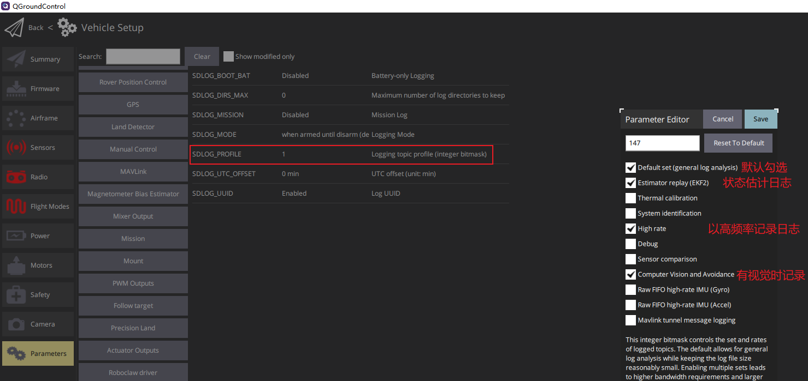

# pixhawk2.4.8使用记录
## 烧录固件
### 参考博客
[烧录固件](https://blog.csdn.net/Maker_pace/article/details/118712434)
### 总结步骤
1. 烧录固件可以问卖飞控的淘宝客服直接要
2. 先打开飞控软件，来到固件固件的菜单栏
   
3. 通过USB连接飞控和电脑，会自动跳出右边的菜单栏，然后选择 高级设置 并选择 自定义固件文件 ，然后点击确定，并选择需要安装的固件文件。飞控就会自动安装固件。
   
4. 烧录完成后会提示升级完成，稍等几秒，QGC就会跳转到飞控正常使用的界面
   
   
## 测试pixhawk与MavROS通信
### 参考博客
[测试px4与mavros通信](https://blog.csdn.net/weixin_43296222/article/details/103778476?ops_request_misc=&request_id=&biz_id=102&utm_term=%E6%B5%8B%E8%AF%95px4%E4%B8%8Emavros%E9%80%9A%E8%AE%AF&utm_medium=distribute.pc_search_result.none-task-blog-2~all~sobaiduweb~default-7-103778476.142^v100^pc_search_result_base4&spm=1018.2226.3001.4187)  
[测试px4与mavros通信](https://blog.csdn.net/weixin_65733623/article/details/130695966?ops_request_misc=%257B%2522request%255Fid%2522%253A%2522171297182916800225543502%2522%252C%2522scm%2522%253A%252220140713.130102334..%2522%257D&request_id=171297182916800225543502&biz_id=0&utm_medium=distribute.pc_search_result.none-task-blog-2~all~top_click~default-2-130695966-null-null.142^v100^pc_search_result_base4&utm_term=mavros&spm=1018.2226.3001.4187)  
[测试apm与mavros通信](https://blog.csdn.net/qq_42994487/article/details/135655473)
### 总结步骤
1. 安装mavros，有两种方式：
   - 二进制安装：
     ```bash
     sudo apt update
     sudo apt install ros-${ROS_DISTRO}-mavros ros-${ROS_DISTRO}-mavros-extras
     # 能成功cd到mavros文件夹中就说明安装成功
     roscd mavros
     ```
   - 源码安装：[Ubuntu 18.04下MAVROS源码安装实战教程](https://cloud.baidu.com/article/3285498) (注：未实践过，可自行百度尝试)
2. 安装GeographicLib(安装这个库，其实也是安装mavros的一部分，之所以单独列出来，是因为这个库的安装可能会有问题)，两种安装方式：
   - 官网安装(安装前提是要科学上网，并且安装过程很慢，在安装过程中会好像卡住，其实是正在安装，静候即可)：
     ```bash
     wget https://raw.githubusercontent.com/mavlink/mavros/master/mavros/scripts/install_geographiclib_datasets.sh
     sudo chmod 777 ./install_geographiclib_datasets.sh
     # 执行下面的安装脚本会自动安装到/usr/share路径下
     sudo ./install_geographiclib_datasets.sh
     ```
   - 从已经安装好的电脑上复制过去
     ```bash
     # 先提升到root用户
     sudo su
     # scp远程复制 如果提示权限不够就先复制到普通用户目录然后再复制到/usr/share
     scp -r shuai@192.168.1.xxx:/usr/share/GeographicLib /usr/share
     ```
3. 将Pixhawk通过USB连接到电脑，打开QGC地面站(这里注意串口都是使用的pixhawk2.4.8上的TELEM 2)
   - PX4设置以下参数(一开始参数里可能只有MAV_1_CONFIG，而搜不到另外两个参数，只需要先把MAV_1_CONFIG设置为TELEM 2，然后把飞控重启后就有了):
     - MAV_1_CONFIG= TELEM 2
     - MAV_1_MODE = Onboard
     - SER_TEL2_BAUD = 921600 8N1
   - APM设置以下参数:
     - SERIAL2_BAUD = 921600（如果通信失败则适当降低波特率为 460800）
     - SERIAL2_PROTOCOL = MAVLink2
4. 硬件连接，连接TELEM 2与板载计算机串口(参考：[青云硬件电路图](https://qingyun-docs.readthedocs.io/zh/latest/01%E7%A1%AC%E4%BB%B6%E4%BB%8B%E7%BB%8D.html))
   pixhawk2.4.8上TELEM 2口引脚图：  
     
   青云1000串口位置图(这里只有青云左下角的那个可以用)(串口0，仅用于输出青云1000的启动日志，用户不应占用此串口。串口1，是全功能串口，用户可以使用此串口收发数据。该串口对应的设备名称为`/dev/ttyAMA1`)：  
     
     
   - USB转TTL(可以通过插拔USB前后分别执行`ls /dev`来观察是哪个USB串口在使用)：
     
   - UART串口(串口设备是固定的`/dev/ttyAMA1`)：
     
5. 启动launch文件apm.launch（如果用的 PX4 固件则对应 px4.launch），测试与Pixhawk板的通讯。
   ```bash
   # 下面的ttyAMA1可以替换成ttyUSB0，具体看实际哪种硬件连接方式
   # 串口波特率的设置需要与之前QGC中设置的参数一样
   sudo chmod 777 /dev/ttyAMA1
   roslaunch mavros apm.launch fcu_url:=/dev/ttyAMA1:921600
   ```
   launch文件启动后，出现下面的字样，就说明板载计算机与飞控可以进行通讯  
     
   ```bash
   # 另起一个终端，测试 NUC 订阅 Pixhawk 中的 IMU 发布频率信息
   rostopic hz /mavros/imu/data_raw
   ```

## 板载计算机4G模块通信
### 参考博客
[手把手教你打造自己的4G数传模块](https://blog.csdn.net/weixin_43053387/article/details/103026843?ops_request_misc=%257B%2522request%255Fid%2522%253A%2522171395645816800211587350%2522%252C%2522scm%2522%253A%252220140713.130102334.pc%255Fall.%2522%257D&request_id=171395645816800211587350&biz_id=0&utm_medium=distribute.pc_search_result.none-task-blog-2~all~first_rank_ecpm_v1~rank_v31_ecpm-3-103026843-null-null.142^v100^pc_search_result_base1&utm_term=%E9%A3%9E%E6%8E%A7%204G%E6%A8%A1%E5%9D%97&spm=1018.2226.3001.4187)  
[阿木实验室4G异地控制](https://docs.amovlab.com/nywiki/#/zh-cn/4G%E5%BC%82%E5%9C%B0%E6%8E%A7%E5%88%B6)  
### 如何使用
见[UbuntuTutorial-使用4G模块](../Guidance/UbuntuTutorial.md)

## 校准电调(此步骤可忽略)
### 方式一 四旋翼APM
买飞控的淘宝商家提供的视频教程(但是这个是在飞四旋翼的时候校准的，对于船好像不需要校准电调)
1. 遥控器打开，油门推最大，飞机上电
2. 飞控指示灯红黄蓝交替闪，此时飞机断电
3. 飞机再上电，打开安全开关，安全开关常亮，飞机此时会滴滴两声，油门拉最低
4. 此时电调滴的一声，完成校准
5. 飞机断电再上电，此时指示灯经过一段时间后变成蓝灯闪烁
### 方式二 四旋翼PX4
来源[视频12:55](https://www.bilibili.com/video/BV1M54y1R71u/?spm_id_from=333.1007.top_right_bar_window_history.content.click&vd_source=a5f4029436fab3ad44f642e3a69eb1d1)
1. 飞机断电，连接USB
2. 将遥控油门拉到最上面，点击校准，根据地面站提示，接飞机电源
3. 电调滴滴两声后，飞控也会滴滴两声，然后迅速将遥控器油门拉到最低，此时电调会再滴一声，此时电调校准完成
4. 关闭飞机电源

## 乐迪遥控器相关设置
1. 根据相应的机型选择对应的控制对象，比如船：基础菜单->机型选择->机型->选择船模型->长按push键一秒确定
2. 对于左手油门的遥控器，一般这样设置：基础菜单->系统设置->摇杆模式->2。因为油门档位一般不会回弹，油门都是慢慢给，给多少是多少。并且这样设置完后，也就是常用的美国手了。(如果是控制车和船，这一步建议将遥控器设置为1。这样就是油门和方向都是右摇杆，左摇杆无用，控制方便一些)
3. 如果需要查看每个摇杆对应的摇杆量：基础菜单->舵量显示。或者在初始页面直接按end键即可跳转到舵量显示
4. 修改遥控器上面拨杆的功能，一般C拨杆是必须要修改，并且一般将其修改成五通道，修改方式：基础菜单->辅助通道->五通-SwC

## 飞控差速控制船 地面站设置(QGC与MP差不多)
说明：APM固件目前比较好用的是买飞控，淘宝客服给的，但是使用新版QGC烧录会有问题，还是使用APM烧录比较合适。PX4固件目前使用的是1.13.3(v3版本)。
### 传感器校准和遥控器校准
没什么难度，按照软件界面提示就可以  
[参考视频](https://www.bilibili.com/video/BV1Hq4y1o7Dt?p=4&vd_source=a5f4029436fab3ad44f642e3a69eb1d1)  
参考：
1. [APM校准罗盘方式 内置 外置 双罗盘](http://pix.1yuav.com/wai-zhi-luo-pan-xiao-zhun.html)
### 飞行模式设置
1. 前提是将五通道对应到了SwC拨杆
2. 拨动遥控器，分别将遥控器SwC拨杆的三个位置对应设置为想要的模式
### 参数设置
#### APM参数配置
1. SERIAL1_BAUD = 57600 否则无线wifi会断连
2. SERVO1_FUNCTION = ThrottleLeft (MP地面站中对应73)(左油门)
3. SERVO3_FUNCTION = ThrottleRight (MP地面站中对应74)(右油门)  
#### PX4参数配置
1. 不知道为什么PX4校准的时候没问题，但是最后校准完，要解锁的时候都会两个错，一个是罗盘的`Preflight Fail: Compasses 121° inconsistent`(后面测试发现，这个错误是因为飞控的内置罗盘漂移严重导致的)，一个是电源的，大概意思就是电源电压太低了(但实际我电源电压够用)。索性将这两个解锁检查都关闭
   1. `COM_ARM_MAG_ANG = -1` 允许罗盘之间的最大磁场不一致性。可查看[官网资料](https://docs.px4.io/main/en/flying/pre_flight_checks.html)  
     
   如果是内部罗盘漂移严重，最好直接禁用掉内置罗盘，设置参数`CAL_MAG0_PRIO = Disabled`(固件版本1.13.3)，参考博客(https://blog.csdn.net/weixin_42157432/article/details/122687079)  
     
   船上的飞控和GPS的罗盘芯片型号分别是IST8310和HMC5883。GPS为乐迪se100。(这里的型号为实际测试下来的型号，因为这个船年代久远，可能现在官网的型号与地面站中实际显示的型号不一样)  
   (并且实际测试发现，不管是设置`CAL_MAG0_PRIO = Disabled`还是设置`CAL_MAG1_PRIO = Disabled`，QGC首页中的罗盘方向都是Pixhawk的指向方向，但是如果单单禁用掉漂移严重的飞控内置罗盘，QGC首页中的罗盘方向确实更准了，这个目前还不知道是为什么。但是如果遇到飞控内置罗盘漂移严重的情况，将其禁用掉)  
   2. `com_power_count = 0` 一直警报电池电压不够，但是电池实际电压够用，设置此参数，不检查电源
2. 船这个机架下的解锁，是通过在飞行模式中设置，并通过拨杆来解锁的。其实油门位置，在解锁时无所谓。如果想让油门能控制电机正反转，可以设置如下参数为1500。这样油门居中时的PWM波就是1500  
   
### 注意
#### APM固件
1. 这里的SERVO1_FUNCTION和SERVO3_FUNCTION对应的是飞控的输出
2. SERVO1_FUNCTION如果设置为ThrottleLeft，那么飞控的 main out 口的1口就要接左电机的信号控制口
3. SERVO3_FUNCTION如果设置为ThrottleRight，那么飞控的 main out 口的3口就要接右电机的信号控制口
4. 如果APM固件报错`Compasses inconsistent`，可以只校准外置罗盘
#### PX4固件
1. 飞控解锁时，`power`口上要接线，否则会提示`check battery`
#### QGC地面站
1. 罗盘校准前，其对应的ID都是0，校准后对应的ID会有显示，如下：  
     
     
   将ID号转成16进制(转换后共6位，取前两位)，可以在PX4源码中找到其对应的罗盘型号，如下  
     
   如果出现校准后`Compasses inconsistent`的报错，则可以禁用飞控的内置罗盘，将内置罗盘ID对应的优先级参数CAL_MAG0_PRIO设置为Disabled(固件版本1.13.3)
     
   罗盘参数修改参考，[官网教程](https://docs.px4.io/main/en/middleware/drivers.html)，[视频教程-02:20](https://www.bilibili.com/video/BV1wr4y1o7fv/?spm_id_from=333.788.top_right_bar_window_history.content.click&vd_source=a5f4029436fab3ad44f642e3a69eb1d1)
2. 如何将参数充值为默认值  
     
## 遥控启动开船
### APM固件
1. 打开电源
2. 等待飞控指示灯红蓝灯闪烁停止后，长按switch按钮，使按钮灯的闪烁变为常亮
3. 遥控器解锁，油门拉到最低，方向杆右拨，等待3秒，解锁，此时飞控指示灯常亮，解锁成功
4. 左手油门是上下推，右手控制方向是左右推
### PX4固件
1. 打开电源，等待飞控指示灯红蓝灯闪烁停止
2. 遥控器解锁，将对应解锁通道的开关拨下来
3. 此时飞控指示灯常亮，解锁成功
4. 左手油门上下推控制前后，右手左右推是控制方向

## 固件下载
此处针对pixhawk2.4.8这个飞控
1. [APM](https://firmware.ardupilot.org/)->(选择想要的版本)->fmuv3
2. [PX4](https://github.com/PX4/PX4-Autopilot/releases?page=1)->(选择想要的版本)->px4_fmu-v3_default.px4

## Pix2.4.8指示灯含义
参考[博客](https://blog.csdn.net/qq504196282/article/details/53008842)  
  

## 无人船电池充电器
  
  
使用B6充电器，充电器具体使用方法见[视频](https://www.bilibili.com/video/BV17s411Y7nE/?spm_id_from=333.337.search-card.all.click&vd_source=a5f4029436fab3ad44f642e3a69eb1d1)  

# QGC地面站使用
[参考视频](https://www.bilibili.com/video/BV1Uu4y197cK/?spm_id_from=333.788&vd_source=a5f4029436fab3ad44f642e3a69eb1d1)
1. 地面站查看电机PWM波输出  
     
2. 如果使用低延时数传，可以在地面站上使用虚拟手柄代替遥控器  
     
3. 控制相机拍摄
     
     
4. 对于无人船和无人车不需要起飞点，所以这个地方要勾选。这样可以直接设置航线
     
5. 如果QGC没有自动连接或者因为意外需要手动连接到飞控pixhawk，需要通过通讯连接来建立连接
     
   这里可以设置是否自动检测飞控pixhawk的连接  
     
6. 地面站航线规划视频的时间点24:45
   - 在任务设置里设置的高度，下面再添加航点的时候都会以这个高度初始化  
       
   - 设置起飞点，然后添加航点(对于无人车船，因为不需要起飞点，在第四步禁用了设置起飞点的功能，所以直接添加航点)  
   - 点击返航，会自动回到原点。设置完成，点击上传任务  
       
   - 点击切换到飞行，然后滑动滑块开始执行任务  
       
       
   - 如果想要在仿真环境中做航线规划的实验，首先先将PX4的环境配置好，参考[博客](https://blog.csdn.net/qq_38768959/article/details/106041494)配置环境，然后启动仿真环境，参考[博客](https://blog.csdn.net/qq_19469271/article/details/119963938)。步骤总结如下：
     - `git clone -b v1.13.3 https://github.com/PX4/PX4-Autopilot.git --recursive`下载PX4源码
     - `cd PX4-Autopilot`
     - `sudo bash ./Tools/setup/ubuntu.sh`安装px4的编译环境和gazebo仿真环境
     - `make px4_sitl_default gazebo`编译生成gazebo仿真所需的sdf文件
     - 添加环境变量(版本不一样，添加的环境变量不一样)
       - 对于PX4-1.13.3的版本，添加如下环境变量
         ```bash
         source ~/PX4-Autopilot/Tools/setup_gazebo.bash ~/PX4-Autopilot/ ~/PX4-Autopilot/build/px4_sitl_default
         export ROS_PACKAGE_PATH=$ROS_PACKAGE_PATH:~/PX4-Autopilot
         export ROS_PACKAGE_PATH=$ROS_PACKAGE_PATH:~/PX4-Autopilot/Tools/sitl_gazebo
         ```
       - 对于PX4-1.14.0的版本，添加如下环境变量
         ```bash
         source ~/PX4-Autopilot/Tools/simulation/gazebo-classic/setup_gazebo.bash ~/PX4-Autopilot/ ~/PX4-Autopilot/build/px4_sitl_default
         export ROS_PACKAGE_PATH=$ROS_PACKAGE_PATH:~/PX4-Autopilot
         export ROS_PACKAGE_PATH=$ROS_PACKAGE_PATH:~/PX4-Autopilot/Tools/simulation/gazebo-classic/sitl_gazebo-classic
         ```
     - `roslaunch px4 posix_sitl.launch`启动仿真环境
     - 此时启动QGC，QGC会默认连接gazebo中的无人机
     - 此时可以通过QGC做航线规划，会发现gazebo中的无人机会自动飞行

# PX4主要参数讲解
[参考视频](https://www.bilibili.com/video/BV1wr4y1o7fv/?spm_id_from=333.788.top_right_bar_window_history.content.click&vd_source=a5f4029436fab3ad44f642e3a69eb1d1)  
1. 罗盘参数修改参考，[官网教程](https://docs.px4.io/main/en/middleware/drivers.html)，[视频教程-02:20](https://www.bilibili.com/video/BV1wr4y1o7fv/?spm_id_from=333.788.top_right_bar_window_history.content.click&vd_source=a5f4029436fab3ad44f642e3a69eb1d1)
2. 电调调试参数修改，[视频教程-10:25](https://www.bilibili.com/video/BV1wr4y1o7fv/?spm_id_from=333.788.top_right_bar_window_history.content.click&vd_source=a5f4029436fab3ad44f642e3a69eb1d1)。  
   我手头上的无人机的电调参数图如下，[淘宝页面](https://www.taobao.com/list/item/594203724423.htm?spm=a21wu.10013406.taglist-content.4.2d61d07aqbZKJ2)在此  
     
   可见支持DSHOT600，带BEC  
     
   实物电机信号线排布。即红线对应一号电机，绿线对应二号电机，黑线对应三号电机，黄线对应四号电机。正负极不用接。  
     
     
   电机序号对应  
     
3. 解锁相关参数，有些时候因为一些误报或者原因导致飞机没法解锁，可以禁用这些参数，从而让飞机不报警，[参考博客](https://blog.csdn.net/qq_38768959/article/details/131934515)
4. PID参数，[视频教程-15:50](https://www.bilibili.com/video/BV1wr4y1o7fv/?spm_id_from=333.788.top_right_bar_window_history.content.click&vd_source=a5f4029436fab3ad44f642e3a69eb1d1)  
   其中位置环外环单纯是一个比例控制，速度环是PID控制
     
   调整位置环时，可以设置成这种模式，然后调  
     
   姿态环在这儿调节  
     
     
5. 滤波参数，[视频教程-18:30](https://www.bilibili.com/video/BV1wr4y1o7fv/?spm_id_from=333.788.top_right_bar_window_history.content.click&vd_source=a5f4029436fab3ad44f642e3a69eb1d1)  
   截止频率的设置  
     
   限波滤波器  
     
6. 无人车参数  
   - 机架选择，如下图中所示，第一个是舵机转向，第二个是差速转向  
       
   - 无人车需要调节速度环  
       
   - 选择开环还是闭环控制  
       
7. 固定翼和复合翼，[视频教程-22:51](https://www.bilibili.com/video/BV1wr4y1o7fv/?spm_id_from=333.788.top_right_bar_window_history.content.click&vd_source=a5f4029436fab3ad44f642e3a69eb1d1)
8. MAVLink参数，[视频教程-32:15](https://www.bilibili.com/video/BV1wr4y1o7fv/?spm_id_from=333.788.top_right_bar_window_history.content.click&vd_source=a5f4029436fab3ad44f642e3a69eb1d1)  
     
   - 如果要接板载电脑，需要令MAV_1_CONFIG = TELEM2  
       
     此时重启飞控，参数列表中就会多一项，并自动设置为了onboard模式(接板载计算机需要设置成这个模式)  
       
     并且将传输速率调大  
       
   - 如果要连接多架飞机需要修改这个参数。对多架飞机分别修改这个编号  
       
9.  日志参数。什么时候记录，默认的是解锁和上锁中间记录。也有上电和下电中间都会记录。  
     
   记录什么数据以及记录频率  
     
10. 条件参数是指一些需要使能后才可以设置的参数  
    如下方的串口2的波特率，一开始是无法设置的  
      
    此时需要在MAV_1_CONFIG = TELEM2并重启的前提下才能设置  
      
    重启飞控后可以发现能设置串口2的波特率了  
      

# 仿真与实物怎么通过ros结合
控制节点对仿真中飞机的控制和实物的控制方式一样，结果也应该差不多，所以代码其实是一样的，不同的是启动仿真与启动实物的方式不同。QGC同理，飞控路径的设置方式都是一样的，只是启动仿真与启动实物的方式不同。
## 启动仿真
1. 刷新环境变量
2. `roslaunch px4 mavros_posix_sitl.launch`，启动gazebo仿真，这里启动的是`mavros_posix_sitl.launch`文件，会自动启动mavros，并且gazebo中的模型默认是四旋翼，可以通过在命令行中指定变量的方式更改模型，如`roslaunch px4 mavros_posix_sitl.launch vehicle:=rover`，就将gazebo中的模型修改成了小车
3. 启动运动控制节点(节点中注意要有切offboard模式和解锁的过程)
4. 仿真中的飞机自动运行控制逻辑
## 启动实物
1. 使能串口权限`sudo chmod 777 /dev/ttyTHS1`
2. 选择好定点方式，对于目前我手头上的无人机(T265定位)，如果是通过视觉定点，`roslaunch px4_realsense_bridge bridge_mavros.launch`(启动mavros和相机)，如果是GPS定点，`roslaunch px4_realsense_bridge bridge_mavros_gps.launch`(其实本质上就是启动了mavros，这个bridge_mavros_gps.launch文件是我放在realsense_ros_ws/src/VIO/launch文件夹中的，主要是为了启动方便，并且与bridge_mavros.launch对比方便)
3. 启动运动控制节点(节点中注意不要有切offboard模式和解锁的过程，权限交给遥控器)
4. 遥控器切`position`模式，解锁，再切`offboard`模式，飞机起飞运行控制逻辑

# 补充阅读
1. [PX4常见解锁失败报错及解决方法](https://blog.csdn.net/qq_38768959/article/details/131934515)
2. [PX4从放弃到精通（十八）：参数](https://blog.csdn.net/qq_38768959/article/details/109605241)
3. [基于Pixhawk和ROS搭建自主无人车（文章链接汇总）](https://blog.csdn.net/qq_42994487/article/details/135572052)

# 无人机飞控更换记录
因为之前无人机摔坏了，无人机需要修理，GPS需要更换，但是飞控固件版本太低，导致GPS无法更换，因为现有的GPS都需要高版本飞控固件支持。并且原无人机飞控参考资料少，索性将其换成了国产仿制廉价飞控Pixhawk2.4.8。这款飞控价格合适，以后如果坏了，可以直接更换。  
接线时注意端子线的正反，端子线是分正反两面的。  
## 电源供电
无人机第二层拆开后，从上往下看，给飞控POWER口供电的接口，引脚从左往右依次对应下图中的从上往下。下图为Pixhawk对应的引脚图。  
  
## 连接数传
现有无人机的数传是出来只有三根线，数传供电不需要通过TELEM1口，有单独电源5V口供电。引脚从左往右依次对应下图中的从上往下。下图为Pixhawk对应的引脚图。红框中为用到的引脚。  
  
## 电调接线
下图为现有无人机的实物电机信号线排布。即红线对应一号电机，绿线对应二号电机，黑线对应三号电机，黄线对应四号电机。正负极不用接。  
  
  
# 遥控器接线
在富斯I6S遥控器中(系统->输出模式)，将接收机的输出模式改为SBUS模式，如下图  
  
接收机与pixhawk如下图接线接口，参考[博客](https://blog.csdn.net/qq_45362336/article/details/128588435)  
  
## 与nano板的串口通讯
串口通讯也只用到了三根线，引脚从左往右依次对应下图中的从上往下。下图为Pixhawk对应的引脚图  
  
nano板的引脚图如下。红框中的为使用到的串口引脚。并注意对应串口号为`/dev/ttyTHS1`  
  