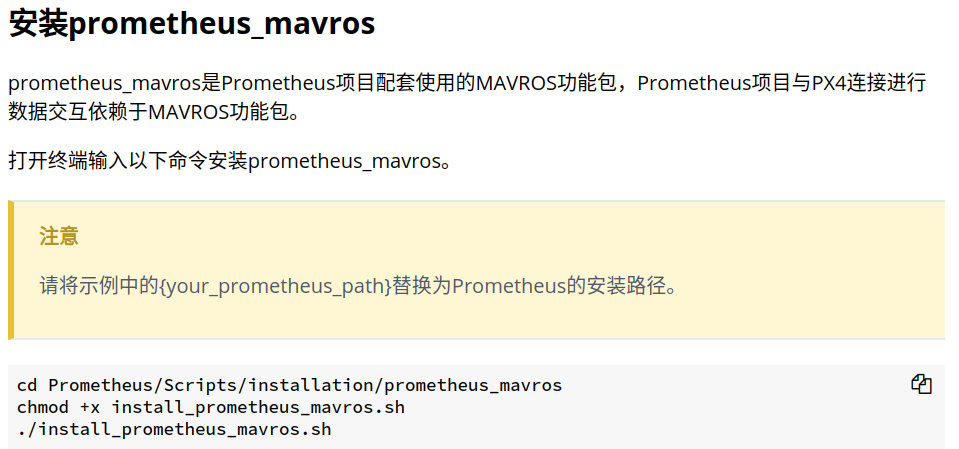

# 相机参数矩阵和畸变参数矩阵
相机参数矩阵K：
\[ K = \begin{bmatrix}
f_x & 0 & x_0 \\
0 & f_y & y_0 \\
0 & 0 & 1
\end{bmatrix} \]
畸变参数矩阵D：
\[ D = \begin{bmatrix}
k_1 & k_2 & p_1 & p_2 & k_3
\end{bmatrix} \]
# Opencv函数
1. estimatePoseSingleMarkers：该函数是用于估算单个 ArUco 标记的姿态（位置和方向）。该函数返回的是 ArUco 标记相对于相机的坐标系下的姿态。换句话说，它返回的是相机到 ArUco 标记的转换，包括平移向量和旋转矩阵。

# 编译问题
1. 教程位置：  
     
   执行指令：`./compile_detection.sh`  
   报错：error: no matching function for call to ‘_IplImage::_IplImage(cv::Mat&)’ IplImage z_ipl = IplImage(z);  
   解决：将  
   `catkin_make --source Modules/object_detection --build build/object_detection`
   修改成  
   `catkin_make --source Modules/object_detection --build build/object_detection --cmake-args -DCMAKE_CXX_FLAGS=-DCV__ENABLE_C_API_CTORS`  
   参考：[YOLO踩坑：编译darknet_ros报错no matching function for call to ‘_IplImage::_IplImage(cv::Mat&)’的解决方案](https://blog.csdn.net/weixin_41855010/article/details/111402710?ops_request_misc=%257B%2522request%255Fid%2522%253A%2522171056137416800186530680%2522%252C%2522scm%2522%253A%252220140713.130102334.pc%255Fall.%2522%257D&request_id=171056137416800186530680&biz_id=0&utm_medium=distribute.pc_search_result.none-task-blog-2~all~first_rank_ecpm_v1~rank_v31_ecpm-1-111402710-null-null.142^v99^pc_search_result_base4&utm_term=pp%3A411%3A36%3A%20error%3A%20no%20matching%20function%20for%20call%20to%20%E2%80%98_IplImage%3A%3A_IplImage%28cv%3A%3AMat%26%29%E2%80%99%20%20%20411%20%7C%20%20%20%20%20%20%20%20%20IplImage%20z_ipl%20%3D%20IplImage%28z%29%3B&spm=1018.2226.3001.4187)

# 运行问题
1. 关于ros环境变量ROS_PACKAGE_PATH的问题：  
   - 命令`echo $ROS_PACKAGE_PATH`会打印当前所有的ros工作空间，但是由于ros的bug，如果在~/.bashrc中删除之前source的工作空间，刷新环境变量后，`echo $ROS_PACKAGE_PATH`依旧会打印之前在~/.bashrc中source的工作空间。此时可以像[该博客](https://blog.csdn.net/u013834525/article/details/88871318)中所示的方法处理，完全删除之前source的工作空间。
   - 命令`echo $ROS_PACKAGE_PATH`中打印出来的环境变量，调用顺序是从前往后
   - 关于ros功能包的一些[命令操作方式](https://blog.csdn.net/GungnirsPledge/article/details/107057229)
   