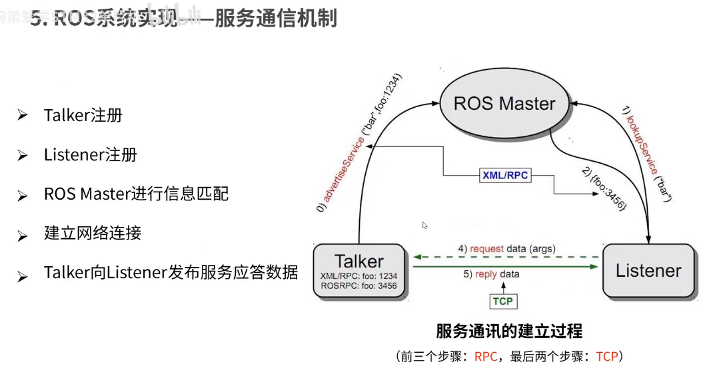
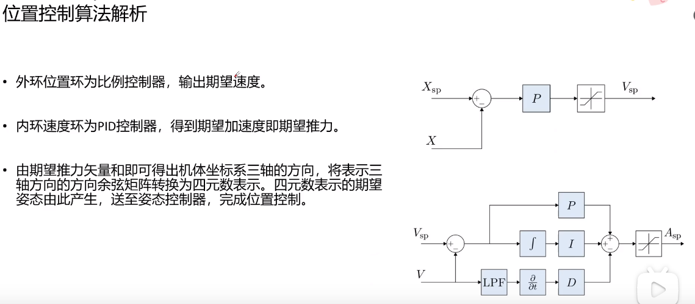

# 视频教程
## [新手入门无人机+PX4+ROS工程应用开发](https://www.bilibili.com/video/BV1Mh4y1h74x/?spm_id_from=333.337.search-card.all.click&vd_source=a5f4029436fab3ad44f642e3a69eb1d1)
### P1
  
1. 飞机命令一般就跟轴距有关
2. 叉型比十字型更稳定

  

  

  
1. 碳纤桨比尼龙桨更好，更贵
2. 螺距越大，一般桨面越斜，所以升力越大
3. 四旋翼对角位的桨是一样的，是为了相邻两个桨之间力可以对消
4. 带R的桨是逆桨，顺时针旋转；正桨，逆时针旋转

1. 有刷电机和有刷电机
2. 电机的直径和高度越大，动力越大，就可以带动更大的桨
3. 小kv可以产生大力矩，配大螺旋桨。小螺旋桨一般通过提高kv值来提升动力

1. 电调一般是无刷电机，因为无刷电机没有电刷换相
2. 电调的作用：直流电转为三相电；通过PWM对电机转速控制
3. 图上的这个30A，就表示最大持续电流

1. 电池电量用到3.7伏就不能再用了，要充电，再用就是过放，过放会损伤电池
2. 图中3S1P中的S表示串联，P表示并联
3. mAh表示电池的容量，图中的电池容量上标的5300就表示其容量
4. 图上电池5300后面的30C表示电池的放电倍率。用来限定电池的输出功率，也就是说持续放电的时候，最多放电$(5300/1000)A\times 30=159A$

1. 飞控是最底层的控制器，遥控器和上位机都是把信号传给飞控然后控制

  

  

  

  

  
1. 根据上图中的三个姿态角的概念对应到飞机的图上，可以明白，飞机头对应的是x轴，右翼对应的y轴，垂直向下对应的是z轴

  
1. 左手摇杆，throttle表示油门，yaw就是转向，pitch就是往前后飞，rall就是往左右飞

  

  

  

  

  

  

  

  

  

  

  
1. P1 - 1:27:30 分析日志
2. [日志在线分析网站](https://logs.px4.io/)

### P2
  

  

  

  

  

  

  

  

  

  

  

  

  

  

  

  

### P3
  

  

  

  

  

  

  

  

  

  

  

  

  

  

  

  

  

  

  

  

  

  

  

  

  

  

  

  

  

  

  

  

  

  

### P4
  

  
1. 这里是设置无人机免密开机并自动连接WiFi

  

  

  

  

  

  

  

  

  

### P6
  

  

  

  

  

  

  

  

  

  

  

  

  

  
1. PID参数可以在QGC中调节

  

  

  

可以使用rqt plot 测试飞机飞行高度

## [PX4二次开发快速入门](https://www.bilibili.com/video/BV1WU421Z7Kw/?spm_id_from=333.1007.top_right_bar_window_history.content.click&vd_source=a5f4029436fab3ad44f642e3a69eb1d1)
### P1 概述
  
`https://cwkj-tech.yuque.com/bsge84/uav-m1/lab6xeqmegbegwvu`这个是视频中说的他们文档的地址  

### P2 自定义工作队列

## [ROS+PX4无人机全开源系列教程专栏](https://www.bilibili.com/video/BV1QN411q7YG/?spm_id_from=333.880.my_history.page.click&vd_source=a5f4029436fab3ad44f642e3a69eb1d1)
### P1 PX4固件简介
常用学习网站收集：  
1. [PX4官网开发手册](https://docs.px4.io/main/zh/development/development.html)
2. [MavLink官网](https://mavlink.io/en/mavgen_c/)
3. [MAVSDK官网](https://mavsdk.mavlink.io/main/en/index.html)
4. [MAVROS官网](http://wiki.ros.org/mavros)
5. [XTDrone无人机仿真平台](https://gitee.com/robin_shaun/XTDrone)
6. [浙大FASTLAB](http://zju-fast.com/)

## [其他](https://space.bilibili.com/479817593/channel/series)

# 博客教程
[基于Pixhawk和ROS搭建自主无人车（文章链接汇总）](https://blog.csdn.net/qq_42994487/article/details/135572052?ops_request_misc=%257B%2522request%255Fid%2522%253A%2522171223157416800186554199%2522%252C%2522scm%2522%253A%252220140713.130102334.pc%255Fblog.%2522%257D&request_id=171223157416800186554199&biz_id=0&utm_medium=distribute.pc_search_result.none-task-blog-2~blog~first_rank_ecpm_v1~rank_v31_ecpm-4-135572052-null-null.nonecase&utm_term=%E5%9F%BA%E4%BA%8EPixhawk%E5%92%8CROS%E6%90%AD%E5%BB%BA%E8%87%AA%E4%B8%BB%E6%97%A0%E4%BA%BA%E8%BD%A6&spm=1018.2226.3001.4450)  
注意：通过这个教程主要是为了了解飞控与ros的关系，以及一般情况下飞控怎么接线

