# Linux如何卸载QtCreator
1. 首先通过指令`sudo find / -name qtcreator 2>/dev/null`找到qtcreator的安装目录
2. 进入qtcreator的安装目录，执行卸载指令`sudo ./QtCreatorUninstaller`
## 参考
[ubuntu18.04 LTS卸载qtcreator-10.0.2](https://blog.csdn.net/lyc_daniel/article/details/133858141)

# Linux安装Qt5.12.9的注意事项
[文档教程](./【正点原子】I.MX6U嵌入式Qt开发指南V1.1.pdf)可以参考`【正点原子】I.MX6U嵌入式Qt开发指南V1.1.pdf`的第52页  
[视频教程](https://www.bilibili.com/video/BV1g24y1F7X4)安装主要看下第4和5讲即可  
1. 安装后如果在左下角总菜单中找不到QtCreator，可以通过命令行运行脚本`/opt/Qt5.12.9/Tools/QtCreator/bin/qtcreator.sh &`，在后台打开QtCreator
2. 安装后如果QtCreator中无法输入中文  
    1. 先配置Ubuntu系统语言，设置为中文。可以直接在搜狗官网安装搜狗数据法即可，安装[教程](https://shurufa.sogou.com/linux/guide)
    2. 安装fcitx插件，指令如下
    sudo apt install fcitx-frontend-qt5
    3. 拷贝这个插件到Qt的安装目录，重启Qt Creator
    sudo cp /usr/lib/x86_64-linux-gnu/qt5/plugins/platforminputcontexts/libfcitxplatforminputcontextplugin.so /opt/Qt5*/Tools/QtCreator/lib/Qt/plugins/platforminputcontexts
3. 安装后运行C++示例代码，控制台没有输出，并且会有一个窗口一闪而过，解决办法就是：工具---选项---环境---系统下，x-terminal-emulator -e换成 xterm -e 即可。如下图：  
     

# Qt4.7的工程用Qt5编译报错并解决
1. 编译报错：`error: QtGui/QDialog: No such file or directory #include <QtGui/QDialog>`  
   解决：因为在Qt5中不再使用QtGui模块，而是使用QtWidgets模块。因此，需要
      - 在.pro中加QT+=widgets
      - 将代码中的"QtGui/QDialog"替换为"QtWidgets/QDialog"。
2. 编译报错：`error: ‘UnicodeUTF8’ is not a member of ‘QApplication’`  
   解决：修改setText(QApplication::translate("MainWindow", "&Quitar", 0, QApplication::UnicodeUTF8));为setText(QApplication::translate("MainWindow", "&Quitar", 0));  
   参考：[博客](https://blog.csdn.net/rl529014/article/details/52684506)
3. 编译报错：`error: ‘class QHeaderView’ has no member named ‘setResizeMode’; did you mean ‘ResizeMode’?`
   解决：将 setResizeMode 替换为为 setSectionResizeMode  
   参考：[博客](https://blog.csdn.net/weixin_41521612/article/details/120702977)
4. 编译报错：`error: ‘setCodecForTr’ is not a member of ‘QTextCodec’`
   解决：删掉下面这两行，具体原因可以看下参考博客
        QTextCodec::setCodecForTr(QTextCodec::codecForName("UTF-8"));
        QTextCodec::setCodecForCStrings(QTextCodec::codecForName("UTF-8"));
   参考：[博客](https://blog.csdn.net/qq_34732729/article/details/115513215)

# 如何在Vscode中使用qt
## 第一种方式(使用vscode插件创建)
主要是使用到了一个up主开发的vscode插件`Qt configure`。  
参考[博客](https://blog.csdn.net/cjj_kk/article/details/132579704)(其中这个博客里提到的`配置环境变量`和`配置Kit工具包`都不需要)  
参考[视频](https://www.bilibili.com/video/BV1YL411L7Sg)  
### 步骤
1. Vscode安装插件`Qt configure`
2. ctrl+shift+p打开命令窗口，输入qt，并选择new project选项  
     
3. 输入项目名称  
   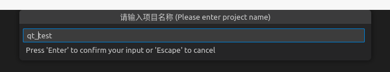  
4. 选择qt套件，cmake，是否带有ui文件(yes)  
     
5. 最后生成项目文件  
     
   其中launch.json为调试文件。如果其他地方需要调试qt文件，可以将这个文件直接复制过去。  
   跟编译相关的最重要的还是CMakeLists.txt文件。通过该文件，cmake才知道怎么编译。所以`.vscode`中的文件有没有无所谓，都不影响编译。

## 第二种方式(自己编写CMakeLists.txt文件)
这里展示的qtcreator自动生成的最简单板的cmakelist.txt，其他的QT项目可以在这个基础之上来进行改编
```cmake
cmake_minimum_required(VERSION 3.5)

project(TEST LANGUAGES CXX)

set(CMAKE_INCLUDE_CURRENT_DIR ON)

set(CMAKE_AUTOUIC ON)
set(CMAKE_AUTOMOC ON)
set(CMAKE_AUTORCC ON)

set(CMAKE_CXX_STANDARD 11)
set(CMAKE_CXX_STANDARD_REQUIRED ON)

find_package(Qt5 COMPONENTS Widgets REQUIRED)

add_executable(TEST
   main.cpp
   mainwindow.cpp
   mainwindow.h
   mainwindow.ui
)

target_link_libraries(TEST PRIVATE Qt5::Widgets)
```
### 注意事项
1. 其中`set(CMAKE_INCLUDE_CURRENT_DIR ON)`表示是否将cmake生成编译文件的目录加入到`include_directories`中，这里的`set(CMAKE_INCLUDE_CURRENT_DIR ON)`也就是相当于在`include_directories`中添加了`${CMAKE_BINARY_DIR}`。
2. `find_package(Qt5 COMPONENTS Widgets REQUIRED)`这里就相当于使用qmake编译时在.pro文件中添加`QT += widgets`是一样的，如果要添加其他的库也是一样的，在COMPONENTS和中REQUIRED写上即可。
3. 其中`set(CMAKE_AUTOUIC ON) set(CMAKE_AUTOMOC ON) set(CMAKE_AUTORCC ON)`这三句其实是普通cmake编译文件与qt的最大区别，cmake也就是通过这三句要分别对qt文件进行转化，简单来说，
   - set(CMAKE_AUTOUIC ON)是控制CMake自动运行uic工具，CMake会自动检测项目中的.ui文件，并生成相应的头文件和源文件，通常以`ui_<WidgetName>.h`命名。
   - set(CMAKE_AUTOMOC ON)是控制CMake自动运行moc工具，CMake会自动检测项目中的头文件和源文件，查找包含Q_OBJECT宏的类，并为其生成支持信号与槽机制的`moc_<ClassName>.cpp`文件。
   - set(CMAKE_AUTORCC ON)是控制CMake自动运行rcc工具，CMake会自动检测项目中的.qrc文件，并使用rcc工具生成相应的源文件（通常以`qrc_<ResourceName>.cpp`命名）。
4. 其中`set(CMAKE_AUTOUIC ON) set(CMAKE_AUTOMOC ON) set(CMAKE_AUTORCC ON)`这三句是让CMake可以自动管理Qt项目的代码生成任务，如果要手动管理则需要分别使用。但是实际测试发现，通过下面三个指令手动管理文件会更方便一些。因为通过set(CMAKE_AUTOUIC ON)等让CMake自动管理Qt项目的代码生成，目前在Qt5中使用还是会出现一些Bug和限制(注意：其中的FORMS、HEADERS和RESOURCES都可以使用set等来设置)
   - `qt5_wrap_ui(UI_WRAP_FILES ${FORMS})`，其中FORMS为所有ui文件路径的一个集合
   - `qt5_wrap_cpp(CPP_WRAP_FILES ${HEADERS})`，其中HEADERS为所有包含Q_OBJECT宏的头文件的集合
   - `qt5_add_resources(RESOURCES_WRAP_FILES ${RESOURCES})`，其中RESOURCES为所以包含资源文件文件的集合  
5. 补充几个cmake的语法，这些在普通cmake文件中也是适用的，这里写出来是为了强调：
   - 设置动态库的查找目录的link_directories指令一定要在add_executable之前
   - 可以通过`set_target_properties(${TARGET} PROPERTIES RUNTIME_OUTPUT_DIRECTORY ${CMAKE_SOURCE_DIR}/build/bin)`来设置可执行文件${TARGET}的编译输出路径
   - 如果find_package找不到qt的具体路径，可以通过`set(CMAKE_PREFIX_PATH "/opt/Qt5.12.9/5.12.9/gcc_64")`指令来设置，让find_package指令能找到
### 关于如何在cmake中编译qt的参考博客
1. [Windows下QtCreator使用CMake编译GUI程序(Linux同理)](https://www.cnblogs.com/linuxAndMcu/p/14458427.html)  
   这里讲解了cmake中编译qt的三种方式，其实主要用到的是第一种set(CMAKE_AUTOUIC ON)和第三种qt5_wrap_ui这两个。但是实际测试下来，如果不能具体指定编译文件的具体路径，而是通过类似file(GLOB_RECURSE UI_FILES ${BASE_DIR}/*.ui)这样的方式来广义搜索，使用第一种方式编译是不行的，会报重定义的错误，但是使用qt5_wrap_ui的手动方式就可以。后面可以再留意一下
2. [使用CMake构建Qt项目](https://blog.csdn.net/qq_40181592/article/details/101623231)  
   这里的CMakeList.txt文件比较通用，可以拿来直接借鉴  
   ```cmake
   #cmake版本
   cmake_minimum_required(VERSION 3.5.1)

   #项目名称
   project(Minesweeper)

   #让cmake自动去寻找Qt5
   FIND_PACKAGE(Qt5 COMPONENTS Widgets REQUIRED)

   #采用C++11标准
   set(CMAKE_CXX_STANDARD 11)

   #添加所有的源文件
   SET(Minesweeper_SOURCES 
      dialog.cpp	
      main.cpp 
      mainwindow.cpp 
      minemap.cpp
      myitem.cpp
      myscene.cpp
      setpro.cpp
   )

   #添加所有的头文件
   SET(Minesweeper_HEADERS 
      dialog.h
      mainwindow.h
      minemap.h
      myitem.h
      myscene.h
      setpro.h
   )

   #添加所有的.ui文件
   SET(Minesweeper_FORMS 
      dialog.ui
      mainwindow.ui
      setpro.ui
   )

   #添加资源文件
   SET(Minesweeper_RESOURCES 
      img.qrc
   )
   #调用预编译器moc，需要使用 QT5_WRAP_CPP宏
   QT5_WRAP_CPP(Minesweeper_HEADERS_MOC ${Minesweeper_HEADERS})
   #使用uic处理.ui文件
   QT5_WRAP_UI(Minesweeper_FORMS_HEADERS ${Minesweeper_FORMS})
   #使用rcc处理.qrc文件
   QT5_ADD_RESOURCES(Minesweeper_RESOURCES_RCC ${Minesweeper_RESOURCES})

   #这些生成的中间文件都会在build目录下，这样的话，编译器则不能定位由uic程序产生的诸如_ui_mainwindow.h等文件。所以，我们需要把build目录添加到包含目录中
   INCLUDE_DIRECTORIES(${CMAKE_CURRENT_BINARY_DIR})

   #生成可执行文件
   ADD_EXECUTABLE(Minesweeper 
      ${Minesweeper_SOURCES} 
      ${Minesweeper_HEADERS_MOC} 
      ${Minesweeper_FORMS_HEADERS}
      ${Minesweeper_RESOURCES_RCC} 
   )

   #为target添加需要链接的共享库
   TARGET_LINK_LIBRARIES(Minesweeper ${Qt5Widgets_LIBRARIES})

   ```
3. [CMake教程--QT项目使用CMake](https://blog.csdn.net/m0_46577050/article/details/134348784)  
   这个教程中对cmake中的qt使用做了更详细的说明，并且讲了一些qt6的cmake使用的新特性
4. [一文搞懂如何在CMake中使用Qt](https://blog.csdn.net/Copperxcx/article/details/123116433)  
   这个博客中主要要注意下对cmake变量CMAKE_PREFIX_PATH的设置。如果find_package找不到qt的具体路径，可以通过`set(CMAKE_PREFIX_PATH "/opt/Qt5.12.9/5.12.9/gcc_64")`指令来设置，让find_package指令能找到。以及运行时依赖缺失的处理  
### 关于qt的翻译文件这里单独说明一下
这里针对翻译文件的作用，gpt是这样解释的：  
  
  
所以为了生成翻译文件，qt中有两个工具分别是`lupdate`和`lrelease`。翻译文件的具体使用方式我还没有使用过，这里将知道的先记录一下，之前我在一个工程中的cmakelsit中是这样写的：
```cmake
find_package(Qt5 COMPONENTS LinguistTools REQUIRED)

# 初始化要使用的列表
set(TS_FILES)
set(QM_FILES)

# 将要生成的翻译文件添加到列表中
list(APPEND TS_FILES ${CMAKE_CURRENT_SOURCE_DIR}/../../translation/QtDemo_zh_CN.ts)

# 设置翻译文件的生成路径，如果不指定就会生成在CMakeFiles的目录里
set_source_files_properties(${TS_FILES}
    PROPERTIES OUTPUT_LOCATION ${CMAKE_CURRENT_SOURCE_DIR}/build
)

# 创建翻译的最关键一步
qt5_create_translation(QM_FILES ${TS_FILES} ${PROJECT_SOURCES})

# 添加更新翻译的目标
add_custom_target(lupdate_task DEPENDS ${TS_FILES})
add_custom_target(lrelease_task DEPENDS ${QM_FILES})
```
这样最后只要在执行`cmake ..`的目录中执行`make lupdate_task`和`make lrelease_task`即可。这里可以点开查看一下`cmake ..`生成的`Makefile`文件，在其中搜索lupdate_task和lrelease_task就能看到。  
当源代码发生变化，且需要从中提取新的翻译条目时，你可以运行lupdate_task来确保.ts文件包含最新的字符串。在确保.ts 文件内容正确后，可以运行lrelease_task来生成对应的.qm文件。这些.qm文件是最终用于应用程序中的。
#### 参考博客
1. [Qt Creator + CMake 管理工程翻译文件](https://blog.csdn.net/Tclser/article/details/125364058)  
这个博客对这两个相关的翻译文件讲解的很清楚，其中针对qtcreator如何利用cmake创建这两个翻译文件说的很清楚了。以后用到了可以跟着后面操作一下。

## 在vsode中如何让编写Qt程序有提示并可以通过头文件点进去
1. Ctrl + Shift + p打开命令窗口
2. 搜索C/Cpp: Edit Configurations，并选择含有json的那一项，此时vsode会帮你自动生成一部分内容
3. 然后在includePath这一项添加qt的头文件路径`/opt/Qt5.12.9/5.12.9/gcc_64/include/**`，如下：
   ```json
   {
      "configurations": [
         {
               "name": "Linux",
               "includePath": [
                  "${workspaceFolder}/**",
                  "/opt/Qt5.12.9/5.12.9/gcc_64/include/**"
               ],
               "defines": [],
               "compilerPath": "/usr/bin/gcc",
               "cStandard": "c17",
               "cppStandard": "gnu++14",
               "intelliSenseMode": "linux-gcc-x64"
         }
      ],
      "version": 4
   }
   ```
   注意其中主要就是配置一下includePath这一项，其他的都什么大的作用。有一点要提一下的就是，qt中编译使用的gcc就是ubuntu自带的gcc，qt下载的库中并没有自带gcc。
## qmake和cmake的区别
说到编译顺带记录一下，qmake和cmake是两种工具。qmake是Qt框架专用的一种构建工具，它使用.pro文件来描述项目的结构和依赖关系，然后生成Makefile。cmake是一个更为通用的构建系统，不仅限于Qt项目，也被广泛用于其他C++项目，cmake通过CMakeLists.txt文件来管理项目，这使得它能够处理更复杂的项目配置和跨平台构建。不存是qmake还是cmake，他们最后都是生成Makefile文件。

# Qt教程
[视频教程](https://www.bilibili.com/video/BV1g24y1F7X4)  
[Qt Documentation Archives](https://doc.qt.io/archives/qt-5.12/qtmodules.html)  
## QtCreator快捷键
  

自定义快捷键方式：  
  
## 信号槽
1. 如果自定义信号槽，信号只要申明不要定义，但是槽函数既需要声明也需要定义
2. 有三种常见的信号槽写法：
   - 传统写法（使用SLOT和SIGNAL宏）:  
     connect(sender, SIGNAL(signalName()), receiver, SLOT(slotName()));  
   - 新式写法（使用函数指针）:  
     connect(sender, &Sender::signalName, receiver, &Receiver::slotName);
   - Lambda表达式:
     connect(sender, &Sender::signalName, [=]() {  
      // lambda expression code  
   });  

   新式写法（函数指针）通常被认为比传统写法更优，因为它更安全（类型安全），编译器可以检查信号和槽的类型是否匹配，而且在运行时也能提供更好的性能，因为它避免了使用SIGNAL和SLOT宏带来的字符串查找。  
   Lambda表达式提供了极大的灵活性，允许你在连接信号时直接执行代码，而不需要单独定义槽函数。但是，过度使用Lambda可能会导致代码不易读和维护，并且如果Lambda捕获了大量的变量，可能会影响性能。
## 资源文件
1. 在QtCreator中添加图片等资源文件的步骤如下：  
     
     
     
     
2. 如果在Vscode中添加资源文件就需要手动写Html代码了，类似如下(参考[博客](https://blog.csdn.net/m0_58178839/article/details/131825108)):  
   ```html
   <RCC>
       <qresource prefix = "/">
           <file>logo.png</file>
       </qresource>
   </RCC>
   ```
   注意：经过实操发现(就是通过qtcreator来实际创建文件后并打开文件查看，再在vsode中模仿)，如果想在代码中通过类似`ui->label->setStyleSheet("QLabel { border-image:url(:/images/bmp.png) }");`的指令来加载资源文件中的图片时，最好将资源文件放在.qrc的同级目录下。例子如下：  
   资源文件的文件目录结构如下：  
     
   然后.qrc的文件内容为  
   ```html
   <RCC>
      <qresource prefix = "/">
         <file>images/bmp.png</file>
      </qresource>
   </RCC>
   ```
   这样在cpp源文件中加载的时候样式表内容就写`QLabel { border-image:url(:/images/bmp.png) }`。
## 样式表及QSS文件
### 如何利用Qt帮助文档在QtCreator中为QLabel添加样式表  
  
  
  
  
  
  
  
  
但是这样会导致添加进去的图片平铺填充  
  
需要改变样式表中的代码  
  
改变字体颜色和大小等通过样式表修改会比较方便，字体的大小的单位可以是px，也可以是pt  
  
也可以不ui文件来设置，直接在cpp文件中通过操作ui->setStyleSheet来设置样式表
  
  

### 如何在QtCreator通过Qss文件为Qt控件修改样式
  
  
  
  
  
  
  
  
在main.cpp和widget.cpp文件中将Qss文件读进来
  
可以通过下面这种方式来获取资源文件的路径。并且另外注意qApp->setStyleSheet这里的qApp是Qt提供的一个全局变量，它可以方便地用于在应用程序的任意地方访问应用程序实例。  
  
但是如果像下面这样设置，会导致其中所有的QLabel都会显示成红色。这样肯定是不符合要求的  
  
  
这里可以单独对这个对象单独起一个名字  
  
然后在qss文件中单独对这个对象设置颜色即可
  
  

### 根据QtCreator步骤总结如何在vsode中通过纯代码使用样式表和QSS文件
#### 样式表
1. 构建文件目录结构，并在其中放入初始文件(可以通过qtcreator来创建一些初始文件，然后在此基础之上修改)：  
   .vscode：里面的c_cpp_properties.json文件是为了代码补全
   build：编译的中间文件夹  
   include：头文件
   qrc：资源文件，图片文件夹和qss文件夹等
   src：代码源文件
   ui：qt的ui文件
     
2. 资源文件.qrc中写入
   ```html
   <RCC>
      <qresource prefix = "/">
         <file>images/bmp.png</file>
         <file>qss/style.qss</file>
      </qresource>
   </RCC>
   ```
   注意其中图片资源和qss文件一定要放在.qrc的同级目录下，否则很有可能会在程序运行时加载不出来效果
3. qss文件的内容，下面再介绍
4. 打开qtdesigner，并通过qtdesigner打开文件目录中的.ui文件  
     
5. 在空的mainwindow中放入一个空的label控件  
     
6. 保存qtdesigner编辑过的.ui文件。打开mainwindow.cpp源文件，在ui->setupUi(this);下方加入如下代码
   ```cpp
   ui->setupUi(this);
   ui->label->setStyleSheet("QLabel { border-image:url(:/images/bmp.png) }");
   ```
   注意这里样式表的路径(`url(:/images/bmp.png)`)是资源文件中的前缀和图片路径组成的  
     
   这样编译并运行就可以在qlabel中加载出来图片了。
#### QSS文件
QSS文件是为了当有多个控件使用样式表时，为了简化代码，将样式表都集中到一起而形成得文件，这样直接修改QSS文件，就可以直接修改控件的样式。所以这里建议直接使用QSS文件，就不要再使用样式表了。  
1. 构建文件目录结构，并在其中放入初始文件(可以通过qtcreator来创建一些初始文件，然后在此基础之上修改)：  
   .vscode：里面的c_cpp_properties.json文件是为了代码补全
   build：编译的中间文件夹  
   include：头文件
   qrc：资源文件，图片文件夹和qss文件夹等
   src：代码源文件
   ui：qt的ui文件
     
2. 资源文件.qrc中写入
   ```html
   <RCC>
      <qresource prefix = "/">
         <file>images/bmp.png</file>
         <file>qss/style.qss</file>
      </qresource>
   </RCC>
   ```
   注意其中图片资源和qss文件一定要放在.qrc的同级目录下，否则很有可能会在程序运行时加载不出来效果
3. qss文件的内容如下
   ```qss
   QWidget { background-color: blue }
   QLabel { border-image:url(:/images/bmp.png) }
   ```
   这里qss的文件内容意思是，将QWidget的背景色变为蓝色，为QLabel附上图片，图片为资源文件中的，路径这里表示为url(:/images/bmp.png)。  
   如果想在qss中使用.qrc中的资源文件，就必须先在.qrc中添加。如果不想使用，这里的路径需要改写为
   ```qss
   QLabel { border-image:url(../qrc/images/bmp.png) }
   ```
   这里的路径是相对于可执行文件的路径，并且注意少了一个冒号
4. 打开qtdesigner，并通过qtdesigner打开文件目录中的.ui文件  
     
5. 在空的mainwindow中放入一个空的label控件  
     
6. 保存qtdesigner编辑过的.ui文件。打开mainwindow.cpp源文件，在ui->setupUi(this);下方加入如下代码
   ```cpp
   ui->setupUi(this);
   
   QFile file(":/qss/style.qss");
   /*判断文件是否存在*/
   if (file.exists()){
      /*以只读的方式打开*/
      file.open(QFile::ReadOnly);
      /*以字符串的方式保存读出的结果*/
      QString stylesheet = QLatin1String(file.readAll());
      /*设置全局样式*/
      qApp->setStyleSheet(stylesheet);
      /*关闭文件*/
      file.close();
   }
   ```
   (其中`QFile file(":/qss/style.qss");`在加载qss文件时，也可以不将qss文件放在资源文件中，直接通过相对路径来搜索，也就是省去冒号，这里写相对于可执行文件的路径`QFile file("../qrc/qss/style.qss");`即可。但是对于qss文件还是建议写在资源文件中)
   这样就可将资源文件中的qss文件加载进来了，并且对所有的QWidget和QLabel加上对应的样式
7. 但是这里注意，因为有些时候我们需要对特定的QLabel附上单独的样式，所以这里在qss中可以这样修改
   ```qss
   QLabel#label1 { border-image:url(:/images/bmp.png) }
   ```
   这里`#label1`中的label1是控件的名字，可以通过代码setObjectName方法指定：
   ```cpp
   QLabel *label1 = new QLabel(this);
   label1->setObjectName("label1");
   ```
   也可以在qtdesigner拖动控件时指定：  
   
##### QSS语法补充
1. 当想添加其他颜色时，可以通过这样去添加
   ```qss
   QWidget {background-color: rgb(220 220 220)}
   ```
   或者  
   ```qss
   QWidget {background-color: #DCDCDC}
   ```


#### 总结 关于什么时候将文件加载为资源文件 什么时候不加载
1. 当你希望将资源（如图片、图标等）打包到应用程序中，以便在所有平台上都能使用，并且不依赖外部文件时使用。将资源文件打包进.qrc文件
2. qss文件一定打包进.qrc文件，如果需要在qss文件中使用一些小的图标或者图片，可以打包进.qrc文件，然后在qss文件中使用这些图片的时候，注意路径要以`:/`开头

## QT中如何加载图片
### 方式一 通过资源文件加载
需要先配置资源文件，这里就不多说了，通过样式表来添加`ui->label->setStyleSheet("QLabel { border-image:url(:/images/bmp.png) }");`
### 方式二 通过QPixmap加载
```cpp
QPixmap pixmap("../qrc/images/bmp.png");
ui->label->setPixmap(pixmap);
```
### 两种方式对比
- 样式表加载图片  
  适合简单的图像设置，尤其是静态图像、背景图片或需要集中管理的样式。
- QPixmap加载图片  
  更适合需要动态处理图片的场景，或需要进行更复杂的图像操作。

## QWidget
QWidget可以当成一种容器，里面放qlabel，通过搭配不同的颜色，可以起到美化空间的作用。
  
  

## QPushButton
### 固定大小
可以通过minimumSize和maximumSize来将按钮大小固定  
  
### toggled信号
只有设置QPushButton的setCheckable(true)属性，才能触发这个信号。  
  
可以发现toggled这个槽函数是在pressed和released中间触发的，并且按钮按下去之后没有再弹起来。类似于插板按钮，再按第二下才能弹起来。  
  
  
槽函数会有一个bool位，通过这个可以判断按钮是否被按下并且有没有弹起来。  


### 添加按钮图片资源文件
视频教程中添加按钮图片资源文件的步骤记录：  
  
  
注意这里点击添加现有文件来添加图片时，会将图片文件所在的文件夹也添加进来  
  

### QSS 伪状态
这里在qss文件中如果添加一行按钮的`:hover`可以让按钮在有鼠标悬停时，变成另一张图片，这个类似于信号槽，通过qss文件可以直接实现。  
  
  
  
通过qss的`:checked`伪状态，可以让按钮点击的时候变成另一个图片  
  
  
这里还可以在`:checked`伪状态后面再继续衔接伪状态，可以让按钮点击后如果鼠标悬停是什么反应  
  
总结：这里要注意的就是，如果想制作视频中所示的音乐播放器按钮的效果，一定要`setCheckable(true)`设置一下

## QRadioButton
### 如何改变QRadioButton前小圆圈的样式
这里类似于QPushButton中的qss文件设置。下图中的`QRadioButton::indicator`表示单选按钮前面的小圆圈  
  
### 如何隔离不同组 实现单选
通过放到不同的组中来让各自组中的按钮互斥  
  
  
### 如何让QRadioButton单选变多选
按钮组中有一个属性，可以让这组中的单选按钮不互相排斥，单选变多选
     
### 如何实现下图中案例的效果
如何做到下图中，只有选项没有前面小圆圈的效果  
  
在qss中将圆圈的宽高都设置为0，字体大小颜色还有背景色也设置一下，但是这样出来的效果，文字不是居中的，且通过qss也无法实现文字的居中。所以这种效果通过QRadioButton来实现，有些不太方便，所以可以使用QPushButton来实现，毕竟他们是继承自一个父类  
  
  
将几个QPushButton分配到一个按钮组  
  
将这几个按钮的checkable属性都设置成可选中的，再运行，效果就有了  
  
  
最后再设置一下qss按钮的背景色和选中时的效果就可以了  
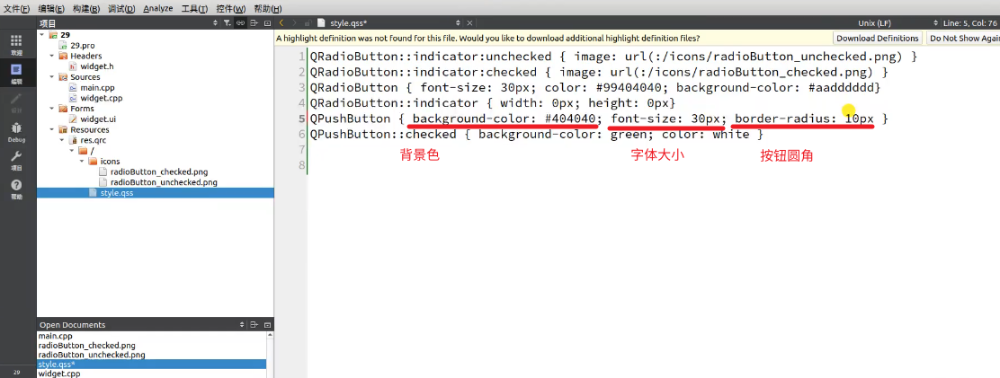  
  
### QRadioButton常用信号
常用信号是这个toggled，一般情况下不会用其他的信号  
  
  

## QCheckBox
### 三态选择
要实现下图中左边的三种状态，需要打开三态的选择窗口  
  
  
但是为了跟图片中一样，上面图片中的左边的显示效果一样，也需要修改样式表QSS  
  
  
### QCheckBox的信号
通过QCheckBox的stateChanged信号的参数来看是三种状态的哪一种  
  
  
### 如何实现复选框按钮组的多选
这里包含复选框的按钮组，将其中的属性exclusive勾选掉就可以实现多选了  
  

## margin&padding(外边距和内边距)
  
  
### 如何利用帮助文档来查看怎么修改样式表以修改按钮边距
  
  
### 如何统一设置边距
这里的margin 50px会使得按钮周围跟总窗口的距离都为50px  
  
  
### 如何四周单独设置边距
四周单独设置用下面的关键字
  
### 如何设置按钮边界(或者叫描边)样式
下图中widget上的绿色部分就表示按钮的边界
  
### 如何设置按钮单边的边界(或者叫描边)样式

### 如何设置按钮文字和按钮边界的样式
因为这里按钮也可以看成一个容器，所以可以通过padding改变文字与按钮边框之间的距离    
  
  
  
### 关于样式表中padding的注意事项
这里注意如果改变padding的值，虽然表示文字距离四周都是100px，但是这里实际效果却看不出来。如果我们将文字的大小变大，可以发现文字会显示不全，这个就是padding的效果  
  
  
  
### 总结
上述中提到的三个概念，margin、border和padding可以分别翻译为外边距、边框和内边距。  
  
其中margin支持的控件有  
  
其中padding支持的控件有  
  

## QHBoxLayout水平布局
布局主要有下面三个属性  
  
可以框选控件然后点快捷键就可以  
  
### spacing
spacing表示间隔距离  
  
### stretch
stretch表示拉伸因子，这里表示当布局很大时，布局内的控件会按照长度1:1:2:2来，具体的长度比例，可以自己在ui中设置。  
  
如果设置成0，就表示会使用按钮的默认宽度。但是为了精准控制按钮的宽度比例，所以这里最好就用明确的值。  
  
### 如何将整个widget窗口设置成水平布局
这里表示整个widget使用ui->herizontalLayout来实现布局  
  
  
注意当整个窗口缩到最小的时候，之前设置的stretch就不起作用了  
  
### 布局的margin属性
这里可以分别设置布局的margin属性，这样就可以让按钮与布局的边界不是紧贴着的  
  
实际案例演示如下：  
  
### SizePolicy
这个属性不在布局上，在布局里的控件上  
  
里面有7个值  

## 如何在帮助文档中查看其用法  
  
  
  
## ignored
当外面的边界框被缩小时，之前设置为Minimum时，按钮不会缩小到比缺省值还小，就好比红框右边的按钮。但是当水平策略被设置为ignored时，外面的边界框被缩小时，按钮就会缩小到比缺省值还要小。  

  
## expanding
这里可以看到当按钮的垂直策略设置为expanding时，按钮的垂直方向会扩展到他能扩展到的最大值  
  
  

## QVBoxLayout垂直布局
垂直布局这里如果设置stretch的值不一样，拉大垂直布局的边框，并不会改变按钮控件的垂直大小，是因为按钮的SizePolicy垂直策略都被默认设置为了fixed。  
  
可以看到如果垂直策略设置成了ignored，stretch的比例效果就有了
  
### 布局可以嵌套使用
这里左边是垂直布局，右边是水平布局，两个一起又是一个水平布局  
  
然后整个widget再设置一个布局，就可以让整个widget充满  
  

## QGridLayout(网格布局)
  
### layoutRowMinimumHeight
这里可以通过设置属性layoutRowMinimumHeight来控制网格布局中的格子的大小  
  
### 如何让按钮固定大小后在网格布局的中间  
  
  

## QSplitter
  
这个类的位置在快捷按钮栏  
  
### 如何使用
选中两个控件后点击分裂器  
  
然后就缩小了，这里要选中然后拖拽放大  
  
运行程序后，把鼠标放在这个中缝上，鼠标会变形，此时点击鼠标左键拖动，即可看见效果  
  
### opaqueResize属性
opaqueResize:为false时，在拖动的时候会显示一条灰色的线条，在拖动到位并释放鼠标后再显示分割线条。默认为true，实时更新子控件大小。  
  
### childrenCollapsible属性
一般情况下如果控件的宽度有一个最小值，那么childrenCollapsible这个属性最好去掉勾选，也就是为false。此时如果将控件往左拖，控件就不会瞬间变为0。  

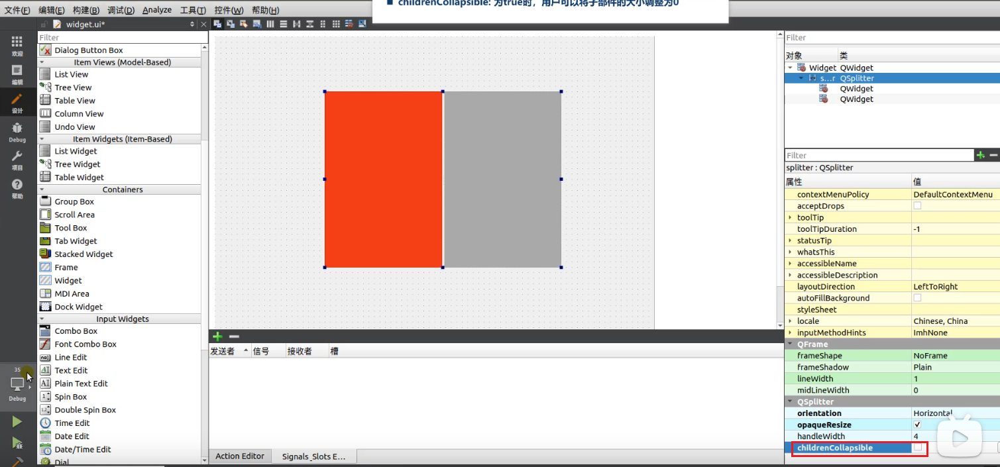  
  
### handleWidth属性
这个属性用于设置两个控件间的距离  
  
### 样式表
可以看到如果对QSplitter设置样式表，可以将其背景色改变。感觉主要是结合handleWidth属性来实现一个美化的作用。  
  
  
### orientation属性
控制其水平或者垂直方向  
  

## QSpacer
  
这里将sizeType设置为Fixed，将sizeHint的宽度设置为40，可以看到实际运行出来的结果就是左边宽度固定。对于水平弹簧，高度值是没有用的，同理，对于垂直弹簧，宽度值没用。  
  
这里弹簧如果将sizeType设置成ignored，可以发现并不起作用。所以如果想要控件左边没有空白可以直接将弹簧删除。  
  
### 小技巧
通过两个弹簧来扩大距离  
  

## QLineEdit
  
### 样式表去除边框
通过在样式表中设置来去除边框  
  
### 如何固定大小
可以通过minimumSize和maximumSize来将按钮大小固定
   
### 如何绘制上述案例中的直线
可以通过qwidget来做，将其高度设置为2。并设置其样式表的背景色为灰色  
  
  
### 如何设置其中的文字大小
  
并可以通过placeholderText属性来设置默认文字  

### 密码显示如何设置
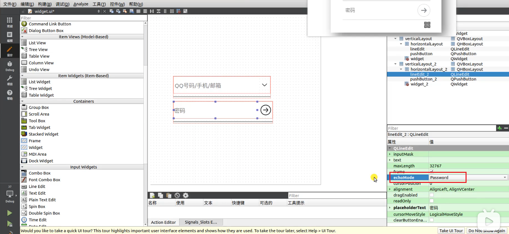  

## QDialog
### 简易用法
通过pushButton点击然后显示dialog  
  
### 设置模态
通过dialog的方法来设置模态，使得该窗口打开时，其他地方会变黑，必须先操作该对话框才行  
  
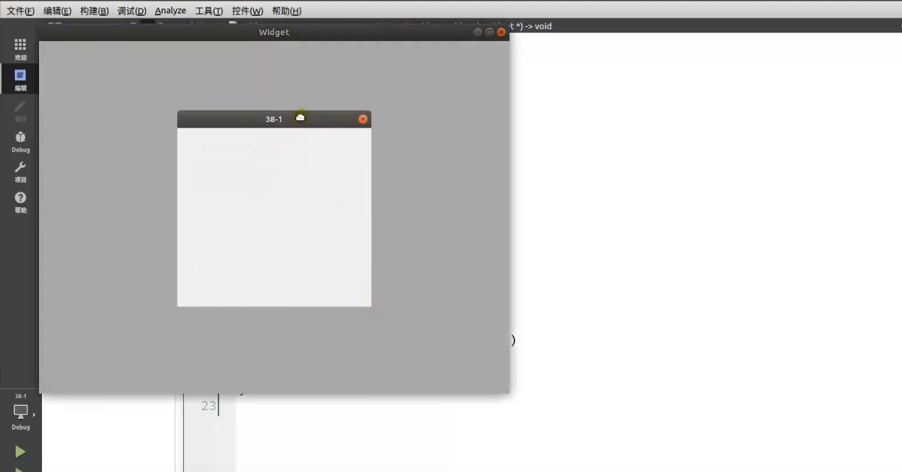  
### 实际案例
仿支付对话框  
  
步骤：  
1. 新建项目  
     
     
2. 这里要选择QDialog作为基类  
     
3. 设置一下对话框的大小  
     
4. 设置无边框属性  
     
     
     
5. 通过帮助文档查看border-radius样式属性都有哪些控件支持  
     
6. 查看得知QFrame支持border-radius样式属性，这里在QDialog上放一个与之一样大的QFrame  
     
7. 修改QFrame的样式，背景色和边框圆角半径  
     
   可以看到圆角的效果出来了。但是背景QDialog还是直角，这里需要将背景隐藏  
     
8. 通过设置属性，将背景QDialog隐藏  
     
     
     
9. 再添加部分控件  
     
10. 调整QLineEdit的大小，并添加弹簧  
      
11. 调整QLabel的文字布局方式和字体大小粗细  
      
      
12. 调整按钮和输入文本框的最小高度  
      
13. 添加弹簧调整布局  
      
14. 通过样式表调整按钮文字颜色  
      
15. 给QFrame加上样式表，添加边框
      
    注意这里样式表QFrame的前面要有`.`，如果没有，则会导致该QFrame容器内部的其他控件，也会加上边框  
      
    加`.`后的效果图如下：  
    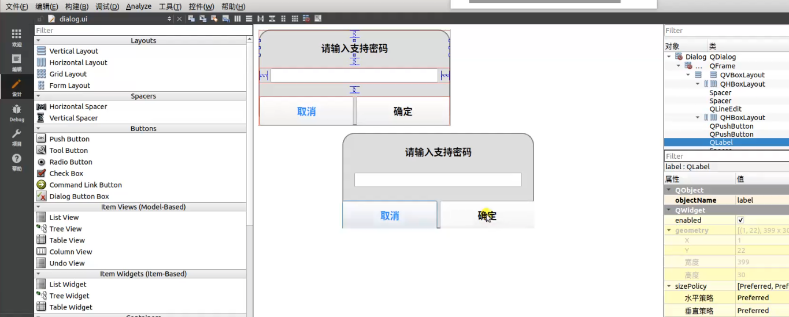  
16. 为按钮设置边框样式。注意这里的颜色设置的是文字的颜色  
      
      
17. 通过样式设置按钮被按下时的背景色  
      
      
    注意这里要设置一下按钮按下时，左下角的圆角，不然其按下时会显示方角，如上图  
      
18. 这里另一个按钮与左边的按钮一样，可以直接复制过来修改，注意下按钮边框的方向和按下时边框的圆角位置即可  
      
19. 修改文本框默认文字  
    
20. 最后再根据实际情况调整边框和颜色等的大小  
      

## QScrollArea
### 实际案例
实现如下滚动效果：  
  
步骤：  
1. 设置主界面和滚动区域大小  
     
     
2. 这里注意QScrollArea里面还包含了一个QWidget，但是这个QWidget是无法通过geometory中的宽度和高度改变大小的  
     
3. 如何让QScrollArea有滚动条的效果，这边的原理是这样的：QWidget是包含在QScrollArea中的，虽然无法改变QWidget的geometory属性中的宽度和高度大小，但是可以改变QWidget的minimumSize最小尺寸的宽度和高度，使其比QScrollArea的geometory属性中的宽度和高度大小大即可，就好像通过增大QWidget将QScrollArea撑大了。  
     
     
4. 那如何关闭滚动条，一种方式是将QScrollArea中的QWidget的minimumSize改小，一种方式是通过修改其属性值，关闭横向的滚动条，如下图  
     
5. 借助帮助文档修改滚动条的样式  
     
     
     
6. 修改QScrollArea的样式，这里注意样式表中的对象是QScrollBar，也就是说修改的是滚动条的样式  
     
     
7. 还可以单独修改滚动条滑块的样式，注意这里颜色使用的是rgba关键字，最后一个数字20%指的是透明度。还可以通过border-radius关键字修改滑块为圆角滑块  
     
   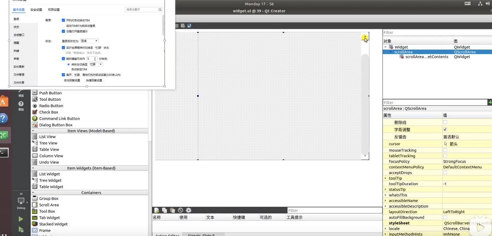  
8. 参考帮助文档修改滚动栏按钮的样式表，让按钮消失
   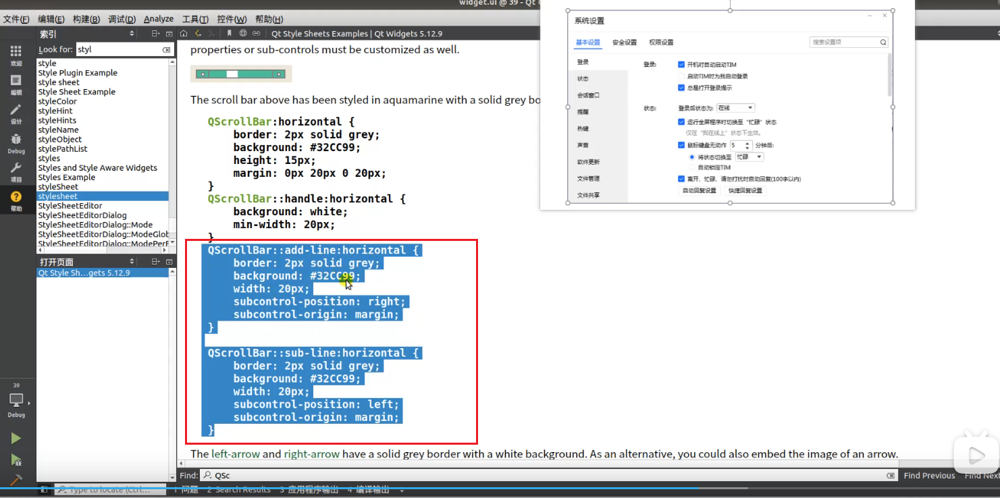  
   这里是通过让按钮的长宽分别为0，也就是消失了  
     
     
9. 通过样式表设置其悬停属性，可以让鼠标悬停时，滑块按钮颜色变深，这里改变的是透明度值  
     
     
10. 修改QScrollArea中的QWidget的背景色颜色  
    
11. 最后适当添加内容即可  
      

## QTabWidget
### 修改QTabWidget子对象的Widget样式
QTabWidget中有子对象Widget，修改子对象的Widget样式  
     
### 如何让tab标签页可关闭
通过勾选tabsClosable属性，让tab标签上有叉号。但是此时点击该叉号，并不会关闭tab标签页。是因为没有写对应的槽函数  
  
写槽函数，关闭tab标签页  
  
  
### 添加新标签的方式  
  
### 修改标签所在方位
通过修改tabPosition属性可修改其方位  
  
### 实际案例
  
步骤：  
1. 先添加一个QListWidget。因为案例中的右边看着像是一个QTabWidget，其实是一个QListWidget  
   
2. 为QListWidget添加项目  
     
3. 可点击后直接修改属性  
     
   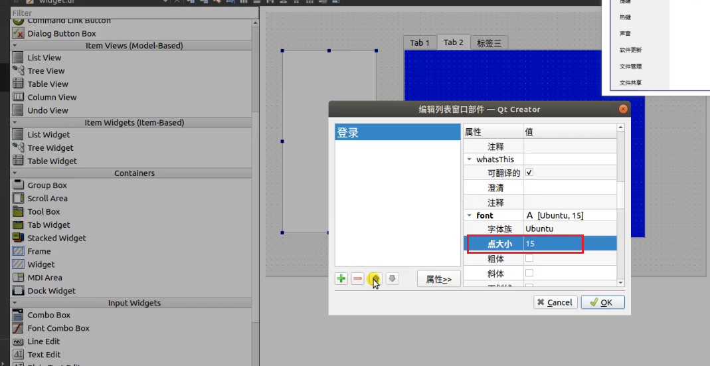  
   这里先添加三个项目  
     
4. 参考帮助文档修改样式表  
     
     
   样式表设置条目宽度变宽，并让其被选中时，背景色变为白色  
   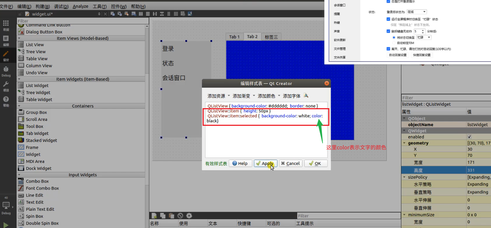  
     
5. 水平布局，并调节QListWidget的maximumSize的值，这样左半边就会小一些  
     
6. 将布局这边的空隙缩小  
     
7. 通过样式表去除边框  
     
8. 查看帮助文档，确认如何去除标签tab
     
9. 一样通过将其设置为0隐藏标签tab
     
   
10. 通过listwidget的信号来触发点击翻页的效果  
      
    其信号会发送一个int，也就是鼠标选中的行号，此时让tabwidget显示对应行号的tab页就可以了  
      
      
      
11. 最后记得设置一下布局效果  
      
12. QListWidget的focusPolicy一定要设置成NoFocus，否则软件一打开，QListWidget就会自动获得焦点，让第一项不是白色，而显得有些发蓝，如下第二张图，所以为了避免这种情况，focusPolicy属性一定要改  
      
      
      
      
13. 其实QStackedWidget与QTabWidget在这个实际案例中的使用方式差不多，效果也差不多。并且在这个案例中QStackedWidget不用隐藏，还可以省掉一步  
      

## QListWidget
### 如何添加项
双击QListWidget，点击加号，再修改属性  
  
### 如何调整项目顺序
点击上下箭头  
  
### 通过代码添加项
  
直接选中QListWidget，可以修改所有项的字体大小  
  
  
### 如何移除项
  
### 如何插入项
是从插入项的前面插入  
  
### 常用信号
发出的信号为项目下标  
  
  
如下图可以返回对应项的名称文字  
  
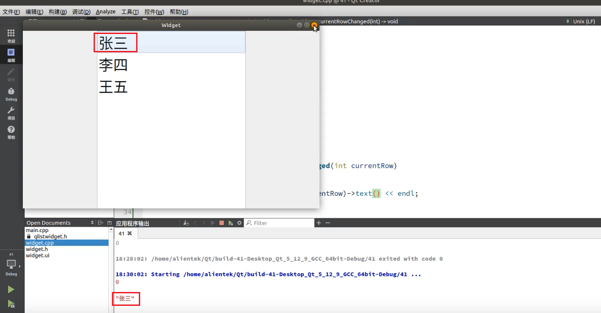  
### 实际案例-QQ好友列表
如下图所示QListWidget无法直接添加头像图标  
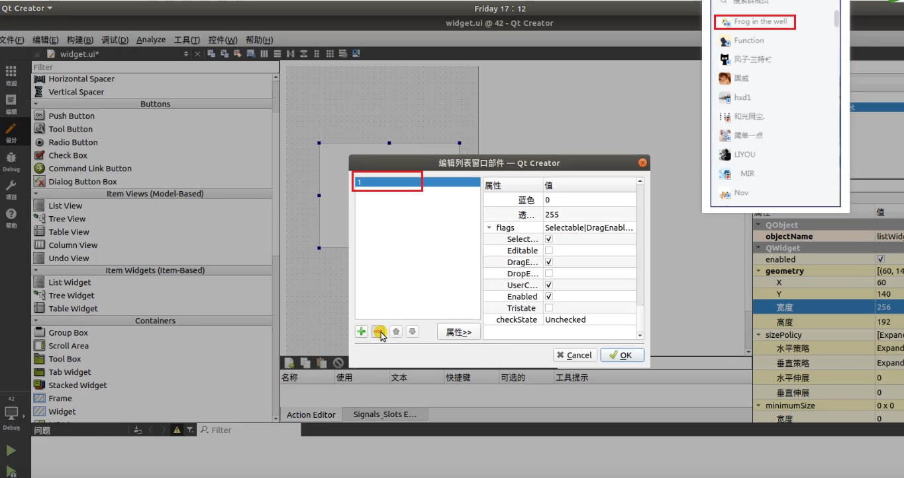  
所以先设计项，再将项添加到QListWidget中  
  
步骤：  
1. 设计项，要自定义一个QListWidget的项item的类  
     
     
     
     
2. 在widget中放入两个QLabel，当做头像和头像下面的图标  
     
     
3. 放一个label当昵称，并修改样式  
     
4. 将之前头像处的两个label放在新建的widget中。因为label不能放在label中，所以需要widget来当容器。并添加布局，将布局大小调整至于widget大小一样  
     
5. 为了与示例一致，需要添加弹簧产生间隙，并调整弹簧的属性  
     
6. 至此，这个类就新建完成了，这个类相当于新建了一个listwidget中的item  
7. 这里引入新建类的头文件，并创建对象，可以发现能在widget中显示。当然这里只是试试新建类能不能正常使用  
   
8. 添加资源文件，用于添加图像  
     
     
9. 双击qqitem修改其中控件的名字，方便下面使用  
   
     
10. 这里通过代码来加载资源文件中的图片，但是直接加载图片不会自动缩放，所以需要手动将图片缩放一下，也就是通过image的scaled方法    
   
11. 这里注意加载图片的时候，刚刚在第9步修改图片的名称，所以这里ui的指针后面要跟正确的控件的名字  
   
12. 如上图所示，手机在显示的时候，后面会有一个白色的背景色，所以这里需要将白色背景去掉，也就是将放手机图片的widget的样式表去掉就行了  
     
     
13. 设置名字qqitem的名字。注意这里老师在讲解的时候，都是在qqitem的类中设置的。这是为了临时演示方便，所以这里需要有一个接口能传入参数才行  
   
14. 这里设置了三个属性参数传入，分别是图标路径，是否显示右下角鼠标的标志位，昵称名字。是通过构造函数来传入。并注意函数的具体实现，这里是否显示phone是通过QLabel的方法setVisiable来设置的  
     
     
15. 然后在引入的widget中，通过构造函数将参数传入即可  
     
16. 可以看到标志位可以自由控制手机图标的显示  
     
17. 再回到widget.ui中设计布局，并为按钮等修改样式  
     
   将输入文本框改成透明的，去掉边框，这是默认显示文字  
     
     
18. 设置布局，并拉直与widget一样大  
     
     
19. 这里是利用了setItemWidget这个方法，来将widget中的内容放到ListWidgetItem中了，但是因为没有调整ListWidgetItem的大小，所以不能显示全  
     
     
     
20. 通过样式表来调整ListWidgetItem的高度  
     
   这样大小就合适了  
     
21. 再设置一下布局，使大小铺满即可  
     
     
22. 添加其余的item，效果就差不多了  
     
     
23. 因为选中的时候背景色是蓝色，所以通过样式表修改一下。鼠标悬停时的颜色效果也要修改一下  
     
     
24. 最后记得将这个focusPolicy改成NoFocus，关掉按钮点击时的聚焦效果  
     
     

## QFile
### 文本读写流程  
  
#### 通过QFileDialog来获取文件路径和名字
QFileDialog运行时，就是会打开系统的文件系统窗口，如下图代码中的第三个参数是`"/home/alientek"`，点击按钮时，就会打开这个目录，然后用户选择文件，就会打印文件名字  
  
运行后  
  
这个窗口路径就是`"/home/alientek"`，并且选择文件的窗口的名字，就是刚刚的第二个参数`"选择文本"`  
  
双击选择该文件  
  
然后就会在控制台窗口显示打印的文件路径和文件名  
  
#### 通过QFile打开文件并关闭文件
  
  
  
这里注意一下，如果qt支持的是UTF-8编码，但是文件本身是GBK编码，这里打开会乱码，所以需要额外转化一下，后面会讲  
  
  
#### 通过QFile写文件并关闭文件
  
将文本框中新添加的内容写入文件，注意要转换编码格式，这里是通过`.toUtf8()`来转的  
### 动态创建文件
#### 实际案例
步骤：  
1. 放置按钮位置，并调整布局
     
2. 添加资源文件  
   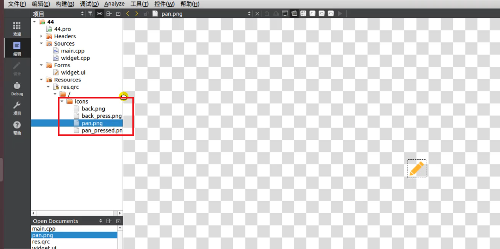  
3. 通过样式表调整按钮样式  
     
4. 创建一个Dialog类来新建文件  
     
     
     
5. 放入按钮等并调整布局  
     
6. 按钮设置文本和图标，这里可以通过QtCreator直接添加。也可以通过样式表，如`QPushButton{qproperty-icon:url(:/images/bmp.png);qproperty-iconSize:20px;}`来设置按钮图标的图片和大小  
     
     
7. 去掉边界  
     
   加上颜色  
     
8. 通过按钮槽函数来设置一下刚刚设置的按钮效果  
     
     
9. 设置一下对话框的大小和模态显示  
     
10. 通过信号来设置图标的颜色变化，也就是更换图片。当然也可以通过样式表来设置  
     
11. 实现点击主widget中点击按钮后创建文件，此时`fileDialog->exec();`会一直阻塞，并不会返回输入框中的内容，只有当fileDialog被关闭时，才会返回输入框的内容，并将其存到文件中  
     
     
     
12. 所以这里QFileDialog返回按钮一定要加上将当前窗口关闭的功能，别忘了  
   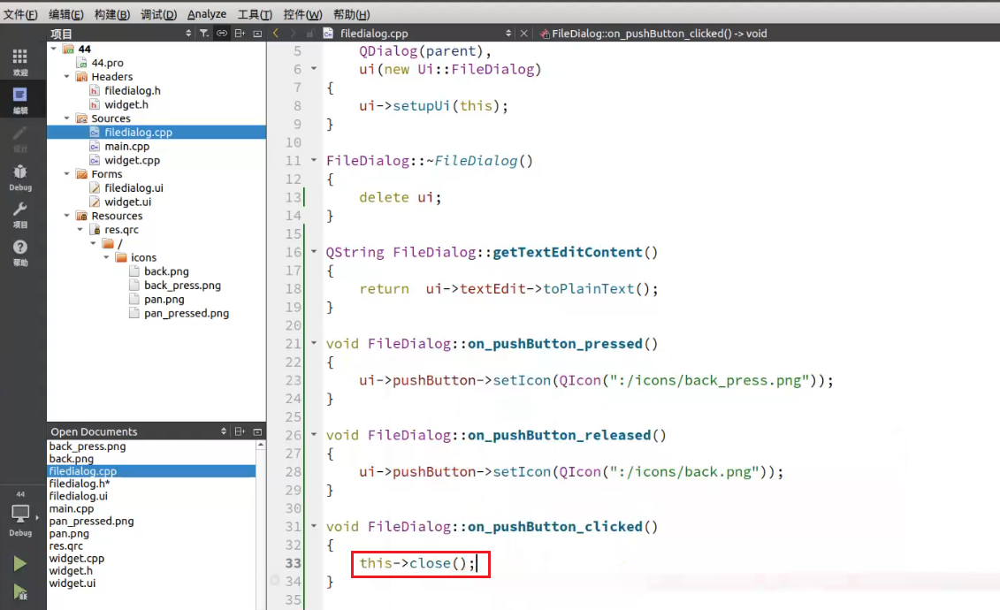  
13. `QDir::setCurrent(QApplication::applicationDirPath());`这行代码的作用是将当前工作目录设置为应用程序的可执行文件所在的目录。这意味着，后续的文件操作（如打开或保存文件）默认会在这个目录下进行，除非你在文件路径中指定了其他目录。  
     
14. 这里增加了一个功能，就是如果内容为空，之前创建的文件也就没有内容要写入，所以就自动删除文件。这里的判断逻辑是，字符串长度为空，就默认为文件为空  
   

## QPainter
### 重写虚函数
通过查看头文件知道paintEvent为虚函数，所以这里需要在子类中重写，注意关键字override，表示虚函数重写  

  
注意，因为参数event没有被使用过，所以会报错，这里可以通过Qt的宏Q_UNUSED(event)，说明一下这个参数没有被使用，所以event参数的这个地方QtCreator就不会报错  
### 如何画图形
  
  
### 文字也可以通过QPainter画出来
通过QRectF给定起点和宽高就能画  
  
可以通过第二个关键字来指定文字的居中方式，这里可以水平或者垂直，也应该可以通过`|`运算符实现既水平又垂直居中  
  
### 画路径
  
### 画笔的用法
  
  
### 画刷的用法

  
### 设置抗锯齿
  
### 实际案例 轮播文字
效果如下所示：  
文字会从右到左慢慢行进，到最左边消失，不断循环  
  
步骤：  
1. 新建并改变一下widget的大小  
     
2. 重写虚函数paintEvent  
     
     
3. 如何修改QPainter中的字体大小，通过QFont  
     
     
4. 那如何实现轮播效果，可以通过setLeft这个方法，这个setLeft其实就是设置文字的左边边界与其承载边框的左边边界的距离。所以只要将setLeft中的值传入一个变值就可以实现稳定的效果  
     
5. 通过定时器来实现改变offset的效果  
     
   设置定时器的槽函数  
     
   初始化并构建信号槽连接  
     
6. 因为要实现滚动的效果，需要知道文字的长度，这里需要引进一个新的头文件，来计算文字的长度  
     
7. 因为文字内容会变，这里定义一个QString新变量，用来存放文字的内容  
     
8. 返回文字的宽度  
     
9. 注意这里setLeft方法中写的是`this->rect().width()-offset`，也就是说根据之前setLeft方法的说明(setLeft其实就是设置文字的左边边界与其承载边框的左边边界的距离)，这里的offset也就是文字距离widget右边框的距离，用该距离与`this->width()+textContentWidth`比较，当offset小于该值时，offset不断+1.文字一直往左走，当offset大于等于该值时，offset重新开始+1，也就是从右往左重新开始滚动  
     
   这里`this->update()`是一定要加的，因为要不断更新绘图效果，paintEvent在widget构造函数执行时，会自动执行一次，这里不会自动执行，需要手动通过`this->update()`让其执行，更新绘制界面  
     

## QChart
Qt自身会附带很多参考示例  
  
### 实际案例
这里绘制一个光滑曲线图  
  
步骤：  
1. 调整文字布局
     
2. 在pro文件中加入图表模块  
   
3. 引入头文件  
     
   加入宏，这个宏本质上就是调用了命名空间  
     
4. 在ui文件中插入GraphicsView，用于显示图标，这里GraphicsView是QChartView的父类，所以这里可以将其提升为QChartView类  
     
     
   
     
5. 提升完之后GraphicsView就变成了QChartView  
     
6. 在widget中进行初始化  
     
     
7. 创建线，加入线的头文件，并加入点  
     
   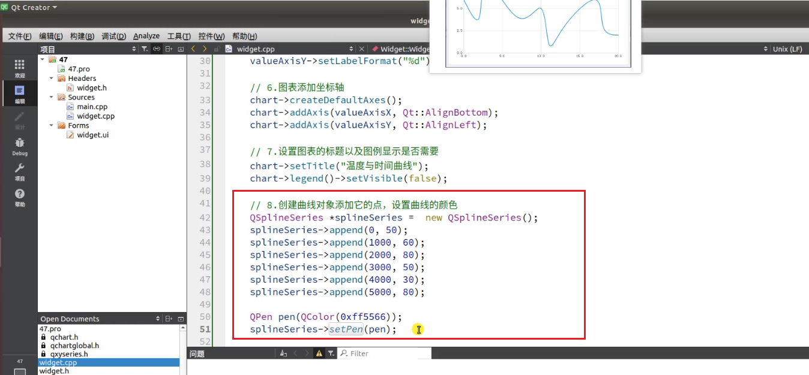  
8. 图表添加曲线。这里还要将曲线的数据与坐标轴相连，并且要在图标添加曲线后，如果不相连，跑出来的图就与实际不符了。最后就是将图标置于视图中  
     
     
9. 可以通过下图红框中的方法，将格子设置的密一点  
     

## QPropertyAnimation属性动画
  
### 简单案例
#### 几何动画
步骤：  
1. 添加三个按钮，分别对应三个功能。再添加一个QWidget用来显示。注意，添加样式表中的颜色可以通过添加来添加，如下图：  
     
     
2. 初始化动画对象，注意构造函数的参数中，第一个表示动画的对象，第二个表示动画的类型  
   
3. 注意设置动画时长属性，还有点击按钮后，动画启动的槽函数  
     
4. 还可以设置循环次数属性，让动画循环跑  
     
     
5. 还可以设置动画的运动速度曲线，下图中的这个曲线就表示前面动画运动的很快，后面运动的很慢。注意这里帮助文档中的曲线表示变化的曲线，而不是运动的曲线  
     
     
6. 还可以设置中间值，让其运动到中间时，在某个位置。比如下图中的0.5就表示，在运动到路程的一半的地方，会经过后面矩形表示的位置和大小  
   
     
#### 颜色动画
步骤：
1. 新复制一个widget，用来做颜色动画，并设置其背景色为蓝色  
     
2. 因为widget实体中没有颜色属性，所以可以需要通过另一个类来设置颜色属性  
     
3. 然后这边会有一个层层的依赖关系，通过`ui->colorWidget->setGraphicsEffect(graphicsColorizeEffect);`将graphicsColorizeEffect与ui->colorWidget产生关系，通过QPropertyAnimation的构造函数，将graphicsColorizeEffect对象传入，这样就可以通过动画来控制ui->colorWidget中的颜色变化了  
     
4. 设置颜色变化值、时间等  
     
5. 设置按钮槽函数触发  
     
#### 不透明度动画
步骤：  
1. 一样也是新复制一个widget，用来做颜色动画，并设置其背景色  
     
2. 因为widget实体也没有透明属性，所以可以需要通过另一个类来设置透明属性。然后还有一些设置方式与之前的动画一致  
     
     
     

## Q_PROPERTY宏简介
  
### 简单示例讲解
补充说明：  
1. 为什么动画这里能识别到字符串`"geometory"`这个字符串，是因为在QWidget的类中，通过Q_PROPERTY宏定义了geometory，如下图所示  
     
     
2. Q_PROPERTY的第四个位置填的应该是一个函数，这里我们可以参照QWidget类，能看到其中的第四个就是一个函数，其定义在QWidget中可以找到  
     
   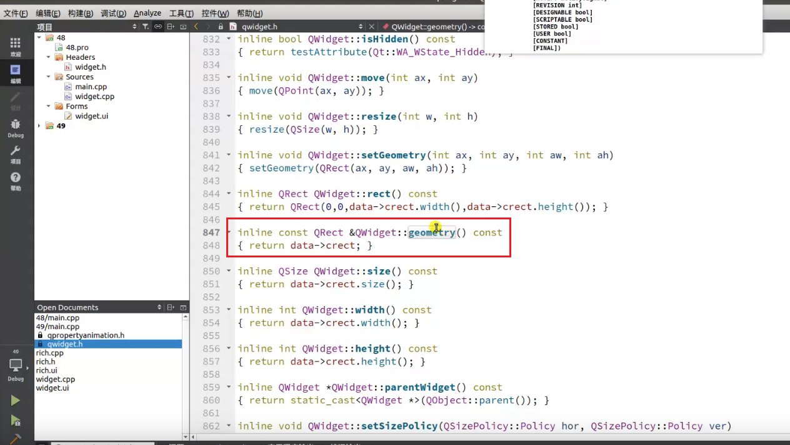  
3. 通过查看帮助文档可知，这里的Q_PROPERTY宏定义要写在Q_OBJECT下面才行  
     

步骤：  
1. 新建一个界面类  
     
     
     
2. 仿着QWidget可以写一个简单的示例如下：  
   注意Q_OBJECT中第一个参数表示类型，这里用的是qreal，也就是double类型，然后再下面定义函数的时候，函数的返回值也是qreal类型  
     
3. 将函数实现，这里是直接返回的一个初始化的变量值  
     
     
4. 在主widget中加入刚刚新建的类  
     
   并返回其初始化的数值  
     
5. 调整一下rich类的ui界面的大小和其中的内容  
     
6. 下面一样接着模仿QWidget类，写第六个参数  
   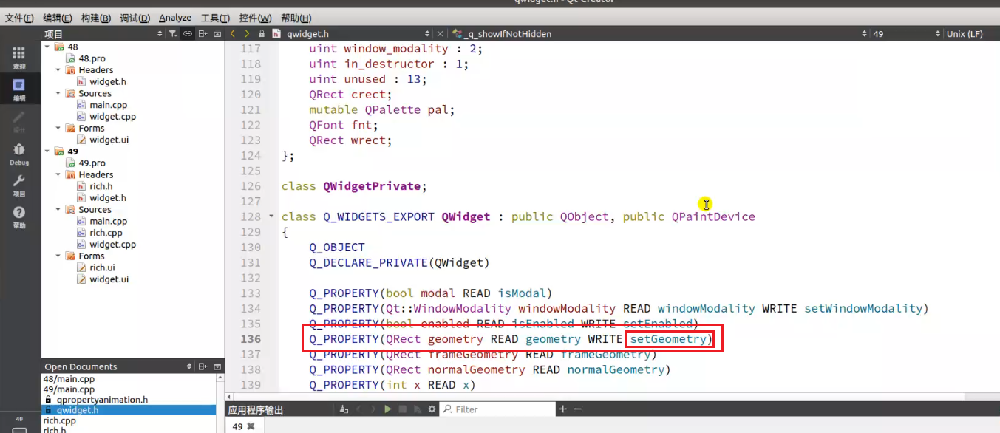  
     
   rich类中就对应写  
     
7. 将WRITE部分的函数实现写一下  
     
     
8. 然后在主widget中直接调用，可以让富人的钱再多一些  
     
   当然这里也可以通过之前宏定义设置的方式，用另一种方法来让富人多一些钱。这里通过setProperty来让富人多一些钱，底层会自动调用WRITE的方法，也就是调用setMoney方法，与上一种直接调用的方式效果是一样的  
     
9. 其实现在也差不多明了，这个Q_PROPERTY宏也就是定义了一种名称，通过这个名称，可以用之前封装好的方法，来实现READ和WRITE这两个动作。第一个参数就是指定了其中传递的参数的类型  
     
## 自定义属性动画
步骤：  
1. 可以将上一讲的文件添加进来，QtCreator会帮助自动归类  
     
     
     
2. 将之前的实现函数稍微修改一下  
     
3. 再在主widget中将动画的各个参数设置一下即可，然后运行  
     
4. 然后之前rich类的ui中的数字就会在10秒内从100万涨到600万  
     
## QThread多线程


