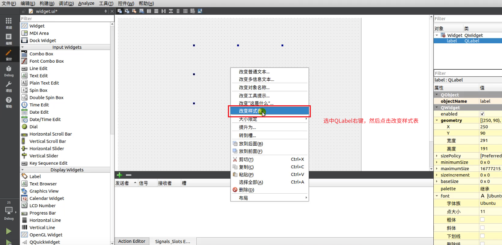
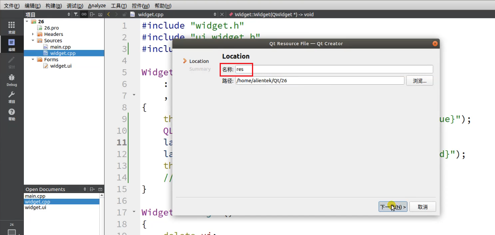
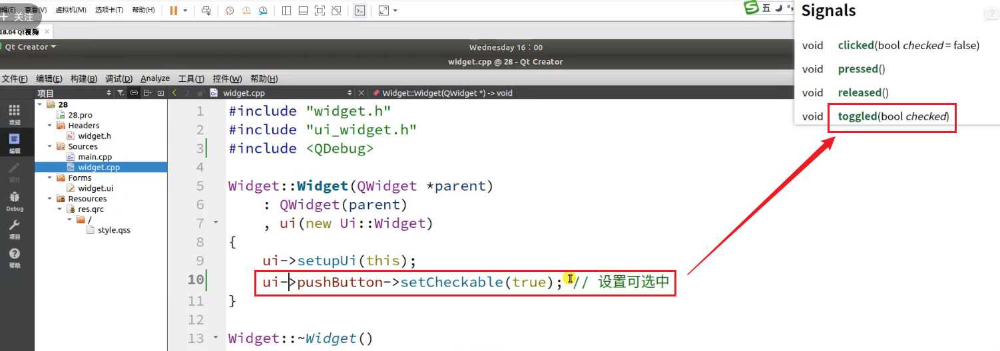
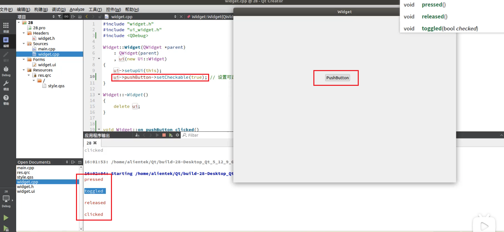

# Linux如何卸载QtCreator
1. 首先通过指令`sudo find / -name qtcreator 2>/dev/null`找到qtcreator的安装目录
2. 进入qtcreator的安装目录，执行卸载指令`sudo ./QtCreatorUninstaller`
## 参考
[ubuntu18.04 LTS卸载qtcreator-10.0.2](https://blog.csdn.net/lyc_daniel/article/details/133858141)

# Linux安装Qt5.12.9的注意事项
[文档教程](./【正点原子】I.MX6U嵌入式Qt开发指南V1.1.pdf)可以参考`【正点原子】I.MX6U嵌入式Qt开发指南V1.1.pdf`的第52页  
[视频教程](https://www.bilibili.com/video/BV1g24y1F7X4)安装主要看下第4和5讲即可  
1. 安装后如果在左下角总菜单中找不到QtCreator，可以通过命令行运行脚本`/opt/Qt5.12.9/Tools/QtCreator/bin/qtcreator.sh &`，在后台打开QtCreator
2. 安装后如果QtCreator中无法输入中文  
    1. 先配置Ubuntu系统语言，设置为中文。可以直接在搜狗官网安装搜狗数据法即可，安装[教程](https://shurufa.sogou.com/linux/guide)
    2. 安装fcitx插件，指令如下
    sudo apt install fcitx-frontend-qt5
    3. 拷贝这个插件到Qt的安装目录，重启Qt Creator
    sudo cp /usr/lib/x86_64-linux-gnu/qt5/plugins/platforminputcontexts/libfcitxplatforminputcontextplugin.so /opt/Qt5*/Tools/QtCreator/lib/Qt/plugins/platforminputcontexts
3. 安装后运行C++示例代码，控制台没有输出，并且会有一个窗口一闪而过，解决办法就是：工具---选项---环境---系统下，x-terminal-emulator -e换成 xterm -e 即可。如下图：  
     

# Qt4.7的工程用Qt5编译报错并解决
1. 编译报错：`error: QtGui/QDialog: No such file or directory #include <QtGui/QDialog>`  
   解决：因为在Qt5中不再使用QtGui模块，而是使用QtWidgets模块。因此，需要
      - 在.pro中加QT+=widgets
      - 将代码中的"QtGui/QDialog"替换为"QtWidgets/QDialog"。
2. 编译报错：`error: ‘UnicodeUTF8’ is not a member of ‘QApplication’`  
   解决：修改setText(QApplication::translate("MainWindow", "&Quitar", 0, QApplication::UnicodeUTF8));为setText(QApplication::translate("MainWindow", "&Quitar", 0));  
   参考：[博客](https://blog.csdn.net/rl529014/article/details/52684506)
3. 编译报错：`error: ‘class QHeaderView’ has no member named ‘setResizeMode’; did you mean ‘ResizeMode’?`
   解决：将 setResizeMode 替换为为 setSectionResizeMode  
   参考：[博客](https://blog.csdn.net/weixin_41521612/article/details/120702977)
4. 编译报错：`error: ‘setCodecForTr’ is not a member of ‘QTextCodec’`
   解决：删掉下面这两行，具体原因可以看下参考博客
        QTextCodec::setCodecForTr(QTextCodec::codecForName("UTF-8"));
        QTextCodec::setCodecForCStrings(QTextCodec::codecForName("UTF-8"));
   参考：[博客](https://blog.csdn.net/qq_34732729/article/details/115513215)

# 如何在Vscode中使用qt
## 第一种方式(使用vscode插件创建)
主要是使用到了一个up主开发的vscode插件`Qt configure`。  
参考[博客](https://blog.csdn.net/cjj_kk/article/details/132579704)(其中这个博客里提到的`配置环境变量`和`配置Kit工具包`都不需要)  
参考[视频](https://www.bilibili.com/video/BV1YL411L7Sg)  
### 步骤
1. Vscode安装插件`Qt configure`
2. ctrl+shift+p打开命令窗口，输入qt，并选择new project选项  
     
3. 输入项目名称  
     
4. 选择qt套件，cmake，是否带有ui文件(yes)  
     
5. 最后生成项目文件  
     
   其中launch.json为调试文件。如果其他地方需要调试qt文件，可以将这个文件直接复制过去。  
   跟编译相关的最重要的还是CMakeLists.txt文件。通过该文件，cmake才知道怎么编译。所以`.vscode`中的文件有没有无所谓，都不影响编译。

## 第二种方式(自己编写CMakeLists.txt文件)
这里展示的qtcreator自动生成的最简单板的cmakelist.txt，其他的QT项目可以在这个基础之上来进行改编
```cmake
cmake_minimum_required(VERSION 3.5)

project(TEST LANGUAGES CXX)

set(CMAKE_INCLUDE_CURRENT_DIR ON)

set(CMAKE_AUTOUIC ON)
set(CMAKE_AUTOMOC ON)
set(CMAKE_AUTORCC ON)

set(CMAKE_CXX_STANDARD 11)
set(CMAKE_CXX_STANDARD_REQUIRED ON)

find_package(Qt5 COMPONENTS Widgets REQUIRED)

add_executable(TEST
   main.cpp
   mainwindow.cpp
   mainwindow.h
   mainwindow.ui
)

target_link_libraries(TEST PRIVATE Qt5::Widgets)
```
### 注意事项
1. 其中`set(CMAKE_INCLUDE_CURRENT_DIR ON)`表示是否将cmake生成编译文件的目录加入到`include_directories`中，这里的`set(CMAKE_INCLUDE_CURRENT_DIR ON)`也就是相当于在`include_directories`中添加了`${CMAKE_BINARY_DIR}`。
2. `find_package(Qt5 COMPONENTS Widgets REQUIRED)`这里就相当于使用qmake编译时在.pro文件中添加`QT += widgets`是一样的，如果要添加其他的库也是一样的，在COMPONENTS和中REQUIRED写上即可。
3. 其中`set(CMAKE_AUTOUIC ON) set(CMAKE_AUTOMOC ON) set(CMAKE_AUTORCC ON)`这三句其实是普通cmake编译文件与qt的最大区别，cmake也就是通过这三句要分别对qt文件进行转化，简单来说，
   - set(CMAKE_AUTOUIC ON)是控制CMake自动运行uic工具，CMake会自动检测项目中的.ui文件，并生成相应的头文件和源文件，通常以`ui_<WidgetName>.h`命名。
   - set(CMAKE_AUTOMOC ON)是控制CMake自动运行moc工具，CMake会自动检测项目中的头文件和源文件，查找包含Q_OBJECT宏的类，并为其生成支持信号与槽机制的`moc_<ClassName>.cpp`文件。
   - set(CMAKE_AUTORCC ON)是控制CMake自动运行rcc工具，CMake会自动检测项目中的.qrc文件，并使用rcc工具生成相应的源文件（通常以`qrc_<ResourceName>.cpp`命名）。
4. 其中`set(CMAKE_AUTOUIC ON) set(CMAKE_AUTOMOC ON) set(CMAKE_AUTORCC ON)`这三句是让CMake可以自动管理Qt项目的代码生成任务，如果要手动管理则需要分别使用。但是实际测试发现，通过下面三个指令手动管理文件会更方便一些。因为通过set(CMAKE_AUTOUIC ON)等让CMake自动管理Qt项目的代码生成，目前在Qt5中使用还是会出现一些Bug和限制(注意：其中的FORMS、HEADERS和RESOURCES都可以使用set等来设置)
   - `qt5_wrap_ui(UI_WRAP_FILES ${FORMS})`，其中FORMS为所有ui文件路径的一个集合
   - `qt5_wrap_cpp(CPP_WRAP_FILES ${HEADERS})`，其中HEADERS为所有包含Q_OBJECT宏的头文件的集合
   - `qt5_add_resources(RESOURCES_WRAP_FILES ${RESOURCES})`，其中RESOURCES为所以包含资源文件文件的集合  
5. 补充几个cmake的语法，这些在普通cmake文件中也是适用的，这里写出来是为了强调：
   - 设置动态库的查找目录的link_directories指令一定要在add_executable之前
   - 可以通过`set_target_properties(${TARGET} PROPERTIES RUNTIME_OUTPUT_DIRECTORY ${CMAKE_SOURCE_DIR}/build/bin)`来设置可执行文件${TARGET}的编译输出路径
   - 如果find_package找不到qt的具体路径，可以通过`set(CMAKE_PREFIX_PATH "/opt/Qt5.12.9/5.12.9/gcc_64")`指令来设置，让find_package指令能找到
### 关于如何在cmake中编译qt的参考博客
1. [Windows下QtCreator使用CMake编译GUI程序(Linux同理)](https://www.cnblogs.com/linuxAndMcu/p/14458427.html)  
   这里讲解了cmake中编译qt的三种方式，其实主要用到的是第一种set(CMAKE_AUTOUIC ON)和第三种qt5_wrap_ui这两个。但是实际测试下来，如果不能具体指定编译文件的具体路径，而是通过类似file(GLOB_RECURSE UI_FILES ${BASE_DIR}/*.ui)这样的方式来广义搜索，使用第一种方式编译是不行的，会报重定义的错误，但是使用qt5_wrap_ui的手动方式就可以。后面可以再留意一下
2. [使用CMake构建Qt项目](https://blog.csdn.net/qq_40181592/article/details/101623231)  
   这里的CMakeList.txt文件比较通用，可以拿来直接借鉴  
   ```cmake
   #cmake版本
   cmake_minimum_required(VERSION 3.5.1)

   #项目名称
   project(Minesweeper)

   #让cmake自动去寻找Qt5
   FIND_PACKAGE(Qt5 COMPONENTS Widgets REQUIRED)

   #采用C++11标准
   set(CMAKE_CXX_STANDARD 11)

   #添加所有的源文件
   SET(Minesweeper_SOURCES 
      dialog.cpp	
      main.cpp 
      mainwindow.cpp 
      minemap.cpp
      myitem.cpp
      myscene.cpp
      setpro.cpp
   )

   #添加所有的头文件
   SET(Minesweeper_HEADERS 
      dialog.h
      mainwindow.h
      minemap.h
      myitem.h
      myscene.h
      setpro.h
   )

   #添加所有的.ui文件
   SET(Minesweeper_FORMS 
      dialog.ui
      mainwindow.ui
      setpro.ui
   )

   #添加资源文件
   SET(Minesweeper_RESOURCES 
      img.qrc
   )
   #调用预编译器moc，需要使用 QT5_WRAP_CPP宏
   QT5_WRAP_CPP(Minesweeper_HEADERS_MOC ${Minesweeper_HEADERS})
   #使用uic处理.ui文件
   QT5_WRAP_UI(Minesweeper_FORMS_HEADERS ${Minesweeper_FORMS})
   #使用rcc处理.qrc文件
   QT5_ADD_RESOURCES(Minesweeper_RESOURCES_RCC ${Minesweeper_RESOURCES})

   #这些生成的中间文件都会在build目录下，这样的话，编译器则不能定位由uic程序产生的诸如_ui_mainwindow.h等文件。所以，我们需要把build目录添加到包含目录中
   INCLUDE_DIRECTORIES(${CMAKE_CURRENT_BINARY_DIR})

   #生成可执行文件
   ADD_EXECUTABLE(Minesweeper 
      ${Minesweeper_SOURCES} 
      ${Minesweeper_HEADERS_MOC} 
      ${Minesweeper_FORMS_HEADERS}
      ${Minesweeper_RESOURCES_RCC} 
   )

   #为target添加需要链接的共享库
   TARGET_LINK_LIBRARIES(Minesweeper ${Qt5Widgets_LIBRARIES})

   ```
3. [CMake教程--QT项目使用CMake](https://blog.csdn.net/m0_46577050/article/details/134348784)  
   这个教程中对cmake中的qt使用做了更详细的说明，并且讲了一些qt6的cmake使用的新特性
4. [一文搞懂如何在CMake中使用Qt](https://blog.csdn.net/Copperxcx/article/details/123116433)  
   这个博客中主要要注意下对cmake变量CMAKE_PREFIX_PATH的设置。如果find_package找不到qt的具体路径，可以通过`set(CMAKE_PREFIX_PATH "/opt/Qt5.12.9/5.12.9/gcc_64")`指令来设置，让find_package指令能找到。以及运行时依赖缺失的处理  
### 关于qt的翻译文件这里单独说明一下
这里针对翻译文件的作用，gpt是这样解释的：  
  
  
所以为了生成翻译文件，qt中有两个工具分别是`lupdate`和`lrelease`。翻译文件的具体使用方式我还没有使用过，这里将知道的先记录一下，之前我在一个工程中的cmakelsit中是这样写的：
```cmake
find_package(Qt5 COMPONENTS LinguistTools REQUIRED)

# 初始化要使用的列表
set(TS_FILES)
set(QM_FILES)

# 将要生成的翻译文件添加到列表中
list(APPEND TS_FILES ${CMAKE_CURRENT_SOURCE_DIR}/../../translation/QtDemo_zh_CN.ts)

# 设置翻译文件的生成路径，如果不指定就会生成在CMakeFiles的目录里
set_source_files_properties(${TS_FILES}
    PROPERTIES OUTPUT_LOCATION ${CMAKE_CURRENT_SOURCE_DIR}/build
)

# 创建翻译的最关键一步
qt5_create_translation(QM_FILES ${TS_FILES} ${PROJECT_SOURCES})

# 添加更新翻译的目标
add_custom_target(lupdate_task DEPENDS ${TS_FILES})
add_custom_target(lrelease_task DEPENDS ${QM_FILES})
```
这样最后只要在执行`cmake ..`的目录中执行`make lupdate_task`和`make lrelease_task`即可。这里可以点开查看一下`cmake ..`生成的`Makefile`文件，在其中搜索lupdate_task和lrelease_task就能看到。  
当源代码发生变化，且需要从中提取新的翻译条目时，你可以运行lupdate_task来确保.ts文件包含最新的字符串。在确保.ts 文件内容正确后，可以运行lrelease_task来生成对应的.qm文件。这些.qm文件是最终用于应用程序中的。
#### 参考博客
1. [Qt Creator + CMake 管理工程翻译文件](https://blog.csdn.net/Tclser/article/details/125364058)  
这个博客对这两个相关的翻译文件讲解的很清楚，其中针对qtcreator如何利用cmake创建这两个翻译文件说的很清楚了。以后用到了可以跟着后面操作一下。

## 在vsode中如何让编写Qt程序有提示并可以通过头文件点进去
1. Ctrl + Shift + p打开命令窗口
2. 搜索C/Cpp: Edit Configurations，并选择含有json的那一项，此时vsode会帮你自动生成一部分内容
3. 然后在includePath这一项添加qt的头文件路径`/opt/Qt5.12.9/5.12.9/gcc_64/include/**`，如下：
   ```json
   {
      "configurations": [
         {
               "name": "Linux",
               "includePath": [
                  "${workspaceFolder}/**",
                  "/opt/Qt5.12.9/5.12.9/gcc_64/include/**"
               ],
               "defines": [],
               "compilerPath": "/usr/bin/gcc",
               "cStandard": "c17",
               "cppStandard": "gnu++14",
               "intelliSenseMode": "linux-gcc-x64"
         }
      ],
      "version": 4
   }
   ```
   注意其中主要就是配置一下includePath这一项，其他的都什么大的作用。有一点要提一下的就是，qt中编译使用的gcc就是ubuntu自带的gcc，qt下载的库中并没有自带gcc。
## qmake和cmake的区别
说到编译顺带记录一下，qmake和cmake是两种工具。qmake是Qt框架专用的一种构建工具，它使用.pro文件来描述项目的结构和依赖关系，然后生成Makefile。cmake是一个更为通用的构建系统，不仅限于Qt项目，也被广泛用于其他C++项目，cmake通过CMakeLists.txt文件来管理项目，这使得它能够处理更复杂的项目配置和跨平台构建。不存是qmake还是cmake，他们最后都是生成Makefile文件。

# Qt教程
[视频教程](https://www.bilibili.com/video/BV1g24y1F7X4)  
[Qt Documentation Archives](https://doc.qt.io/archives/qt-5.12/qtmodules.html)  
## QtCreator快捷键
  

自定义快捷键方式：  
  
## 信号槽
1. 如果自定义信号槽，信号只要申明不要定义，但是槽函数既需要声明也需要定义
2. 有三种常见的信号槽写法：
   - 传统写法（使用SLOT和SIGNAL宏）:  
     connect(sender, SIGNAL(signalName()), receiver, SLOT(slotName()));  
   - 新式写法（使用函数指针）:  
     connect(sender, &Sender::signalName, receiver, &Receiver::slotName);
   - Lambda表达式:
     connect(sender, &Sender::signalName, [=]() {  
      // lambda expression code  
   });  

   新式写法（函数指针）通常被认为比传统写法更优，因为它更安全（类型安全），编译器可以检查信号和槽的类型是否匹配，而且在运行时也能提供更好的性能，因为它避免了使用SIGNAL和SLOT宏带来的字符串查找。  
   Lambda表达式提供了极大的灵活性，允许你在连接信号时直接执行代码，而不需要单独定义槽函数。但是，过度使用Lambda可能会导致代码不易读和维护，并且如果Lambda捕获了大量的变量，可能会影响性能。
## 资源文件
1. 在QtCreator中添加图片等资源文件的步骤如下：  
     
     
     
     
2. 如果在Vscode中添加资源文件就需要手动写Html代码了，类似如下(参考[博客](https://blog.csdn.net/m0_58178839/article/details/131825108)):  
   ```html
   <RCC>
       <qresource prefix = "/">
           <file>logo.png</file>
       </qresource>
   </RCC>
   ```
   注意：经过实操发现(就是通过qtcreator来实际创建文件后并打开文件查看，再在vsode中模仿)，如果想在代码中通过类似`ui->label->setStyleSheet("QLabel { border-image:url(:/images/bmp.png) }");`的指令来加载资源文件中的图片时，最好将资源文件放在.qrc的同级目录下。例子如下：  
   资源文件的文件目录结构如下：  
     
   然后.qrc的文件内容为  
   ```html
   <RCC>
      <qresource prefix = "/">
         <file>images/bmp.png</file>
      </qresource>
   </RCC>
   ```
   这样在cpp源文件中加载的时候样式表内容就写`QLabel { border-image:url(:/images/bmp.png) }`。
## 样式表及QSS文件
### 如何利用Qt帮助文档在QtCreator中为QLabel添加样式表  
  
  
  
  
  
  
  
  
但是这样会导致添加进去的图片平铺填充  
  
需要改变样式表中的代码  
  
改变字体颜色和大小等通过样式表修改会比较方便，字体的大小的单位可以是px，也可以是pt  
  
也可以不ui文件来设置，直接在cpp文件中通过操作ui->setStyleSheet来设置样式表
  
  

### 如何在QtCreator通过Qss文件为Qt控件修改样式
  
  
  
  
  
  
  
  
在main.cpp和widget.cpp文件中将Qss文件读进来
  
可以通过下面这种方式来获取资源文件的路径。并且另外注意qApp->setStyleSheet这里的qApp是Qt提供的一个全局变量，它可以方便地用于在应用程序的任意地方访问应用程序实例。  
  
但是如果像下面这样设置，会导致其中所有的QLabel都会显示成红色。这样肯定是不符合要求的  
  
  
这里可以单独对这个对象单独起一个名字  
  
然后在qss文件中单独对这个对象设置颜色即可
  
  

### 根据QtCreator步骤总结如何在vsode中通过纯代码使用样式表和QSS文件
#### 样式表
1. 构建文件目录结构，并在其中放入初始文件(可以通过qtcreator来创建一些初始文件，然后在此基础之上修改)：  
   .vscode：里面的c_cpp_properties.json文件是为了代码补全
   build：编译的中间文件夹  
   include：头文件
   qrc：资源文件，图片文件夹和qss文件夹等
   src：代码源文件
   ui：qt的ui文件
     
2. 资源文件.qrc中写入
   ```html
   <RCC>
      <qresource prefix = "/">
         <file>images/bmp.png</file>
         <file>qss/style.qss</file>
      </qresource>
   </RCC>
   ```
   注意其中图片资源和qss文件一定要放在.qrc的同级目录下，否则很有可能会在程序运行时加载不出来效果
3. qss文件的内容，下面再介绍
4. 打开qtdesigner，并通过qtdesigner打开文件目录中的.ui文件  
     
5. 在空的mainwindow中放入一个空的label控件  
     
6. 保存qtdesigner编辑过的.ui文件。打开mainwindow.cpp源文件，在ui->setupUi(this);下方加入如下代码
   ```cpp
   ui->setupUi(this);
   ui->label->setStyleSheet("QLabel { border-image:url(:/images/bmp.png) }");
   ```
   注意这里样式表的路径(`url(:/images/bmp.png)`)是资源文件中的前缀和图片路径组成的  
     
   这样编译并运行就可以在qlabel中加载出来图片了。
#### QSS文件
QSS文件是为了当有多个控件使用样式表时，为了简化代码，将样式表都集中到一起而形成得文件，这样直接修改QSS文件，就可以直接修改控件的样式。所以这里建议直接使用QSS文件，就不要再使用样式表了。  
1. 构建文件目录结构，并在其中放入初始文件(可以通过qtcreator来创建一些初始文件，然后在此基础之上修改)：  
   .vscode：里面的c_cpp_properties.json文件是为了代码补全
   build：编译的中间文件夹  
   include：头文件
   qrc：资源文件，图片文件夹和qss文件夹等
   src：代码源文件
   ui：qt的ui文件
     
2. 资源文件.qrc中写入
   ```html
   <RCC>
      <qresource prefix = "/">
         <file>images/bmp.png</file>
         <file>qss/style.qss</file>
      </qresource>
   </RCC>
   ```
   注意其中图片资源和qss文件一定要放在.qrc的同级目录下，否则很有可能会在程序运行时加载不出来效果
3. qss文件的内容如下
   ```qss
   QWidget { background-color: blue }
   QLabel { border-image:url(:/images/bmp.png) }
   ```
   这里qss的文件内容意思是，将QWidget的背景色变为蓝色，为QLabel附上图片，图片为资源文件中的，路径这里表示为url(:/images/bmp.png)。  
   如果想在qss中使用.qrc中的资源文件，就必须先在.qrc中添加。如果不想使用，这里的路径需要改写为
   ```qss
   QLabel { border-image:url(../qrc/images/bmp.png) }
   ```
   这里的路径是相对于可执行文件的路径，并且注意少了一个冒号
4. 打开qtdesigner，并通过qtdesigner打开文件目录中的.ui文件  
     
5. 在空的mainwindow中放入一个空的label控件  
     
6. 保存qtdesigner编辑过的.ui文件。打开mainwindow.cpp源文件，在ui->setupUi(this);下方加入如下代码
   ```cpp
   ui->setupUi(this);
   
   QFile file(":/qss/style.qss");
   /*判断文件是否存在*/
   if (file.exists()){
      /*以只读的方式打开*/
      file.open(QFile::ReadOnly);
      /*以字符串的方式保存读出的结果*/
      QString stylesheet = QLatin1String(file.readAll());
      /*设置全局样式*/
      qApp->setStyleSheet(stylesheet);
      /*关闭文件*/
      file.close();
   }
   ```
   (其中`QFile file(":/qss/style.qss");`在加载qss文件时，也可以不将qss文件放在资源文件中，直接通过相对路径来搜索，也就是省去冒号，这里写相对于可执行文件的路径`QFile file("../qrc/qss/style.qss");`即可。但是对于qss文件还是建议写在资源文件中)
   这样就可将资源文件中的qss文件加载进来了，并且对所有的QWidget和QLabel加上对应的样式
7. 但是这里注意，因为有些时候我们需要对特定的QLabel附上单独的样式，所以这里在qss中可以这样修改
   ```qss
   QLabel#label1 { border-image:url(:/images/bmp.png) }
   ```
   这里`#label1`中的label1是控件的名字，可以通过代码setObjectName方法指定：
   ```cpp
   QLabel *label1 = new QLabel(this);
   label1->setObjectName("label1");
   ```
   也可以在qtdesigner拖动控件时指定：  
   
##### QSS语法补充
1. 当想添加其他颜色时，可以通过这样去添加
   ```qss
   QWidget {background-color: rgb(220 220 220)}
   ```
   或者  
   ```qss
   QWidget {background-color: #DCDCDC}
   ```


#### 总结 关于什么时候将文件加载为资源文件 什么时候不加载
1. 当你希望将资源（如图片、图标等）打包到应用程序中，以便在所有平台上都能使用，并且不依赖外部文件时使用。将资源文件打包进.qrc文件
2. qss文件一定打包进.qrc文件，如果需要在qss文件中使用一些小的图标或者图片，可以打包进.qrc文件，然后在qss文件中使用这些图片的时候，注意路径要以`:/`开头

## QT中如何加载图片
### 方式一 通过资源文件加载
需要先配置资源文件，这里就不多说了，通过样式表来添加`ui->label->setStyleSheet("QLabel { border-image:url(:/images/bmp.png) }");`
### 方式二 通过QPixmap加载
```cpp
QPixmap pixmap("../qrc/images/bmp.png");
ui->label->setPixmap(pixmap);
```
### 两种方式对比
- 样式表加载图片  
  适合简单的图像设置，尤其是静态图像、背景图片或需要集中管理的样式。
- QPixmap加载图片  
  更适合需要动态处理图片的场景，或需要进行更复杂的图像操作。

## QWidget
QWidget可以当成一种容器，里面放qlabel，通过搭配不同的颜色，可以起到美化空间的作用。
  
  

## QPushButton
### toggled信号
只有设置QPushButton的setCheckable(true)属性，才能触发这个信号。  
  
可以发现toggled这个槽函数是在pressed和released中间触发的，并且按钮按下去之后没有再弹起来。类似于插板按钮，再按第二下才能弹起来。  
  
  
槽函数会有一个bool位，通过这个可以判断按钮是否被按下并且有没有弹起来。  


### 添加按钮图片资源文件
视频教程中添加按钮图片资源文件的步骤记录：  
  
  
注意这里点击添加现有文件来添加图片时，会将图片文件所在的文件夹也添加进来  
  

### QSS 伪状态
这里在qss文件中如果添加一行按钮的`:hover`可以让按钮在有鼠标悬停时，变成另一张图片，这个类似于信号槽，通过qss文件可以直接实现。  
  
  
  
通过qss的`:checked`伪状态，可以让按钮点击的时候变成另一个图片  
  
  
这里还可以在`:checked`伪状态后面再继续衔接伪状态，可以让按钮点击后如果鼠标悬停是什么反应  
  
总结：这里要注意的就是，如果想制作视频中所示的音乐播放器按钮的效果，一定要`setCheckable(true)`设置一下

## QRadioButton
1. 这里类似于QPushButton中的qss文件设置。下图中的`QRadioButton::indicator`表示单选按钮前面的小圆圈  
     

2. 通过放到不同的组中来让各自组中的按钮互斥  
     
     

3. 按钮组中有一个属性，可以让这组中的单选按钮不互相排斥，单选变多选
     

4. 如何做到下图中，只有选项没有前面小圆圈的效果  
     
   在qss中将圆圈的宽高都设置为0，字体大小颜色还有背景色也设置一下，但是这样出来的效果，文字不是居中的，且通过qss也无法实现文字的居中。所以这种效果通过QRadioButton来实现，有些不太方便，所以可以使用QPushButton来实现，毕竟他们是继承自一个父类  
     
     
   将几个QPushButton分配到一个按钮组  
     
   将这几个按钮的checkable属性都设置成可选中的，再运行，效果就有了  
     
     
   最后再设置一下qss按钮的背景色和选中时的效果就可以了  
     
     
5. 常用信号是这个toggled，一般情况下不会用其他的信号  
     
     

## QCheckBox


