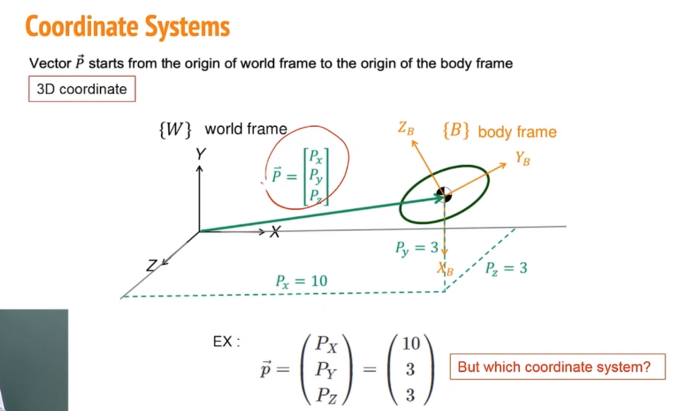
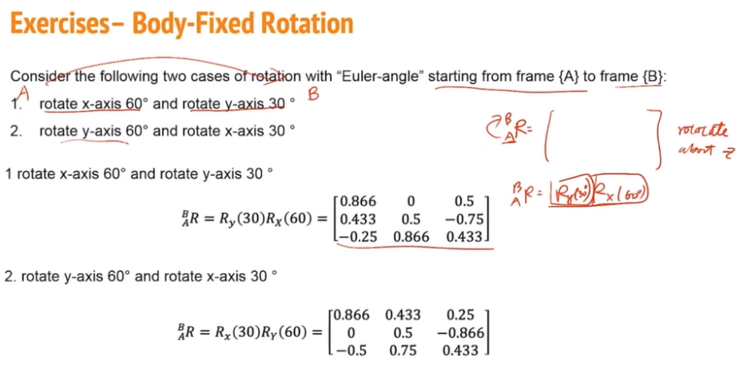
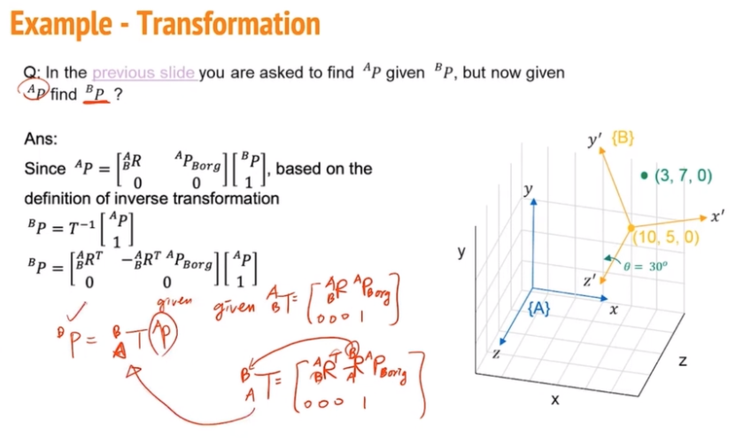
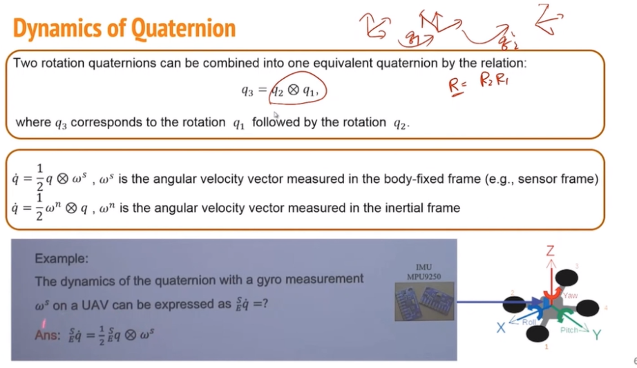

# 教程一 台交通大学无人机系列课程——2运动数学（欧拉角、四元数、坐标系转换）  
B站教程链接：[运动数学（欧拉角、四元数、坐标系转换）](https://www.bilibili.com/video/BV1z94y1Y7g8/?spm_id_from=333.337.search-card.all.click&vd_source=a5f4029436fab3ad44f642e3a69eb1d1)
# 目录
  
# 坐标系
  
  
  
  
  
  
# 旋转矩阵
  
  
  
  
  
  
  
  
  
  
  
  
  
  
  
```
注意：这里的Body-Fixed Rotation就是之前的Euler Angles，Space-Fixed Rotation就是之前的Fixed Angles
```
  
  
# 欧拉角
  
  
  
  
  
# 变换矩阵
  
  
  
  
  
  
  
  
  
  
  
  
  
# 四元数
  
  
  
  
  
```
Hamilton product有点像乘法分配律，交叉相乘后再求和。
```
  
  
  
## 用四元数转动向量
  
```
这里是将四元数转化为旋转矩阵的公式
```
  
  
## 用四元数转动坐标系
可以发现其旋转公式与向量转动正好相反。这个与之前用矩阵旋转是一样的，向量旋转$\theta$就相当于矩阵旋转$-\theta$  
  
  
```
这个案例是关于无人机的可看可不看
```
  
  
  
  
```
下图中的第一个公式是根据上图中的对应关系，表示四元数与旋转矩阵中各个旋转角的关系。第二个公式则与四元数无关，仅仅表示旋转矩阵中的各个值与旋转角的关系。
```
  
  
  
  
  
